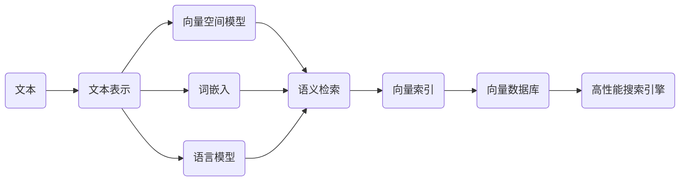

# 高效检索：构建基于向量数据库的高性能搜索引擎

## 1. 背景介绍
### 1.1 搜索引擎的重要性
在当今信息爆炸的时代,高效准确的信息检索变得越来越重要。搜索引擎是帮助用户从海量数据中快速找到所需信息的关键工具。无论是在互联网上查找资料,还是在企业内部检索数据,搜索引擎都发挥着不可或缺的作用。

### 1.2 传统搜索引擎的局限性
传统的搜索引擎主要基于关键词匹配的倒排索引技术。虽然这种方法简单高效,但也存在一些局限性:

1. 难以处理同义词和多义词,容易漏掉相关结果
2. 无法理解查询和文档的语义,匹配结果的相关性有限
3. 对长尾查询和复杂查询支持不足
4. 搜索结果的排序往往基于简单的 TF-IDF 等统计信息,无法精准反映相关度

### 1.3 向量检索技术的兴起
近年来,随着深度学习和自然语言处理技术的发展,基于向量表示的语义检索方法逐渐兴起。通过将文本映射到高维向量空间,并通过向量之间的距离来度量相似性,向量检索可以克服传统关键词匹配的局限,实现更加智能和语义化的搜索体验。

### 1.4 向量数据库的优势
为了高效地存储和检索大规模的向量数据,向量数据库应运而生。与传统的关系型和 NoSQL 数据库相比,向量数据库在以下方面具有独特的优势:

1. 原生支持高维向量的存储和索引
2. 提供高效的相似度搜索算法,如 Annoy、HNSW 等
3. 支持实时插入和动态更新索引
4. 易于扩展和分布式部署

本文将深入探讨如何利用向量数据库构建高性能的搜索引擎,分享实践经验和优化技巧,帮助读者掌握这一前沿技术。

## 2. 核心概念与联系
### 2.1 向量空间模型
向量空间模型(Vector Space Model)是信息检索领域的经典理论之一。它将文本表示为一个 N 维实数向量,每个维度对应一个 term,其值表示该 term 在文档中的重要性。常见的词项加权方法有:

- TF-IDF:综合考虑词频(TF)和逆文档频率(IDF)
- BM25:基于概率论的词项加权模型,对 TF-IDF 的改进

将查询和文档都表示为向量后,可以通过计算向量之间的距离(如欧氏距离、余弦相似度)来度量它们的相似程度。

### 2.2 词嵌入
传统的 VSM 采用 One-hot 或 TF-IDF 方式得到的词向量是稀疏、高维且难以刻画语义的。词嵌入(Word Embedding)技术可以将词映射到低维稠密的实数向量空间,并使语义相近的词有着相近的向量表示。常见的词嵌入模型有:

- Word2Vec:基于 Skip-gram 和 CBOW 的浅层神经网络
- GloVe:基于全局词共现统计的矩阵分解方法
- FastText:在 Word2Vec 的基础上考虑了字符级 n-gram 信息

### 2.3 语言模型
语言模型(Language Model)是用来计算一段文本出现概率的模型。近年来,预训练语言模型(如 BERT、GPT 系列)在 NLP 领域取得了巨大成功。这些模型在海量语料上进行预训练,学习到丰富的语言知识,可以用于下游的各种任务。将输入文本喂入预训练好的语言模型,可以得到高质量的语义向量表示。

### 2.4 语义检索
传统的关键词匹配检索无法理解词语和查询的语义,而语义检索(Semantic Retrieval)旨在克服这一局限。常见的语义检索方法包括:

- 基于主题模型:如 LSA、pLSA、LDA 等,可以发现潜在语义
- 基于深度学习:利用词嵌入、语言模型得到语义向量表示
- 基于知识图谱:利用外部知识增强语义理解能力

语义检索的关键是构建语义向量空间,并设计高效的相似度计算和索引方法。

### 2.5 向量索引
向量索引(Vector Index)是一种数据结构,用于快速检索高维向量空间中最相似的 k 个向量。常见的向量索引算法有:

- Annoy:基于随机投影和树形结构的近似最近邻算法
- HNSW:基于图的层次化导航最近邻搜索算法
- FAISS:Facebook 开源的向量索引库,支持多种索引类型

高效的向量索引算法通过牺牲少量准确率换取数量级的检索效率提升,是向量数据库的核心组件之一。

### 2.6 核心概念之间的联系

从上图可以看出,文本经过各种方法转换为向量表示后,在向量空间中进行语义检索。高维向量通过向量索引进行加速,存储在向量数据库中。基于向量数据库可以构建高性能的语义搜索引擎。理解这些概念之间的联系,有助于我们系统性地掌握基于向量数据库的搜索引擎构建方法。

## 3. 核心算法原理具体操作步骤
本节将详细介绍几种常用的向量索引算法的核心原理和具体操作步骤,包括 Annoy、HNSW 和 IVF。

### 3.1 Annoy
Annoy(Approximate Nearest Neighbors Oh Yeah)是一种基于随机投影和树形结构的近似最近邻算法。其基本步骤如下:

1. 随机选择两个向量,将所有向量投影到它们形成的直线上
2. 以直线的中点为分割点,将向量集合划分为左右两个子集
3. 递归对每个子集重复步骤 1 和 2,直到子集大小小于指定阈值
4. 在最终得到的叶子节点中存储实际的向量

检索时,从根节点出发,比较查询向量与分割超平面的位置关系,进入对应的子树,直到达到叶子节点。然后在所有达到的叶子节点中进行暴力搜索,返回最近邻结果。通过多次构建这样的随机投影树,可以提高检索的准确率。

Annoy 的优点是实现简单、索引构建快速、可支持动态插入。但其缺点是当数据维度很高时,随机投影的有效性下降,导致需要构建大量的树才能保证准确率。

### 3.2 HNSW
HNSW(Hierarchical Navigable Small World)是一种基于图的层次化索引结构。其核心思想是在不同层次上构建 NN 图,形成一个多层次的导航结构。算法的主要步骤如下:

1. 随机选取一个向量作为第 0 层的入口点
2. 对于每个新插入的向量,从入口点出发,找到第 0 层上距离最近的 M 个节点
3. 从这 M 个节点中选取距离最近的一个,作为当前向量的上层入口
4. 递归执行步骤 3,直到达到最高层
5. 将当前向量插入到每一层选中的节点的邻居表中
6. 对邻居表按照与当前向量的距离进行排序,保留距离最近的 M 个节点

检索时,从最高层的入口点出发,找到距离查询向量最近的节点,然后进入下一层递归搜索,直到达到第 0 层。在每一层,都选择距离查询向量最近的 efSearch 个节点作为下一层的搜索起点,直到找到最终的 k 个最近邻。

HNSW 通过构建多层次的 NN 图,大大减少了搜索的路径长度,加快了搜索速度。同时,由于邻居表动态更新,HNSW 天然支持增量插入。但其缺点是索引构建比较耗时,且搜索代价随数据规模线性增长。

### 3.3 IVF
IVF(Inverted File)是一种基于聚类的向量索引方法。其基本思想是将向量空间划分为多个 Voronoi 区域,每个区域对应一个类中心。查询时只搜索查询向量所属区域及其邻近区域,避免了全局搜索。算法步骤如下:

1. 使用 k-means 等聚类算法对向量集合进行聚类,得到 nlist 个类中心
2. 建立类中心到向量列表的倒排索引
3. 对每个类中心,计算它的 nearestk 个最近邻类中心
4. 对查询向量,找到它所属的类中心,以及该中心的最近邻类中心
5. 在这些类中心对应的倒排列表中进行暴力搜索,得到最终的 k 个最近邻

IVF 避免了对整个数据集的暴力搜索,大大提高了检索效率。但其缺点是当类中心数较少时,每个类的数据量较大,暴力搜索代价仍然较高。而当类中心数较多时,聚类的效果可能会变差。因此需要平衡好聚类数与类内数据量的关系。

以上就是几种经典向量索引算法的核心原理和操作步骤。在实践中,还需要根据数据特点和应用需求,选择合适的算法和参数。通过优化索引构建和搜索过程,可以进一步提升向量检索的效率和精度。

## 4. 数学模型和公式详细讲解举例说明
本节将详细讲解向量检索中涉及的几个关键数学模型和公式,并给出具体的举例说明。

### 4.1 向量相似度计算
向量相似度计算是向量检索的核心,常用的相似度度量有欧氏距离和余弦相似度。

#### 4.1.1 欧氏距离
欧氏距离(Euclidean Distance)又称 L2 距离,用于衡量两个向量在空间中的直线距离。对于 n 维向量 $\mathbf{x} = (x_1, x_2, \dots, x_n)$ 和 $\mathbf{y} = (y_1, y_2, \dots, y_n)$,其欧氏距离定义为:

$$
d(\mathbf{x},\mathbf{y}) = \sqrt{\sum_{i=1}^n (x_i - y_i)^2}
$$

举例说明:假设有两个 3 维向量 $\mathbf{x} = (1, 2, 3)$, $\mathbf{y} = (4, 5, 6)$,则它们的欧氏距离为:

$$
\begin{aligned}
d(\mathbf{x},\mathbf{y}) &= \sqrt{(1-4)^2 + (2-5)^2 + (3-6)^2} \\
&= \sqrt{9 + 9 + 9} \\
&= \sqrt{27} \\
&= 3\sqrt{3}
\end{aligned}
$$

可见,欧氏距离越小,表示两个向量在空间中越接近,也就是越相似。

#### 4.1.2 余弦相似度
余弦相似度(Cosine Similarity)通过计算两个向量夹角的余弦值来衡量它们的相似程度。对于 n 维向量 $\mathbf{x} = (x_1, x_2, \dots, x_n)$ 和 $\mathbf{y} = (y_1, y_2, \dots, y_n)$,其余弦相似度定义为:

$$
\cos(\mathbf{x},\mathbf{y}) = \frac{\mathbf{x} \cdot \mathbf{y}}{\|\mathbf{x}\| \|\mathbf{y}\|} = \frac{\sum_{i=1}^n x_i y_i}{\sqrt{\sum_{i=1}^n x_i^2} \sqrt{\sum_{i=1}^n y_i^2}}
$$

其中 $\mathbf{x} \cdot \mathbf{y}$ 表示向量的点积(Dot Product),而 $\|\mathbf{x}\|$ 表示