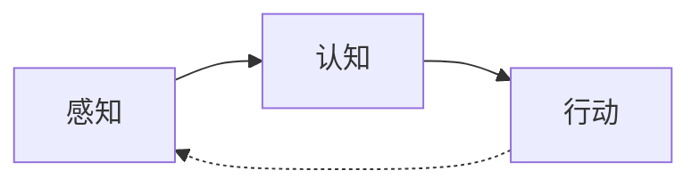

# AI (人工智能) 原理与代码实例讲解

## 1.背景介绍
### 1.1 人工智能的定义与发展历程
#### 1.1.1 人工智能的定义
人工智能(Artificial Intelligence,简称AI)是研究、开发用于模拟、延伸和扩展人的智能的理论、方法、技术及应用系统的一门新的技术科学。它企图了解智能的实质,并生产出一种新的能以人类智能相似的方式做出反应的智能机器,该领域的研究包括机器人、语言识别、图像识别、自然语言处理和专家系统等。

#### 1.1.2 人工智能的发展历程
人工智能从1956年正式提出,经历了三次浪潮:
- 第一次浪潮(1956-1974年):以"推理"为主的符号主义。
- 第二次浪潮(1980-1990年):以"知识"为主的专家系统。 
- 第三次浪潮(2006年至今):以"学习"为主的机器学习和深度学习。

### 1.2 人工智能的分支领域
人工智能主要包括以下分支领域:
- 机器学习:让机器通过数据学习获得新的能力。
- 自然语言处理:让机器能够处理、理解、生成自然语言。
- 计算机视觉:让机器能够理解、分析图像和视频的内容。
- 语音识别:让机器能够将语音信号转化为相应的文本。
- 专家系统:用计算机来模拟人类专家的决策能力。
- 机器人学:研究机器人的感知、决策与控制。

## 2.核心概念与联系
### 2.1 人工智能的核心概念
人工智能的核心概念可以总结为:
- 感知(Perception):获取外界信息,如计算机视觉、语音识别等。
- 认知(Cognition):对信息进行分析、推理与决策,如知识表示、机器学习等。  
- 行动(Action):根据决策结果采取相应行动,如自然语言生成、机器人控制等。

### 2.2 核心概念之间的关系
下面是人工智能核心概念之间关系的 Mermaid 流程图:

感知获取外界信息,认知对信息进行分析决策,行动根据决策结果做出反应,行动的结果又会被感知获取,形成一个循环。

## 3.核心算法原理具体操作步骤
### 3.1 监督学习
监督学习是使用已标注的数据来训练模型,常见算法包括:
1. 选择合适的模型(如决策树、支持向量机、神经网络等) 
2. 准备训练数据集,将数据分为特征 X 和标签 y
3. 将训练数据输入模型,进行参数学习优化
4. 在测试集上评估模型性能,并进行超参数调优
5. 使用训练好的模型对新数据进行预测

### 3.2 无监督学习 
无监督学习是让模型从无标注数据中自主学习,常见算法包括:
1. 选择合适的模型(如 K-means、PCA、自编码器等)
2. 准备无标注的数据集 X
3. 将数据输入模型,学习数据内在的模式和结构
4. 对学习到的模式进行分析和解释
5. 应用学习到的模型对新数据进行聚类、降维、异常检测等

### 3.3 强化学习
强化学习是智能体通过与环境的交互来学习最优策略,具体步骤为:
1. 定义状态空间 S、动作空间 A 和奖励函数 R
2. 初始化策略模型(如 Q-learning、策略梯度等)
3. 智能体根据当前策略选择动作与环境交互  
4. 环境根据动作给予智能体奖励反馈
5. 智能体根据奖励更新策略模型的参数
6. 重复步骤3-5,直到策略收敛或满足结束条件

## 4.数学模型和公式详细讲解举例说明
### 4.1 线性回归
线性回归是利用数理统计中回归分析,来确定两种或两种以上变量间相互依赖的定量关系的一种统计分析方法。其数学模型为:

$$h_\theta(x) = \theta_0 + \theta_1x_1 + \theta_2x_2 + ... + \theta_nx_n$$

其中,$x_i$ 为特征值,$\theta_i$为模型参数,我们的目标是找到最优的参数 $\theta$ 使得预测值 $h_\theta(x)$ 和真实值 $y$ 的差距最小。通常使用平方误差作为损失函数:

$$J(\theta) = \frac{1}{2m}\sum_{i=1}^{m}(h_\theta(x^{(i)})-y^{(i)})^2$$

我们可以使用梯度下降法来最小化损失函数,参数更新公式为:

$$\theta_j := \theta_j - \alpha\frac{\partial}{\partial\theta_j}J(\theta)$$

其中 $\alpha$ 为学习率。重复迭代直到损失函数收敛。

### 4.2 支持向量机
支持向量机(Support Vector Machine,SVM)是一种二分类模型,它的基本模型是定义在特征空间上的间隔最大的线性分类器。

SVM 的数学模型可以表示为:

$$\min_{\omega,b} \frac{1}{2}\lVert \omega \rVert^2 \\ 
s.t. \ y_i(\omega \cdot x_i + b) \geq 1, i=1,...,m$$

其中 $\omega$ 为分类超平面的法向量, $b$ 为截距, $x_i$ 为特征向量, $y_i$ 为对应的标签。

SVM 的目标是找到一个超平面,使得两类样本到超平面的最小间隔最大化。通过拉格朗日乘子法可以得到其对偶问题:

$$\max_\alpha \sum_{i=1}^m \alpha_i - \frac{1}{2} \sum_{i,j=1}^m \alpha_i \alpha_j y_i y_j (x_i \cdot x_j) \\
s.t. \ \sum_{i=1}^m \alpha_i y_i = 0 \\
0 \leq \alpha_i \leq C, i=1,...,m$$

其中 $\alpha_i$ 为拉格朗日乘子, $C$ 为正则化参数。求解出 $\alpha$ 后,可得分类决策函数:

$$f(x) = \text{sign}(\sum_{i=1}^m \alpha_i y_i (x \cdot x_i) + b)$$

对于线性不可分的情况,可以通过核函数将样本映射到高维空间,再进行分类。

## 5.项目实践：代码实例和详细解释说明
下面以 Python 语言为例,给出几个常见的机器学习算法的代码实现。

### 5.1 K-近邻算法
K-近邻(K-Nearest Neighbor,KNN)是一种基本分类和回归方法。它的基本思想是:如果一个样本在特征空间中的 k 个最相似(即特征空间中最邻近)的样本中的大多数属于某一个类别,则该样本也属于这个类别。

```python
import numpy as np
from sklearn.datasets import load_iris
from sklearn.model_selection import train_test_split
from sklearn.neighbors import KNeighborsClassifier

# 加载数据集
iris = load_iris()
X = iris.data
y = iris.target

# 划分训练集和测试集
X_train, X_test, y_train, y_test = train_test_split(X, y, test_size=0.2)

# 创建 KNN 分类器
knn = KNeighborsClassifier(n_neighbors=3)

# 训练模型
knn.fit(X_train, y_train)

# 在测试集上预测
y_pred = knn.predict(X_test)

# 计算准确率
accuracy = np.mean(y_pred == y_test)
print("Accuracy:", accuracy)
```

这个例子展示了如何使用 KNN 算法对鸢尾花数据集进行分类。首先将数据划分为训练集和测试集,然后创建一个 KNN 分类器,并在训练集上进行训练。最后在测试集上进行预测,并计算准确率。

### 5.2 决策树
决策树(Decision Tree)是一种基本的分类和回归方法。它通过训练数据构建一棵树,每个内部节点表示一个属性测试,每个分支代表一个测试输出,每个叶节点存储一个类别。

```python
from sklearn.datasets import load_iris
from sklearn.model_selection import train_test_split
from sklearn.tree import DecisionTreeClassifier

# 加载数据集
iris = load_iris()
X = iris.data
y = iris.target

# 划分训练集和测试集
X_train, X_test, y_train, y_test = train_test_split(X, y, test_size=0.2)

# 创建决策树分类器
dt = DecisionTreeClassifier()

# 训练模型
dt.fit(X_train, y_train)

# 在测试集上预测
y_pred = dt.predict(X_test)

# 计算准确率
accuracy = np.mean(y_pred == y_test)
print("Accuracy:", accuracy)
```

这个例子展示了如何使用决策树算法对鸢尾花数据集进行分类。过程与 KNN 类似,先划分数据集,然后创建决策树分类器并进行训练和预测。决策树通过递归地选择最佳分割属性来构建一棵树。

### 5.3 神经网络
神经网络(Neural Network)是一种模仿生物神经网络的结构和功能的数学模型,由大量的节点(或称神经元)之间相互联接构成的网络。

下面是一个简单的多层感知机的 Python 实现:

```python
import numpy as np

def sigmoid(x):
    return 1 / (1 + np.exp(-x))

def sigmoid_derivative(x):
    return x * (1 - x)

class NeuralNetwork:
    def __init__(self, layers):
        self.weights = []
        for i in range(1, len(layers)):
            self.weights.append(np.random.randn(layers[i], layers[i-1]))
            
    def forward(self, x):
        a = x
        for w in self.weights:
            z = np.dot(w, a)
            a = sigmoid(z)
        return a
    
    def backward(self, x, y, output, learning_rate):
        deltas = [output - y]
        for i in range(len(self.weights) - 1, 0, -1):
            delta = np.dot(self.weights[i].T, deltas[-1]) * sigmoid_derivative(output)
            deltas.append(delta)
        deltas.reverse()
        
        for i in range(len(self.weights)):
            layer = x if i == 0 else sigmoid(np.dot(self.weights[i-1], x))
            self.weights[i] -= learning_rate * np.outer(deltas[i], layer)
            
    def train(self, X, y, epochs, learning_rate):
        for _ in range(epochs):
            for x, target in zip(X, y):
                output = self.forward(x)
                self.backward(x, target, output, learning_rate)
                
    def predict(self, x):
        return self.forward(x)
```

这个神经网络包含了前向传播和反向传播两个过程。前向传播用于预测输出,反向传播用于计算梯度并更新权重。通过大量的训练数据和迭代,神经网络可以学习到输入和输出之间的复杂映射关系。

## 6.实际应用场景
人工智能在很多领域都有广泛应用,下面列举几个典型场景:

### 6.1 智能客服
传统客服需要人工来回答用户的各种问题,效率低下且成本高。使用自然语言处理和知识图谱技术,可以开发智能客服系统,自动解答用户的常见问题,大幅提升客服效率。

### 6.2 智慧医疗
利用计算机视觉和机器学习技术,可以辅助医生进行医学影像分析、病理诊断等,帮助提高诊断的准确率。同时也可以开发智能导诊系统,为患者提供自助式医疗服务。

### 6.3 自动驾驶
自动驾驶是人工智能的一个重要应用场景。通过机器视觉识别道路状况,结合导航地图数据,再利用强化学习来训练决策模型,就可以实现无人驾驶。目前各大车企和科技公司都在积极研发 L4 及以上级别的自动驾驶系统。

### 6.4 智能推荐
在电商、资讯、视频等领域,个性化推荐已成为刚需。通过对海量用户行为数据的挖掘分析,利用协同过滤、矩阵分解等算法,可以给用户推荐其感