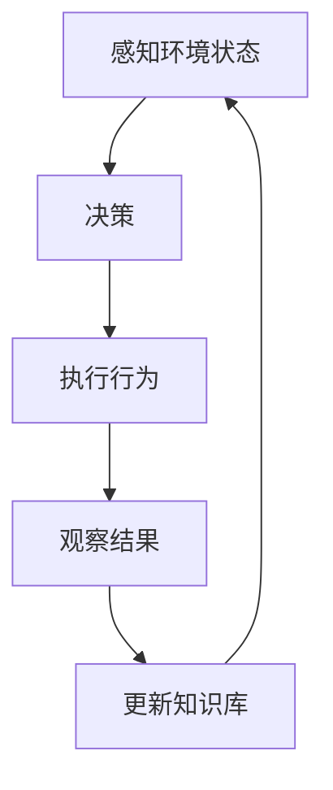

# AI Agent: AI的下一个风口 企业级应用与任务规划

## 1. 背景介绍

### 1.1 人工智能的发展历程

人工智能(Artificial Intelligence, AI)作为一门跨学科的技术,自20世纪50年代问世以来,已经经历了几个重要的发展阶段。早期的人工智能主要集中在专家系统、机器学习和自然语言处理等领域。随着计算能力和数据量的不断增长,深度学习技术在21世纪初开始崭露头角,推动了人工智能在计算机视觉、自然语言处理等领域取得了突破性进展。

### 1.2 AI Agent的兴起

近年来,随着人工智能技术的不断发展和应用场景的日益丰富,AI Agent(智能代理)这一新兴概念开始引起广泛关注。AI Agent可以被视为一种具有自主性、交互性和智能性的软件实体,能够感知环境、做出决策并执行相应的行为,从而协助或代替人类完成特定任务。

### 1.3 企业级应用与任务规划的重要性

在当前数字化转型的大潮中,企业纷纷寻求利用人工智能技术提高运营效率、优化决策过程、改善客户体验等。AI Agent作为一种灵活、智能且可扩展的解决方案,在企业级应用和任务规划领域展现出巨大的潜力。通过部署AI Agent,企业可以自动化重复性任务、提高业务流程效率、实现智能决策支持等,从而获得竞争优势。

## 2. 核心概念与联系

### 2.1 AI Agent的定义

AI Agent是一种具有感知、决策和行动能力的软件实体,能够根据环境状态做出智能响应。它通常包含以下几个核心组件:

- 感知器(Sensors):用于获取环境信息
- 执行器(Actuators):用于执行相应的行为
- 知识库(Knowledge Base):存储代理的知识和规则
- 推理引擎(Inference Engine):基于知识库进行推理和决策

### 2.2 AI Agent的分类

根据不同的特征,AI Agent可以分为以下几种类型:

- 反应型Agent(Reactive Agents)
- 基于模型的Agent(Model-based Agents)
- 目标驱动型Agent(Goal-based Agents)
- 实用型Agent(Utility-based Agents)
- 学习型Agent(Learning Agents)

### 2.3 企业级应用与任务规划

企业级应用指的是在企业环境中广泛使用的应用程序,通常需要满足高可用性、可扩展性、安全性等要求。任务规划则是指根据特定目标和约束条件,制定一系列行动步骤来实现该目标的过程。

在企业级应用中,AI Agent可以用于自动化流程、智能决策支持、客户服务等场景。而在任务规划方面,AI Agent可以根据预定目标和环境状态,动态生成并执行任务计划。

## 3. 核心算法原理具体操作步骤

### 3.1 AI Agent的基本工作流程

AI Agent的基本工作流程可以概括为以下几个步骤:

1. 感知环境状态
2. 基于知识库和推理引擎做出决策
3. 执行相应的行为
4. 观察行为结果并更新知识库

这个循环过程持续进行,直到达成预定目标或满足终止条件。



### 3.2 经典算法

AI Agent中常用的一些经典算法包括:

1. **搜索算法**:广度优先搜索(BFS)、深度优先搜索(DFS)、A*算法等,用于在状态空间中寻找最优解。
2. **规划算法**:情景规划、层次任务网络(HTN)规划等,用于生成行动序列以实现目标。
3. **机器学习算法**:决策树、神经网络、强化学习等,用于从数据中学习知识和策略。
4. **推理算法**:基于规则的推理、案例推理、模糊推理等,用于从知识库中推导出新知识。

### 3.3 算法选择与组合

在实际应用中,AI Agent往往需要综合运用多种算法来解决复杂问题。算法的选择取决于具体场景、目标和约束条件。此外,不同算法之间也可以相互组合,形成混合智能系统。

例如,在任务规划场景中,可以先使用规划算法生成初步行动序列,然后通过搜索算法优化该序列,并利用机器学习算法动态调整策略。

## 4. 数学模型和公式详细讲解举例说明

### 4.1 马尔可夫决策过程(MDP)

马尔可夫决策过程(Markov Decision Process, MDP)是AI Agent中一种常用的数学模型,用于描述决策过程。一个MDP可以用一个元组 $(S, A, P, R, \gamma)$ 来表示,其中:

- $S$ 是状态集合
- $A$ 是行动集合
- $P(s'|s,a)$ 是状态转移概率,表示在状态 $s$ 下执行行动 $a$ 后,转移到状态 $s'$ 的概率
- $R(s,a)$ 是即时奖励函数,表示在状态 $s$ 下执行行动 $a$ 所获得的即时奖励
- $\gamma \in [0, 1)$ 是折扣因子,用于权衡即时奖励和长期累积奖励

目标是找到一个策略 $\pi: S \rightarrow A$,使得在该策略下的期望累积奖励最大化:

$$
\max_{\pi} \mathbb{E}\left[\sum_{t=0}^{\infty} \gamma^t R(s_t, \pi(s_t))\right]
$$

其中 $s_t$ 是第 $t$ 个时间步的状态。

### 4.2 值函数和贝尔曼方程

在MDP中,我们定义状态值函数 $V^{\pi}(s)$ 和行动值函数 $Q^{\pi}(s,a)$ 来评估一个策略 $\pi$ 的好坏:

$$
V^{\pi}(s) = \mathbb{E}_{\pi}\left[\sum_{t=0}^{\infty} \gamma^t R(s_t, \pi(s_t)) \mid s_0 = s\right]
$$

$$
Q^{\pi}(s,a) = \mathbb{E}_{\pi}\left[\sum_{t=0}^{\infty} \gamma^t R(s_t, \pi(s_t)) \mid s_0 = s, a_0 = a\right]
$$

这两个函数满足贝尔曼方程:

$$
V^{\pi}(s) = \sum_{a \in A} \pi(a|s) \sum_{s' \in S} P(s'|s,a) \left[R(s,a) + \gamma V^{\pi}(s')\right]
$$

$$
Q^{\pi}(s,a) = \sum_{s' \in S} P(s'|s,a) \left[R(s,a) + \gamma \sum_{a' \in A} \pi(a'|s') Q^{\pi}(s',a')\right]
$$

通过求解这些方程,我们可以找到最优策略对应的值函数。

### 4.3 动态规划算法

动态规划是求解MDP的一种常用方法,包括价值迭代(Value Iteration)和策略迭代(Policy Iteration)两种算法。

**价值迭代**通过不断更新状态值函数或行动值函数,直到收敛于最优值函数:

$$
V_{k+1}(s) = \max_{a \in A} \sum_{s' \in S} P(s'|s,a) \left[R(s,a) + \gamma V_k(s')\right]
$$

**策略迭代**则在每次迭代中首先评估当前策略,然后改进策略:

1. 对于当前策略 $\pi_k$,求解 $V^{\pi_k}$
2. 构造新策略 $\pi_{k+1}$,使得 $\pi_{k+1}(s) = \arg\max_a \sum_{s'} P(s'|s,a)[R(s,a) + \gamma V^{\pi_k}(s')]$
3. 重复上述步骤,直到策略收敛

这两种算法都可以收敛到最优策略,但在不同情况下计算效率有所差异。

## 5. 项目实践: 代码实例和详细解释说明

为了更好地理解AI Agent的实现,我们以一个简单的网格世界(GridWorld)为例,演示如何使用Python和强化学习算法训练一个AI Agent。

### 5.1 问题描述

在一个 $4 \times 4$ 的网格世界中,有一个起点(绿色)和一个终点(红色),Agent(蓝色)的目标是从起点出发,找到一条路径到达终点。每次移动,Agent可以选择上下左右四个方向,但是有一定概率会偏移到其他方向。Agent需要学习一个最优策略,以最小化到达终点所需的步数。

```python
import numpy as np
import matplotlib.pyplot as plt

# 定义网格世界
grid = np.array([
    [0, 0, 0, 0],
    [0, 0, 0, 0],
    [0, 0, 0, 0],
    [2, 0, 0, 1]
])

# 定义状态转移概率
action_prob = 0.8  # 执行正确动作的概率

# 定义奖励函数
def reward_func(state, action, next_state):
    if next_state == 3:  # 到达终点
        return 1
    else:
        return 0

# 可视化网格世界
def visualize_grid(values=None):
    plt.imshow(grid, cmap='RdYlGn', vmin=0, vmax=1)
    for i in range(4):
        for j in range(4):
            state = grid[i, j]
            v = values[i, j] if values is not None else 0
            plt.text(j, i, f"{state:.2f}" if state else f"{v:.2f}",
                     horizontalalignment='center',
                     verticalalignment='center',
                     fontsize=12, fontweight='bold')
    plt.xticks([])
    plt.yticks([])
    plt.show()

visualize_grid()
```

### 5.2 实现Q-Learning算法

我们将使用Q-Learning算法来训练Agent。Q-Learning是一种无模型的强化学习算法,通过不断更新行动值函数 $Q(s,a)$ 来学习最优策略。

```python
import numpy as np

# 初始化Q表
Q = np.zeros((4, 4, 4))  # 状态空间大小: 4 * 4, 行动空间大小: 4

# 定义行动空间
actions = [(-1, 0), (1, 0), (0, -1), (0, 1)]  # 上下左右

# 超参数
alpha = 0.1  # 学习率
gamma = 0.9  # 折扣因子
epsilon = 0.1  # 探索率

# Q-Learning算法
for episode in range(1000):
    state = 0  # 初始状态
    done = False
    while not done:
        # 选择行动
        if np.random.uniform() < epsilon:
            action = np.random.choice(4)  # 探索
        else:
            action = np.argmax(Q[state])  # 利用

        # 执行行动并获取下一状态和奖励
        next_state, reward = step(state, action)

        # 更新Q值
        Q[state, action] += alpha * (reward + gamma * np.max(Q[next_state]) - Q[state, action])

        # 更新状态
        state = next_state

        # 判断是否到达终点
        if state == 3:
            done = True

# 可视化最优值函数
visualize_grid(np.max(Q, axis=2))
```

在上述代码中,我们首先初始化了Q表,然后进入训练循环。在每个episode中,Agent从初始状态出发,根据当前的Q值和探索策略选择行动。执行行动后,Agent会获得下一状态和即时奖励,并根据Q-Learning更新规则更新Q值。循环执行直到到达终点。

最后,我们可视化了最优值函数,即每个状态下最大的Q值,代表了Agent在该状态下执行最优行动所能获得的期望累积奖励。

### 5.3 结果分析

经过1000次训练后,我们得到了如下的最优值函数:

```
0.90 0.81 0.72 0.63
0.81 0.72 0.63 0.54
0.72 0.63 0.54 0.45
0.00 0.00 0.00 1.00
```

从可视化结果可以看出,Agent已经学会了从起点出发,通过最短路径到达终点。值函数的值反映了到达终点所需的期望步数,离终点越近,值越大。

通过这个简单的例子,我们可以体会到强化学习算法在