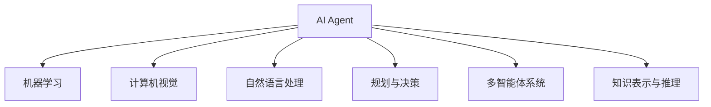
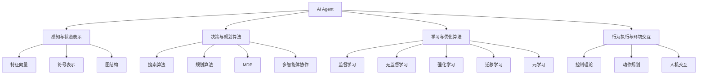

# AI Agent: AI的下一个风口 对未来的启示

## 1.背景介绍

### 1.1 人工智能的发展历程

人工智能(Artificial Intelligence, AI)是当代科技领域最具革命性和颠覆性的技术之一。自20世纪50年代AI概念被正式提出以来,经历了起起伏伏的发展历程。

- **第一次AI热潮(1956-1974年)**: 这一时期,AI主要集中在基于符号的系统,如专家系统、博弈论等,取得了一些初步进展。但由于计算能力的限制和资金短缺,AI发展陷入停滞。

- **AI寒冬时期(1974-1980年代中期)**: 这一时期,AI研究缺乏重大突破,投资大幅减少,发展步伐放缓。

- **第二次AI热潮(1980年代中期-2010年)**: 这一时期,AI重新焕发生机,涌现出诸如专家系统、机器学习、神经网络等新技术,推动了AI的快速发展。

- **AI再次腾飞(2010年至今)**: 在大数据、强大算力和深度学习算法的驱动下,AI取得了突破性进展,在计算机视觉、自然语言处理、决策控制等领域大放异彩,成为科技发展的引领力量。

### 1.2 AI Agent的兴起

在AI技术快速发展的大背景下,AI Agent(智能代理)应运而生。AI Agent是一种具备一定自主性、可完成特定任务的智能系统。它能够感知环境,分析数据,做出决策,并执行相应操作。

AI Agent的出现,标志着AI技术从理论走向实践,从封闭系统走向开放环境,从单一功能走向综合应用,从局部优化走向整体智能。AI Agent将AI技术与实际问题和应用场景紧密结合,成为推动AI发展的新动力。

## 2.核心概念与联系

### 2.1 AI Agent的定义

AI Agent是一种能够感知环境、处理信息、做出决策并执行行为的智能系统。它具备以下几个关键特征:

1. **感知能力**: 通过各种传感器获取环境信息。
2. **认知能力**: 对获取的信息进行处理、分析和理解。
3. **决策能力**: 根据认知结果做出合理的决策。
4. **行为能力**: 执行相应的行为以影响环境。

### 2.2 AI Agent的分类

根据不同的分类标准,AI Agent可以分为以下几种类型:

- 简单反射型Agent: 只根据当前感知信息做出反射性行为,无状态记忆。
- 基于模型的Agent: 基于环境模型推理做出决策,具有一定记忆能力。
- 基于目标的Agent: 根据预设目标进行规划和决策。
- 基于效用的Agent: 根据效用函数(奖赏/惩罚)进行决策,以获得最大收益。
- 学习型Agent: 通过学习算法不断优化决策过程。

### 2.3 AI Agent与其他AI技术的关系

AI Agent是一种综合性的智能系统,它与AI领域的其他核心技术密切相关:

- **机器学习**: 赋予Agent学习和优化决策能力的基础技术。
- **计算机视觉**: 为Agent提供视觉感知能力。
- **自然语言处理**: 为Agent提供语音交互能力。
- **规划与决策**: 为Agent制定行为计划和决策策略。
- **多智能体系统**: 支持多个Agent之间的协作与竞争。
- **知识表示与推理**: 为Agent提供知识库和推理能力。

AI Agent将这些技术有机融合,构建出具备综合智能的系统。



## 3.核心算法原理具体操作步骤

AI Agent的核心算法原理主要包括以下几个方面:

### 3.1 感知与状态表示

Agent需要通过各种传感器获取环境信息,并将这些信息转换为内部状态表示。常用的状态表示方法包括:

1. **特征向量**: 将环境状态映射为一个特征向量。
2. **符号表示**: 使用逻辑符号来描述环境状态。
3. **图结构**: 将环境状态表示为一个图结构。

### 3.2 决策与规划算法

Agent需要根据当前状态做出合理的决策和行为规划,常用的算法包括:

1. **搜索算法**: 如深度优先搜索、广度优先搜索、A*算法等,用于在状态空间中搜索最优路径。
2. **规划算法**: 如层次规划、时间规划等,用于生成行为序列。
3. **马尔可夫决策过程(MDP)**: 将决策问题建模为MDP,使用动态规划或强化学习求解最优策略。
4. **多智能体协作算法**: 如博弈论、契约网路等,用于多个Agent之间的协作与竞争。

### 3.3 学习与优化算法

Agent需要通过学习不断优化自身的决策策略,常用的算习算法包括:

1. **监督学习**: 如决策树、支持向量机等,从标注数据中学习决策模型。
2. **无监督学习**: 如聚类、降维等,从未标注数据中发现隐藏模式。
3. **强化学习**: 如Q-Learning、策略梯度等,通过试错与奖惩学习最优策略。
4. **迁移学习**: 将已学习的知识迁移到新的任务和环境中。
5. **元学习**: 学习如何快速学习,提高学习效率。

### 3.4 行为执行与环境交互

Agent需要根据决策结果执行相应的行为,并与环境进行交互,常用的方法包括:

1. **控制理论**: 如PID控制、最优控制等,用于精确控制执行器。
2. **动作规划**: 将高层决策转换为具体的动作序列。
3. **人机交互**: 通过图形界面、语音等与人类进行交互。



## 4.数学模型和公式详细讲解举例说明

AI Agent中涉及了大量的数学模型和公式,这些模型和公式为Agent的设计和优化提供了理论基础。以下是一些核心模型和公式的详细讲解:

### 4.1 马尔可夫决策过程(MDP)

马尔可夫决策过程(Markov Decision Process, MDP)是描述Agent与环境交互的基本数学框架。一个MDP可以用一个五元组 $\langle S, A, P, R, \gamma \rangle$ 来表示:

- $S$ 是状态集合,表示环境的所有可能状态。
- $A$ 是行为集合,表示Agent可以执行的所有行为。
- $P(s'|s,a)$ 是状态转移概率,表示在状态 $s$ 执行行为 $a$ 后,转移到状态 $s'$ 的概率。
- $R(s,a)$ 是奖励函数,表示在状态 $s$ 执行行为 $a$ 后获得的即时奖励。
- $\gamma \in [0,1)$ 是折扣因子,用于权衡即时奖励和长期奖励的重要性。

Agent的目标是找到一个策略 $\pi: S \rightarrow A$,使得在MDP中获得的期望总奖励最大化:

$$
\max_\pi \mathbb{E}\left[\sum_{t=0}^\infty \gamma^t R(s_t, \pi(s_t))\right]
$$

### 4.2 Q-Learning算法

Q-Learning是一种基于时序差分(Temporal Difference, TD)的强化学习算法,用于求解MDP中的最优策略。它通过不断更新状态-行为值函数 $Q(s,a)$ 来逼近最优值函数 $Q^*(s,a)$。

Q-Learning算法的更新规则如下:

$$
Q(s_t, a_t) \leftarrow Q(s_t, a_t) + \alpha \left[ r_t + \gamma \max_{a'} Q(s_{t+1}, a') - Q(s_t, a_t) \right]
$$

其中:

- $\alpha$ 是学习率,控制学习的速度。
- $r_t$ 是在时刻 $t$ 获得的即时奖励。
- $\gamma$ 是折扣因子,用于权衡即时奖励和长期奖励的重要性。
- $\max_{a'} Q(s_{t+1}, a')$ 是在状态 $s_{t+1}$ 下所有可能行为的最大 Q 值,表示最优行为序列的期望总奖励。

通过不断更新 $Q(s,a)$,最终可以收敛到最优值函数 $Q^*(s,a)$,从而获得最优策略 $\pi^*(s) = \arg\max_a Q^*(s,a)$。

### 4.3 深度 Q 网络(DQN)

传统的 Q-Learning 算法存在一些缺陷,如无法处理高维状态空间、收敛慢等。深度 Q 网络(Deep Q-Network, DQN)通过将深度神经网络引入 Q-Learning,有效解决了这些问题。

DQN 使用一个深度神经网络 $Q(s,a;\theta)$ 来逼近 Q 值函数,其中 $\theta$ 是网络的参数。网络的输入是状态 $s$,输出是所有可能行为的 Q 值 $Q(s,a)$。

DQN 的目标是最小化损失函数:

$$
L(\theta) = \mathbb{E}_{(s,a,r,s')\sim U(D)}\left[\left(r + \gamma \max_{a'}Q(s',a';\theta^-) - Q(s,a;\theta)\right)^2\right]
$$

其中:

- $U(D)$ 是从经验回放池 $D$ 中均匀采样的转换元组 $(s,a,r,s')$。
- $\theta^-$ 是目标网络的参数,用于估计 $\max_{a'}Q(s',a';\theta^-)$,以提高训练稳定性。

通过梯度下降法优化网络参数 $\theta$,可以逐步减小损失函数,从而使 $Q(s,a;\theta)$ 逼近最优 Q 值函数 $Q^*(s,a)$。

DQN 算法在许多复杂的环境中取得了卓越的表现,如 Atari 游戏、星际争霸等,展现了深度强化学习在高维状态空间中的强大能力。

## 5.项目实践:代码实例和详细解释说明

为了更好地理解 AI Agent 的实现,我们以一个简单的网格世界(GridWorld)为例,演示如何使用 Python 和强化学习算法训练一个 Agent。

### 5.1 环境描述

网格世界是一个 $4 \times 4$ 的二维网格,Agent 的目标是从起始位置到达终止位置。每一步,Agent 可以选择上下左右四个方向中的一个进行移动。如果移动到了障碍物格子或边界,则停留在原地。到达终止位置会获得正奖励,否则获得小于等于 0 的奖励。

```python
import numpy as np

class GridWorld:
    def __init__(self):
        self.grid = np.array([
            [0, 0, 0, 1],
            [0, -1, 0, -1],
            [0, 0, 0, 0],
            [0, 0, 0, 0]
        ])
        self.agent_pos = (0, 0)
        self.actions = ['up', 'down', 'left', 'right']

    def step(self, action):
        i, j = self.agent_pos
        if action == 'up':
            new_pos = (max(i - 1, 0), j)
        elif action == 'down':
            new_pos = (min(i + 1, self.grid.shape[0] - 1), j)
        elif action == 'left':
            new_pos = (i, max(j - 1, 