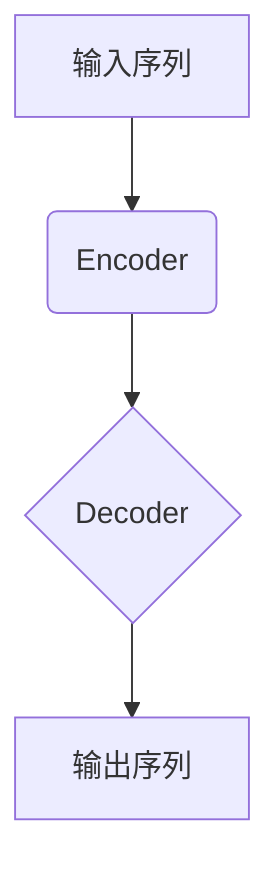
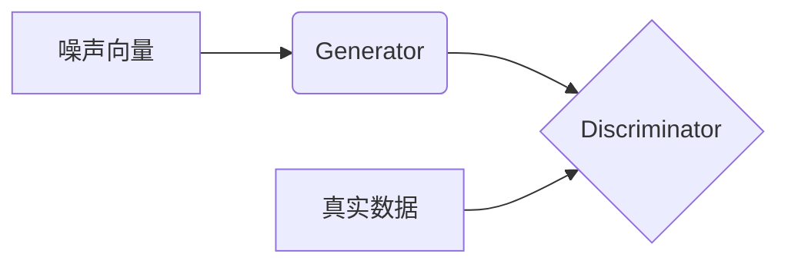
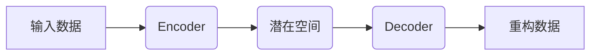

# AIGC从入门到实战：AIGC在金融行业的创新场景—银行零售新范式

## 1.背景介绍

### 1.1 AIGC的兴起

近年来,人工智能生成式内容(AIGC)技术的快速发展正在重塑各行各业的运营模式。AIGC技术利用深度学习算法从海量数据中学习模式,能够生成逼真的文本、图像、音频和视频等多模态内容,为企业带来前所未有的创新机遇。

在金融行业,AIGC技术的应用正在推动银行零售服务的全面变革。传统的银行零售模式面临着诸多挑战,如标准化服务难以满足个性化需求、渠道单一导致客户体验差等。AIGC技术为银行带来了突破性的解决方案,有望彻底重塑银行的零售业务模式。

### 1.2 银行零售服务的痛点

银行零售业务作为银行的主要收入来源之一,其服务质量和客户体验直接影响着银行的竞争力。然而,传统银行零售服务存在以下几个主要痛点:

1. **标准化服务**:传统银行零售服务大多采用"一刀切"的标准化模式,难以满足不同客户的个性化需求。

2. **渠道单一**:线下网点是传统银行零售服务的主要渠道,客户体验较差,无法实现7*24小时无缝服务。

3. **人力成本高**:人工服务模式导致人力成本居高不下,严重制约了银行的盈利能力。

4. **营销效率低**:传统营销手段如冷Call、短信营销等已显效率低下,难以精准触达目标客户群体。

5. **风控能力薄弱**:人工风控存在主观判断偏差,且无法对海量数据进行实时分析,风控能力有待提升。

面对这些痛点,AIGC技术为银行零售服务带来了全新的解决方案和发展机遇。

## 2.核心概念与联系

### 2.1 AIGC技术概述

AIGC(AI-Generated Content)技术是指利用人工智能算法从海量数据中学习模式,生成逼真的文本、图像、音频、视频等多模态内容。AIGC技术主要包括以下几个核心技术:

1. **自然语言处理(NLP)**: 用于理解和生成人类语言文本内容。

2. **计算机视觉(CV)**: 用于理解和生成图像、视频等视觉内容。 

3. **语音识别与合成**: 用于理解和生成语音内容。

4. **深度学习算法**: 如Transformer、GPT、BERT等,是AIGC技术的核心驱动力。

5. **大模型训练**: 基于海量数据训练大规模AI模型,是AIGC技术的基础。

AIGC技术的发展离不开算力、数据等基础资源的支持,同时也面临着版权、隐私、伦理等挑战。

### 2.2 AIGC在银行零售的应用场景

AIGC技术在银行零售领域的应用主要集中在以下几个方面:

1. **智能客服**: 基于NLP和对话系统,提供7*24小时智能客服,解决客户咨询、投诉等问题。

2. **个性化营销**: 利用大数据和AI算法,实现精准客户画像和个性化营销内容生成。

3. **风控审核**: 应用NLP和CV技术,对客户信息进行智能审核,提高风控效率和准确性。  

4. **智能投顾**: 基于大数据和AI模型,为客户提供个性化的投资理财建议。

5. **智能助手**: 集成多模态AI能力,为客户提供一站式智能化金融服务。

AIGC技术在银行零售领域的应用,有望显著提升服务质量、降低运营成本、提高风控能力,推动银行零售服务实现数字化转型。

## 3.核心算法原理具体操作步骤  

### 3.1 Transformer模型

Transformer是AIGC技术中广泛使用的核心深度学习模型,其自注意力机制能够有效捕捉输入序列中长距离依赖关系,在生成式任务上表现出色。Transformer模型主要包括编码器(Encoder)和解码器(Decoder)两个部分。



1. **Encoder**:将输入序列编码为一系列向量表示。
2. **Decoder**:基于Encoder的输出,生成相应的输出序列。

Transformer模型的训练过程包括:

1. **预训练**:在大规模无标注数据上预训练模型参数。
2. **微调**:在特定任务的标注数据上,微调预训练模型参数。

Transformer模型广泛应用于AIGC任务,如机器翻译、文本生成、对话系统等。

### 3.2 生成对抗网络(GAN)

生成对抗网络(GAN)是一种用于生成式建模的深度学习框架,在AIGC中常用于生成逼真的图像、视频等视觉内容。GAN由生成器(Generator)和判别器(Discriminator)两个对抗模型组成。



1. **Generator**:生成器从随机噪声中生成假样本。
2. **Discriminator**:判别器判断输入是真实样本还是生成样本。

GAN的训练过程是一个迭代的对抗过程:

1. 生成器生成假样本,试图欺骗判别器。
2. 判别器学习区分真假样本。
3. 生成器根据判别器反馈,不断改进生成质量。

GAN模型广泛应用于图像生成、图像翻译、视频生成等AIGC任务。

### 3.3 变分自动编码器(VAE)

变分自动编码器(VAE)是一种用于生成式建模和表示学习的深度学习框架,常用于AIGC中的内容生成任务。VAE由编码器(Encoder)和解码器(Decoder)两部分组成。



1. **Encoder**:将输入数据编码为潜在表示。
2. **Decoder**:从潜在表示中重构原始数据。

VAE的训练目标是最大化输入数据的Evidence Lower Bound(ELBO),包括:

1. 重构损失:输入与重构数据的差异。
2. KL散度:潜在分布与先验分布的差异。

通过对抗训练,VAE可学习数据的潜在表示和生成模型,广泛应用于文本、图像、视频等多模态内容生成。

## 4.数学模型和公式详细讲解举例说明

### 4.1 Transformer注意力机制

Transformer模型中的自注意力机制是捕捉输入序列长距离依赖关系的关键。给定查询(Query)向量$q$、键(Key)向量$k$和值(Value)向量$v$,注意力机制计算如下:

$$\begin{aligned}
\text{Attention}(q, k, v) &= \text{softmax}(\frac{qk^T}{\sqrt{d_k}})v \\
&= \sum_{i=1}^n \alpha_i v_i
\end{aligned}$$

其中,$\alpha_i$为注意力权重:

$$\alpha_i = \frac{\exp(q(k_i)^T/\sqrt{d_k})}{\sum_{j=1}^n\exp(q(k_j)^T/\sqrt{d_k})}$$

$d_k$为缩放因子,用于防止内积过大导致梯度消失。

通过计算查询向量与所有键向量的相关性,注意力机制自动学习对输入序列中不同位置分配不同的权重,从而捕捉长距离依赖关系。

### 4.2 GAN损失函数

GAN的目标是让生成器$G$生成的假样本$G(z)$无法被判别器$D$识别,同时让判别器能够正确区分真实样本$x$和假样本$G(z)$。这可以形式化为一个两人零和博弈:

$$\min_G \max_D V(D,G) = \mathbb{E}_{x\sim p_{\text{data}}(x)}[\log D(x)] + \mathbb{E}_{z\sim p_z(z)}[\log(1-D(G(z)))]$$

其中,$p_{\text{data}}$为真实数据分布,$p_z$为噪声先验分布。

对于判别器$D$,其目标是最大化上式;对于生成器$G$,其目标是最小化上式。通过交替优化,GAN可以学习生成逼真的样本分布$p_g$,使其尽可能逼近真实数据分布$p_{\text{data}}$。

### 4.3 VAE损失函数 

VAE的训练目标是最大化输入数据$x$的Evidence Lower Bound(ELBO):

$$\mathcal{L}(\theta,\phi;x) = \mathbb{E}_{q_\phi(z|x)}[\log p_\theta(x|z)] - D_{KL}(q_\phi(z|x)||p(z))$$

其中:

- $p_\theta(x|z)$为解码器,表示从潜在变量$z$生成数据$x$的概率。
- $q_\phi(z|x)$为编码器,表示从数据$x$推断潜在变量$z$的分布。
- $D_{KL}$为KL散度,衡量两个分布的差异。

第一项为重构损失,衡量输入与重构数据的差异;第二项为KL正则项,促使潜在分布$q_\phi(z|x)$逼近先验分布$p(z)$。

通过最大化ELBO,VAE可以同时学习数据的潜在表示$q_\phi(z|x)$和生成模型$p_\theta(x|z)$,从而实现内容生成。

## 5.项目实践:代码实例和详细解释说明

### 5.1 Transformer实现文本生成

以下是使用Hugging Face的Transformers库实现文本生成的Python代码示例:

```python
from transformers import GPT2LMHeadModel, GPT2Tokenizer

# 加载预训练模型和分词器
model = GPT2LMHeadModel.from_pretrained('gpt2')
tokenizer = GPT2Tokenizer.from_pretrained('gpt2')

# 输入文本
input_text = "今天天气很好,"

# 对输入文本进行编码
input_ids = tokenizer.encode(input_text, return_tensors='pt')

# 生成文本
output = model.generate(input_ids, max_length=100, do_sample=True, top_k=50, top_p=0.95, num_return_sequences=1)

# 解码输出
generated_text = tokenizer.decode(output[0], skip_special_tokens=True)

print(generated_text)
```

代码解释:

1. 加载预训练的GPT-2模型和分词器。
2. 输入种子文本`"今天天气很好,"`。
3. 使用分词器对输入文本进行编码,得到输入token ids。
4. 调用`model.generate()`方法生成文本,设置相关参数如最大长度、采样策略等。
5. 使用分词器将输出token ids解码为文本。

通过修改输入种子文本和调整生成参数,可以生成不同风格和主题的文本内容。

### 5.2 GAN实现图像生成

以下是使用PyTorch实现DCGAN(Deep Convolutional GAN)进行图像生成的Python代码示例:

```python
import torch
import torch.nn as nn

# 生成器
class Generator(nn.Module):
    def __init__(self, z_dim=100, img_channels=3):
        # ...
    
    def forward(self, z):
        # ...
        return img

# 判别器
class Discriminator(nn.Module):
    def __init__(self, img_channels=3):
        # ...
    
    def forward(self, img):
        # ...
        return validity

# 初始化模型
device = torch.device('cuda' if torch.cuda.is_available() else 'cpu')
gen = Generator().to(device)
dis = Discriminator().to(device)

# 训练循环
for epoch in range(epochs):
    for real_imgs in dataloader:
        real_imgs = real_imgs.to(device)
        
        # 训练判别器
        # ...
        
        # 训练生成器
        # ...
        
    # 保存生成的图像
    # ...
```

代码解释:

1. 定义生成器`Generator`和判别器`Discriminator`的网络结构。
2. 初始化模型,并将模型加载到GPU(如果可用)。
3. 在训练循环中,对每个批次的真实图像:
    - 训练判别器,使其能够区分真实图像和生成图像