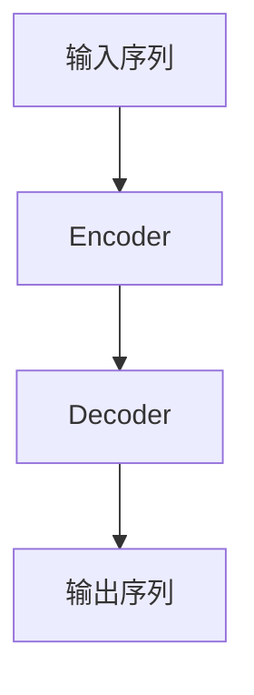

# AIGC从入门到实战：横看成岭侧成峰：ChatGPT的外貌及内涵是什么样？

## 1. 背景介绍

### 1.1 人工智能的崛起

人工智能(Artificial Intelligence, AI)是当代科技领域最热门、最具革命性的技术之一。从深度学习(Deep Learning)算法的突破性发展,到大规模并行计算硬件的飞速进化,再到海量数据的累积和存储,人工智能技术的发展已经渗透到我们生活的方方面面。无论是语音助手、自动驾驶汽车、医疗诊断系统,还是内容创作、游戏对战等领域,人工智能都正在发挥着越来越重要的作用。

### 1.2 AIGC的兴起

在人工智能的浪潮中,一个新兴的领域正在崭露头角——AIGC(Artificial Intelligence Generated Content,人工智能生成内容)。AIGC技术利用机器学习、自然语言处理等人工智能算法,可以自动生成文字、图像、音频、视频等多种形式的内容。其中,以ChatGPT为代表的大型语言模型(Large Language Model, LLM)在文本生成领域取得了令人瞩目的成就,引发了全球范围内的热烈讨论和广泛关注。

### 1.3 ChatGPT的崛起

2022年11月,OpenAI推出的ChatGPT在短短几个月内就吸引了数百万用户。作为一款基于GPT-3.5语言模型的对话式AI助手,ChatGPT不仅能够进行高质量的问答互动,还可以帮助用户完成各种任务,如写作、编程、数学计算等。其出色的性能和多功能性,令人们再次感受到了人工智能的强大魅力。

ChatGPT的出现,被视为人工智能发展的一个重要里程碑。它不仅展现了当前人工智能技术的高度,更为未来AIGC技术的发展指明了方向。那么,ChatGPT的外表和内在本质到底是什么样的呢?本文将从多个角度深入探讨这一问题。

## 2. 核心概念与联系

### 2.1 人工智能与机器学习

要理解ChatGPT的本质,我们首先需要了解人工智能(AI)和机器学习(Machine Learning)的基本概念。

人工智能是一门旨在使机器具备类似于人类的智能行为的学科,包括感知、推理、学习、规划和行动等多种能力。而机器学习则是人工智能的一个重要分支,它赋予计算机系统从数据中自主学习和改进的能力,无需显式编程。

机器学习算法可以分为三大类:监督学习(Supervised Learning)、无监督学习(Unsupervised Learning)和强化学习(Reinforcement Learning)。其中,监督学习是当前最成熟和应用最广泛的机器学习范式,它通过从标注好的训练数据中学习,建立输入和输出之间的映射关系。

### 2.2 神经网络与深度学习

神经网络(Neural Network)是机器学习的一种重要模型,其设计灵感来源于生物神经系统。神经网络由多层节点(神经元)组成,每层节点通过加权连接与上下层节点相连,并通过激活函数对输入信号进行非线性转换。通过对大量训练数据的学习,神经网络可以自动提取输入数据的特征,并对输出做出预测或决策。

深度学习(Deep Learning)是一种基于多层神经网络的机器学习方法,它能够从原始数据(如图像、文本等)中自动学习出多级表示特征,从而解决复杂的任务。近年来,深度学习在计算机视觉、自然语言处理、语音识别等领域取得了突破性进展,推动了人工智能技术的飞速发展。

### 2.3 自然语言处理与语言模型

自然语言处理(Natural Language Processing, NLP)是人工智能的一个重要分支,旨在使计算机能够理解和生成人类语言。NLP技术广泛应用于机器翻译、问答系统、文本分类、信息检索等领域。

语言模型(Language Model)是NLP中的一种核心技术,它通过对大量文本数据的学习,捕捉语言的统计规律,从而能够预测下一个单词或字符的概率。传统的语言模型主要基于n-gram统计方法,而现代语言模型则多采用神经网络模型,如循环神经网络(RNN)、长短期记忆网络(LSTM)和Transformer等。

### 2.4 Transformer与自注意力机制

Transformer是一种全新的基于自注意力机制(Self-Attention)的神经网络架构,由谷歌的研究人员在2017年提出,主要用于序列到序列(Sequence-to-Sequence)的建模任务,如机器翻译、语言理解等。

与传统的循环神经网络相比,Transformer完全基于注意力机制,摒弃了循环和卷积结构,从而克服了长期依赖问题,并且可以高效利用并行计算资源。自注意力机制使Transformer能够同时关注输入序列中的所有位置,从而捕捉长距离依赖关系。

Transformer架构的出现,极大地提高了NLP任务的性能表现,成为当前主流的语言模型架构。

### 2.5 GPT与大型语言模型

GPT(Generative Pre-trained Transformer)是一种基于Transformer的大型语言模型,由OpenAI于2018年提出。GPT采用自回归(Auto-Regressive)的方式,对大规模文本语料进行预训练,学习文本的统计规律,从而获得强大的语言理解和生成能力。

GPT的后续版本GPT-2(2019年)和GPT-3(2020年)进一步扩大了模型规模,参数量从原来的1.2亿增加到1750亿,展现出了惊人的文本生成能力。GPT-3被视为当前最强大的语言模型之一,它可以完成包括写作、问答、代码生成等多种任务,为AIGC技术的发展奠定了基础。

ChatGPT正是基于GPT-3.5模型进行了进一步优化和微调,从而获得了出色的对话交互能力。

## 3. 核心算法原理具体操作步骤

### 3.1 Transformer架构原理

为了理解ChatGPT的工作原理,我们需要先了解其核心架构Transformer的细节。Transformer由编码器(Encoder)和解码器(Decoder)两个子模块组成,如下图所示:

1. **Encoder**:负责处理输入序列,捕捉其中的上下文信息。Encoder由多个相同的层组成,每层包含两个子层:多头自注意力机制(Multi-Head Self-Attention)和前馈神经网络(Feed-Forward Neural Network)。

2. **Decoder**:基于Encoder输出的上下文信息,生成相应的输出序列。Decoder的结构与Encoder类似,但在自注意力机制之外,还引入了一个额外的注意力子层,用于关注Encoder的输出。

3. **自注意力机制**:是Transformer的核心部分。它允许每个位置的单词与输入序列的所有其他位置建立直接连接,从而捕捉长距离依赖关系。

4. **多头注意力**:将注意力机制复制多次,从不同的表示子空间捕捉不同的相关性,最后将这些子空间的信息进行合并。

5. **残差连接**:将子层的输入和输出相加,以构建更深层的网络,同时避免梯度消失问题。

6. **层归一化**:对每层的输入进行归一化处理,加速收敛并提高性能。

通过上述结构,Transformer可以高效地对输入序列进行编码,并基于编码信息生成相应的输出序列,从而完成序列到序列的转换任务。

### 3.2 GPT语言模型原理

GPT(Generative Pre-trained Transformer)是一种基于Transformer架构的大型语言模型,它采用自回归(Auto-Regressive)的方式对语料进行预训练,从而获得强大的语言理解和生成能力。

GPT的训练过程可分为两个阶段:

1. **预训练(Pre-training)**:在这个阶段,GPT模型会在大规模的文本语料上进行无监督预训练,目标是最大化下一个词的预测概率。具体来说,给定一个文本序列 $x_1, x_2, \ldots, x_n$,GPT需要学习到一个条件概率分布 $P(x_n | x_1, x_2, \ldots, x_{n-1})$,即根据前面的词预测下一个词的概率。通过这种自回归的方式,GPT可以捕捉语言的统计规律和上下文依赖关系。

2. **微调(Fine-tuning)**:在完成预训练后,GPT可以针对特定的下游任务(如文本生成、问答等)进行进一步的微调。这个阶段会利用有标注的数据集,对预训练模型的部分参数进行调整,以更好地适应目标任务。

通过上述两个阶段的训练,GPT可以学习到丰富的语言知识,并将其应用到各种NLP任务中。GPT的后续版本GPT-2和GPT-3通过扩大模型规模和提高训练数据量,进一步提升了模型的性能表现。

ChatGPT正是基于GPT-3.5模型,通过针对性的微调,获得了出色的对话交互能力。

## 4. 数学模型和公式详细讲解举例说明

### 4.1 自注意力机制

自注意力机制(Self-Attention)是Transformer架构的核心部分,它允许每个位置的单词与输入序列的所有其他位置建立直接连接,从而捕捉长距离依赖关系。

给定一个长度为 $n$ 的输入序列 $X = (x_1, x_2, \ldots, x_n)$,其中每个 $x_i$ 是一个 $d$ 维向量,自注意力机制的计算过程如下:

1. 将输入序列 $X$ 线性映射到查询(Query)、键(Key)和值(Value)三个向量空间:

$$
Q = XW^Q, K = XW^K, V = XW^V
$$

其中 $W^Q, W^K, W^V$ 分别是可学习的权重矩阵。

2. 计算查询 $Q$ 与所有键 $K$ 的点积,得到一个 $n \times n$ 的分数矩阵 $S$:

$$
S = QK^T
$$

3. 对分数矩阵 $S$ 进行缩放处理,并应用 Softmax 函数得到注意力权重矩阵 $A$:

$$
A = \text{Softmax}(\frac{S}{\sqrt{d_k}})
$$

其中 $d_k$ 是键向量的维度,缩放操作可以防止较大的值导致 Softmax 函数梯度消失或爆炸。

4. 将注意力权重矩阵 $A$ 与值向量 $V$ 相乘,得到最终的注意力输出 $Z$:

$$
Z = AV
$$

通过上述计算,自注意力机制可以自适应地捕捉输入序列中任意两个位置之间的相关性,从而更好地建模长距离依赖关系。

### 4.2 多头注意力机制

为了进一步提高模型的表示能力,Transformer引入了多头注意力机制(Multi-Head Attention)。多头注意力机制将注意力机制复制多次,从不同的表示子空间捕捉不同的相关性,最后将这些子空间的信息进行合并。

具体来说,假设我们有 $h$ 个注意力头,每个注意力头都会独立地执行自注意力计算,得到一个注意力输出 $Z_i$:

$$
Z_i = \text{Attention}(QW_i^Q, KW_i^K, VW_i^V)
$$

其中 $W_i^Q, W_i^K, W_i^V$ 是第 $i$ 个注意力头的可学习权重矩阵。

然后,将所有注意力头的输出进行拼接和线性变换,得到最终的多头注意力输出 $Z$:

$$
Z = \text{Concat}(Z_1, Z_2, \ldots, Z_h)W^O
$$

其中 $W^O$ 是另一个可学习的权重矩阵,用于将拼接后的向量映射回原始的维度空间。

通过多头注意力机制,Transformer可以从不同的子空间捕捉不同的相关性,提高了模型的表示能力和性能。

### 