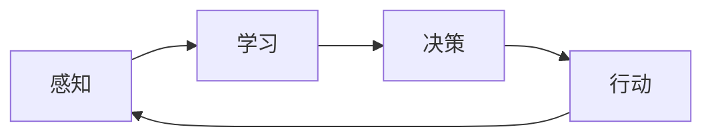

# AI人工智能代理工作流 AI Agent WorkFlow：智能体的设计与实现

## 1. 背景介绍
在人工智能的迅猛发展中，智能代理（Intelligent Agents）扮演着至关重要的角色。它们是能够自主操作、感知环境并作出决策的系统，广泛应用于机器人、自动驾驶、智能家居等领域。智能代理的工作流程是其设计与实现的核心，它涉及感知、学习、决策和行动等多个环节。本文将深入探讨智能代理的工作流程，从核心概念到实际应用，为读者提供一个全面的视角。

## 2. 核心概念与联系
智能代理的工作流程涉及多个核心概念，包括感知（Perception）、学习（Learning）、决策（Decision Making）和行动（Action）。感知是智能代理获取外部信息的过程，学习则是通过数据分析和模式识别来改善其行为模式，决策是基于当前状态和已有知识选择最佳行动方案，行动则是智能代理对环境产生影响的具体执行过程。



## 3. 核心算法原理具体操作步骤
智能代理的核心算法原理包括但不限于机器学习算法、深度学习网络、强化学习策略等。操作步骤通常包括数据预处理、特征提取、模型训练、策略优化和行动执行等。以强化学习为例，其操作步骤可以概括为：定义环境和代理状态、选择合适的奖励函数、采用适当的学习策略、执行行动并观察结果、根据反馈调整策略。

## 4. 数学模型和公式详细讲解举例说明
智能代理的数学模型通常涉及概率论、统计学、线性代数等领域。例如，在强化学习中，马尔可夫决策过程（MDP）是常用的数学模型，其核心公式包括状态转移概率 $P(s'|s,a)$ 和奖励函数 $R(s,a)$。通过这些数学工具，我们可以对智能代理的行为进行量化分析和预测。

$$
V(s) = \max_a \sum_{s'} P(s'|s,a) [R(s,a) + \gamma V(s')]
$$

## 5. 项目实践：代码实例和详细解释说明
在项目实践中，我们通常使用Python等编程语言来实现智能代理的工作流程。以下是一个简单的强化学习代理的伪代码示例：

```python
class ReinforcementAgent:
    def __init__(self, states, actions):
        self.states = states
        self.actions = actions
        self.Q = defaultdict(lambda: 0)  # Q-value table

    def choose_action(self, state):
        # Choose an action based on the current state and policy
        pass

    def learn(self, state, action, reward, next_state):
        # Update Q-value table based on experience
        pass

# 主循环
agent = ReinforcementAgent(states, actions)
for episode in range(total_episodes):
    state = env.reset()
    while not done:
        action = agent.choose_action(state)
        next_state, reward, done = env.step(action)
        agent.learn(state, action, reward, next_state)
        state = next_state
```

## 6. 实际应用场景
智能代理的工作流程在多个领域有着广泛的应用，如自动驾驶汽车中的决策系统、推荐系统中的个性化推荐、智能家居中的环境控制等。这些应用场景展示了智能代理在解决实际问题中的强大能力和潜在价值。

## 7. 工具和资源推荐
为了更好地设计和实现智能代理，以下是一些推荐的工具和资源：
- TensorFlow、PyTorch：强大的深度学习框架。
- OpenAI Gym：提供多种环境的强化学习工具包。
- Scikit-learn：机器学习算法的集合库。

## 8. 总结：未来发展趋势与挑战
智能代理的未来发展趋势将更加注重多模态学习、自适应性和泛化能力。同时，随着技术的进步，如何确保智能代理的决策过程透明、可解释和符合伦理标准，也是未来研究的重要挑战。

## 9. 附录：常见问题与解答
Q1: 智能代理和机器学习有什么区别？
A1: 机器学习是智能代理的一个子集，智能代理不仅包括学习能力，还包括感知、决策和行动等能力。

Q2: 如何评估智能代理的性能？
A2: 可以通过任务完成率、决策时间、奖励总和等指标来评估智能代理的性能。

作者：禅与计算机程序设计艺术 / Zen and the Art of Computer Programming