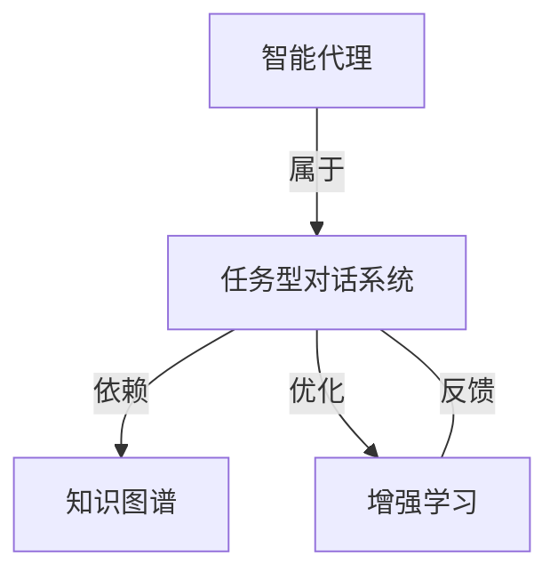

# AI人工智能代理工作流AI Agent WorkFlow：智能代理在CRM客户管理中的应用

## 1. 背景介绍

随着人工智能技术的飞速发展,越来越多的企业开始将AI应用到各个业务领域,以提高工作效率和业务绩效。客户关系管理(CRM)作为企业的一项核心业务,也开始引入AI技术,尤其是AI智能代理,来优化客户服务流程,提升客户满意度。本文将重点探讨AI智能代理在CRM客户管理中的应用,介绍相关的核心概念、算法原理、数学模型、代码实践以及未来发展趋势,帮助读者全面了解这一前沿技术领域。

### 1.1 CRM客户关系管理概述
#### 1.1.1 CRM的定义与内涵
#### 1.1.2 CRM的发展历程
#### 1.1.3 CRM的业务流程与功能模块

### 1.2 人工智能技术发展现状
#### 1.2.1 人工智能的概念与分类
#### 1.2.2 人工智能的关键技术
#### 1.2.3 人工智能在企业级应用中的现状

### 1.3 AI智能代理的兴起
#### 1.3.1 AI智能代理的定义与特点  
#### 1.3.2 AI智能代理的技术架构
#### 1.3.3 AI智能代理在客服领域的应用价值

## 2. 核心概念与联系

要理解AI智能代理在CRM中的应用,需要先明确几个核心概念:

### 2.1 智能代理(Intelligent Agent)
智能代理是一种能够感知环境、自主行动,并通过学习不断优化的人工智能系统。它一般由感知模块、决策模块和执行模块组成,可以代替人类完成特定任务。

### 2.2 任务型对话系统(Task-oriented Dialogue System)
任务型对话系统是智能代理的一种,旨在通过自然语言对话的方式帮助用户完成特定任务,如客服咨询、业务办理等。它需要具备语义理解、对话管理、信息检索等多项AI能力。

### 2.3 知识图谱(Knowledge Graph) 
知识图谱以结构化的方式存储领域知识,为智能代理提供问答和推理的知识基础。它一般包含大量的实体(如产品、服务等)及其属性和关系。

### 2.4 增强学习(Reinforcement Learning)
增强学习是一种机器学习范式,智能体通过与环境的交互,根据反馈的奖励或惩罚来不断优化行为策略。它在对话策略优化、用户模拟等方面有重要应用。

下图展示了这几个核心概念之间的关系:



智能代理作为一种任务型对话系统,以知识图谱为基础,通过增强学习算法不断优化对话策略,从而更好地服务用户。

## 3. 核心算法原理具体操作步骤

### 3.1 任务型对话系统的流程
一个典型的任务型对话系统通常包含以下几个步骤:

1. 用户输入理解:对用户的自然语言输入进行意图识别和语义解析。
2. 对话状态跟踪:根据当前对话上下文,记录和更新用户意图完成所需的关键信息。
3. 对话策略决策:根据对话状态,决定下一步的系统动作,如提问、查询知识库、返回结果等。
4. 回复生成:将系统动作转换成自然语言回复。

### 3.2 对话管理的 POMDP 框架
在对话管理中,POMDP(Partially Observable Markov Decision Process)是一种重要的理论框架。它将对话看作一个部分可观察的马尔可夫决策过程:

- State(状态):对话的真实状态,包含用户意图、信念状态等,但不完全可观察。
- Action(动作):系统可执行的动作,如提问、查询等。
- Observation(观察):用户的话语,是状态的一种体现。
- Reward(奖励):根据系统动作对当前对话的影响给出的即时奖励值。

对话策略的目标就是根据历史观察序列,选择一个动作序列使得累积期望奖励最大。

### 3.3 深度强化学习算法
传统的 POMDP 优化方法在大规模对话管理任务中遇到了扩展性问题。近年来,深度强化学习为此提供了新的思路。一般采用 Actor-Critic 框架:

- Actor 网络:根据状态,生成动作的概率分布。
- Critic 网络:根据状态-动作对,评估当前策略的性能。

两个网络通过梯度下降等方法交替优化,最终收敛到最优策略。常用的算法包括 DDPG、PPO、REINFORCE 等。

## 4. 数学模型和公式详细讲解举例说明

### 4.1 POMDP 数学模型
POMDP 用一个六元组 $<S,A,T,R,\Omega,O>$ 来描述:

- $S$:状态空间,每个状态 $s$ 对应一个对话真实状态。
- $A$:动作空间,每个动作 $a$ 对应系统的一个可能动作。
- $T$:状态转移函数,$T(s'|s,a)$表示在状态 $s$ 下执行动作 $a$ 后转移到状态 $s'$ 的概率。
- $R$:奖励函数,$R(s,a)$表示在状态 $s$ 下执行动作 $a$ 后获得的即时奖励。
- $\Omega$:观察空间,每个观察 $o$ 对应用户的一次话语。
- $O$:观察函数,$O(o|s',a)$表示在执行动作 $a$ 后转移到状态 $s'$ 时,观察到 $o$ 的概率。

求解 POMDP 的目标是寻找一个最优策略 $\pi^*:S\rightarrow A$,使得从任意状态 $s$ 开始,执行 $\pi^*(s)$ 的累积期望奖励最大。

$$\pi^*=\arg\max_{\pi} E\left[\sum_{t=0}^{\infty} \gamma^t R(s_t,\pi(s_t))\right]$$

其中 $\gamma\in[0,1]$ 为折扣因子。

### 4.2 强化学习中的 Bellman 方程
在强化学习中,我们定义状态-动作值函数 $Q^\pi(s,a)$ 表示在状态 $s$ 下执行动作 $a$,并在之后都遵循策略 $\pi$ 的累积期望奖励。它满足贝尔曼方程:

$$Q^\pi(s,a)=R(s,a)+\gamma \sum_{s'\in S}T(s'|s,a)V^\pi(s')$$

其中 $V^\pi(s)=\max_{a\in A} Q^\pi(s,a)$ 为状态值函数。最优状态-动作值函数 $Q^*(s,a)$ 满足最优贝尔曼方程:

$$Q^*(s,a)=R(s,a)+\gamma \sum_{s'\in S}T(s'|s,a)\max_{a'\in A} Q^*(s',a')$$

### 4.3 基于值函数的强化学习算法
许多强化学习算法通过优化近似的值函数来求解最优策略,如 Q-learning:

$$Q(s_t,a_t) \leftarrow Q(s_t,a_t)+\alpha[R(s_t,a_t)+\gamma \max_a Q(s_{t+1},a)-Q(s_t,a_t)]$$

其中 $\alpha$ 为学习率。在深度强化学习中,值函数 $Q(s,a)$ 由深度神经网络来近似表示。

## 5. 项目实践：代码实例和详细解释说明

下面我们用 PyTorch 实现一个简单的任务型对话系统,以客服机器人为例。

### 5.1 环境和依赖
- Python 3.6+
- PyTorch 1.5+
- transformers 4.5+

### 5.2 对话管理模型
我们使用 BERT 作为对话管理模型的主干网络,输入为当前对话状态(用户话语、系统动作历史等),输出为下一步的系统动作。

```python
import torch
import torch.nn as nn
from transformers import BertModel

class DialogueManager(nn.Module):
    def __init__(self):
        super().__init__()
        self.bert = BertModel.from_pretrained('bert-base-uncased')
        self.action_head = nn.Linear(768, num_actions)
        
    def forward(self, input_ids, attention_mask):
        outputs = self.bert(input_ids, attention_mask=attention_mask)
        pooled_output = outputs[1] 
        action_logits = self.action_head(pooled_output)
        return action_logits
```

### 5.3 强化学习训练
我们使用 PPO 算法来训练对话管理模型,奖励函数根据对话的成功完成度、对话轮数等指标来设计。

```python
from transformers import AdamW

model = DialogueManager()
optimizer = AdamW(model.parameters(), lr=1e-5)

for epoch in range(num_epochs):
    for batch in data_loader:
        input_ids, attention_mask, actions, rewards = batch
        
        action_logits = model(input_ids, attention_mask)
        action_probs = nn.functional.softmax(action_logits, dim=-1)
        action_log_probs = nn.functional.log_softmax(action_logits, dim=-1)
        
        action_loss = -torch.sum(action_log_probs * rewards)
        
        kl_div = nn.functional.kl_div(action_log_probs, old_action_probs, reduction='batchmean')
        kl_loss = kl_div * kl_coef
        
        total_loss = action_loss + kl_loss
        
        optimizer.zero_grad()
        total_loss.backward()
        optimizer.step()
```

### 5.4 模型推理
训练好的模型可用于实际对话:

```python
model.eval()
with torch.no_grad():
    while True:
        user_input = input("User: ")
        input_ids, attention_mask = tokenize(user_input)
        action_logits = model(input_ids, attention_mask)
        action_id = torch.argmax(action_logits, dim=-1)
        action_response = lookup_response(action_id)
        print("Bot:", action_response)
```

## 6. 实际应用场景

AI智能代理在CRM客户管理中有广泛的应用,主要场景包括:

### 6.1 客服咨询
用户可通过文字或语音与智能客服机器人进行多轮对话,机器人通过知识库问答、上下文理解等技术,解答用户的常见问题,如产品功能、使用方法、故障诊断等。

### 6.2 业务办理
智能代理可引导用户完成一些标准化的业务办理流程,如账单查询、套餐变更、故障报修等。通过填槽位、多轮问询等形式收集必要信息,并调用后台接口完成业务操作。

### 6.3 客户画像
智能代理可通过与客户的历史交互数据,如对话记录、购买记录等,构建客户画像,进行客户分群。这为精准营销、个性化推荐等CRM应用提供了支持。

### 6.4 服务质量分析
对智能代理与客户的对话数据进行分析,可以发现服务流程中的问题,如话术不当、客户投诉等,为质检、流程优化提供依据。通过机器学习不断优化对话策略,也可以提升客户满意度。

## 7. 工具和资源推荐

### 7.1 开源对话系统框架
- Rasa: https://rasa.com/
- DeepPavlov: https://deeppavlov.ai/
- Botkit: https://botkit.com/

### 7.2 自然语言处理工具包
- NLTK: http://www.nltk.org/
- spaCy: https://spacy.io/
- Transformers: https://huggingface.co/transformers/

### 7.3 知识图谱构建工具
- Neo4j: https://neo4j.com/
- ArangoDB: https://www.arangodb.com/
- Protege: https://protege.stanford.edu/

### 7.4 开源对话数据集
- MultiWOZ: https://github.com/budzianowski/multiwoz
- bAbI: https://research.fb.com/downloads/babi/
- Ubuntu Dialogue Corpus: https://github.com/rkadlec/ubuntu-ranking-dataset-creator

## 8. 总结：未来发展趋势与挑战

AI智能代理在CRM领域虽然已有一定应用,但仍有很大的发展空间。未来的主要趋势包括:

### 8.1 更加