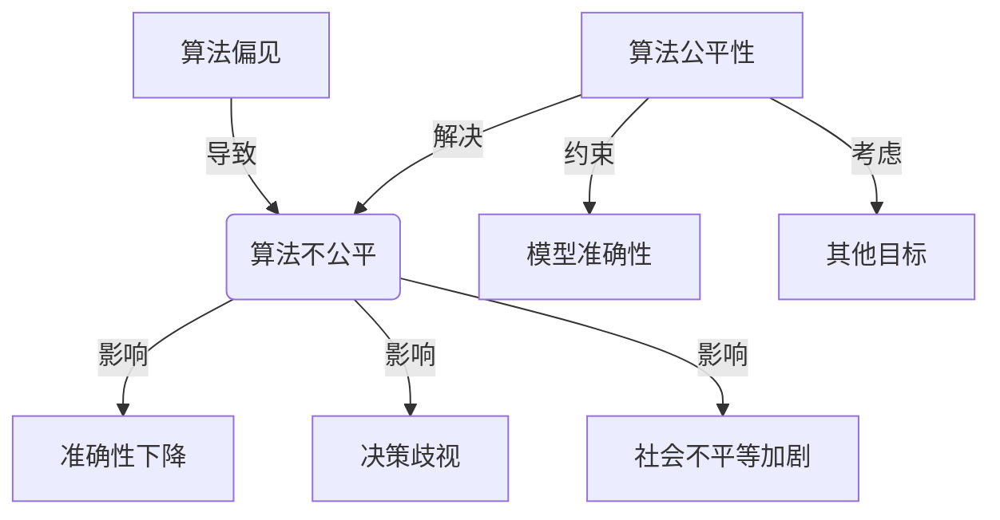
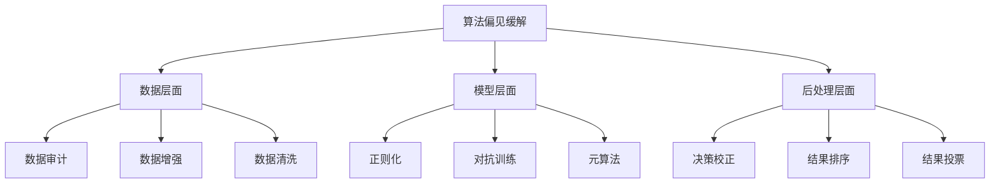

# AI人工智能核心算法原理与代码实例讲解：算法偏见

## 1.背景介绍

在当今的数字时代,人工智能(AI)已经无处不在,从个人助理到自动驾驶汽车,再到医疗诊断和金融决策等诸多领域。然而,随着AI系统的广泛应用,一个日益受到关注的问题是算法偏见。算法偏见指的是AI系统在做出决策或预测时存在的不公平或歧视性倾向,这可能源于训练数据中固有的偏差、算法本身的缺陷或其他因素。

算法偏见不仅会影响AI系统的准确性和公平性,还可能加剧社会不平等,侵犯个人隐私和民权。因此,解决算法偏见已经成为AI领域的一个重大挑战,吸引了业界和学术界的广泛关注。

## 2.核心概念与联系

### 2.1 算法偏见的类型

算法偏见可以分为多种类型,包括但不限于:

1. **数据偏见**: 训练数据集中存在代表性不足或系统性偏差,导致模型学习到不公平的模式。
2. **算法偏见**: 算法本身的设计或优化目标可能会引入偏见。
3. **交互偏见**: 人机交互过程中的偏见,如用户输入的偏见或系统反馈的偏见。
4. **环境偏见**: 算法部署环境中的偏差,如硬件或基础设施的差异。

### 2.2 算法公平性

为了解决算法偏见问题,需要引入算法公平性的概念。算法公平性是指AI系统在做出决策或预测时,应该对不同群体保持公平和无歧视。常见的算法公平性定义包括:

1. **群组公平性**: 不同人口统计群体在整体上受到的决策或预测应该是相似的。
2. **个体公平性**: 类似的个体应该受到类似的对待。
3. **因果公平性**: 决策或预测不应该基于不相关的敏感属性,如种族或性别。

实现算法公平性需要在准确性、公平性和其他目标之间进行权衡和优化。

## 3.核心算法原理具体操作步骤

### 3.1 偏差缓解技术

为了缓解算法偏见,研究人员提出了多种技术,可以在数据、模型和后处理三个层面进行应用。

#### 3.1.1 数据层面

1. **数据审计**: 分析数据集中的潜在偏差,如缺失值、标签噪声和群体分布差异等。
2. **数据增强**: 通过过采样、欠采样或生成对抗网络等技术来平衡数据集中的群体分布。
3. **数据清洗**: 移除或修正数据集中的噪声标签或不相关的敏感属性。

#### 3.1.2 模型层面

1. **正则化**: 在模型训练过程中加入公平性正则项,惩罚不公平的决策。
2. **对抗训练**: 通过对抗样本训练,提高模型对敏感属性的鲁棒性。
3. **元算法**: 设计新的公平机器学习算法,如prejudice remover和优化预处理等。

#### 3.1.3 后处理层面

1. **决策校正**: 对模型输出进行校正,使其满足特定的公平性标准。
2. **结果排序**: 对模型输出进行重新排序,提高公平性。
3. **结果投票**: 集成多个模型的输出,提高公平性和鲁棒性。

### 3.2 算法公平性评估

评估算法公平性是确保AI系统公平和无歧视的关键步骤。常见的评估指标包括:

1. **统计学检验**: 如卡方检验、t检验等,用于检测不同群体之间的差异是否显著。
2. **群组公平性指标**: 如统计率简单性、等等机会、条件等等等等等等等等等等等等等等等等等等等等等等等等等等等等等等等等等等等等等等等等等等等等等等等等等等等等等等等等等等等等等等等等等等等等等等等等等等等等等等等等等等等等等等等等等等等等等等等等等等等等等等等等等等等等等等等等等等等等等等等等等等等等等等等等等等等等等等等等等等等等等等等等等等等等等等等等等等等等等等等等等等等等等等等等等等等等等等等等等等等等等等等等等等等等等等等等等等等等等等等等等等等等等等等等等等等等等等等等等等等等等等等等等等等等等等等等等等等等等等等等等等等等等等等等等等等等等等等等等等等等等等等等等等等等等等等等等等等等等等等等等等等等等等等等等等等等等等等等等等等等等等等等等等等等等等等等等等等等等等等等等等等等等等等等等等等等等等等等等等等等等等等等等等等等等等等等等等等等等等等等等等等等等等等等等等等等等等等等等等等等等等等等等等等等等等等等等等等等等等等等等等等等等等等等等等等等等等等等等等等等等等等等等等等等等等等等等等等等等等等等等等等等等等等等等等等等等等等等等等等等等等等等等等等等等等等等等等等等等等等等等等等等等等等等等等等等等等等等等等等等等等等等等等等等等等等等等等等等等等等等等等等等等等等等等等等等等等等等等等等等等等等等等等等等等等等等等等等等等等等等等等等等等等等等等等等等等等等等等等等等等等等等等等等等等等等等等等等等等等等等等等等等等等等等等等等等等等等等等等等等等等等等等等等等等等等等等等等等等等等等等等等等等等等等等等等等等等等等等等等等等等等等等等等等等等等等等等等等等等等等等等等等等等等等等等等等等等等等等等等等等等等等等等等等等等等等等等等等等等等等等等等等等等等等等等等等等等等等等等等等等等等等等等等等等等等等等等等等等等等等等等等等等