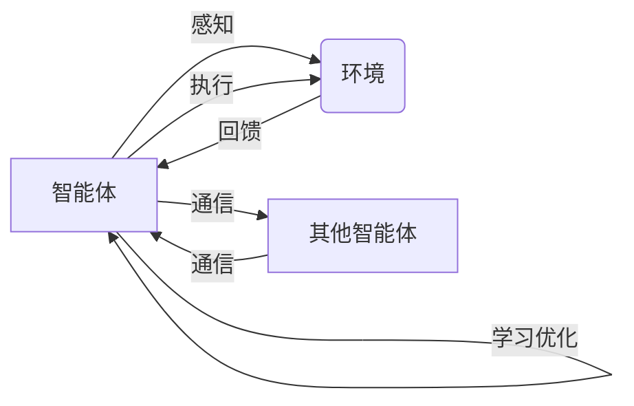

# AI人工智能深度学习算法：代理通信与协作模型概览

## 1. 背景介绍
### 1.1 人工智能的发展历程
#### 1.1.1 早期人工智能
#### 1.1.2 专家系统时代  
#### 1.1.3 机器学习与深度学习崛起

### 1.2 多智能体系统的兴起
#### 1.2.1 分布式人工智能 
#### 1.2.2 群体智能
#### 1.2.3 多智能体强化学习

### 1.3 智能体间通信与协作的重要性
#### 1.3.1 实现群体智能的基础
#### 1.3.2 提高系统整体性能
#### 1.3.3 扩展应用场景

## 2. 核心概念与联系
### 2.1 智能体 Agent
#### 2.1.1 定义与特点
#### 2.1.2 感知、决策与执行
#### 2.1.3 目标导向性

### 2.2 通信 Communication  
#### 2.2.1 通信渠道与协议
#### 2.2.2 显式通信与隐式通信
#### 2.2.3 通信效率与成本

### 2.3 协作 Collaboration
#### 2.3.1 协作的定义与分类
#### 2.3.2 协作机制设计
#### 2.3.3 博弈论视角下的协作

### 2.4 概念间的关系
#### 2.4.1 通信是协作的基础
#### 2.4.2 协作促进群体智能涌现
#### 2.4.3 智能体内在机制与外在交互的统一

## 3. 核心算法原理具体操作步骤
### 3.1 集中式通信与协作
#### 3.1.1 中心调度器设计
#### 3.1.2 全局信息聚合与分发
#### 3.1.3 优缺点分析

### 3.2 分布式通信与协作
#### 3.2.1 去中心化架构
#### 3.2.2 局部交互生成全局涌现
#### 3.2.3 一致性与容错机制

### 3.3 基于深度学习的通信协作
#### 3.3.1 端到端可微通信协议
#### 3.3.2 图神经网络建模智能体交互
#### 3.3.3 多智能体深度强化学习

### 3.4 基于博弈论的通信协作
#### 3.4.1 合作博弈与纳什均衡
#### 3.4.2 重复博弈与演化稳定策略  
#### 3.4.3 机制设计理论指导协作

## 4. 数学模型和公式详细讲解举例说明
### 4.1 图模型表示智能体交互
#### 4.1.1 无向图与邻接矩阵
#### 4.1.2 图卷积神经网络
#### 4.1.3 消息传递神经网络

### 4.2 博弈论模型刻画协作 
#### 4.2.1 囚徒困境与重复博弈
#### 4.2.2 合作进化动力学方程
#### 4.2.3 最优机制设计

### 4.3 多智能体马尔可夫决策过程
#### 4.3.1 状态、动作、奖励定义
#### 4.3.2 联合策略与纳什均衡
#### 4.3.3 分布式优化算法

## 5. 项目实践：代码实例和详细解释说明
### 5.1 基于PyTorch的通信协作环境搭建
#### 5.1.1 定义Agent类与通信接口
#### 5.1.2 实现集中式与分布式通信逻辑
#### 5.1.3 自定义奖励函数与训练流程

### 5.2 基于PaddlePaddle的图神经网络通信协作
#### 5.2.1 构建图数据集与数据加载器
#### 5.2.2 搭建GCN与GAT网络结构
#### 5.2.3 端到端训练与效果评估

### 5.3 基于RLlib的多智能体强化学习
#### 5.3.1 定义多智能体环境接口
#### 5.3.2 实现MADDPG算法  
#### 5.3.3 分布式采样与训练加速

## 6. 实际应用场景
### 6.1 自动驾驶中的车车通信与协作
#### 6.1.1 V2V通信标准与协议
#### 6.1.2 多车协同决策与控制
#### 6.1.3 交通流量优化

### 6.2 智慧城市中的群体智能调度
#### 6.2.1 大规模传感器网络
#### 6.2.2 分布式任务分配与执行
#### 6.2.3 应急响应与自组织

### 6.3 多机器人系统协同作业
#### 6.3.1 异构机器人通信标准
#### 6.3.2 协同感知、规划与控制
#### 6.3.3 群体涌现行为分析

## 7. 工具和资源推荐
### 7.1 通信协作仿真平台
#### 7.1.1 Gazebo与ROS
#### 7.1.2 Unity ML-Agents
#### 7.1.3 SUMO交通仿真器

### 7.2 图神经网络开源框架
#### 7.2.1 PyTorch Geometric
#### 7.2.2 Deep Graph Library
#### 7.2.3 Euler

### 7.3 多智能体强化学习库
#### 7.3.1 OpenAI MADDPG
#### 7.3.2 RLlib MARL
#### 7.3.3 MARLPO

## 8. 总结：未来发展趋势与挑战
### 8.1 通信协作机制的持续创新
#### 8.1.1 差分通信压缩
#### 8.1.2 注意力机制动态协作
#### 8.1.3 基于区块链的激励机制

### 8.2 多模态通信协作
#### 8.2.1 自然语言交互
#### 8.2.2 视觉语义理解
#### 8.2.3 情感感知与共情

### 8.3 安全隐私与鲁棒性
#### 8.3.1 对抗攻防博弈
#### 8.3.2 差分隐私保护
#### 8.3.3 Byzantine容错协作

## 9. 附录：常见问题与解答
### 9.1 通信协作的计算复杂度如何?
### 9.2 如何权衡通信效率与成本?
### 9.3 多智能体探索与利用的平衡?
### 9.4 通信信道受限情况下如何协作?
### 9.5 异构智能体间如何有效通信协作?

智能体之间的通信与协作是实现群体智能的关键。通过智能体间信息交互与分工合作，多个智能体可以实现优于单个智能体的性能，产生群体涌现行为。本文从智能体、通信、协作三个核心概念出发，系统阐述了它们之间的内在联系，并重点介绍了相关的理论算法。

在算法层面，我们详细讲解了集中式、分布式两种通信协作范式，以及如何利用深度学习和博弈论等技术对通信协作过程进行建模优化。同时给出了基于主流深度学习框架的代码实践，展示了如何构建仿真环境并训练智能体。

针对通信协作在自动驾驶、智慧城市、机器人等领域的应用场景，本文分别从通信协议、协同决策、群体行为等角度进行了剖析。在工具和资源推荐部分，我们介绍了主流的通信协作仿真平台、图神经网络开源框架以及多智能体强化学习库，为相关研究提供参考。

展望未来，通信协作机制还有很大的创新空间，差分通信、注意力机制、区块链激励等新技术为其注入了新的活力。此外，多模态通信以及安全隐私等方面的挑战也亟需攻克。相信通过学界和业界的共同努力，智能体通信协作模型必将取得更大的突破，为人工智能的发展贡献力量。

以上是智能体通信协作的一个简要概念框架图。智能体通过感知环境获取信息，并与其他智能体进行通信交互，在此基础上做出决策并执行动作，同时通过学习机制不断优化自身策略，最终实现群体智能。

作者：禅与计算机程序设计艺术 / Zen and the Art of Computer Programming