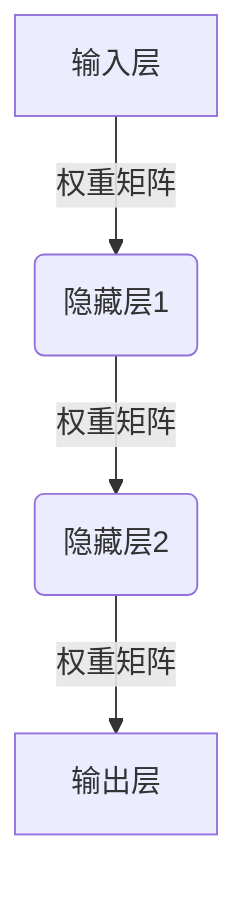
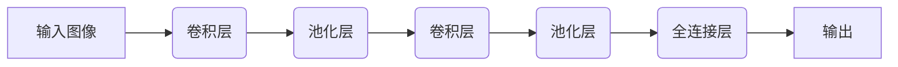
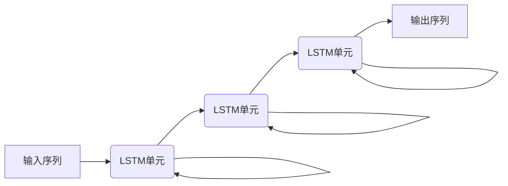
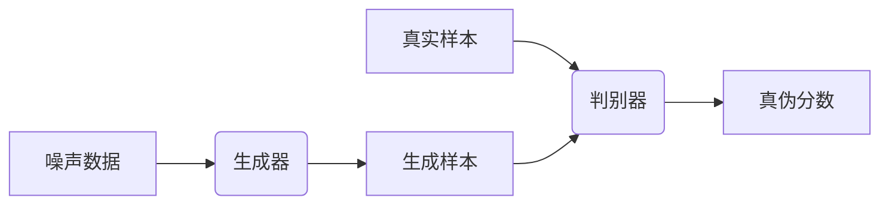

# AI人工智能深度学习算法：在模式识别中的应用

## 1.背景介绍

### 1.1 模式识别的重要性

在当今科技飞速发展的时代,模式识别技术扮演着至关重要的角色。无论是计算机视觉、自然语言处理、生物信息学还是其他领域,模式识别都是实现智能系统的关键基础。模式识别技术赋予了机器以识别、分类和理解复杂数据的能力,使得人工智能系统能够从海量数据中发现隐藏的规律和模式,并对其进行高效处理和决策。

### 1.2 传统模式识别方法的局限性

传统的模式识别方法,如统计机器学习算法、支持向量机等,虽然在特定场景下表现出色,但也存在一些固有的局限性。例如,这些方法需要人工设计特征,且对于高维、非线性和复杂的数据,其性能往往受到限制。此外,传统方法缺乏对数据本质的深层次理解,难以捕捉数据中的内在结构和规律。

### 1.3 深度学习在模式识别中的突破

深度学习作为一种全新的机器学习范式,为模式识别领域带来了革命性的变革。深度神经网络具有强大的自动学习特征的能力,可以从原始数据中自动提取高层次的抽象特征,从而更好地表示数据的内在结构。与传统方法相比,深度学习模型不需要人工设计特征,能够自主地从数据中学习最优特征表示,从而更好地解决复杂的模式识别问题。

## 2.核心概念与联系

### 2.1 神经网络

神经网络是深度学习的核心模型,其设计灵感来源于生物神经系统。神经网络由多层神经元组成,每个神经元接收来自上一层的输入,经过非线性激活函数的转换,将结果传递给下一层。通过对网络参数的不断调整和优化,神经网络可以学习到输入数据与目标输出之间的映射关系。

### 2.2 卷积神经网络

卷积神经网络(CNN)是深度学习在计算机视觉领域的杰出代表,它通过卷积、池化等操作,能够自动学习图像的空间特征。CNN在图像分类、目标检测、语义分割等任务中表现出色,成为了计算机视觉的主流模型。

### 2.3 循环神经网络

循环神经网络(RNN)是处理序列数据(如文本、语音等)的有力工具。与前馈神经网络不同,RNN在隐藏层之间引入了循环连接,使得网络能够捕捉序列数据中的时间依赖关系。长短期记忆网络(LSTM)和门控循环单元(GRU)是RNN的两种常用变体,广泛应用于自然语言处理、语音识别等领域。

### 2.4 生成对抗网络

生成对抗网络(GAN)是一种全新的深度学习架构,由生成网络和判别网络组成。生成网络的目标是生成逼真的样本数据,而判别网络则旨在区分生成的样本和真实数据。通过生成器和判别器之间的对抗训练,GAN可以学习到数据的真实分布,并生成新的、逼真的样本数据。GAN在图像生成、语音合成等领域展现出巨大的潜力。

## 3.核心算法原理具体操作步骤  

### 3.1 前馈神经网络

前馈神经网络是最基本的神经网络结构,其核心思想是通过层层传递,将输入数据映射到目标输出。前馈神经网络的训练过程遵循以下步骤:

1. **网络初始化**: 随机初始化神经网络的权重和偏置参数。
2. **前向传播**: 将输入数据传递至输出层,计算每一层的激活值。
3. **计算损失**: 根据输出层的激活值和真实标签,计算损失函数的值。
4. **反向传播**: 利用链式法则,计算每一层参数相对于损失函数的梯度。
5. **参数更新**: 根据梯度下降算法,更新网络参数(权重和偏置)。
6. **重复训练**: 重复步骤2-5,直至网络收敛或达到最大迭代次数。

通过上述步骤,前馈神经网络可以逐步优化参数,从而学习到输入数据与目标输出之间的映射关系。

### 3.2 卷积神经网络

卷积神经网络在图像处理任务中表现卓越,其核心操作包括卷积和池化:

1. **卷积层**: 卷积层通过滑动卷积核在输入数据(如图像)上进行卷积操作,提取局部特征。卷积核的权重在训练过程中被学习得到。
2. **激活层**: 激活层对卷积层的输出施加非线性激活函数(如ReLU),增强网络的表达能力。
3. **池化层**: 池化层对激活数据进行下采样,减小数据尺寸,提高模型的鲁棒性。常用的池化操作包括最大池化和平均池化。
4. **全连接层**: 全连接层将前面层的特征映射到最终的输出,如分类标签。

通过交替堆叠卷积层、激活层和池化层,CNN可以自动学习图像的层次化特征表示,并在全连接层将这些特征映射到最终的输出。

### 3.3 循环神经网络

循环神经网络擅长处理序列数据,如文本、语音等。以LSTM为例,其训练过程可分为以下步骤:

1. **初始化**: 初始化LSTM单元的状态(细胞状态和隐藏状态)。
2. **前向传播**: 对于序列中的每个时间步,执行以下操作:
   - 将当前输入和上一时间步的隐藏状态传入LSTM单元。
   - LSTM单元根据输入和状态,计算当前时间步的输出、细胞状态和隐藏状态。
3. **计算损失**: 根据最后一个时间步的输出和真实标签,计算损失函数的值。
4. **反向传播**: 利用反向传播算法,计算每个时间步的梯度。
5. **参数更新**: 根据梯度下降算法,更新LSTM单元的参数。
6. **重复训练**: 重复步骤2-5,直至网络收敛或达到最大迭代次数。

通过上述步骤,LSTM能够捕捉序列数据中的长期依赖关系,从而更好地解决序列建模任务。

### 3.4 生成对抗网络

生成对抗网络的训练过程是一个对抗博弈的过程,包括以下步骤:

1. **初始化**: 初始化生成器和判别器的参数。
2. **生成器训练**:
   - 从噪声分布中采样噪声数据。
   - 将噪声数据输入生成器,生成假样本。
   - 将假样本输入判别器,计算判别器对假样本的判别分数。
   - 根据判别分数计算生成器的损失函数。
   - 更新生成器的参数,使其生成的假样本能够欺骗判别器。
3. **判别器训练**:
   - 从真实数据和生成器生成的假样本中采样数据。
   - 将采样数据输入判别器,计算判别器对真实样本和假样本的判别分数。
   - 根据判别分数计算判别器的损失函数。
   - 更新判别器的参数,使其能够更好地区分真实样本和假样本。
4. **重复训练**: 重复步骤2和3,直至生成器和判别器达到动态平衡。

通过生成器和判别器的对抗训练,GAN可以学习到数据的真实分布,并生成新的、逼真的样本数据。

## 4.数学模型和公式详细讲解举例说明

### 4.1 神经网络

神经网络的核心数学模型是通过权重矩阵和激活函数,将输入数据映射到输出。对于一个具有 $L$ 层的全连接神经网络,第 $l$ 层的输出 $\boldsymbol{a}^{(l)}$ 可以表示为:

$$\boldsymbol{a}^{(l)} = g\left(\boldsymbol{W}^{(l)}\boldsymbol{a}^{(l-1)} + \boldsymbol{b}^{(l)}\right)$$

其中:
- $\boldsymbol{W}^{(l)}$ 是第 $l$ 层的权重矩阵
- $\boldsymbol{b}^{(l)}$ 是第 $l$ 层的偏置向量
- $g(\cdot)$ 是激活函数,如ReLU、Sigmoid等

在训练过程中,我们需要优化神经网络的参数 $\boldsymbol{W}$ 和 $\boldsymbol{b}$,使得输出 $\boldsymbol{a}^{(L)}$ 能够最小化损失函数 $J(\boldsymbol{W},\boldsymbol{b})$。常用的优化算法包括梯度下降法和其变体,如随机梯度下降、动量梯度下降等。

### 4.2 卷积神经网络

卷积神经网络的核心操作是卷积和池化。对于一个二维卷积层,卷积操作可以表示为:

$$\boldsymbol{a}_{i,j}^{(l)} = g\left(\sum_{m,n}\boldsymbol{W}_{m,n}^{(l)}\ast\boldsymbol{a}_{i+m,j+n}^{(l-1)} + b^{(l)}\right)$$

其中:
- $\boldsymbol{W}^{(l)}$ 是第 $l$ 层的卷积核权重
- $\ast$ 表示卷积操作
- $b^{(l)}$ 是第 $l$ 层的偏置项
- $g(\cdot)$ 是激活函数

池化操作则是通过下采样来减小特征图的尺寸,常用的池化方法包括最大池化和平均池化。对于一个 $2\times2$ 的最大池化层,池化操作可以表示为:

$$\boldsymbol{a}_{i,j}^{(l)} = \max\limits_{0\leq m,n<2}\boldsymbol{a}_{2i+m,2j+n}^{(l-1)}$$

通过交替堆叠卷积层和池化层,CNN可以逐层提取图像的局部特征和全局特征,从而实现对图像的有效表示和处理。

### 4.3 循环神经网络

循环神经网络的核心思想是引入循环连接,捕捉序列数据中的时间依赖关系。以LSTM为例,在第 $t$ 个时间步,LSTM单元的状态更新公式如下:

$$\begin{aligned}
\boldsymbol{f}_t &= \sigma\left(\boldsymbol{W}_f\cdot\left[\boldsymbol{h}_{t-1},\boldsymbol{x}_t\right] + \boldsymbol{b}_f\right)\\
\boldsymbol{i}_t &= \sigma\left(\boldsymbol{W}_i\cdot\left[\boldsymbol{h}_{t-1},\boldsymbol{x}_t\right] + \boldsymbol{b}_i\right)\\
\boldsymbol{o}_t &= \sigma\left(\boldsymbol{W}_o\cdot\left[\boldsymbol{h}_{t-1},\boldsymbol{x}_t\right] + \boldsymbol{b}_o\right)\\
\boldsymbol{c}_t &= \boldsymbol{f}_t\odot\boldsymbol{c}_{t-1} + \boldsymbol{i}_t\odot\tanh\left(\boldsymbol{W}_c\cdot\left[\boldsymbol{h}_{t-1},\boldsymbol{x}_