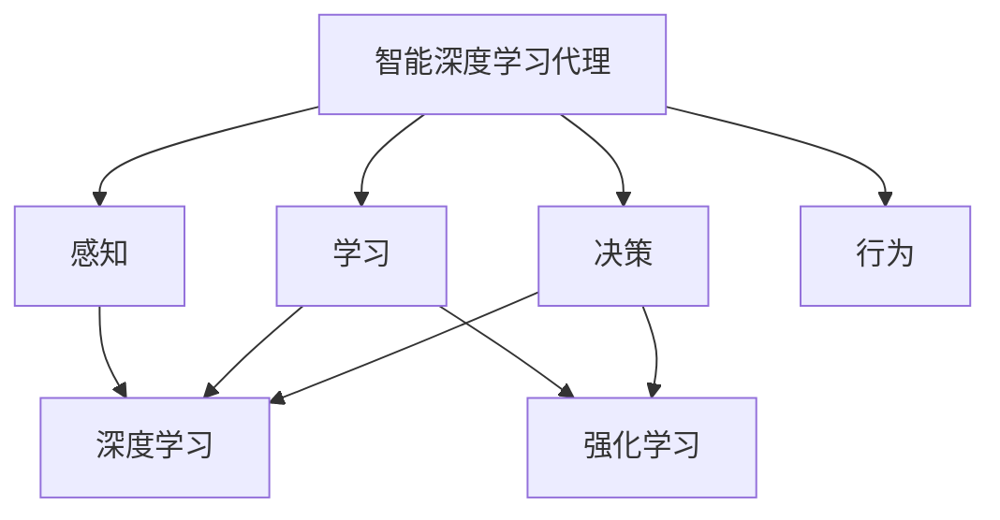

# AI人工智能深度学习算法：智能深度学习代理的构建基础

## 1.背景介绍

### 1.1 人工智能的兴起

人工智能(Artificial Intelligence, AI)是当代科技发展的热点领域,近年来受到了前所未有的关注和投资。AI的发展历程可以追溯到20世纪50年代,当时一些先驱者提出了"智能机器"的设想,并开始探索如何使计算机具备一些智能行为。

### 1.2 深度学习的崛起

传统的人工智能系统主要依赖人工设计的规则和算法,但在处理复杂问题时往往效果不佳。21世纪初,深度学习(Deep Learning)技术的出现为人工智能注入了新的活力。深度学习是机器学习的一个新兴热点领域,它模仿人脑神经网络的结构和工作原理,通过训练多层神经网络自动学习特征模式,在计算机视觉、自然语言处理等领域取得了突破性进展。

### 1.3 智能代理的需求

随着人工智能技术的不断发展,人们对智能系统的期望也在不断提高。传统的人工智能系统往往只能解决特定的任务,而现代社会需要更加通用和智能的代理(Agent),能够感知环境、学习经验、做出决策并执行行为,自主完成复杂任务。构建这种智能代理需要综合运用多种人工智能技术,其中深度学习是关键的基础。

## 2.核心概念与联系  

### 2.1 智能代理

智能代理是指能够感知环境、学习经验、做出决策并执行行为的自主系统。它需要具备以下几个核心能力:

1. 感知(Perception):从环境中获取信息
2. 学习(Learning):从经验中积累知识
3. 决策(Decision Making):根据知识做出合理决策 
4. 行为(Action):执行决策对应的行为

### 2.2 深度学习

深度学习是机器学习的一个新兴热点领域,主要思想是通过构建神经网络模型,对输入数据进行表征学习,自动发现数据的内在特征,从而完成相应的任务。深度学习在以下方面为构建智能代理奠定了基础:

1. 感知:深度学习可以从原始数据(图像、语音等)中自动提取特征,实现对环境的感知。
2. 学习:通过训练神经网络模型,可以从大量数据中学习知识。
3. 决策:神经网络可以根据学习到的知识,对输入做出预测或决策。

### 2.3 强化学习

强化学习(Reinforcement Learning)是机器学习的另一个重要分支,其核心思想是通过与环境的交互,获得反馈奖惩信号,从而学习到优化行为决策的策略。强化学习与深度学习相结合,可以用于训练智能代理在复杂环境中做出最优决策。

### 2.4 核心概念联系

构建智能深度学习代理需要综合运用深度学习、强化学习等多种技术,它们的关系如下:



深度学习为智能代理提供了感知、学习和决策的基础能力;强化学习则进一步优化了代理在环境中的决策行为,使其能够自主学习获得最优策略。

## 3.核心算法原理具体操作步骤

构建智能深度学习代理涉及多种算法和技术,本节将介绍其中的核心算法原理和具体操作步骤。

### 3.1 深度神经网络

深度神经网络(Deep Neural Network)是深度学习的核心模型,它由多层神经元组成,每层对上一层的输出进行非线性转换,从而逐层提取输入数据的高阶特征。常用的深度网络结构包括卷积神经网络(CNN)、递归神经网络(RNN)等。

构建深度神经网络的一般步骤如下:

1. 确定网络结构:根据任务需求设计网络的层数、每层神经元数量等。
2. 初始化权重:通常使用随机初始化或预训练模型的权重。
3. 定义损失函数:根据任务设置合适的损失函数,如交叉熵、均方误差等。
4. 选择优化算法:常用的优化算法有随机梯度下降(SGD)、Adam等。
5. 训练模型:使用训练数据对模型进行迭代训练,直至损失函数收敛。
6. 评估模型:在验证集或测试集上评估模型的性能指标。

### 3.2 强化学习算法

强化学习算法的目标是学习一个策略(Policy),使代理在与环境交互时获得的累积奖赏最大化。主要的强化学习算法包括Q-Learning、Deep Q-Network(DQN)、策略梯度(Policy Gradient)等。

以DQN算法为例,其核心步骤如下:

1. 初始化智能代理和环境
2. 初始化深度Q网络:输入为环境状态,输出为各行为的Q值估计
3. 对于每个时间步:
    - 根据当前Q网络,选择行为(exploration/exploitation trade-off)
    - 执行选择的行为,获得奖赏和新的环境状态
    - 存储(状态,行为,奖赏,新状态)到经验回放池
    - 从经验回放池采样数据,计算目标Q值
    - 使用目标Q值更新Q网络的权重(最小化损失函数)
4. 重复3直至训练收敛

通过上述步骤,智能代理可以逐步学习到在特定环境中获取最大累积奖赏的最优策略。

## 4.数学模型和公式详细讲解举例说明

构建智能深度学习代理涉及多种数学模型和公式,本节将对其中的关键部分进行详细讲解和举例说明。

### 4.1 深度神经网络模型

深度神经网络本质上是一种函数逼近器,将输入$\boldsymbol{x}$映射到输出$\boldsymbol{y}$:

$$\boldsymbol{y} = f_\theta(\boldsymbol{x})$$

其中$\theta$为网络的可训练参数(权重和偏置)。对于一个有$L$层的全连接神经网络,其函数形式为:

$$f_\theta(\boldsymbol{x}) = \sigma(W_L\sigma(W_{L-1}\cdots\sigma(W_1\boldsymbol{x} + \boldsymbol{b}_1) \cdots + \boldsymbol{b}_{L-1}) + \boldsymbol{b}_L)$$

其中$W_l$和$\boldsymbol{b}_l$分别为第$l$层的权重矩阵和偏置向量,$\sigma$为非线性激活函数(如ReLU、Sigmoid等)。

在训练过程中,我们需要最小化损失函数$\mathcal{L}$,通常使用梯度下降法更新参数:

$$\theta \leftarrow \theta - \eta \nabla_\theta \mathcal{L}(\theta)$$

其中$\eta$为学习率,梯度$\nabla_\theta \mathcal{L}(\theta)$可以通过反向传播算法高效计算。

### 4.2 强化学习模型

在强化学习中,我们定义了马尔可夫决策过程(Markov Decision Process, MDP),用于描述智能代理与环境的交互过程。MDP可以用元组$(S, A, P, R, \gamma)$表示:

- $S$:状态空间
- $A$:行为空间
- $P(s'|s,a)$:状态转移概率,表示在状态$s$执行行为$a$后,转移到状态$s'$的概率
- $R(s,a)$:奖赏函数,表示在状态$s$执行行为$a$获得的即时奖赏
- $\gamma \in [0, 1]$:折现因子,用于权衡即时奖赏和长期奖赏

我们的目标是学习一个策略$\pi(a|s)$,使得期望的累积折现奖赏最大化:

$$J(\pi) = \mathbb{E}_\pi \left[\sum_{t=0}^\infty \gamma^t R(s_t, a_t)\right]$$

对于基于值函数(Value-based)的强化学习算法,如Q-Learning,我们需要估计状态-行为对$(s,a)$的价值函数(Action-Value Function):

$$Q^\pi(s,a) = \mathbb{E}_\pi \left[\sum_{t=0}^\infty \gamma^t R(s_t, a_t) | s_0 = s, a_0 = a\right]$$

然后根据贝尔曼方程(Bellman Equation)进行迭代更新:

$$Q(s,a) \leftarrow R(s,a) + \gamma \max_{a'} Q(s', a')$$

对于基于策略(Policy-based)的算法,如策略梯度,我们直接对策略$\pi_\theta$的参数$\theta$进行优化,使期望的累积奖赏最大化:

$$\nabla_\theta J(\theta) = \mathbb{E}_{\pi_\theta} \left[\sum_{t=0}^\infty \nabla_\theta \log \pi_\theta(a_t|s_t) Q^{\pi_\theta}(s_t, a_t)\right]$$

### 4.3 示例:基于DQN的游戏AI代理

我们以构建一个基于DQN算法的游戏AI代理为例,说明上述数学模型和公式在实践中的应用。

假设我们要构建一个AI代理,用于玩一款经典的游戏(如雅达利游戏或井字棋等)。首先我们需要定义MDP:

- 状态$s$:游戏画面(图像)
- 行为$a$:可执行的游戏操作(上下左右等)
- 奖赏$R(s,a)$:根据游戏得分的变化设计合适的奖赏函数
- 状态转移$P(s'|s,a)$:执行行为$a$后,游戏画面转移到新状态$s'$

然后,我们构建一个深度卷积神经网络,输入为当前游戏画面$s$,输出为各行为$a$对应的Q值$Q(s,a)$。在训练过程中,我们让AI代理与游戏环境交互,获取(状态,行为,奖赏,新状态)的经验,并根据DQN算法更新Q网络的参数,使得Q值估计逐渐准确,代理的行为决策也越来越优化。

通过上述步骤,我们最终可以获得一个强大的游戏AI代理,它能够根据当前游戏画面,选择获得最大期望累积奖赏的最优行为序列。

## 5.项目实践:代码实例和详细解释说明

为了帮助读者更好地理解智能深度学习代理的构建过程,本节将提供一个基于PyTorch的实践项目代码示例,并对关键部分进行详细解释说明。

### 5.1 项目概述

我们将构建一个基于DQN算法的游戏AI代理,用于玩一款经典的Atari游戏"Pong"(经典的桌上网球游戏)。代理的输入是游戏画面,输出是移动操作(上下左右)。我们的目标是通过与游戏环境的交互,训练出一个能够获得高分的AI代理。

### 5.2 环境设置

首先,我们需要导入必要的Python库,并设置游戏环境:

```python
import gym
import torch
import torch.nn as nn
import torch.optim as optim
import numpy as np

# 创建游戏环境
env = gym.make('Pong-v0')

# 设置GPU
device = torch.device("cuda" if torch.cuda.is_available() else "cpu")
```

### 5.3 深度Q网络

我们使用一个深度卷积神经网络作为Q网络,用于估计每个状态-行为对$(s,a)$的Q值:

```python
class DQN(nn.Module):
    def __init__(self, input_shape, n_actions):
        super(DQN, self).__init__()
        self.conv = nn.Sequential(
            nn.Conv2d(input_shape[0], 32, kernel_size=8, stride=4),
            nn.ReLU(),
            nn.Conv2d(32, 64, kernel_size=4, stride=2),
            nn.ReLU(),
            nn.Conv2d(64, 64, kernel_size=3, stride=1),
            nn.ReLU()
        )

        conv_out_size = self._get_conv_out(input_shape)
        self.fc = nn.Sequential(
            nn.Linear(conv_out_size, 512),
            nn.ReLU(),
            nn.Linear(512, n_actions)