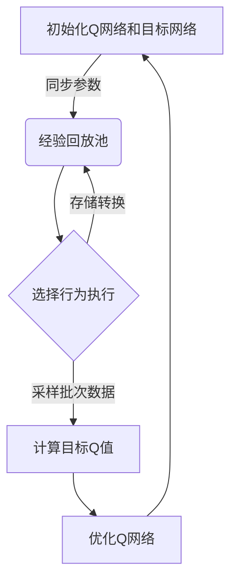
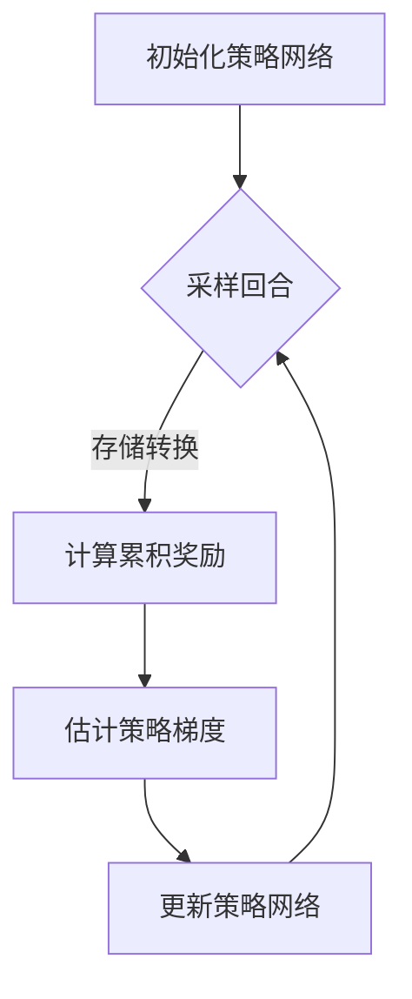
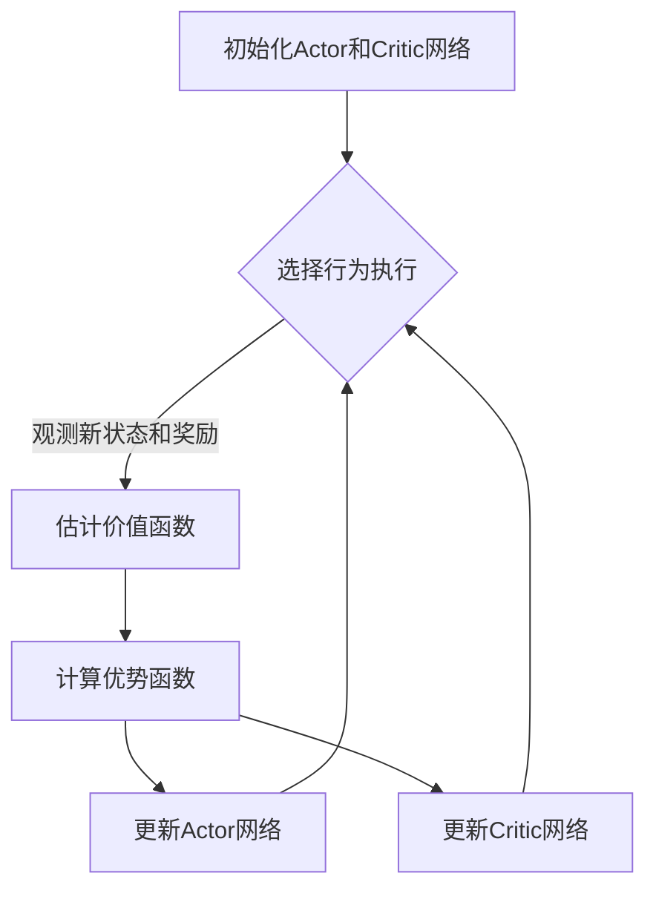

# AI人工智能深度学习算法：智能深度学习代理的深度学习技术

## 1.背景介绍

### 1.1 人工智能的兴起

人工智能(Artificial Intelligence,AI)是当代科技发展的前沿领域,近年来受到了前所未有的关注和投入。随着算力的不断提高、数据量的激增以及深度学习算法的突破性进展,AI技术在诸多领域展现出了令人惊叹的能力,如计算机视觉、自然语言处理、决策控制等,正在深刻改变着我们的生产生活方式。

### 1.2 深度学习的核心地位  

在AI技术的多种范式中,深度学习(Deep Learning)凭借其在大数据环境下的优异表现,已成为人工智能发展的核心动力。深度学习是一种机器学习的方法,其灵感来源于人脑的神经网络结构和信息传递规则,通过构建多层非线性变换模型对海量数据进行特征表示学习和模式识别。

### 1.3 智能代理与深度强化学习

智能代理(Intelligent Agent)是AI系统与环境交互的核心,通过感知环境状态并做出相应行为来达成既定目标。传统的监督学习和非监督学习方法往往难以很好地解决连续决策控制问题。而深度强化学习(Deep Reinforcement Learning)则通过代理与环境的不断试错互动,逐步优化策略模型,从而能够自主获取最优行为序列,在复杂环境中表现出超人的智能水平。

## 2.核心概念与联系

### 2.1 深度学习模型

深度学习模型本质上是一种由多层神经网络构成的函数逼近器,通过对大量训练数据的反复迭代学习,能够从原始输入数据中自动提取出多层次的抽象特征表示,并对目标输出进行建模和预测。常见的深度学习模型包括:

- 前馈神经网络(Feedforward Neural Network)
- 卷积神经网络(Convolutional Neural Network, CNN) 
- 循环神经网络(Recurrent Neural Network, RNN)
- 长短期记忆网络(Long Short-Term Memory, LSTM)
- 生成对抗网络(Generative Adversarial Network, GAN)
- 变分自编码器(Variational Autoencoder, VAE)
- transformer等

### 2.2 深度强化学习

深度强化学习是将深度神经网络应用于强化学习(Reinforcement Learning)领域。强化学习是一种基于环境交互的学习范式,智能体(Agent)通过观测当前环境状态,选择行为策略,并根据行为结果获得奖励反馈信号,从而优化自身策略,最终达成目标。

在传统的强化学习中,状态空间和行为空间往往有限,且需要人工设计状态特征。而深度强化学习则利用深度神经网络自动从高维环境状态中提取特征,并端到端地学习策略模型,从而能够有效解决复杂环境下的决策控制问题。

值得一提的是,结合深度学习的强化学习算法有很多种,包括:

- 深度Q网络(Deep Q-Network, DQN)
- 策略梯度(Policy Gradient)
- 确定性策略梯度(Deterministic Policy Gradient)
- 优势Actor-Critic(Advantage Actor-Critic, A2C)
- 深度确定性策略梯度(Deep Deterministic Policy Gradient, DDPG)
- 信任区域策略优化(Trust Region Policy Optimization, TRPO)
- 近端策略优化(Proximal Policy Optimization, PPO)

### 2.3 深度学习与强化学习的关系

深度学习和强化学习是相互借鉴、相辅相成的关系。一方面,深度学习为强化学习提供了强大的函数逼近能力,使得智能体能够直接从原始的高维环境状态中学习策略,避免了手工设计特征的困难;另一方面,强化学习也为深度学习开辟了新的应用场景,如智能控制、决策系统、自主导航等,极大拓展了深度学习在交互式场景下的应用前景。

总的来说,深度学习算法为强化学习解决了表示学习的问题,而强化学习则为深度学习提供了一种全新的以环境为中心的学习范式,两者的融合孕育出了智能深度学习代理这一全新的人工智能系统。

## 3.核心算法原理具体操作步骤  

### 3.1 深度Q网络(DQN)

深度Q网络是将深度神经网络应用于Q学习(一种基于价值函数的强化学习算法)的开创性工作。DQN的核心思想是使用一个深度卷积神经网络来估计状态行为对的Q值,并通过Q学习算法不断优化该Q网络。算法步骤如下:

1. 初始化深度Q网络及其目标网络(两个相同的Q网络)
2. 初始化经验回放池(Experience Replay Buffer)
3. 对于每个时间步:
    - 根据当前Q网络,选择具有最大Q值的行为
    - 执行该行为,观测到新状态和奖励
    - 将(状态,行为,奖励,新状态)的转换存入经验回放池
    - 从经验回放池中采样批次数据
    - 使用目标Q网络计算每个样本的目标Q值
    - 优化当前Q网络,使其输出的Q值逼近目标Q值
    - 每隔一定步数同步一次目标Q网络的参数

DQN算法的关键创新在于引入了经验回放和目标网络机制,从而解决了传统Q学习算法的不稳定性问题,使得Q网络能够逐步收敛并学习到最优Q函数。

### 3.2 策略梯度算法(Policy Gradient)

策略梯度是一种直接对策略模型进行优化的强化学习算法。其基本思路是将策略模型参数化,然后沿着使期望回报最大化的方向更新参数。算法步骤如下:

1. 初始化策略网络(Policy Network)
2. 对于每个回合(Episode):
    - 初始化环境状态
    - 对于每个时间步:
        - 根据当前策略网络输出的概率分布,采样选择行为
        - 执行该行为,观测到新状态和奖励
        - 存储(状态,行为,奖励)的转换
    - 计算该回合的折现累积奖励
    - 根据回合中的转换和累积奖励,估计策略梯度
    - 使用策略梯度,对策略网络的参数进行更新

策略梯度算法直接对策略进行建模和优化,避免了估计动作价值函数的中间步骤,因此在解决连续控制问题时更加高效和稳定。但由于需要对整个回合进行采样,因此存在较高的方差。

### 3.3 Actor-Critic算法

Actor-Critic算法是策略梯度算法和价值函数算法的结合体,包含两个深度神经网络:Actor网络用于生成行为策略,Critic网络用于估计状态价值函数。算法步骤如下:

1. 初始化Actor网络和Critic网络
2. 对于每个时间步:
    - 根据Actor网络输出的概率分布,采样选择行为
    - 执行该行为,观测到新状态和奖励
    - 使用Critic网络估计当前状态的价值函数
    - 计算优势函数(Advantage),即实际奖励与估计价值的差值
    - 使用优势函数,对Actor网络进行策略梯度更新
    - 使用时序差分(TD)目标,对Critic网络进行价值函数更新

Actor-Critic算法将策略梯度和价值函数估计相结合,利用Critic网络的价值函数估计来减小策略梯度的方差,从而获得更好的收敛性和性能表现。

## 4.数学模型和公式详细讲解举例说明

### 4.1 马尔可夫决策过程(MDP)

强化学习问题通常建模为马尔可夫决策过程(Markov Decision Process, MDP),其由以下几个要素组成:

- 状态集合 $\mathcal{S}$
- 行为集合 $\mathcal{A}$  
- 转移概率 $\mathcal{P}_{ss'}^a = \Pr(s_{t+1}=s'|s_t=s,a_t=a)$
- 奖励函数 $\mathcal{R}_s^a = \mathbb{E}[r_{t+1}|s_t=s,a_t=a]$
- 折扣因子 $\gamma \in [0, 1)$

在MDP中,智能体处于某个状态$s \in \mathcal{S}$,选择一个行为$a \in \mathcal{A}$执行,然后根据转移概率$\mathcal{P}_{ss'}^a$转移到新状态$s'$,并获得对应的奖励$r=\mathcal{R}_s^a$。目标是学习一个策略$\pi: \mathcal{S} \rightarrow \mathcal{A}$,使得期望的折现累积奖励最大化:

$$
J(\pi) = \mathbb{E}_\pi \left[ \sum_{t=0}^\infty \gamma^t r_t \right]
$$

### 4.2 Q-Learning与Bellman方程

在价值函数方法中,常用的是状态行为价值函数$Q^\pi(s,a)$,它表示在状态$s$执行行为$a$,之后遵循策略$\pi$所能获得的期望回报:

$$
Q^\pi(s,a) = \mathbb{E}_\pi \left[ \sum_{t=0}^\infty \gamma^t r_t | s_0=s, a_0=a \right]
$$

Q函数满足以下Bellman方程:

$$
Q^\pi(s,a) = \mathcal{R}_s^a + \gamma \sum_{s' \in \mathcal{S}} \mathcal{P}_{ss'}^a \max_{a'} Q^\pi(s',a')
$$

Q-Learning算法即通过不断迭代更新Q函数,使其收敛到最优Q函数$Q^*(s,a)$,从而可得到最优策略$\pi^*(s) = \arg\max_a Q^*(s,a)$。

### 4.3 策略梯度算法

策略梯度算法直接对策略$\pi_\theta$进行参数化,其目标是最大化期望回报的目标函数:

$$
J(\theta) = \mathbb{E}_{\pi_\theta} \left[ \sum_{t=0}^\infty \gamma^t r_t \right]
$$

根据策略梯度定理,目标函数的梯度可以表示为:

$$
\nabla_\theta J(\theta) = \mathbb{E}_{\pi_\theta} \left[ \sum_{t=0}^\infty \nabla_\theta \log \pi_\theta(a_t|s_t) Q^{\pi_\theta}(s_t, a_t) \right]
$$

因此,我们可以沿着此梯度方向,对策略网络的参数$\theta$进行更新,从而不断提高期望回报。

### 4.4 Actor-Critic算法

Actor-Critic算法将策略梯度和价值函数估计相结合。Actor网络输出的是状态$s$下的行为概率分布$\pi_\theta(a|s)$;而Critic网络则估计的是状态价值函数$V_\phi(s)$。

Actor网络的更新目标是最大化期望回报,其梯度为:

$$
\nabla_\theta J(\theta) = \mathbb{E}_{\pi_\theta} \left[ \nabla_\theta \log \pi_\theta(a_t|s_t) A^{\pi_\theta}(s_t, a_t) \right]
$$

其中,优势函数$A^{\pi_\theta}(s_t, a_t) = Q^{\pi_\theta}(s_t, a_t) - V^{\pi_\theta}(s_t)$表示执行行为$a_t$相对于只遵循当前策略的优势。

Critic网络的更新目标是最小化时序差