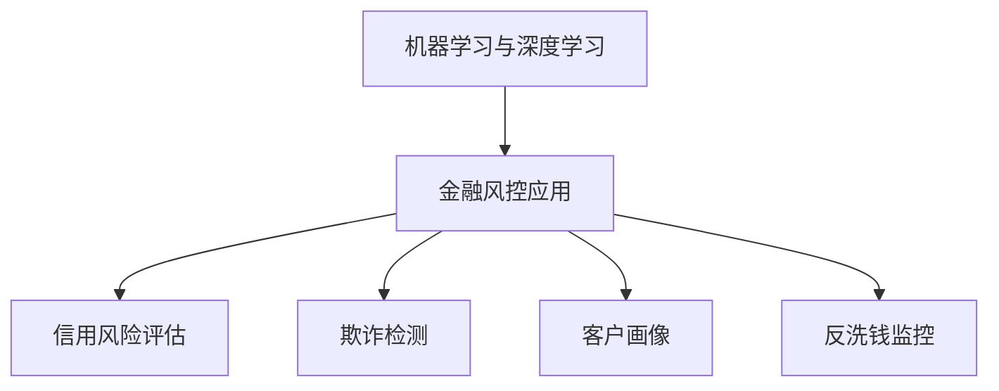
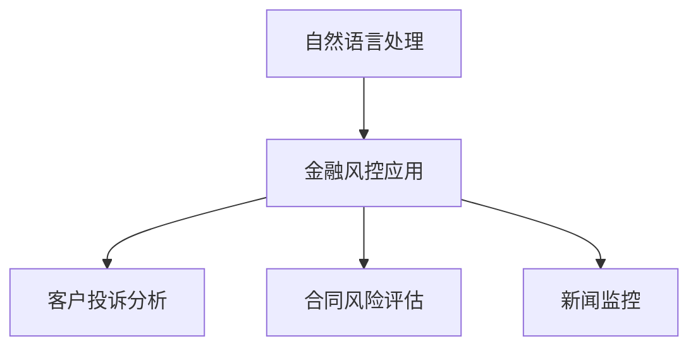
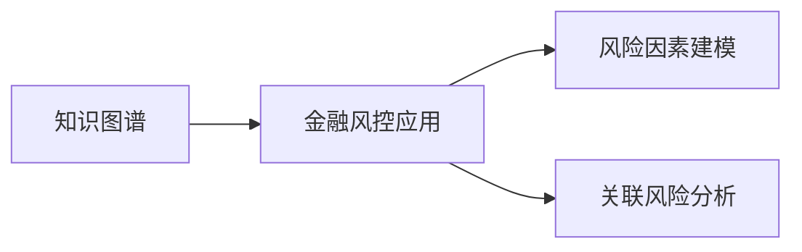
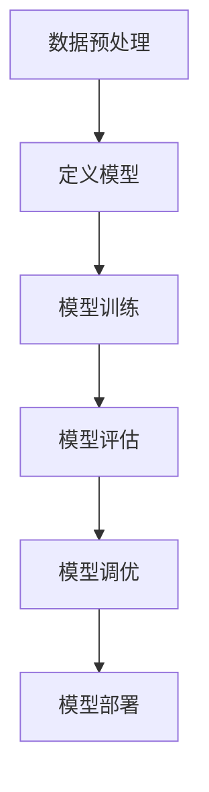
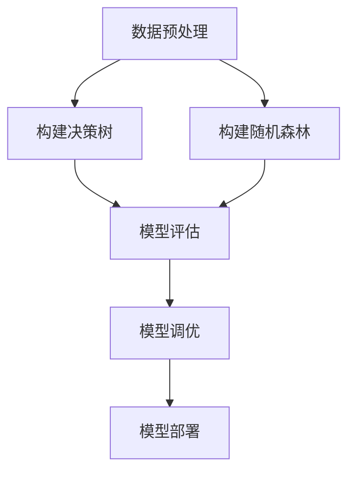
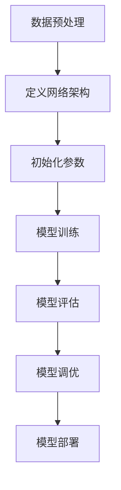

# AI可用性与金融科技：智能风控，高效服务

## 1.背景介绍

### 1.1 金融科技的兴起

金融科技(FinTech)是一个新兴的跨学科领域,将创新技术与金融服务相结合,旨在提高金融服务的效率、可访问性和安全性。随着人工智能(AI)、大数据、云计算等新兴技术的飞速发展,金融科技正在重塑传统金融行业的运营模式。

### 1.2 风险管理的重要性

在金融行业中,风险管理是确保业务持续运营和维护客户信任的关键环节。有效的风险管理可以帮助金融机构识别、评估和缓解各种潜在风险,如信用风险、市场风险、操作风险等。然而,传统的风险管理方法往往依赖人工处理,效率低下且容易出错。

### 1.3 AI在金融风控中的应用

AI技术在金融风控领域的应用正在兴起,为金融机构提供了更智能、更高效的风险管理解决方案。AI算法可以从海量历史数据中发现隐藏的模式和关联,从而实现风险的自动化识别、评估和预测。同时,AI还可以优化客户服务流程,提高服务质量和客户体验。

## 2.核心概念与联系

### 2.1 机器学习与深度学习

机器学习(ML)和深度学习(DL)是AI的两个核心技术,在金融风控中发挥着重要作用。

- 机器学习: 机器学习算法可以从历史数据中自动学习模式,并对新数据进行预测或决策。常用的机器学习算法包括逻辑回归、决策树、随机森林等。

- 深度学习: 深度学习是一种基于人工神经网络的机器学习技术,擅长处理高维、非结构化数据,如图像、文本和语音。深度学习在金融风控中可用于欺诈检测、客户画像等任务。

### 2.2 自然语言处理

自然语言处理(NLP)是AI的另一个重要分支,在金融风控中也有广泛应用。NLP技术可以自动理解和处理人类语言,用于分析客户投诉、合同文本、新闻报道等非结构化数据,从中发现潜在风险信号。

### 2.3 知识图谱

知识图谱是一种结构化的知识表示方式,可以将各种实体及其关系以图形化的方式呈现。在金融风控中,知识图谱可用于建模各种风险因素及其相互关联,从而更全面地评估风险。

## 3.核心算法原理具体操作步骤

### 3.1 逻辑回归

逻辑回归是一种常用的机器学习算法,在信用风险评估中发挥着重要作用。它通过对历史数据进行训练,学习各个特征与目标变量(如违约概率)之间的关系,从而对新样本进行预测。

逻辑回归算法的具体步骤如下:

1. **数据预处理**: 对原始数据进行清洗、标准化和特征工程,将其转换为算法可以处理的格式。

2. **定义模型**: 选择合适的逻辑回归模型,如二元逻辑回归或多类逻辑回归。

3. **模型训练**: 使用优化算法(如梯度下降)在训练数据上训练模型参数,目标是最小化损失函数(如交叉熵损失)。

4. **模型评估**: 在测试数据上评估模型的性能,使用指标如准确率、精确率、召回率等。

5. **模型调优**: 根据评估结果,通过调整超参数、特征选择等方式优化模型性能。

6. **模型部署**: 将训练好的模型集成到实际的风险评估系统中,对新的申请数据进行评分。

### 3.2 决策树与随机森林

决策树和随机森林是另外两种常用的机器学习算法,在金融风控中也有广泛应用。

- 决策树: 决策树通过递归地对特征空间进行划分,构建一个类似于流程图的决策模型。决策树易于解释,但容易过拟合。

- 随机森林: 随机森林是一种集成学习方法,它通过构建多个决策树,并将它们的预测结果进行组合,从而提高预测精度和鲁棒性。

这两种算法的具体步骤如下:

1. **数据预处理**: 对原始数据进行清洗、标准化和特征工程。

2. **构建决策树**: 对于决策树,需要选择合适的算法(如ID3、C4.5、CART)和停止条件,然后根据特征和目标变量递归地构建决策树。

3. **构建随机森林**: 对于随机森林,需要指定树的数量、特征采样比例等超参数,然后并行地构建多个决策树。

4. **模型评估**: 在测试数据上评估模型的性能,使用指标如准确率、F1分数等。

5. **模型调优**: 根据评估结果,调整决策树的深度、叶节点样本数等参数,或调整随机森林的树的数量、特征采样比例等超参数。

6. **模型部署**: 将训练好的模型集成到实际的风险评估系统中,对新的申请数据进行评分。

### 3.3 神经网络与深度学习

神经网络是一种受生物神经元启发的机器学习模型,深度学习则是基于多层神经网络的一种技术。在金融风控中,深度学习可用于欺诈检测、客户画像等任务。

深度学习模型的训练过程如下:

1. **数据预处理**: 对原始数据进行清洗、标准化和特征提取,将其转换为神经网络可以处理的格式。

2. **定义网络架构**: 选择合适的网络架构,如全连接网络、卷积神经网络或递归神经网络,并确定网络的层数、神经元数量等超参数。

3. **初始化参数**: 对网络的权重和偏置进行随机初始化。

4. **模型训练**: 使用优化算法(如随机梯度下降)在训练数据上迭代地更新网络参数,目标是最小化损失函数(如交叉熵损失)。

5. **模型评估**: 在测试数据上评估模型的性能,使用指标如准确率、精确率、召回率等。

6. **模型调优**: 根据评估结果,调整网络架构、超参数、正则化策略等,以优化模型性能。

7. **模型部署**: 将训练好的模型集成到实际的风险评估系统中,对新的申请数据进行预测。

## 4.数学模型和公式详细讲解举例说明

在金融风控中,数学模型和公式扮演着重要的角色,用于量化风险、优化决策等。以下是一些常用的数学模型和公式:

### 4.1 逻辑回归模型

逻辑回归是一种广泛使用的机器学习模型,用于解决二分类或多分类问题。在信用风险评估中,逻辑回归可用于预测借款人违约的概率。

逻辑回归模型的数学表达式如下:

$$
P(Y=1|X) = \sigma(w^TX + b) = \frac{1}{1 + e^{-(w^TX + b)}}
$$

其中:

- $Y$ 是二元目标变量(如违约/未违约)
- $X$ 是特征向量
- $w$ 是特征权重向量
- $b$ 是偏置项
- $\sigma(z)$ 是 Sigmoid 函数,将线性组合 $w^TX + b$ 映射到 $(0, 1)$ 范围内

在训练过程中,我们需要最小化如下损失函数:

$$
J(w, b) = -\frac{1}{m}\sum_{i=1}^{m}[y^{(i)}\log(h_w(x^{(i)})) + (1-y^{(i)})\log(1-h_w(x^{(i)}))]
$$

其中:

- $m$ 是训练样本数量
- $y^{(i)}$ 是第 $i$ 个样本的真实标签
- $h_w(x^{(i)}) = \sigma(w^Tx^{(i)} + b)$ 是模型对第 $i$ 个样本的预测概率

通过梯度下降等优化算法,我们可以找到最优的 $w$ 和 $b$,从而获得最终的逻辑回归模型。

### 4.2 决策树模型

决策树是一种常用的机器学习模型,可用于分类和回归任务。在金融风控中,决策树可用于信用风险评估、欺诈检测等场景。

决策树的构建过程可以看作是一个递归的特征空间划分过程。在每个节点,我们选择一个特征及其对应的分割点,将样本划分为两个子集,使得子集内部的纯度最高(对于分类问题)或方差最小(对于回归问题)。

这个过程可以用以下公式表示:

$$
G(D, A) = \sum_{j=1}^{c}\frac{|D_j|}{|D|}H(D_j)
$$

其中:

- $D$ 是当前节点的样本集合
- $A$ 是选择的特征
- $c$ 是根据特征 $A$ 将 $D$ 划分后的子集数量
- $D_j$ 是第 $j$ 个子集
- $H(D_j)$ 是第 $j$ 个子集的不纯度度量(如基尼系数或熵)

我们选择使 $G(D, A)$ 最小的特征 $A$ 及其对应的分割点,将当前节点划分为子节点。这个过程递归地进行,直到满足停止条件(如最大深度、最小样本数等)。

### 4.3 神经网络模型

神经网络是一种强大的机器学习模型,可用于解决各种复杂的任务,如图像识别、自然语言处理等。在金融风控中,神经网络可用于欺诈检测、客户画像等场景。

神经网络的基本单元是人工神经元,它接收多个输入,对它们进行加权求和,然后通过激活函数(如 Sigmoid 或 ReLU)得到输出。多个神经元组成一层,多层神经元组成整个神经网络。

对于一个单层神经网络,其数学表达式如下:

$$
y = \sigma(w^Tx + b)
$$

其中:

- $x$ 是输入向量
- $w$ 是权重向量
- $b$ 是偏置项
- $\sigma$ 是激活函数

对于多层神经网络,每一层的输出都作为下一层的输入,形成一个复合函数:

$$
y = f^{(L)}(f^{(L-1)}(...f^{(2)}(f^{(1)}(x))))
$$

其中 $f^{(i)}$ 表示第 $i$ 层的函数。

在训练过程中,我们需要最小化一个损失函数(如均方误差或交叉熵损失),通过反向传播算法计算每个权重和偏置的梯度,然后使用优化算法(如梯度下降)更新模型参数。

## 5.项目实践：代码实例和详细解释说明

在本节中,我们将通过一个实际项目案例,