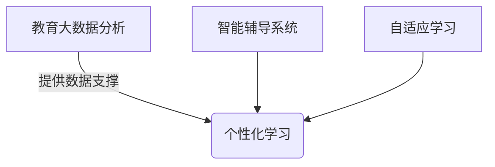

# **AI在教育领域的创新应用**

## 1.背景介绍

教育是一个永恒的主题,它关乎着人类知识的传承和创新。随着科技的飞速发展,人工智能(AI)技术正在为教育领域带来前所未有的机遇和挑战。AI已经并将继续深刻影响教育的方方面面,从教学方式、学习体验到教育管理等,正在发生翻天覆地的变革。

### 1.1 教育领域面临的挑战

传统的教育模式面临着诸多挑战,例如:

- 教育资源分布不均衡
- 教学效率和质量参差不齐
- 个性化教学难以实现
- 教育评估缺乏客观性和公平性

这些问题的根源在于传统教育模式过于僵化,难以适应不同学生的个体差异和发展需求。

### 1.2 AI带来的机遇

AI技术为解决这些挑战提供了新的思路和手段。AI可以通过大数据分析、机器学习等技术,实现个性化教学、智能辅导、自适应学习等,从而提高教育质量和效率。同时,AI也可以在教育管理、资源分配等方面发挥重要作用,优化教育资源的利用效率。

## 2.核心概念与联系

### 2.1 AI在教育领域的核心概念

要充分发挥AI在教育领域的作用,需要了解以下几个核心概念:

1. **个性化学习**
   - 根据学生的知识水平、学习风格等个体差异,提供定制化的学习内容和方式。
2. **智能辅导系统**
   - 利用自然语言处理、知识图谱等技术,模拟人类导师的行为,为学生提供个性化辅导。
3. **自适应学习**
   - 根据学生的学习进度和表现,动态调整教学内容和难度,实现最佳学习效果。
4. **教育大数据分析**
   - 通过对海量教育数据(如学习行为、成绩等)进行分析,发现教育规律,优化教学决策。

### 2.2 核心概念之间的关系

上述核心概念相互关联、相辅相成,共同构建了AI在教育领域的应用框架。其中,个性化学习是目标,智能辅导系统和自适应学习是实现手段,而教育大数据分析则为前者提供数据支撑和决策依据。



## 3.核心算法原理具体操作步骤

实现上述核心概念需要多种AI算法的支持,下面将介绍其中的几种核心算法。

### 3.1 知识图谱构建

知识图谱是智能辅导系统的核心,它通过构建结构化的知识库,模拟人类导师对知识的理解和表达方式。构建知识图谱的主要步骤包括:

1. **知识抽取**: 从非结构化数据(如教材、网页等)中自动抽取知识三元组(实体-关系-实体)。
2. **知识表示**: 将抽取的知识三元组转换为计算机可读的形式,如RDF、OWL等。
3. **知识融合**: 将多个异构知识源融合成统一的知识图谱。
4. **知识推理**: 基于已有知识,进行逻辑推理,发现隐含知识。

常用的知识抽取和表示算法包括远程监督、张量分解、图嵌入等。

### 3.2 个性化推荐算法

个性化推荐是实现个性化学习的关键,主要步骤包括:

1. **用户建模**: 根据学生的学习行为、兴趣爱好等数据,构建用户模型。
2. **内容理解**: 对学习资源(如课程、练习等)进行语义理解和向量化表示。
3. **相似度计算**: 计算用户模型与内容表示之间的相似度。
4. **排序推荐**: 根据相似度对内容进行排序,推荐最匹配的内容。

常用的推荐算法有协同过滤、矩阵分解、深度学习等。

### 3.3 自适应学习路径规划

自适应学习需要根据学生的学习状态,动态调整学习路径,主要步骤包括:

1. **知识状态跟踪**: 通过练习、测试等方式,实时跟踪学生对每个知识点的掌握程度。
2. **知识关系建模**: 构建知识点之间的先修关系模型。
3. **路径规划算法**: 基于学生的知识状态和知识关系模型,计算出最优的个性化学习路径。

常用的路径规划算法有决策树、深度强化学习等。

## 4.数学模型和公式详细讲解举例说明

### 4.1 知识图谱嵌入

知识图谱嵌入是将结构化的知识表示为低维向量空间的方法,常用的嵌入模型包括TransE、DistMult等。以TransE为例,它将知识三元组$(h, r, t)$映射到向量空间,使得:

$$\vec{h} + \vec{r} \approx \vec{t}$$

其中$\vec{h}$、$\vec{r}$、$\vec{t}$分别表示头实体、关系和尾实体的向量表示。模型的目标是最小化所有正例和负例之间的损失函数:

$$L = \sum_{(h,r,t) \in S} \sum_{(h',r',t') \in S'} [\gamma + d(\vec{h} + \vec{r}, \vec{t}) - d(\vec{h'} + \vec{r'}, \vec{t'})]_+$$

这里$S$是正例集合,$S'$是负例集合,$\gamma$是边距超参数,$ d $是距离函数(如L1或L2范数),$ [x]_+ = \max(0, x) $是铰链损失函数。

### 4.2 个性化推荐算法

常用的个性化推荐算法有基于矩阵分解的协同过滤算法,如SVD++模型。设$R$为用户-物品评分矩阵,$p_u$和$q_i$分别表示用户$u$和物品$i$的隐向量,则SVD++模型的目标函数为:

$$\min_{p_*,q_*} \sum_{(u,i) \in R} (r_{ui} - \mu - b_u - b_i - q_i^Tp_u - |R(u)|^{-\frac{1}{2}}\sum_{j \in R(u)}y_j)^2 + \lambda(b_u^2 + b_i^2 + ||q_i||^2 + ||p_u||^2 + \sum_{j \in R(u)}||y_j||^2)$$

其中$\mu$是全局偏置,$b_u$和$b_i$分别是用户和物品的偏置项,$R(u)$表示用户$u$的历史交互物品集合,$y_j$是物品$j$的隐式向量,用于捕捉用户的隐式兴趣,$ \lambda $是正则化系数。

### 4.3 强化学习路径规划

强化学习可用于自适应规划学习路径,将学生的学习过程建模为马尔可夫决策过程。设$s_t$为第$t$时刻的学生知识状态,$a_t$为推荐的下一个知识点,则状态转移方程为:

$$s_{t+1} = f(s_t, a_t)$$

其中$f$是状态转移函数,描述了学生在学习$a_t$后的新知识状态。目标是找到一个策略$\pi$,最大化预期的累积奖励:

$$\max_\pi \mathbb{E}_\pi \left[ \sum_{t=0}^{T} \gamma^t r(s_t, a_t) \right]$$

这里$r(s_t, a_t)$是在状态$s_t$下选择动作$a_t$的即时奖励,$\gamma$是折现因子,用于平衡即时奖励和长期奖励。

常用的强化学习算法有Q-Learning、Policy Gradient等。以Q-Learning为例,其更新规则为:

$$Q(s_t, a_t) \leftarrow Q(s_t, a_t) + \alpha \left[ r(s_t, a_t) + \gamma \max_{a'} Q(s_{t+1}, a') - Q(s_t, a_t) \right]$$

其中$\alpha$是学习率,$\max_{a'} Q(s_{t+1}, a')$是下一状态的最大Q值,用于估计未来的最大预期奖励。

## 5.项目实践: 代码实例和详细解释说明

为了更好地理解上述算法的实现细节,我们将通过一个基于PyTorch的简单示例,演示如何构建一个基于知识图谱的智能问答系统。

### 5.1 数据准备

我们将使用一个开源的医疗知识图谱数据集[dataset]作为示例。该数据集包含约14,000个三元组,描述了疾病、症状、检查、治疗等医疗知识。

```python
import torch
from torch.utils.data import Dataset

# 定义知识图谱数据集类
class KGDataset(Dataset):
    def __init__(self, triples):
        self.triples = triples

    def __len__(self):
        return len(self.triples)

    def __getitem__(self, idx):
        head, rel, tail = self.triples[idx]
        return head, rel, tail

# 读取数据集
with open('dataset.txt', 'r') as f:
    triples = [line.strip().split('\t') for line in f.readlines()]
    triples = [(int(h), int(r), int(t)) for h, r, t in triples]

# 构建数据集
dataset = KGDataset(triples)
```

### 5.2 知识图谱嵌入模型

我们将实现一个简化版的TransE模型,用于将实体和关系映射到低维向量空间。

```python
import torch.nn as nn

# 定义TransE模型
class TransE(nn.Module):
    def __init__(self, num_entities, num_relations, emb_dim):
        super(TransE, self).__init__()
        self.emb_dim = emb_dim
        self.entity_emb = nn.Embedding(num_entities, emb_dim)
        self.relation_emb = nn.Embedding(num_relations, emb_dim)

    def forward(self, heads, relations, tails):
        h_emb = self.entity_emb(heads)
        r_emb = self.relation_emb(relations)
        t_emb = self.entity_emb(tails)
        scores = torch.sum((h_emb + r_emb - t_emb) ** 2, dim=1)
        return scores

# 初始化模型
num_entities = max(max(triples, key=lambda x: x[0])[0], max(triples, key=lambda x: x[2])[2]) + 1
num_relations = max(max(triples, key=lambda x: x[1])[1]) + 1
emb_dim = 100
model = TransE(num_entities, num_relations, emb_dim)
```

### 5.3 模型训练

我们将使用负采样策略和二元交叉熵损失函数进行模型训练。

```python
import torch.optim as optim

# 定义训练函数
def train(model, dataset, num_epochs, batch_size, lr):
    optimizer = optim.Adam(model.parameters(), lr=lr)
    criterion = nn.BCEWithLogitsLoss()
    dataloader = DataLoader(dataset, batch_size=batch_size, shuffle=True)

    for epoch in range(num_epochs):
        running_loss = 0.0
        for heads, relations, tails in dataloader:
            optimizer.zero_grad()
            scores = model(heads, relations, tails)
            
            # 负采样
            neg_heads = torch.randint(num_entities, heads.size(), device=device)
            neg_tails = torch.randint(num_entities, tails.size(), device=device)
            neg_scores = model(neg_heads, relations, tails) + model(heads, relations, neg_tails)
            
            # 计算损失
            pos_labels = torch.ones(scores.size(), device=device)
            neg_labels = torch.zeros(neg_scores.size(), device=device)
            all_scores = torch.cat([scores, neg_scores])
            all_labels = torch.cat([pos_labels, neg_labels])
            loss = criterion(all_scores, all_labels)
            
            loss.backward()
            optimizer.step()
            running_loss += loss.item()
        
        print(f'Epoch {epoch+1}, Loss: {running_loss / len(dataloader)}')

# 训练模型
num_epochs = 100
batch_size = 128
lr = 0.001
train(model, dataset, num_epochs, batch_size, lr)
```

### 5.4 问答系统

最后,我们将构建一个简单的问答系统,根据输入的自然语言问题,从知识图谱中查找相关的答案三元组。

```python
from nltk import word_tokenize

# 定义问答函数
def answer_query(model, query):
    tokens = word_tokenize(query.lower())
    head_scores = []
    rel_scores = []
    tail_scores