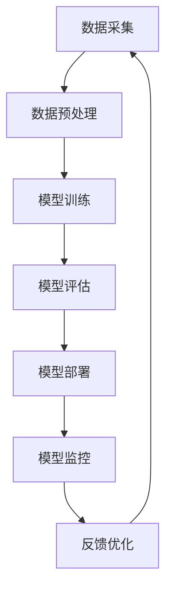

# AI工程最佳实践原理与代码实战案例讲解

## 1.背景介绍

### 1.1 人工智能的兴起

人工智能(Artificial Intelligence, AI)是当代科技发展的热点领域之一,近年来受到了前所未有的关注和投资。随着计算能力的不断提高、海量数据的积累以及算法的创新,AI技术在诸多领域展现出了巨大的潜力和价值。从计算机视觉、自然语言处理到机器学习和深度学习等,AI技术正在重塑着我们的生活和工作方式。

### 1.2 AI工程的重要性

然而,要成功地将AI技术应用于实际场景并获得预期效果,仅依赖算法和模型是远远不够的。AI工程(AI Engineering)作为一门新兴的跨学科领域,旨在将AI理论与软件工程实践相结合,为AI系统的设计、开发、测试、部署和维护提供系统化的方法和最佳实践。

良好的AI工程实践不仅能够确保AI系统的可靠性、可扩展性和可维护性,还能够提高开发效率,加快AI技术的落地进程。因此,掌握AI工程的核心原理和最佳实践,对于任何从事AI相关工作的个人和组织都至关重要。

## 2.核心概念与联系

### 2.1 AI系统的生命周期

AI系统的生命周期包括数据采集、数据预处理、模型训练、模型评估、模型部署和模型监控等多个环节。每个环节都需要遵循特定的原则和实践,以确保整个系统的质量和性能。



### 2.2 AI工程的核心要素

AI工程涵盖了多个关键要素,包括但不限于:

- **数据管理**: 高质量的数据是训练出优秀AI模型的基础。数据管理包括数据采集、清洗、标注、版本控制等环节。
- **模型开发**: 涉及模型架构选择、超参数调优、训练策略优化等方面的最佳实践。
- **模型评估**: 包括模型性能指标选择、评估方法设计、偏差分析等内容。
- **系统设计**: 围绕AI系统的可扩展性、高可用性、安全性等非功能需求进行架构设计。
- **工程实践**: 包括持续集成、持续交付、监控和日志记录等软件工程最佳实践在AI系统中的应用。

### 2.3 AI工程与软件工程的关系

AI工程与传统软件工程有许多相似之处,比如都需要遵循软件开发生命周期、编码规范、测试驱动开发等实践。但AI工程也有自身的特殊性,例如需要处理大规模数据、训练资源密集型模型、应对模型偏差和漂移等挑战。因此,AI工程需要在软件工程的基础上,引入专门针对AI系统的方法和工具。

## 3.核心算法原理具体操作步骤  

在AI工程中,常见的核心算法包括机器学习算法(如决策树、支持向量机等)和深度学习算法(如卷积神经网络、递归神经网络等)。这些算法的原理和操作步骤对于成功地开发AI系统至关重要。

### 3.1 机器学习算法

以决策树算法为例,其核心原理是根据训练数据构建一个决策树模型,该模型以树状结构映射出数据特征与目标变量之间的决策规则。构建决策树的一般步骤如下:

1. **数据预处理**: 对原始数据进行清洗、标准化等预处理,将其转换为算法可以接受的格式。
2. **选择最优特征**: 根据信息增益或基尼系数等指标,选择能够最好地区分样本的特征作为决策树的根节点。
3. **生成子节点**: 对于根节点的每个特征值,创建相应的子节点,将数据集划分到相应的子节点中。
4. **递归构建树**: 对于每个子节点,重复步骤2和步骤3,直到满足停止条件(如达到最大深度、样本足够纯净等)。
5. **树的修剪**: 为防止过拟合,可以对生成的决策树进行修剪,移除一些不重要的节点和分支。

### 3.2 深度学习算法

以卷积神经网络(Convolutional Neural Network, CNN)为例,它是一种常用于计算机视觉任务的深度学习模型。CNN的核心原理是通过卷积操作自动学习图像的特征表示,并基于这些特征进行分类或检测等任务。训练CNN的一般步骤如下:

1. **数据预处理**: 对原始图像数据进行预处理,如归一化、数据增广等,以提高模型的泛化能力。
2. **模型构建**: 设计CNN的网络架构,包括卷积层、池化层、全连接层等,并初始化网络权重。
3. **前向传播**: 将预处理后的图像输入到CNN中,计算每一层的输出,直到得到最终的预测结果。
4. **计算损失**: 将预测结果与真实标签进行比较,计算损失函数的值,如交叉熵损失。
5. **反向传播**: 根据损失函数的值,利用反向传播算法计算每一层权重的梯度。
6. **权重更新**: 使用优化算法(如随机梯度下降)根据梯度值更新网络权重。
7. **迭代训练**: 重复步骤3到步骤6,直到模型收敛或达到预设的迭代次数。

上述步骤展示了机器学习和深度学习算法的一般原理和操作流程。在实际应用中,还需要根据具体任务和数据特点进行调整和优化,例如选择合适的损失函数、正则化方法、优化器等。

## 4.数学模型和公式详细讲解举例说明

AI算法背后往往有着丰富的数学基础,掌握相关的数学模型和公式有助于更深入地理解算法原理。以下是一些常见的数学模型和公式,以及它们在AI工程中的应用。

### 4.1 线性代数

线性代数是机器学习和深度学习的基石,许多算法都依赖于矩阵和向量的运算。例如,在神经网络中,输入数据通常被表示为向量,权重被表示为矩阵,前向传播过程就是一系列的矩阵乘法和向量加法运算。

$$\boldsymbol{y} = \boldsymbol{Wx} + \boldsymbol{b}$$

其中,$\boldsymbol{x}$是输入向量,$\boldsymbol{W}$是权重矩阵,$\boldsymbol{b}$是偏置向量,$\boldsymbol{y}$是输出向量。

### 4.2 概率论与统计学

概率论和统计学在机器学习中扮演着重要角色,许多算法都基于概率模型和统计推断。例如,在朴素贝叶斯分类器中,我们需要根据训练数据估计每个特征在不同类别下的条件概率分布,然后利用贝叶斯公式计算后验概率进行分类预测。

$$P(c_k|\boldsymbol{x}) = \frac{P(c_k)P(\boldsymbol{x}|c_k)}{P(\boldsymbol{x})}$$

其中,$P(c_k|\boldsymbol{x})$是给定特征向量$\boldsymbol{x}$时,样本属于类别$c_k$的后验概率,$P(c_k)$是类别$c_k$的先验概率,$P(\boldsymbol{x}|c_k)$是在类别$c_k$下,特征向量$\boldsymbol{x}$的条件概率,$P(\boldsymbol{x})$是特征向量$\boldsymbol{x}$的边缘概率。

### 4.3 优化理论

在训练机器学习和深度学习模型时,我们通常需要优化一个目标函数(如损失函数或代价函数),以找到最优的模型参数。这就涉及到优化理论中的一些概念和方法,如梯度下降、随机梯度下降、动量优化等。

$$\boldsymbol{w}_{t+1} = \boldsymbol{w}_t - \eta \nabla_{\boldsymbol{w}} J(\boldsymbol{w}_t)$$

其中,$\boldsymbol{w}_t$是第$t$次迭代时的参数向量,$\eta$是学习率,$\nabla_{\boldsymbol{w}} J(\boldsymbol{w}_t)$是目标函数$J$关于$\boldsymbol{w}_t$的梯度,梯度下降法通过沿着梯度的反方向更新参数,逐步减小目标函数的值。

上述只是数学模型和公式在AI工程中应用的一小部分示例,实际应用中还有许多其他重要的数学工具,如微积分、信息论、图论等。掌握这些数学基础有助于更好地理解和优化AI算法。

## 5.项目实践:代码实例和详细解释说明

为了帮助读者更好地理解AI工程的实践,本节将提供一个基于Python和TensorFlow的图像分类项目实例,并对关键代码进行详细解释。

### 5.1 项目概述

本项目旨在构建一个卷积神经网络模型,用于对CIFAR-10数据集中的图像进行分类。CIFAR-10是一个常用的计算机视觉基准数据集,包含10个类别的32x32彩色图像,如飞机、汽车、鸟类等。

### 5.2 数据预处理

```python
import tensorflow as tf

# 加载CIFAR-10数据集
(x_train, y_train), (x_test, y_test) = tf.keras.datasets.cifar10.load_data()

# 数据预处理
x_train = x_train.astype('float32') / 255.0
x_test = x_test.astype('float32') / 255.0

# 将标签转换为one-hot编码
y_train = tf.keras.utils.to_categorical(y_train, num_classes=10)
y_test = tf.keras.utils.to_categorical(y_test, num_classes=10)
```

上述代码首先加载CIFAR-10数据集,将图像像素值归一化到0到1之间,并将标签转换为one-hot编码格式,以便于模型训练。

### 5.3 模型构建

```python
# 构建CNN模型
model = tf.keras.models.Sequential([
    tf.keras.layers.Conv2D(32, (3, 3), activation='relu', input_shape=(32, 32, 3)),
    tf.keras.layers.MaxPooling2D((2, 2)),
    tf.keras.layers.Conv2D(64, (3, 3), activation='relu'),
    tf.keras.layers.MaxPooling2D((2, 2)),
    tf.keras.layers.Flatten(),
    tf.keras.layers.Dense(64, activation='relu'),
    tf.keras.layers.Dense(10, activation='softmax')
])

# 编译模型
model.compile(optimizer='adam',
              loss='categorical_crossentropy',
              metrics=['accuracy'])
```

上述代码使用Keras Sequential API构建了一个简单的CNN模型,包含两个卷积层、两个池化层、一个全连接层和一个输出层。模型使用Adam优化器,交叉熵损失函数和准确率作为评估指标。

### 5.4 模型训练

```python
# 训练模型
history = model.fit(x_train, y_train,
                    batch_size=64,
                    epochs=10,
                    validation_data=(x_test, y_test))
```

上述代码使用`model.fit`函数训练CNN模型,将训练数据分成64个批次,训练10个epoch,并使用测试数据作为验证集。

### 5.5 模型评估

```python
# 评估模型
test_loss, test_acc = model.evaluate(x_test, y_test)
print('Test accuracy:', test_acc)
```

上述代码使用`model.evaluate`函数在测试数据集上评估模型的性能,输出测试集上的准确率。

### 5.6 模型保存和加载

```python
# 保存模型
model.save('cifar10_model.h5')

# 加载模型
loaded_model = tf.keras.models.load_model('cifar10_model.h5')
```

上述代码展示了如何使用Keras API保存和加载训练好的模型。保存模型有助于在部署环境中重用模型,或者在未来继续训练和优化模型。

以上是一个简单的图像分类项目实例,展示了AI工程中常见的数据预处理、模型构建、模型训练、模型评估和模型保存等步骤。在实际项目中