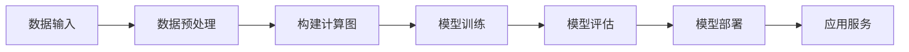

# AI开发框架原理与代码实战案例讲解

## 1.背景介绍

### 1.1 人工智能的兴起

人工智能(Artificial Intelligence, AI)是当代科技发展的热点领域,近年来受到了前所未有的关注和投资。随着计算能力的不断提升、海量数据的积累以及算法的创新,AI技术在多个领域取得了突破性进展,展现出巨大的应用潜力。

### 1.2 AI开发框架的重要性

AI系统的开发过程通常涉及大量的数据处理、模型训练和部署等环节,这些工作往往复杂且耗时。为了提高开发效率,简化工作流程,AI开发框架(AI Development Framework)应运而生。优秀的AI框架能够屏蔽底层细节,提供统一的API接口,极大地降低了AI系统的开发难度。

### 1.3 主流AI框架概览  

目前,主流的AI开发框架包括TensorFlow、PyTorch、MXNet、PaddlePaddle等,它们均来自于顶尖的科技公司或知名高校,拥有活跃的开源社区。这些框架在机器学习、深度学习、自然语言处理、计算机视觉等多个AI领域发挥着重要作用。

## 2.核心概念与联系

### 2.1 张量(Tensor)

张量是AI框架中表示多维数组的核心数据结构。它可以用来表示各种数据类型,如图像、视频、语音等。张量的阶数(rank)代表了它的维度数量。例如,一个向量是一阶张量,一个矩阵是二阶张量。

```python
import numpy as np

# 0阶张量(标量)
scalar = np.array(5)  

# 1阶张量(向量)
vector = np.array([1, 2, 3])

# 2阶张量(矩阵)
matrix = np.array([[1, 2], [3, 4]])
```

### 2.2 计算图(Computational Graph)

计算图是AI框架中描述数学运算的有向无环图结构。它由节点(Node)和边(Edge)组成,节点表示具体的数学运算,边则表示数据的流动。通过建立计算图,框架可以自动计算导数,并进行反向传播等优化。

```python
import tensorflow as tf

# 构建计算图
x = tf.placeholder(tf.float32)
y = tf.placeholder(tf.float32)
z = x * x * y + y + 2

# 执行计算图
with tf.Session() as sess:
    z_value = sess.run(z, feed_dict={x: 3, y: 2})
    print(z_value)  # 输出20.0
```

### 2.3 自动微分(Automatic Differentiation)

自动微分是AI框架中实现反向传播算法的关键技术。它可以根据计算图自动计算目标函数相对于各个参数的导数,从而指导模型参数的更新。相比于数值微分和符号微分,自动微分拥有更高的精度和效率。

```python
import torch

# 构建计算图
x = torch.tensor(3.0, requires_grad=True)
y = x * x * 2 + x * 3 + 5

# 自动计算导数
y.backward()
print(x.grad)  # 输出13.0
```

### 2.4 模型构建

AI框架通常提供了多种模型构建的方式,如序贯式模型(Sequential)、函数式API(Functional API)和模型子类化(Model Subclassing)等。用户可以根据需求选择合适的方式,快速搭建神经网络模型。

```python
from tensorflow.keras.models import Sequential
from tensorflow.keras.layers import Dense

# 构建序贯式模型
model = Sequential([
    Dense(64, activation='relu', input_shape=(784,)),
    Dense(10, activation='softmax')
])
```

### 2.5 Mermaid流程图



上图展示了AI开发框架的典型工作流程。首先需要输入原始数据,并对其进行必要的预处理,如归一化、增强等。然后,根据模型结构和损失函数构建计算图。在训练阶段,利用自动微分技术,不断优化模型参数。训练完成后,需要对模型进行评估,了解其在测试集上的表现。最后,将模型部署到实际的应用服务中,为用户提供AI能力。

## 3.核心算法原理具体操作步骤

### 3.1 前向传播(Forward Propagation)

前向传播是神经网络模型的基本计算过程。它将输入数据按照网络结构通过一系列线性和非线性变换,最终得到输出结果。该过程可以通过计算图自动完成。

1. 准备输入数据,以张量的形式表示。
2. 根据网络结构,对输入数据进行线性变换(如全连接层的矩阵乘法运算)。
3. 对线性变换的结果应用非线性激活函数(如ReLU、Sigmoid等)。
4. 重复步骤2和3,直到得到最终的输出结果。

### 3.2 反向传播(Backward Propagation)

反向传播是训练神经网络的关键算法,它根据输出结果和标签计算损失函数,并利用自动微分技术计算各个参数的梯度,从而指导参数的更新。

1. 计算输出结果与标签之间的损失函数值。
2. 根据计算图,利用自动微分技术,计算损失函数相对于各个参数的梯度。
3. 使用优化器(如SGD、Adam等)根据梯度值更新网络参数。
4. 重复步骤1到3,直到模型收敛或达到指定的训练轮数。

### 3.3 模型评估(Model Evaluation)

在训练完成后,需要对模型进行评估,了解其在测试集上的实际表现。常用的评估指标包括准确率(Accuracy)、精确率(Precision)、召回率(Recall)、F1分数(F1-Score)等。

1. 准备测试数据集。
2. 使用训练好的模型对测试数据进行前向传播,得到预测结果。
3. 根据预测结果和测试集标签,计算相应的评估指标。
4. 分析评估结果,并根据需要对模型进行调整和优化。

### 3.4 模型部署(Model Deployment)

将训练好的模型部署到实际的应用服务中,为用户提供AI能力。不同的框架和应用场景有不同的部署方式,如保存模型文件、转换为高效的模型格式、使用云服务部署等。

1. 选择合适的部署方式,如保存模型文件、转换为高效格式等。
2. 根据部署环境的要求,对模型进行必要的优化和转换。
3. 将模型集成到应用服务中,提供预测或推理功能。
4. 监控模型的运行状态,并根据需要进行更新和维护。

## 4.数学模型和公式详细讲解举例说明

### 4.1 线性回归(Linear Regression)

线性回归是一种常见的监督学习算法,它试图找到一条最佳拟合直线,使得数据点到直线的距离之和最小。该算法的数学模型如下:

$$
y = wx + b
$$

其中$y$是预测值,$x$是输入特征,$w$和$b$分别是权重和偏置项,需要通过训练数据进行学习。

该模型的损失函数通常使用均方误差(Mean Squared Error, MSE):

$$
\text{MSE} = \frac{1}{n}\sum_{i=1}^{n}(y_i - \hat{y}_i)^2
$$

其中$n$是样本数量,$y_i$是真实标签,$\hat{y}_i$是预测值。

在训练过程中,我们需要最小化损失函数,可以使用梯度下降法更新$w$和$b$:

$$
w \leftarrow w - \alpha \frac{\partial \text{MSE}}{\partial w}\\
b \leftarrow b - \alpha \frac{\partial \text{MSE}}{\partial b}
$$

其中$\alpha$是学习率,控制更新的步长。

### 4.2 逻辑回归(Logistic Regression)

逻辑回归是一种用于分类任务的算法,它将输入特征映射到0到1之间的概率值,表示样本属于某个类别的可能性。该算法的数学模型如下:

$$
P(y=1|x) = \sigma(w^Tx + b) = \frac{1}{1 + e^{-(w^Tx + b)}}
$$

其中$\sigma$是Sigmoid函数,将线性组合$w^Tx + b$映射到(0,1)区间。

该模型的损失函数通常使用交叉熵损失(Cross-Entropy Loss):

$$
\text{CE} = -\frac{1}{n}\sum_{i=1}^{n}[y_i\log(\hat{y}_i}) + (1-y_i)\log(1-\hat{y}_i)]
$$

其中$y_i$是真实标签(0或1),$\hat{y}_i$是预测概率。

在训练过程中,我们需要最小化损失函数,可以使用梯度下降法更新$w$和$b$。

### 4.3 多层感知机(Multilayer Perceptron, MLP)

多层感知机是一种基础的神经网络模型,它由多个全连接层组成,每个层的输出都经过非线性激活函数的变换。该模型的数学表达式如下:

$$
h_1 = \sigma(W_1^Tx + b_1)\\
h_2 = \sigma(W_2^Th_1 + b_2)\\
\cdots\\
y = \sigma(W_n^Th_{n-1} + b_n)
$$

其中$x$是输入特征,$h_i$是第$i$层的隐藏状态,$W_i$和$b_i$分别是第$i$层的权重矩阵和偏置向量,$\sigma$是非线性激活函数(如ReLU、Sigmoid等)。

该模型的损失函数可以使用均方误差或交叉熵损失,具体取决于任务类型(回归或分类)。在训练过程中,我们需要使用反向传播算法计算各层参数的梯度,并使用优化器(如SGD、Adam等)进行更新。

### 4.4 卷积神经网络(Convolutional Neural Network, CNN)

卷积神经网络是一种广泛应用于计算机视觉任务的深度学习模型。它由卷积层、池化层和全连接层组成,能够自动学习图像的空间特征。

卷积层的数学表达式如下:

$$
h_{ij}^l = \sigma\left(\sum_{m}\sum_{p=0}^{P_m-1}\sum_{q=0}^{Q_m-1}W_{pq}^{m,l}x_{i+p,j+q}^{l-1} + b^{m,l}\right)
$$

其中$x^{l-1}$是上一层的输入特征图,$W^{m,l}$和$b^{m,l}$分别是第$l$层第$m$个卷积核的权重和偏置,$P_m$和$Q_m$是卷积核的大小,$\sigma$是非线性激活函数。

池化层的作用是降低特征图的分辨率,提取局部的最大值或平均值,从而实现一定程度的平移不变性和空间聚合。

全连接层类似于多层感知机,它将卷积层和池化层提取的高级特征映射到最终的输出。

在训练过程中,我们需要使用反向传播算法计算各层参数的梯度,并使用优化器进行更新。卷积神经网络通常需要大量的训练数据和计算资源。

## 5.项目实践:代码实例和详细解释说明

在本节中,我们将使用PyTorch框架,构建一个简单的图像分类模型,并在MNIST手写数字识别数据集上进行训练和测试。

### 5.1 导入必要的库

```python
import torch
import torch.nn as nn
import torch.optim as optim
from torchvision import datasets, transforms
```

我们导入了PyTorch的核心库`torch`、神经网络模块`torch.nn`、优化器模块`torch.optim`和数据加载模块`torchvision`。

### 5.2 定义网络模型

```python
class Net(nn.Module):
    def __init__(self):
        super(Net, self).__init__()
        self.conv1 = nn.Conv2d(1, 10, kernel_size=5)
        self.conv2 = nn.Conv2d(10, 20, kernel_size=5)
        self.pool = nn.MaxPool2d(2, 2)
        self.fc1 = nn.Linear(320, 50)
        self.fc2 = nn.Linear(50, 10)

    def forward(self, x):
        x = self.pool(nn.functional.relu(self.conv1(x)))