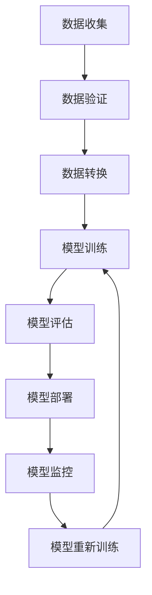

# AI系统DataOps原理与代码实战案例讲解

## 1.背景介绍

在当今数据驱动的时代,人工智能(AI)系统已经成为各行业的关键驱动力。然而,构建和维护高质量的AI系统是一项艰巨的挑战,需要有效管理大量的数据、模型和基础设施。这就是DataOps(数据操作)的概念应运而生。DataOps是一种将软件工程的最佳实践应用于数据分析过程的方法,旨在加快AI系统的交付速度、提高数据质量和模型性能。

## 2.核心概念与联系

### 2.1 DataOps概念

DataOps将敏捷方法、DevOps实践和数据管理相结合,形成了一个端到端的数据生命周期管理框架。它涵盖了数据收集、数据验证、数据转换、模型训练、模型部署和模型监控等各个阶段。DataOps的核心目标是建立一个自动化、可重复和可审计的数据管道,确保数据和模型的质量,加快AI系统的交付速度。

### 2.2 DataOps与DevOps的关系

DataOps与DevOps有着密切的联系,它们都强调自动化、协作和持续交付。然而,DataOps更侧重于数据和模型的管理,而DevOps则侧重于软件开发和基础设施管理。DataOps和DevOps的结合可以实现端到端的自动化,从数据收集到模型部署,再到应用程序交付,形成一个完整的AI系统交付管道。

### 2.3 DataOps原则

DataOps遵循以下几个核心原则:

1. **版本控制**: 对数据、代码和模型进行版本控制,确保可追溯性和可重复性。
2. **自动化**: 自动化数据处理、模型训练和部署等过程,减少人工错误和提高效率。
3. **测试和监控**: 持续测试和监控数据质量、模型性能和系统健康状况。
4. **协作**: 促进数据科学家、工程师和业务人员之间的协作,确保AI系统满足业务需求。

### 2.4 DataOps流程

DataOps流程通常包括以下几个阶段:



1. **数据收集**: 从各种数据源收集原始数据。
2. **数据验证**: 检查数据质量,确保数据的完整性和一致性。
3. **数据转换**: 对数据进行清理、标准化和特征工程等预处理。
4. **模型训练**: 使用预处理后的数据训练机器学习模型。
5. **模型评估**: 评估模型的性能和质量,确保满足业务需求。
6. **模型部署**: 将模型部署到生产环境中,供应用程序使用。
7. **模型监控**: 持续监控模型的性能和输入数据的质量。
8. **模型重新训练**: 根据监控结果和新数据,重新训练模型以提高性能。

## 3.核心算法原理具体操作步骤

DataOps涉及多种算法和技术,包括数据预处理、特征工程、机器学习算法等。以下是一些常见的算法原理和具体操作步骤:

### 3.1 数据预处理

数据预处理是确保数据质量和模型性能的关键步骤。常见的数据预处理技术包括:

1. **缺失值处理**: 使用均值插补、最近邻插补或机器学习模型预测缺失值。
2. **异常值处理**: 使用统计方法(如箱线图)或基于聚类的方法检测并处理异常值。
3. **数据标准化**: 使用Min-Max标准化、Z-Score标准化或其他方法将数据缩放到相似的范围。
4. **编码分类变量**: 使用One-Hot编码或标签编码等技术将分类变量转换为数值特征。

### 3.2 特征工程

特征工程是从原始数据中提取有意义的特征,对模型的性能至关重要。常见的特征工程技术包括:

1. **特征选择**: 使用Filter方法(如相关系数、卡方统计量)或Wrapper方法(如递归特征消除)选择最相关的特征。
2. **特征构造**: 通过组合、转换或聚合现有特征创建新的特征。
3. **特征降维**: 使用主成分分析(PCA)、线性判别分析(LDA)或其他技术降低特征空间的维度。

### 3.3 机器学习算法

机器学习算法是DataOps中的核心部分,用于从数据中学习模式并进行预测或决策。常见的机器学习算法包括:

1. **监督学习算法**:
   - **回归算法**: 线性回归、逻辑回归、决策树回归等。
   - **分类算法**: 支持向量机(SVM)、随机森林、梯度提升决策树(GBDT)等。
2. **无监督学习算法**:
   - **聚类算法**: K-Means聚类、层次聚类、DBSCAN等。
   - **降维算法**: 主成分分析(PCA)、t-SNE等。
3. **深度学习算法**:
   - **神经网络**: 前馈神经网络、卷积神经网络(CNN)、循环神经网络(RNN)等。
   - **生成对抗网络(GAN)**: 用于生成式建模和数据增强。

这些算法的具体操作步骤因算法而异,通常包括数据准备、模型构建、模型训练、模型评估和模型调优等步骤。

## 4.数学模型和公式详细讲解举例说明

在DataOps中,数学模型和公式扮演着重要的角色,用于描述和解释各种算法和技术。以下是一些常见的数学模型和公式,以及它们在DataOps中的应用:

### 4.1 线性回归

线性回归是一种常用的监督学习算法,用于预测连续型目标变量。它的数学模型如下:

$$y = \beta_0 + \beta_1x_1 + \beta_2x_2 + ... + \beta_nx_n + \epsilon$$

其中:
- $y$是目标变量
- $x_1, x_2, ..., x_n$是特征变量
- $\beta_0$是偏置项(常数项)
- $\beta_1, \beta_2, ..., \beta_n$是特征系数
- $\epsilon$是随机误差项

线性回归的目标是找到最小化残差平方和的系数$\beta$:

$$\min_\beta \sum_{i=1}^{m} (y_i - \hat{y}_i)^2$$

其中$m$是样本数量,$\hat{y}_i$是对第$i$个样本的预测值。

线性回归在DataOps中可用于预测连续型目标,如销售额、能源消耗等。

### 4.2 逻辑回归

逻辑回归是一种常用的分类算法,用于预测二元或多元分类目标变量。它的数学模型如下:

$$\hat{p}(y=1|x) = \sigma(\beta_0 + \beta_1x_1 + \beta_2x_2 + ... + \beta_nx_n)$$

其中:
- $\hat{p}(y=1|x)$是给定特征$x$时,目标变量$y$为1的概率
- $\sigma(z) = \frac{1}{1 + e^{-z}}$是Sigmoid函数,用于将线性组合映射到(0,1)范围内
- $\beta_0, \beta_1, ..., \beta_n$是系数

逻辑回归的目标是最大化对数似然函数:

$$\max_\beta \sum_{i=1}^{m} [y_i \log(\hat{p}_i) + (1 - y_i) \log(1 - \hat{p}_i)]$$

其中$m$是样本数量,$\hat{p}_i$是对第$i$个样本的预测概率。

逻辑回归在DataOps中可用于预测二元或多元分类目标,如客户流失预测、垃圾邮件检测等。

### 4.3 K-Means聚类

K-Means聚类是一种常用的无监督学习算法,用于将数据划分为$K$个聚类。它的目标是最小化聚类内部的平方误差:

$$\min_{\mu_1, \mu_2, ..., \mu_K} \sum_{i=1}^{m} \sum_{k=1}^{K} r_{ik} \left\lVert x_i - \mu_k \right\rVert^2$$

其中:
- $m$是样本数量
- $K$是聚类数量
- $\mu_1, \mu_2, ..., \mu_K$是聚类中心
- $r_{ik}$是一个指示变量,如果样本$x_i$属于第$k$个聚类,则$r_{ik}=1$,否则$r_{ik}=0$
- $\left\lVert x_i - \mu_k \right\rVert^2$是样本$x_i$与聚类中心$\mu_k$的欧几里得距离的平方

K-Means聚类的算法步骤如下:

1. 随机初始化$K$个聚类中心
2. 对每个样本$x_i$,计算它与每个聚类中心的距离,将它分配给最近的聚类
3. 更新每个聚类的中心,使其成为该聚类中所有样本的均值
4. 重复步骤2和3,直到聚类中心不再发生变化

K-Means聚类在DataOps中可用于客户细分、异常检测等无监督学习任务。

### 4.4 主成分分析(PCA)

主成分分析(PCA)是一种常用的无监督学习技术,用于降低数据的维度。它的目标是找到一组正交基向量,使得数据在这些基向量上的投影具有最大的方差。

设$X$是$m \times n$的数据矩阵,其中$m$是样本数量,$n$是特征数量。PCA的步骤如下:

1. 对数据进行中心化,得到$\tilde{X}$
2. 计算数据的协方差矩阵$\Sigma = \frac{1}{m} \tilde{X}^T \tilde{X}$
3. 计算协方差矩阵$\Sigma$的特征值$\lambda_1, \lambda_2, ..., \lambda_n$和对应的特征向量$v_1, v_2, ..., v_n$
4. 选择前$k$个最大的特征值对应的特征向量$v_1, v_2, ..., v_k$,构成投影矩阵$P = [v_1, v_2, ..., v_k]^T$
5. 将原始数据$X$投影到$k$维空间,得到降维后的数据$Y = XP$

PCA在DataOps中可用于降低数据的维度,从而加快模型训练速度、提高模型性能,并且有助于可视化高维数据。

这些数学模型和公式只是DataOps中使用的一小部分,还有许多其他模型和技术,如深度学习、强化学习、概率图模型等,具体取决于应用场景和任务需求。

## 5.项目实践:代码实例和详细解释说明

为了更好地理解DataOps的原理和实践,我们将通过一个实际案例来演示如何构建一个端到端的DataOps管道。在这个案例中,我们将使用Python和一些流行的数据科学库(如Pandas、Scikit-learn、TensorFlow等)来构建一个客户流失预测模型。

### 5.1 数据准备

我们将使用Kaggle上的一个开源数据集"银行客户流失预测"(Bank Customer Churn Prediction)。该数据集包含了一家银行的客户信息,如客户年龄、工作年限、信用评分等,以及客户是否已经流失的标签。我们的目标是基于这些特征预测客户是否会流失。

首先,我们导入所需的库并加载数据:

```python
import pandas as pd
from sklearn.model_selection import train_test_split

# 加载数据
data = pd.read_csv('bank_churn.csv')

# 将特征和目标变量分离
X = data.drop('Churn', axis=1)
y = data['Churn']

# 划分训练集和测试集
X_train, X_test, y_train, y_test = train_test_split(X, y, test_size=0.2, random_state=42)
```

### 5.2 特征工程

接下来,我们将对数据进行一些预处理和特征工程,以提高模型的性能。

```python
from sklearn.preprocessing import OneHotEncoder, StandardScaler

# 对分类特征进行One-Hot编码
cat_cols = X_train.select_dt