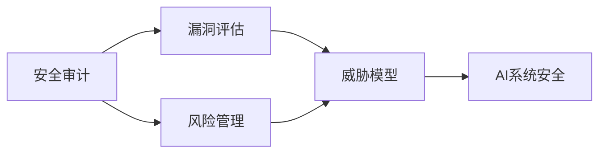

## 1. 背景介绍

随着人工智能技术的飞速发展，AI系统已经渗透到了社会的各个角落，从金融风控到智能医疗，从自动驾驶到智能家居，AI的应用无处不在。然而，随之而来的安全问题也日益凸显，AI系统的安全性成为了业界关注的焦点。安全审计作为一种预防性安全措施，对于确保AI系统的稳定和可靠运行至关重要。本文将深入探讨AI系统安全审计的原理，并结合代码实战案例，为读者提供一个全面的技术解读。

## 2. 核心概念与联系

在深入讨论之前，我们首先需要明确几个核心概念及其之间的联系：

- **安全审计（Security Audit）**：是指对系统的安全措施进行全面的检查和评估，以确保系统能够抵御外部威胁和内部漏洞。
- **AI系统（AI System）**：指采用人工智能技术，能够执行特定任务的软件系统。
- **威胁模型（Threat Model）**：是指对可能对系统造成威胁的行为者、行为方式和潜在目标的描述。
- **漏洞评估（Vulnerability Assessment）**：是指发现和量化系统中的安全漏洞。
- **风险管理（Risk Management）**：是指识别、评估和控制风险的过程。

这些概念之间的联系是：安全审计通过漏洞评估和风险管理来构建威胁模型，进而确保AI系统的安全性。



## 3. 核心算法原理具体操作步骤

AI系统安全审计的核心算法原理可以分为以下几个步骤：

1. **数据收集**：收集系统运行的各种数据，包括日志文件、用户操作记录等。
2. **威胁建模**：根据收集的数据，建立威胁模型，识别可能的攻击路径。
3. **漏洞扫描**：使用自动化工具扫描系统中的已知漏洞。
4. **行为分析**：分析系统行为，识别异常模式，可能指示着安全事件。
5. **风险评估**：对识别的风险进行评估，确定其严重性和优先级。
6. **修复与加固**：根据风险评估的结果，修复漏洞并加固系统。

## 4. 数学模型和公式详细讲解举例说明

在AI系统安全审计中，数学模型和公式是评估风险和识别异常行为的重要工具。例如，我们可以使用贝叶斯网络来评估不同安全事件发生的概率：

$$ P(A|B) = \frac{P(B|A) \cdot P(A)}{P(B)} $$

其中，$P(A|B)$ 表示在事件B发生的条件下，事件A发生的概率；$P(B|A)$ 表示在事件A发生的条件下，事件B发生的概率；$P(A)$ 和 $P(B)$ 分别表示事件A和事件B发生的独立概率。

通过构建贝叶斯网络，我们可以对AI系统中可能发生的安全事件进行概率推断，从而更好地进行风险管理。

## 5. 项目实践：代码实例和详细解释说明

为了更好地理解AI系统安全审计的实际操作，我们将通过一个简单的代码实例来演示漏洞扫描的过程。以下是一个使用Python编写的漏洞扫描脚本示例：

```python
import requests

# 漏洞扫描目标URL
target_url = "http://example.com"

# 已知漏洞列表
known_vulnerabilities = ["/admin", "/login.php", "/config.json"]

# 扫描函数
def scan_vulnerabilities(url, vuln_list):
    for vuln in vuln_list:
        full_url = url + vuln
        response = requests.get(full_url)
        if response.status_code == 200:
            print(f"发现潜在漏洞: {full_url}")

# 执行扫描
scan_vulnerabilities(target_url, known_vulnerabilities)
```

这个脚本会对目标网站进行扫描，检查是否存在已知的漏洞路径。如果发现潜在的漏洞，脚本会输出相应的信息。

## 6. 实际应用场景

AI系统安全审计在多个领域都有广泛的应用，例如：

- **金融行业**：用于检测和防止欺诈行为，保护客户的财产安全。
- **医疗健康**：确保患者数据的隐私和安全，防止数据泄露。
- **自动驾驶**：保证车辆系统的安全，防止黑客攻击导致的事故。

## 7. 工具和资源推荐

为了帮助读者更好地进行AI系统安全审计，以下是一些推荐的工具和资源：

- **OWASP ZAP**：一个开源的网络应用安全扫描工具。
- **Nessus**：一个广泛使用的漏洞扫描程序。
- **AI安全白皮书**：提供AI安全领域的最新研究和实践。

## 8. 总结：未来发展趋势与挑战

AI系统安全审计是一个不断发展的领域，随着AI技术的进步，审计方法和工具也在不断进化。未来的发展趋势包括使用更多的机器学习方法来自动化安全审计过程，以及开发更智能的威胁检测算法。同时，随着AI系统的复杂性增加，安全审计面临的挑战也在增加，如何有效地保护AI系统的安全将是一个长期的课题。

## 9. 附录：常见问题与解答

**Q1：AI系统安全审计和传统IT安全审计有什么不同？**

A1：AI系统安全审计更加关注数据的安全性和算法的可靠性，而传统IT安全审计更多关注网络和系统的安全。

**Q2：如何成为一名AI系统安全审计专家？**

A2：需要具备深厚的AI知识、熟悉安全审计的方法和工具，同时不断学习最新的安全技术和趋势。

**Q3：AI系统安全审计是否可以完全自动化？**

A3：虽然部分审计过程可以自动化，但人工专家的判断和决策仍然不可或缺。

作者：禅与计算机程序设计艺术 / Zen and the Art of Computer Programming