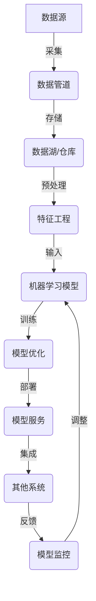

# AI系统架构原理与代码实战案例讲解

## 1. 背景介绍

### 1.1 人工智能系统的重要性

人工智能(AI)已经成为当今科技领域最具革命性的力量之一。从语音助手到自动驾驶汽车,从医疗诊断到金融分析,AI系统无处不在,正在彻底改变我们的生活和工作方式。随着数据量的激增和计算能力的提高,AI系统变得越来越复杂和强大。然而,构建一个高效、可靠和安全的AI系统绝非易事,需要深入理解其背后的原理和架构。

### 1.2 AI系统架构的挑战

设计和实现AI系统架构面临着诸多挑战:

1. **数据处理**:AI系统需要处理海量的结构化和非结构化数据,这对数据存储、传输和预处理提出了巨大的要求。

2. **算法选择**:不同的AI任务需要不同的算法,如机器学习、深度学习、自然语言处理等。选择合适的算法对系统的性能和准确性至关重要。

3. **硬件加速**:训练复杂的AI模型需要强大的计算能力,通常需要利用GPU、TPU等专用硬件进行加速。

4. **分布式计算**:大规模的AI系统通常需要在多台机器上进行分布式计算,以提高效率和可扩展性。

5. **系统集成**:AI系统往往需要与其他系统(如数据库、Web服务等)进行集成,这增加了系统的复杂性。

6. **模型部署**:将训练好的AI模型部署到生产环境中,并确保其稳定、高效运行,是一个巨大的挑战。

7. **安全和隐私**:AI系统处理大量敏感数据,需要采取有效措施保护数据安全和隐私。

8. **可解释性**:许多AI模型是"黑箱",难以解释其内部决策过程,这可能会影响其在一些关键领域(如医疗、金融等)的应用。

### 1.3 本文的目的和范围

本文旨在深入探讨AI系统架构的原理和实践。我们将介绍AI系统架构的核心概念、算法原理、数学模型,并通过实战案例讲解如何设计和实现一个高效、可扩展的AI系统。我们还将探讨AI系统在不同领域的应用场景,分享工具和资源,并展望未来的发展趋势和挑战。

本文适合AI从业者、研究人员、架构师和开发人员阅读,旨在提供一个全面的AI系统架构参考。

## 2. 核心概念与联系

在深入探讨AI系统架构之前,我们需要了解一些核心概念及其相互关系。

### 2.1 机器学习

机器学习(Machine Learning)是AI的一个核心分支,它赋予计算机从数据中自主学习和改进的能力,而无需显式编程。常见的机器学习算法包括:

- 监督学习(Supervised Learning):基于已标注的训练数据,学习一个从输入到输出的映射函数。例如,图像分类、语音识别等。
- 非监督学习(Unsupervised Learning):从未标注的数据中发现隐藏的模式和结构。例如,聚类分析、降维等。
- 强化学习(Reinforcement Learning):通过与环境的交互,学习一个策略以最大化累积奖励。例如,AlphaGo等。

### 2.2 深度学习

深度学习(Deep Learning)是机器学习的一个子领域,它利用深度神经网络模型来模拟人脑的工作原理,在计算机视觉、自然语言处理等领域取得了巨大成功。常见的深度学习模型包括:

- 卷积神经网络(Convolutional Neural Networks, CNN):擅长处理图像和视频数据。
- 循环神经网络(Recurrent Neural Networks, RNN):擅长处理序列数据,如文本和语音。
- transformer模型(Transformer Models):基于自注意力机制,在NLP任务中表现出色。

### 2.3 数据管道

数据管道(Data Pipeline)是AI系统中负责数据采集、存储、预处理和传输的关键组件。一个健壮的数据管道对于确保AI模型的准确性和可靠性至关重要。常见的数据管道技术包括:

- 数据湖(Data Lake):用于存储原始数据的大型分布式存储系统。
- 数据仓库(Data Warehouse):用于存储经过处理的结构化数据。
- ETL/ELT工具:用于提取(Extract)、转换(Transform)和加载(Load)数据。
- 流处理系统(Stream Processing):用于实时处理数据流。

### 2.4 模型训练与优化

训练AI模型是一个计算密集型的过程,需要大量的数据和计算资源。常见的模型训练和优化技术包括:

- 分布式训练:在多台机器上并行训练模型,以提高效率。
- 模型压缩:通过剪枝、量化等技术压缩模型大小,以便部署到资源受限的设备上。
- 超参数优化:自动搜索模型的最佳超参数组合,以提高性能。
- 迁移学习:利用在大型数据集上预训练的模型,加快在新任务上的训练过程。

### 2.5 模型部署和服务

将训练好的AI模型部署到生产环境中,并提供高效、可靠的服务,是AI系统架构中的一个重要环节。常见的模型部署和服务技术包括:

- 容器化部署:将模型打包成Docker容器,以便在不同环境中运行。
- 模型服务:通过RESTful API或gRPC等方式,将模型封装为可伸缩的Web服务。
- 模型监控:持续监控模型的性能和输出,以发现异常并进行调整。
- A/B测试:在生产环境中同时运行多个模型版本,以比较它们的表现。

### 2.6 系统集成

AI系统通常需要与其他系统(如数据库、Web服务等)进行集成,以实现端到端的功能。常见的系统集成技术包括:

- 消息队列:用于在不同系统之间异步传递消息和事件。
- API网关:提供统一的入口点,将请求路由到不同的后端服务。
- 服务网格:用于管理和监控分布式微服务架构中的服务。
- 数据虚拟化:提供统一的数据视图,抽象掉底层数据源的差异。

### 2.7 Mermaid流程图

下面的Mermaid流程图展示了AI系统架构的核心概念及其关系:

该流程图描述了AI系统的典型生命周期:从数据采集、存储、预处理,到模型训练、优化、部署,再到与其他系统集成、模型监控和调整。这些环节相互关联,构成了一个完整的AI系统架构。

## 3. 核心算法原理具体操作步骤

在上一节中,我们介绍了AI系统架构的核心概念。现在,我们将深入探讨一些广泛应用于AI系统中的核心算法原理及其具体操作步骤。

### 3.1 监督学习算法

监督学习是机器学习中最常见的一种范式,它旨在从标注的训练数据中学习出一个映射函数,用于对新的输入数据进行预测或分类。

#### 3.1.1 线性回归

线性回归是一种简单但有效的监督学习算法,用于预测连续值的目标变量。它试图找到一条最佳拟合直线,使得数据点到直线的距离之和最小。

线性回归的具体操作步骤如下:

1. 收集并准备数据。
2. 将数据分为训练集和测试集。
3. 选择特征变量(自变量)和目标变量(因变量)。
4. 使用最小二乘法或梯度下降法估计回归系数。
5. 在测试集上评估模型的性能。
6. 对新的输入数据进行预测。

#### 3.1.2 逻辑回归

逻辑回归是一种用于二分类问题的监督学习算法。它通过学习一个逻辑函数,将输入数据映射到0或1的类别标签。

逻辑回归的具体操作步骤如下:

1. 收集并准备数据。
2. 将数据分为训练集和测试集。
3. 选择特征变量和目标变量(0或1)。
4. 使用最大似然估计或梯度下降法估计回归系数。
5. 在测试集上评估模型的性能。
6. 对新的输入数据进行分类预测。

#### 3.1.3 决策树

决策树是一种基于树形结构的监督学习算法,它通过递归地对特征进行分裂,将数据划分为不同的子集,从而构建一棵决策树。

决策树的具体操作步骤如下:

1. 收集并准备数据。
2. 将数据分为训练集和测试集。
3. 选择特征变量和目标变量。
4. 使用信息增益或基尼系数等指标,递归地构建决策树。
5. 在测试集上评估模型的性能。
6. 对新的输入数据进行预测或分类。

#### 3.1.4 支持向量机

支持向量机(Support Vector Machines, SVM)是一种基于核技巧的监督学习算法,它试图在高维空间中找到一个最优超平面,将不同类别的数据点分开。

SVM的具体操作步骤如下:

1. 收集并准备数据。
2. 将数据分为训练集和测试集。
3. 选择特征变量和目标变量。
4. 选择合适的核函数(如线性核、高斯核等)。
5. 使用序列最小优化(SMO)算法或其他优化方法训练SVM模型。
6. 在测试集上评估模型的性能。
7. 对新的输入数据进行预测或分类。

### 3.2 非监督学习算法

非监督学习旨在从未标注的数据中发现隐藏的模式和结构,常用于聚类、降维和关联规则挖掘等任务。

#### 3.2.1 K-Means聚类

K-Means是一种简单但有效的聚类算法,它将数据划分为K个簇,使得每个数据点都属于离它最近的簇的质心。

K-Means聚类的具体操作步骤如下:

1. 收集并准备数据。
2. 选择特征变量。
3. 随机初始化K个簇的质心。
4. 将每个数据点分配到最近的簇。
5. 重新计算每个簇的质心。
6. 重复步骤4和5,直到簇的质心不再发生变化。
7. 对新的输入数据进行聚类预测。

#### 3.2.2 层次聚类

层次聚类是一种基于距离度量的聚类算法,它通过递归地将数据点或簇合并或分裂,构建一棵层次聚类树。

层次聚类的具体操作步骤如下:

1. 收集并准备数据。
2. 选择特征变量。
3. 计算数据点之间的距离矩阵。
4. 使用凝聚层次聚类(自底向上)或分裂层次聚类(自顶向下)的策略,构建层次聚类树。
5. 根据需要选择合适的层次水平,对数据进行聚类。
6. 对新的输入数据进行聚类预测。

#### 3.2.3 主成分分析

主成分分析(Principal Component Analysis, PCA)是一种常用的降维技术,它通过线性变换将高维数据投影到一个低维子空间,同时尽可能保留数据的方差。

PCA的具体操作步骤如下:

1. 收集并准备数据。
2. 标准化数据(均值为0,方差为1)。
3. 计算数据的协方差矩阵。
4. 计算协方差矩阵的特征值和特征向量。
5. 选择对应于最大K个特征值的特征向量作为主成分。
6. 将原始数据投影到由主成分构成的低维子空间。
7.