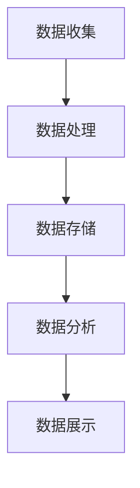

# AI系统监控原理与代码实战案例讲解

## 1.背景介绍

在现代信息技术的飞速发展中，人工智能（AI）系统已经成为各行各业的核心驱动力。然而，随着AI系统的复杂性和规模的增加，如何有效地监控这些系统以确保其稳定性、性能和安全性，成为了一个至关重要的问题。AI系统监控不仅仅是为了检测和解决问题，更是为了优化系统性能，提升用户体验，并确保系统的可靠性和安全性。

## 2.核心概念与联系

### 2.1 监控的基本概念

监控是指对系统的运行状态进行实时或定期的观察和记录，以便及时发现和解决潜在问题。对于AI系统，监控的内容包括但不限于以下几个方面：

- **性能监控**：包括CPU、内存、磁盘I/O等资源的使用情况。
- **日志监控**：记录系统运行过程中的各种事件和错误信息。
- **应用监控**：监控AI模型的运行状态、预测结果的准确性等。
- **安全监控**：检测系统是否存在安全漏洞或受到攻击。

### 2.2 监控与AI系统的联系

AI系统的监控与传统系统的监控有许多相似之处，但也有其独特的挑战和需求。AI系统通常涉及大量的数据处理和复杂的算法，这使得监控变得更加复杂和重要。通过有效的监控，可以：

- **提高系统的可靠性**：及时发现和解决问题，避免系统崩溃。
- **优化系统性能**：通过分析监控数据，发现性能瓶颈并进行优化。
- **确保安全性**：检测并防范潜在的安全威胁。
- **提升用户体验**：通过监控用户行为和反馈，优化系统功能和性能。

## 3.核心算法原理具体操作步骤

### 3.1 数据收集

数据收集是监控的第一步。对于AI系统，数据收集的内容包括系统资源使用情况、日志信息、应用状态等。常用的数据收集工具有Prometheus、Grafana等。

### 3.2 数据处理

收集到的数据需要进行处理和分析，以便提取有用的信息。数据处理的步骤包括数据清洗、数据转换、数据聚合等。可以使用ELK（Elasticsearch、Logstash、Kibana）等工具进行数据处理。

### 3.3 数据存储

处理后的数据需要存储起来，以便后续的查询和分析。常用的数据存储工具有InfluxDB、Elasticsearch等。

### 3.4 数据分析

数据分析是监控的核心，通过对存储的数据进行分析，可以发现系统的运行状态和潜在问题。可以使用机器学习算法对数据进行分析，预测系统的性能和故障。

### 3.5 数据展示

数据展示是监控的最后一步，通过可视化工具将分析结果展示出来，便于运维人员进行监控和决策。常用的可视化工具有Grafana、Kibana等。

以下是一个简单的Mermaid流程图，展示了AI系统监控的基本流程：



## 4.数学模型和公式详细讲解举例说明

### 4.1 监控数据的统计分析

在监控数据的分析中，常用的统计方法包括均值、方差、标准差等。假设我们有一组监控数据 $X = \{x_1, x_2, \ldots, x_n\}$，其均值 $\mu$ 和方差 $\sigma^2$ 的计算公式如下：

$$
\mu = \frac{1}{n} \sum_{i=1}^{n} x_i
$$

$$
\sigma^2 = \frac{1}{n} \sum_{i=1}^{n} (x_i - \mu)^2
$$

### 4.2 预测模型

在AI系统监控中，预测模型可以用于预测系统的性能和故障。常用的预测模型有线性回归、时间序列分析等。以线性回归为例，其模型公式如下：

$$
y = \beta_0 + \beta_1 x_1 + \beta_2 x_2 + \ldots + \beta_p x_p + \epsilon
$$

其中，$y$ 是预测值，$x_1, x_2, \ldots, x_p$ 是特征变量，$\beta_0, \beta_1, \ldots, \beta_p$ 是模型参数，$\epsilon$ 是误差项。

### 4.3 异常检测

异常检测是监控中的一个重要任务，可以使用统计方法或机器学习算法进行。以基于均值和标准差的异常检测为例，其检测规则如下：

$$
\text{如果} \ |x_i - \mu| > k \sigma, \ \text{则} \ x_i \ \text{为异常值}
$$

其中，$k$ 是一个常数，通常取值为2或3。

## 5.项目实践：代码实例和详细解释说明

### 5.1 数据收集

以下是使用Prometheus进行数据收集的示例代码：

```yaml
# prometheus.yml
global:
  scrape_interval: 15s

scrape_configs:
  - job_name: 'node'
    static_configs:
      - targets: ['localhost:9100']
```

### 5.2 数据处理

以下是使用Logstash进行数据处理的示例代码：

```ruby
# logstash.conf
input {
  file {
    path => "/var/log/syslog"
    start_position => "beginning"
  }
}

filter {
  grok {
    match => { "message" => "%{SYSLOGTIMESTAMP:timestamp} %{SYSLOGHOST:host} %{DATA:program} %{GREEDYDATA:message}" }
  }
}

output {
  elasticsearch {
    hosts => ["localhost:9200"]
    index => "syslog-%{+YYYY.MM.dd}"
  }
}
```

### 5.3 数据存储

以下是使用Elasticsearch进行数据存储的示例代码：

```json
PUT /syslog-2023.10.01
{
  "mappings": {
    "properties": {
      "timestamp": { "type": "date" },
      "host": { "type": "keyword" },
      "program": { "type": "keyword" },
      "message": { "type": "text" }
    }
  }
}
```

### 5.4 数据分析

以下是使用Python进行数据分析的示例代码：

```python
import pandas as pd
from sklearn.linear_model import LinearRegression

# 读取数据
data = pd.read_csv('monitoring_data.csv')

# 特征变量和目标变量
X = data[['cpu_usage', 'memory_usage']]
y = data['response_time']

# 训练线性回归模型
model = LinearRegression()
model.fit(X, y)

# 预测
predictions = model.predict(X)
```

### 5.5 数据展示

以下是使用Grafana进行数据展示的示例代码：

```json
{
  "dashboard": {
    "id": null,
    "title": "System Monitoring",
    "panels": [
      {
        "type": "graph",
        "title": "CPU Usage",
        "targets": [
          {
            "expr": "avg(node_cpu_seconds_total{mode='idle'})",
            "format": "time_series"
          }
        ]
      }
    ]
  }
}
```

## 6.实际应用场景

### 6.1 云计算平台

在云计算平台中，AI系统监控可以帮助运维人员实时了解系统的运行状态，及时发现和解决问题，确保系统的稳定性和性能。

### 6.2 金融行业

在金融行业，AI系统监控可以用于监控交易系统的运行状态，检测异常交易行为，防范金融风险。

### 6.3 医疗行业

在医疗行业，AI系统监控可以用于监控医疗设备的运行状态，确保设备的正常运行，保障患者的安全。

### 6.4 制造业

在制造业，AI系统监控可以用于监控生产设备的运行状态，预测设备故障，减少停机时间，提高生产效率。

## 7.工具和资源推荐

### 7.1 Prometheus

Prometheus是一个开源的系统监控和报警工具，具有强大的数据收集和查询功能，适用于大规模分布式系统的监控。

### 7.2 Grafana

Grafana是一个开源的可视化工具，支持多种数据源，可以用于创建和分享监控仪表盘。

### 7.3 ELK Stack

ELK Stack（Elasticsearch、Logstash、Kibana）是一个开源的日志管理和分析工具，适用于大规模日志数据的处理和分析。

### 7.4 InfluxDB

InfluxDB是一个开源的时序数据库，适用于存储和查询时序数据，广泛应用于系统监控和物联网领域。

## 8.总结：未来发展趋势与挑战

### 8.1 发展趋势

随着AI技术的不断发展，AI系统监控也将面临新的挑战和机遇。未来，AI系统监控将更加智能化和自动化，通过引入机器学习和深度学习技术，实现对系统运行状态的智能预测和自动调优。

### 8.2 挑战

AI系统监控面临的主要挑战包括数据量大、数据复杂、实时性要求高等。如何高效地处理和分析海量数据，及时发现和解决问题，是AI系统监控需要解决的关键问题。

## 9.附录：常见问题与解答

### 9.1 如何选择合适的监控工具？

选择监控工具时，需要考虑系统的规模、复杂性、实时性要求等因素。对于大规模分布式系统，可以选择Prometheus和Grafana；对于日志数据的处理和分析，可以选择ELK Stack。

### 9.2 如何处理监控数据的噪声？

监控数据中可能存在噪声，可以通过数据清洗和过滤的方法去除噪声。例如，可以使用滑动平均、加权平均等方法对数据进行平滑处理。

### 9.3 如何实现监控数据的可视化？

可以使用Grafana、Kibana等可视化工具，将监控数据以图表的形式展示出来，便于运维人员进行监控和决策。

### 9.4 如何进行异常检测？

可以使用统计方法或机器学习算法进行异常检测。例如，可以使用基于均值和标准差的异常检测方法，或使用支持向量机、孤立森林等机器学习算法进行异常检测。

### 9.5 如何优化监控系统的性能？

可以通过优化数据收集、处理和存储的流程，提高监控系统的性能。例如，可以使用分布式数据处理框架，提升数据处理的效率；使用高性能的时序数据库，提升数据存储和查询的效率。

---

作者：禅与计算机程序设计艺术 / Zen and the Art of Computer Programming