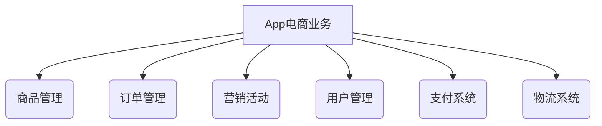

# App电商业务团队规划和人员规划与人员培养计划

## 1.背景介绍

### 1.1 电商行业概况

随着互联网和移动互联网的快速发展,电子商务(电商)行业正在蓬勃发展。电商不仅改变了人们的消费习惯,也推动了整个零售行业的变革。根据统计,2022年中国电商市场交易规模达到了16.69万亿元人民币,同比增长6.7%。移动电商交易规模更是达到了13.98万亿元,占比高达83.8%。

### 1.2 App电商的重要性

在电商行业中,App移动端是最主要的交易场景。App电商平台为用户提供了便捷的购物体验,也为商家提供了触达用户的渠道。构建高质量的App电商平台,对于企业获取更多用户流量、提高销售转化率至关重要。

### 1.3 团队规划的必要性

要打造出色的App电商平台,需要一支高效的研发团队。合理的团队规划和人员配置,对于提高开发效率、保证产品质量至关重要。同时,持续的人员培养也是保持团队竞争力的关键。

## 2.核心概念与联系

### 2.1 App电商业务概念

App电商业务主要包括以下几个核心概念:

- **商品管理**: 包括商品的上架、下架、编辑、分类等。
- **订单管理**: 包括订单的创建、支付、发货、收货、退换货等流程。
- **营销活动**: 包括各种促销活动、优惠券、积分等营销手段。
- **用户管理**: 包括用户注册、登录、个人中心等用户相关功能。
- **支付系统**: 与第三方支付渠道对接,实现在线支付。
- **物流系统**: 与物流公司对接,实现订单配送。

这些核心概念相互关联,共同构建了App电商的完整业务流程。



### 2.2 人员角色划分

为了高效开发和运营App电商业务,需要将人员合理分工,主要包括以下角色:

- **产品经理**: 负责产品需求分析、产品规划和产品设计。
- **UI设计师**: 负责App界面设计,提升用户体验。
- **前端开发工程师**: 负责App客户端开发,实现界面交互。
- **后端开发工程师**: 负责服务端开发,实现业务逻辑。
- **测试工程师**: 负责功能测试、性能测试等质量保证工作。
- **运维工程师**: 负责系统部署、监控和维护。
- **数据分析师**: 负责分析用户行为数据,为决策提供支持。
- **营销人员**: 负责营销活动策划和执行。

不同角色在App电商业务中承担不同的职责,相互配合,共同推进项目进度。

## 3.核心算法原理具体操作步骤

### 3.1 推荐算法原理

推荐算法是App电商平台的核心算法之一,它可以为用户推荐感兴趣的商品,提高购买转化率。常见的推荐算法包括:

1. **协同过滤算法(Collaborative Filtering)**

协同过滤算法基于用户的历史行为数据,找到具有相似兴趣爱好的用户群体,并基于这些相似用户的喜好推荐商品。

算法步骤:

1) 计算用户之间的相似度
2) 找到与目标用户相似的用户群体
3) 基于相似用户的喜好,为目标用户生成推荐列表

2. **内容过滤算法(Content-based Filtering)**

内容过滤算法基于商品的内容特征(如标题、描述、类别等),与用户的兴趣爱好进行匹配,推荐相似的商品。

算法步骤:

1) 提取商品的内容特征
2) 构建用户兴趣模型
3) 计算商品与用户兴趣的相似度
4) 根据相似度排序,生成推荐列表

3. **组合算法**

实际应用中,通常会将协同过滤和内容过滤相结合,发挥各自的优势,提高推荐效果。

### 3.2 商品搜索算法

商品搜索是App电商平台的另一核心算法,它能够快速从海量商品中检索出用户感兴趣的商品。常见的搜索算法包括:

1. **倒排索引(Inverted Index)**

倒排索引是文档检索系统中最常用的数据结构,它将每个词与包含该词的文档列表相关联,大大提高了查询效率。

算法步骤:

1) 对商品信息进行分词和去重
2) 构建倒排索引表
3) 根据用户查询,从倒排索引表中获取相关商品列表

2. **BM25算法**

BM25是一种常用的商品相关性打分算法,它综合考虑了词频(TF)、逆文档频率(IDF)等多个因素,对查询结果进行排序。

算法步骤:

1) 计算每个查询词在商品中的TF-IDF值
2) 将TF-IDF值代入BM25公式,计算商品相关性分数
3) 根据分数对商品进行排序

### 3.3 其他核心算法

除了推荐和搜索算法外,App电商平台还涉及到其他一些核心算法,例如:

- **购物车算法**: 用于管理用户的购物车,计算优惠、运费等。
- **营销优惠算法**: 用于计算各种优惠活动的折扣、赠品等。
- **物流路由算法**: 用于规划最优的配送路线,提高物流效率。
- **防刷单算法**: 用于识别和防止刷单行为,保护平台利益。

这些算法的实现细节由于篇幅有限而不再赘述,但它们都是App电商平台不可或缺的重要组成部分。

## 4.数学模型和公式详细讲解举例说明

### 4.1 TF-IDF模型

TF-IDF(Term Frequency-Inverse Document Frequency)是一种常用的文本挖掘模型,它可以量化一个词对于一个文档的重要程度。在商品搜索中,TF-IDF被用于计算查询词在商品中的权重,作为相关性打分的一个重要因素。

TF-IDF的计算公式如下:

$$\mathrm{tfidf}(t, d, D) = \mathrm{tf}(t, d) \times \mathrm{idf}(t, D)$$

其中:

- $\mathrm{tf}(t, d)$ 表示词 $t$ 在文档 $d$ 中出现的频率
- $\mathrm{idf}(t, D)$ 表示词 $t$ 在整个文档集 $D$ 中的逆文档频率

$\mathrm{tf}(t, d)$ 可以使用不同的方式计算,最常见的是原始词频:

$$\mathrm{tf}(t, d) = \frac{n_{t,d}}{\sum_{t' \in d} n_{t',d}}$$

其中 $n_{t,d}$ 表示词 $t$ 在文档 $d$ 中出现的次数。

$\mathrm{idf}(t, D)$ 的计算公式为:

$$\mathrm{idf}(t, D) = \log \frac{|D|}{|\{d \in D : t \in d\}|}$$

其中 $|D|$ 表示文档集的总数, $|\{d \in D : t \in d\}|$ 表示包含词 $t$ 的文档数量。

通过将 $\mathrm{tf}$ 和 $\mathrm{idf}$ 相乘,可以得到每个词对文档的 TF-IDF 权重。一个词在文档中出现的频率越高,且在整个文档集中出现的频率越低,它的 TF-IDF 权重就越大,表示对该文档越重要。

在商品搜索中,可以将用户的查询作为一个"文档",商品的标题、描述等作为另一个"文档",计算查询词在商品中的 TF-IDF 权重,作为商品相关性的一个重要指标。

### 4.2 BM25模型

BM25是一种常用的文本相关性模型,它在 TF-IDF 的基础上,引入了更多的调节因子,使得相关性评分更加准确。BM25模型的公式如下:

$$\mathrm{score}(D, Q) = \sum_{q \in Q} \mathrm{idf}(q) \cdot \frac{f(q, D) \cdot (k_1 + 1)}{f(q, D) + k_1 \cdot (1 - b + b \cdot \frac{|D|}{\mathrm{avgdl}})}$$

其中:

- $D$ 表示文档(商品)
- $Q$ 表示查询(用户输入的关键词)
- $f(q, D)$ 表示查询词 $q$ 在文档 $D$ 中出现的频率
- $|D|$ 表示文档 $D$ 的长度(字数)
- $\mathrm{avgdl}$ 表示文档集中文档的平均长度
- $k_1$ 和 $b$ 是两个调节因子,用于控制词频和文档长度对相关性的影响程度

BM25模型在 TF-IDF 的基础上,引入了文档长度的归一化因子,避免了长文档过于占优的问题。同时,通过调节 $k_1$ 和 $b$ 两个参数,可以调整词频和文档长度对相关性的影响程度,使得评分更加准确。

在商品搜索中,可以将用户的查询作为 $Q$,商品的标题、描述等作为 $D$,使用 BM25 模型计算商品与查询的相关性分数,作为排序的依据。

## 5.项目实践:代码实例和详细解释说明

为了更好地理解上述算法的实现,我们提供了一些简单的代码示例,供参考。

### 5.1 协同过滤算法示例

下面是一个基于用户的协同过滤算法的Python实现示例:

```python
import numpy as np
from scipy.spatial.distance import cosine

# 用户-商品评分矩阵
ratings = np.array([[5, 3, 0, 1],
                    [3, 2, 0, 0],
                    [1, 0, 0, 5],
                    [0, 3, 4, 4],
                    [0, 0, 5, 3]])

# 计算用户之间的相似度
user_sim = 1 - ratings.dot(ratings.T) / np.sqrt(np.diagonal(ratings.dot(ratings.T)))

# 为目标用户推荐商品
def recommend(user_id, top_n=3):
    # 获取目标用户的评分
    user_ratings = ratings[user_id]
    
    # 计算其他用户与目标用户的相似度
    sim_scores = user_sim[user_id]
    
    # 排除目标用户已经评分的商品
    item_idx = np.where(user_ratings == 0)[0]
    
    # 计算每个商品的加权评分
    item_scores = []
    for i in item_idx:
        user_ratings_i = ratings[:, i]
        sim_scores_i = sim_scores[np.where(user_ratings_i != 0)[0]]
        user_ratings_i = user_ratings_i[np.where(user_ratings_i != 0)]
        item_scores.append(np.sum(sim_scores_i * user_ratings_i) / np.sum(sim_scores_i))
    
    # 获取评分最高的商品
    item_scores = np.array(item_scores)
    top_items = np.argsort(-item_scores)[:top_n]
    
    return [item_idx[i] for i in top_items]

# 为用户0推荐3个商品
print(recommend(0))
```

上述代码首先构建了一个用户-商品评分矩阵,然后计算了用户之间的相似度。在推荐函数中,我们首先获取目标用户的评分,然后计算其他用户与目标用户的相似度。接着,对于目标用户未评分的商品,我们计算加权评分,并返回评分最高的几个商品作为推荐结果。

### 5.2 商品搜索示例

下面是一个基于BM25模型的商品搜索Python实现示例:

```python
import math

# BM25参数
k1 = 1.2
b = 0.75

# 文档集
docs = [
    "Apple iPhone 12 Pro Max 256GB",
    "Samsung Galaxy S21 Ultra 5G 128GB",
    "Xiaomi Mi 11 Pro 8GB+256GB",
    "Huawei Mate 40 Pro 5G 8