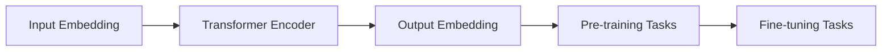

# BERT原理与代码实例讲解

## 1. 背景介绍
### 1.1 自然语言处理的发展历程
### 1.2 深度学习在NLP中的应用
### 1.3 Transformer模型的提出与意义

## 2. 核心概念与联系
### 2.1 BERT的定义与特点
#### 2.1.1 BERT的全称与含义
#### 2.1.2 BERT的核心创新点
### 2.2 BERT与Transformer的关系
#### 2.2.1 BERT对Transformer的继承与发展
#### 2.2.2 BERT去掉Transformer的编码器-解码器结构
### 2.3 BERT与ELMo、GPT等模型的异同
#### 2.3.1 BERT与ELMo的比较
#### 2.3.2 BERT与GPT的比较

## 3. 核心算法原理具体操作步骤
### 3.1 BERT的输入表示
#### 3.1.1 Token Embeddings
#### 3.1.2 Segment Embeddings 
#### 3.1.3 Position Embeddings
### 3.2 BERT的预训练任务
#### 3.2.1 Masked Language Model(MLM)
#### 3.2.2 Next Sentence Prediction(NSP)
### 3.3 BERT的微调与下游任务
#### 3.3.1 微调的基本流程
#### 3.3.2 常见的下游任务

## 4. 数学模型和公式详细讲解举例说明
### 4.1 Transformer的自注意力机制
#### 4.1.1 Scaled Dot-Product Attention
$Attention(Q,K,V) = softmax(\frac{QK^T}{\sqrt{d_k}})V$
#### 4.1.2 Multi-Head Attention
$$MultiHead(Q,K,V) = Concat(head_1,...,head_h)W^O$$
$$head_i=Attention(QW_i^Q, KW_i^K, VW_i^V)$$
### 4.2 BERT的损失函数
#### 4.2.1 MLM的损失函数
$$\mathcal{L}_{MLM}(\theta) = -\sum_{i \in masked} \log P(w_i|w_{/i};\theta)$$
#### 4.2.2 NSP的损失函数
$$\mathcal{L}_{NSP}(\theta) = -\log P(y|\mathbf{s}_1,\mathbf{s}_2;\theta)$$

## 5. 项目实践：代码实例和详细解释说明
### 5.1 BERT的TensorFlow实现
#### 5.1.1 创建BERT模型
#### 5.1.2 加载预训练权重
#### 5.1.3 微调与预测
### 5.2 BERT的PyTorch实现
#### 5.2.1 创建BERT模型
#### 5.2.2 加载预训练权重
#### 5.2.3 微调与预测
### 5.3 使用Hugging Face的Transformers库
#### 5.3.1 加载BERT模型与分词器
#### 5.3.2 文本分类任务示例
#### 5.3.3 命名实体识别任务示例

## 6. 实际应用场景
### 6.1 情感分析
### 6.2 问答系统
### 6.3 机器翻译
### 6.4 文本摘要

## 7. 工具和资源推荐
### 7.1 预训练模型与权重
#### 7.1.1 BERT-Base
#### 7.1.2 BERT-Large
#### 7.1.3 多语言版BERT
### 7.2 开源代码实现
#### 7.2.1 Google官方的TensorFlow实现
#### 7.2.2 Hugging Face的PyTorch实现
### 7.3 相关论文与教程
#### 7.3.1 BERT原论文
#### 7.3.2 Transformer原论文
#### 7.3.3 Jay Alammar的博客教程

## 8. 总结：未来发展趋势与挑战
### 8.1 BERT的影响与意义
### 8.2 后BERT时代的发展方向
#### 8.2.1 模型压缩与加速
#### 8.2.2 知识融合与注入
#### 8.2.3 更大规模预训练
### 8.3 BERT面临的挑战与局限性
#### 8.3.1 计算资源需求大
#### 8.3.2 预训练与下游任务的差异
#### 8.3.3 推理速度慢

## 9. 附录：常见问题与解答
### 9.1 如何选择BERT的预训练模型？
### 9.2 BERT在实际应用中需要注意哪些问题？ 
### 9.3 BERT相比传统的词向量有何优势？

BERT（Bidirectional Encoder Representations from Transformers）是谷歌在2018年提出的一种预训练语言模型，旨在通过自监督学习从大规模无标注文本语料中学习通用的语言表示。与之前的ELMo、GPT等模型不同，BERT采用了双向Transformer编码器结构，可以更好地捕捉文本的上下文信息，在多个自然语言处理任务上取得了显著的性能提升。

BERT的核心创新点在于其独特的预训练任务设计。传统的语言模型通常采用单向的自回归方式，即根据前面的词预测下一个词。而BERT引入了两个新颖的预训练任务：Masked Language Model(MLM)和Next Sentence Prediction(NSP)。MLM随机地Mask掉输入序列中的一些Token，然后训练模型根据上下文去预测这些被Mask掉的Token。这使得BERT能够学习到深层次的双向语言表示。NSP则是为了让模型理解句子间的关系，通过判断两个句子在原文中是否相邻来进行二分类任务。

在实际应用中，BERT需要先在大规模无标注语料上进行预训练，学习通用的语言表示。然后在特定的下游任务上通过微调来适应任务的需求。微调时，我们在预训练好的BERT模型的基础上添加一个额外的输出层，针对具体任务的标签进行训练，同时对整个模型进行端到端的Fine-tuning。这种预训练-微调的范式使得BERT能够快速适应不同的NLP任务，如文本分类、命名实体识别、问答等，并在标准数据集上刷新了多项任务的最好成绩。

BERT强大的性能得益于其庞大的模型参数量和海量的预训练语料。以BERT-Base为例，其包含12层Transformer编码器，模型参数量达1.1亿，在33亿词的英文语料上进行预训练。这也给BERT的训练和部署带来了挑战。幸运的是，谷歌开源了BERT的TensorFlow实现和预训练模型权重，Hugging Face也提供了PyTorch版本的实现，这为后续研究者复现和应用BERT提供了很大便利。

尽管BERT在多个NLP任务上取得了瞩目的成绩，但它仍然存在一些局限性。首先，BERT的预训练和微调都需要大量的计算资源和时间。其次，预训练阶段使用的MLM任务与部分下游任务存在Gap，导致微调时需要较多的任务相关数据。此外，由于模型庞大，BERT在实际应用时的推理速度也是一个瓶颈。这些问题为后续的研究指明了发展方向，如模型压缩、知识蒸馏、任务自适应预训练等。

总的来说，BERT开启了预训练语言模型的新时代，其双向Transformer结构和预训练任务设计为NLP领域带来了新的思路。尽管还有待解决的问题，但BERT已经成为了自然语言处理的重要基础设施，为学术界和工业界广泛应用。站在BERT的肩膀上，后续的XLNet、RoBERTa、ALBERT等模型不断地刷新着NLP任务的性能上限。预训练语言模型必将在人工智能时代扮演越来越重要的角色。

作者：禅与计算机程序设计艺术 / Zen and the Art of Computer Programming