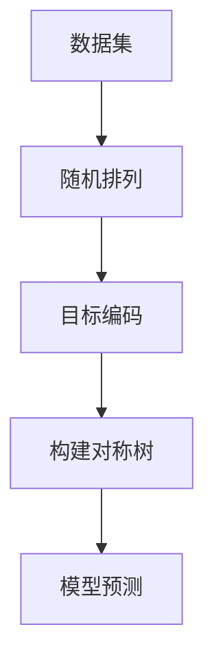

# CatBoost 原理与代码实战案例讲解

## 1.背景介绍

在机器学习领域，梯度提升决策树（Gradient Boosting Decision Trees, GBDT）是一种非常流行且强大的算法。GBDT在处理结构化数据时表现尤为出色，广泛应用于分类、回归等任务中。CatBoost是由Yandex开发的一种基于GBDT的开源算法，专门针对类别特征（Categorical Features）进行了优化。CatBoost不仅在处理类别特征时表现优异，还在防止过拟合和提升模型泛化能力方面有显著优势。

## 2.核心概念与联系

### 2.1 梯度提升决策树（GBDT）

GBDT是一种集成学习方法，通过构建多个决策树并将其结果进行加权平均来提高模型的预测性能。每棵树都是在前一棵树的残差基础上进行训练的，从而逐步减少误差。

### 2.2 类别特征

类别特征是指那些取值为离散类别的特征，如性别、职业等。传统的GBDT算法在处理类别特征时通常需要进行独热编码（One-Hot Encoding），这会导致维度爆炸问题。

### 2.3 CatBoost的独特之处

CatBoost通过一种称为“目标编码”（Target Encoding）的技术来处理类别特征，避免了独热编码带来的维度爆炸问题。此外，CatBoost还引入了对称树（Symmetric Trees）和随机排列（Ordered Boosting）等技术，进一步提升了模型的性能和稳定性。

## 3.核心算法原理具体操作步骤

### 3.1 目标编码

目标编码是指将类别特征转换为其对应目标变量的均值。CatBoost在进行目标编码时，采用了一种基于随机排列的策略，确保编码过程不会引入数据泄露。

### 3.2 对称树

对称树是一种特殊的决策树结构，其左右子树的结构完全对称。这种结构使得树的构建和预测过程更加高效，同时也有助于防止过拟合。

### 3.3 随机排列

CatBoost在训练过程中会对数据进行多次随机排列，并在每次排列后进行目标编码和树的构建。这种策略有效地减少了模型的方差，提高了泛化能力。



## 4.数学模型和公式详细讲解举例说明

### 4.1 目标编码公式

目标编码的基本公式为：

$$
\text{Encoded Value} = \frac{\sum_{i=1}^{n} y_i}{n}
$$

其中，$y_i$ 是第 $i$ 个样本的目标变量，$n$ 是类别特征的样本数量。

### 4.2 对称树构建

对称树的构建过程可以表示为：

$$
\text{Tree Structure} = \text{Symmetric Split}(X, y)
$$

其中，$X$ 是特征矩阵，$y$ 是目标变量。

### 4.3 随机排列策略

随机排列策略的数学表示为：

$$
\text{Random Permutation}(X) = \{X_{\pi(1)}, X_{\pi(2)}, \ldots, X_{\pi(n)}\}
$$

其中，$\pi$ 是一个随机排列函数。

## 5.项目实践：代码实例和详细解释说明

### 5.1 安装CatBoost

首先，我们需要安装CatBoost库：

```bash
pip install catboost
```

### 5.2 数据准备

我们使用一个简单的分类数据集进行演示：

```python
from sklearn.datasets import load_iris
from sklearn.model_selection import train_test_split
import pandas as pd

# 加载数据集
data = load_iris()
df = pd.DataFrame(data.data, columns=data.feature_names)
df['target'] = data.target

# 划分训练集和测试集
train_df, test_df = train_test_split(df, test_size=0.2, random_state=42)
```

### 5.3 模型训练

使用CatBoostClassifier进行模型训练：

```python
from catboost import CatBoostClassifier

# 定义模型
model = CatBoostClassifier(iterations=100, learning_rate=0.1, depth=6)

# 训练模型
model.fit(train_df.drop('target', axis=1), train_df['target'], cat_features=[])

# 预测
predictions = model.predict(test_df.drop('target', axis=1))
```

### 5.4 模型评估

评估模型的性能：

```python
from sklearn.metrics import accuracy_score

# 计算准确率
accuracy = accuracy_score(test_df['target'], predictions)
print(f'Accuracy: {accuracy}')
```

## 6.实际应用场景

CatBoost在多个实际应用场景中表现出色，以下是一些典型的应用场景：

### 6.1 金融风控

在金融风控领域，CatBoost可以用于信用评分、欺诈检测等任务。其对类别特征的处理能力使其在处理客户信息时表现优异。

### 6.2 营销推荐

在营销推荐系统中，CatBoost可以用于用户画像、个性化推荐等任务。其高效的模型训练和预测能力使其能够快速响应用户需求。

### 6.3 医疗诊断

在医疗诊断领域，CatBoost可以用于疾病预测、患者分类等任务。其对数据的高效处理能力使其能够处理大量复杂的医疗数据。

## 7.工具和资源推荐

### 7.1 官方文档

CatBoost的官方文档提供了详细的使用指南和API参考，是学习和使用CatBoost的最佳资源。

[CatBoost官方文档](https://catboost.ai/docs/)

### 7.2 开源项目

以下是一些使用CatBoost的开源项目，供读者参考：

- [Kaggle竞赛项目](https://www.kaggle.com/)
- [GitHub上的CatBoost项目](https://github.com/catboost/catboost)

### 7.3 在线课程

一些在线课程也提供了关于CatBoost的详细讲解：

- [Coursera上的机器学习课程](https://www.coursera.org/)
- [Udacity上的数据科学课程](https://www.udacity.com/)

## 8.总结：未来发展趋势与挑战

CatBoost作为一种强大的GBDT算法，在处理类别特征和防止过拟合方面表现出色。未来，随着数据量的不断增加和应用场景的不断扩展，CatBoost在大数据处理和实时预测方面的性能优化将成为重要的发展方向。同时，如何进一步提升模型的解释性和可解释性也是一个重要的研究课题。

## 9.附录：常见问题与解答

### 9.1 CatBoost与XGBoost、LightGBM的区别是什么？

CatBoost在处理类别特征时具有独特的优势，而XGBoost和LightGBM在处理数值特征时表现更为出色。具体选择哪种算法需要根据具体的应用场景和数据特点来决定。

### 9.2 如何处理缺失值？

CatBoost可以自动处理缺失值，无需进行额外的预处理。用户只需在数据中保留缺失值，CatBoost会在训练过程中自动处理。

### 9.3 如何调参？

CatBoost提供了多种参数供用户调节，如迭代次数、学习率、树的深度等。用户可以通过交叉验证等方法来选择最优参数。

### 9.4 CatBoost是否支持GPU加速？

是的，CatBoost支持GPU加速，可以显著提升模型训练速度。用户只需在定义模型时指定 `task_type='GPU'` 即可。

---

作者：禅与计算机程序设计艺术 / Zen and the Art of Computer Programming