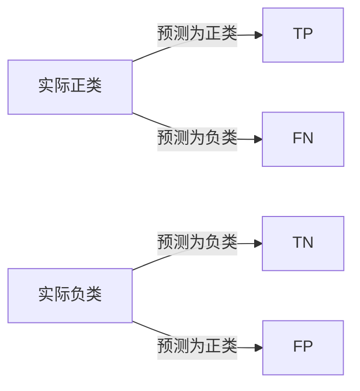

# Confusion Matrix 原理与代码实战案例讲解

## 1. 背景介绍

在机器学习领域，评估分类模型的性能是一个至关重要的步骤。Confusion Matrix（混淆矩阵），作为一种评估分类器性能的工具，它直观地展示了模型预测结果与实际标签之间的关系。通过混淆矩阵，我们可以计算出多种评价指标，如准确率、召回率、精确率和F1分数等，这些指标帮助我们从不同角度理解模型的性能。

## 2. 核心概念与联系

混淆矩阵是一个二维矩阵，用于评估分类模型的性能。它的核心概念包括：

- True Positives (TP): 正确地将正类预测为正类的数量。
- True Negatives (TN): 正确地将负类预测为负类的数量。
- False Positives (FP): 错误地将负类预测为正类的数量。
- False Negatives (FN): 错误地将正类预测为负类的数量。

这些概念之间的联系可以通过以下Mermaid流程图表示：



## 3. 核心算法原理具体操作步骤

构建混淆矩阵的步骤如下：

1. 对于给定的测试数据集，使用分类模型进行预测。
2. 根据预测结果和实际标签，计算TP、TN、FP和FN的数量。
3. 将这些数量填充到混淆矩阵的相应位置。

## 4. 数学模型和公式详细讲解举例说明

混淆矩阵的数学模型可以表示为：

$$
\begin{bmatrix}
TP & FP \\
FN & TN
\end{bmatrix}
$$

基于混淆矩阵，我们可以计算以下评价指标：

- 准确率（Accuracy）: $\frac{TP + TN}{TP + TN + FP + FN}$
- 精确率（Precision）: $\frac{TP}{TP + FP}$
- 召回率（Recall）: $\frac{TP}{TP + FN}$
- F1分数（F1 Score）: $2 \times \frac{Precision \times Recall}{Precision + Recall}$

举例来说，假设一个二分类问题的混淆矩阵如下：

$$
\begin{bmatrix}
50 & 10 \\
5 & 35
\end{bmatrix}
$$

则准确率为 $\frac{50 + 35}{50 + 10 + 5 + 35} = 0.85$，即85%。

## 5. 项目实践：代码实例和详细解释说明

在Python中，我们可以使用`sklearn.metrics`模块中的`confusion_matrix`函数来计算混淆矩阵。以下是一个简单的代码实例：

```python
from sklearn.metrics import confusion_matrix

# 假设y_true是真实标签，y_pred是模型预测的标签
y_true = [1, 0, 1, 1, 0, 1, 0, 0, 1, 1]
y_pred = [1, 0, 1, 0, 0, 1, 1, 0, 1, 0]

# 计算混淆矩阵
cm = confusion_matrix(y_true, y_pred)
print(cm)
```

输出的混淆矩阵可能如下：

```
[[3 1]
 [2 4]]
```

这表示有3个真正类被正确预测，1个假负类被错误预测，2个假正类被错误预测，4个真负类被正确预测。

## 6. 实际应用场景

混淆矩阵在多个领域都有广泛应用，例如医疗诊断、欺诈检测、图像识别和自然语言处理等。在这些领域，混淆矩阵帮助研究人员和工程师评估模型的性能，并调整模型以达到更好的预测效果。

## 7. 工具和资源推荐

- scikit-learn: 提供了计算混淆矩阵的工具。
- TensorFlow和PyTorch: 这两个深度学习框架也提供了构建和评估模型的工具。
- Matplotlib: 用于可视化混淆矩阵。

## 8. 总结：未来发展趋势与挑战

混淆矩阵作为一个基础工具，其未来的发展趋势将与机器学习和人工智能的整体进步紧密相关。随着模型变得更加复杂，如何更好地解释和可视化混淆矩阵，以及如何在不平衡数据集上应用混淆矩阵，将是未来研究的重点和挑战。

## 9. 附录：常见问题与解答

Q1: 混淆矩阵是否只适用于二分类问题？
A1: 不是，混淆矩阵也可以扩展到多分类问题，但矩阵的维度会随着类别数的增加而增加。

Q2: 如何处理不平衡数据集？
A2: 在不平衡数据集上，除了准确率之外，召回率和精确率等指标更能反映模型的性能。可以通过调整分类阈值或使用过采样/欠采样技术来处理不平衡数据。

作者：禅与计算机程序设计艺术 / Zen and the Art of Computer Programming