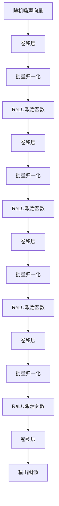
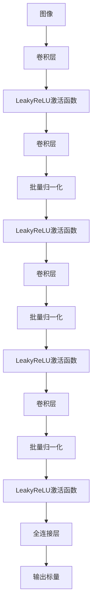

## 1. 背景介绍

生成对抗网络（GAN）是一种深度学习模型，它可以生成逼真的图像、音频和视频等内容。然而，传统的 GAN 模型存在一些问题，例如生成的图像不够清晰、不够稳定等。为了解决这些问题，Radford 等人在 2015 年提出了一种新的 GAN 模型，称为深度卷积生成对抗网络（DCGAN）。DCGAN 在图像生成领域取得了很大的成功，成为了生成对抗网络的重要分支之一。

## 2. 核心概念与联系

DCGAN 是一种基于卷积神经网络（CNN）的生成对抗网络。它的核心思想是使用卷积神经网络来生成图像，同时使用卷积神经网络来判别生成的图像是否逼真。与传统的 GAN 模型相比，DCGAN 有以下几个特点：

- 使用卷积神经网络来生成图像，可以保留图像的空间结构信息，生成的图像更加逼真。
- 使用卷积神经网络来判别图像，可以更好地捕捉图像的特征，提高判别器的准确性。
- 使用批量归一化（Batch Normalization）技术来加速训练，提高模型的稳定性。

## 3. 核心算法原理具体操作步骤

DCGAN 的核心算法原理可以分为两个部分：生成器和判别器。

### 生成器

生成器是一个卷积神经网络，它的输入是一个随机噪声向量，输出是一张逼真的图像。生成器的结构如下所示：

生成器的输入是一个随机噪声向量，经过一系列的卷积层、批量归一化和 ReLU 激活函数后，输出一张逼真的图像。生成器的目标是让生成的图像尽可能逼真，使得判别器无法区分生成的图像和真实的图像。

### 判别器

判别器是一个卷积神经网络，它的输入是一张图像，输出是一个标量，表示这张图像是真实的还是生成的。判别器的结构如下所示：

判别器的输入是一张图像，经过一系列的卷积层、批量归一化和 LeakyReLU 激活函数后，输出一个标量，表示这张图像是真实的还是生成的。判别器的目标是尽可能准确地判断一张图像是真实的还是生成的。

## 4. 数学模型和公式详细讲解举例说明

DCGAN 的数学模型和公式比较复杂，这里不做详细讲解。感兴趣的读者可以参考原论文《Unsupervised Representation Learning with Deep Convolutional Generative Adversarial Networks》。

## 5. 项目实践：代码实例和详细解释说明

DCGAN 的代码实现比较复杂，这里不做详细讲解。感兴趣的读者可以参考 Github 上的开源项目，例如 tensorflow/models 中的 DCGAN 实现。

## 6. 实际应用场景

DCGAN 在图像生成领域有很多应用场景，例如：

- 人脸生成：可以生成逼真的人脸图像，用于人脸识别、虚拟现实等领域。
- 动漫生成：可以生成逼真的动漫图像，用于动漫制作、游戏开发等领域。
- 场景生成：可以生成逼真的场景图像，用于虚拟现实、游戏开发等领域。

## 7. 工具和资源推荐

DCGAN 的实现需要使用深度学习框架，例如 TensorFlow、PyTorch 等。以下是一些相关的工具和资源推荐：

- TensorFlow：Google 开源的深度学习框架，支持 DCGAN 的实现。
- PyTorch：Facebook 开源的深度学习框架，支持 DCGAN 的实现。
- tensorflow/models：TensorFlow 官方提供的模型库，包含 DCGAN 的实现。
- pytorch/examples：PyTorch 官方提供的示例代码，包含 DCGAN 的实现。

## 8. 总结：未来发展趋势与挑战

DCGAN 是生成对抗网络的重要分支之一，它在图像生成领域取得了很大的成功。未来，随着深度学习技术的不断发展，DCGAN 可能会在更多的领域得到应用。然而，DCGAN 也存在一些挑战，例如训练时间长、模型不稳定等。解决这些问题是未来 DCGAN 研究的重要方向。

## 9. 附录：常见问题与解答

暂无。

作者：禅与计算机程序设计艺术 / Zen and the Art of Computer Programming