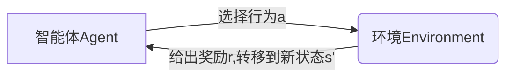
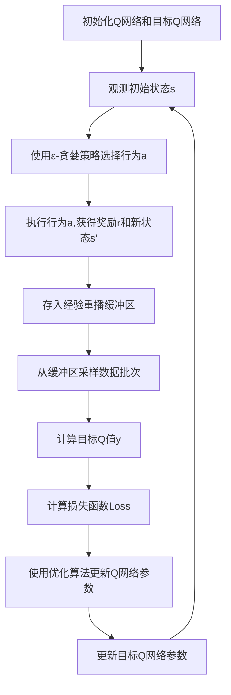

# DQN与经济学的关系：优化决策，提升效率

## 1.背景介绍

在当今快节奏的商业环境中,做出明智的决策对于企业的成功至关重要。传统的决策过程通常依赖于人类专家的经验和直觉,这种方式存在局限性,难以处理复杂的动态环境和大量数据。因此,越来越多的企业开始寻求利用人工智能(AI)技术来优化决策过程,提高效率。其中,强化学习(Reinforcement Learning)作为AI的一个重要分支,为解决这一问题提供了有力的工具。

深度Q网络(Deep Q-Network,DQN)是强化学习中的一种突破性算法,它结合了深度神经网络和Q学习,能够在复杂的环境中学习最优策略。DQN在视频游戏、机器人控制等领域取得了卓越的成绩,但它在经济学领域的应用还相对较新。本文将探讨DQN如何与经济学理论相结合,为企业决策提供新的思路和方法。

### 1.1 经济学决策的挑战

经济学决策问题通常具有以下特点:

1. **动态复杂环境**:市场条件、竞争对手行为等因素都在不断变化,形成了一个动态的决策环境。
2. **高维状态空间**:影响决策的因素众多,如价格、供给、需求等,导致状态空间维度很高。
3. **延迟反馈**:决策的结果通常需要一段时间才能体现,存在延迟反馈的问题。
4. **连续行为空间**:决策变量通常是连续的,如定价、产量等,而非离散的行为选择。

传统的经济学方法如线性规划、动态规划等,在处理这些复杂问题时存在局限性。相比之下,DQN作为一种基于经验的学习方法,能够从数据中自动发现最优策略,更适合应对复杂动态环境。

## 2.核心概念与联系

### 2.1 强化学习与经济学决策

强化学习(Reinforcement Learning)是机器学习的一个重要分支,它研究如何基于环境反馈来学习获取最大化累积奖励的策略。在强化学习中,智能体(Agent)与环境(Environment)进行交互,根据当前状态选择行为,环境则根据这个行为转移到下一个状态,并给出相应的奖励信号。智能体的目标是学习一个策略,使得在给定的环境中获得的长期累积奖励最大化。

强化学习与经济学决策问题有着内在的相似性:企业就相当于智能体,市场环境就是强化学习中的环境。企业根据当前的市场状态做出决策行为,这种行为会影响市场的发展,进而产生反馈(收益或损失),企业的目标就是最大化长期累积收益。

因此,我们可以将经济学决策问题建模为一个强化学习过程,利用强化学习算法来学习最优决策策略。DQN作为强化学习的一种先进算法,具有处理高维状态空间、连续行为空间等优势,非常适合应用于复杂的经济学决策场景。

### 2.2 DQN算法概述

Deep Q-Network(DQN)是第一个将深度神经网络应用到强化学习中的突破性算法,它解决了传统Q学习在处理高维观测数据时的困难。DQN使用一个深度神经网络来近似Q函数,即给定状态s和行为a,预测其对应的Q值Q(s,a)。在训练过程中,DQN从经验重播缓冲区(Experience Replay Buffer)中采样数据进行训练,减少了数据相关性,提高了数据利用效率。同时,它还采用了目标网络(Target Network)的策略,使训练过程更加稳定。

DQN算法的核心思想是使用深度神经网络来逼近Q函数,通过不断从经验中学习,更新网络参数,从而获得最优的Q函数近似,进而导出最优策略。具体来说,DQN算法包括以下几个关键步骤:

1. 初始化Q网络和目标Q网络,两个网络参数相同。
2. 观测当前环境状态s。
3. 使用ε-贪婪策略基于Q网络输出选择行为a。
4. 执行行为a,获得奖励r和新状态s'。
5. 将(s,a,r,s')的经验存入经验重播缓冲区。
6. 从经验重播缓冲区中采样一个数据批次。
7. 计算该批次数据的目标Q值y,使用Q学习的Bellman方程:y = r + γ * max(Q'(s',a'))。其中Q'为目标Q网络。
8. 计算损失函数Loss,如均方误差:Loss = (y - Q(s,a))^2。
9. 使用优化算法(如随机梯度下降)更新Q网络参数,最小化损失函数。
10. 每隔一定步数,使用Q网络的参数更新目标Q网络参数。
11. 重复2-10步,直至收敛。

通过上述过程,DQN算法能够从经验数据中不断学习,逐步逼近最优的Q函数,从而获得最优的决策策略。

## 3.核心算法原理具体操作步骤

在将DQN应用于经济学决策问题之前,我们需要对问题进行建模,将其转化为强化学习的形式。具体步骤如下:

1. **定义状态空间(State Space)**: 状态空间描述了影响决策的所有相关因素,如市场需求、竞争对手行为、原材料价格等。状态空间的设计直接影响了DQN算法的性能和收敛速度。

2. **定义行为空间(Action Space)**: 行为空间包含了智能体可以采取的所有行动,如定价、产量、广告投放等。根据问题的性质,行为空间可以是离散的或连续的。

3. **设计奖励函数(Reward Function)**: 奖励函数定义了智能体所追求的目标,通常与企业的利润或市场份额等指标相关。合理的奖励函数设计对于DQN算法的收敛至关重要。

4. **构建环境模型(Environment Model)**: 环境模型描述了状态与行为之间的转移规则,以及相应的奖励。在现实场景中,我们通常无法获得环境的精确模型,需要使用模拟或历史数据进行近似。

5. **初始化DQN算法**: 根据状态空间和行为空间的维度,初始化DQN算法中的Q网络、目标Q网络和经验重播缓冲区等组件。

6. **生成经验数据**: 在训练的初始阶段,我们可以使用随机策略或一些启发式规则来与环境交互,生成初始的经验数据,存入经验重播缓冲区。

7. **训练DQN算法**: 按照DQN算法的流程,从经验重播缓冲区中采样数据批次,计算目标Q值和损失函数,使用优化算法(如随机梯度下降)更新Q网络参数,不断迭代直至收敛。

8. **评估和改进**: 在训练过程中,我们可以定期评估DQN算法在测试环境中的表现,根据评估结果对状态空间、奖励函数等进行调整和改进,提高算法的性能。

9. **应用于实际决策**: 当DQN算法收敛且性能满足要求时,我们可以将其应用于实际的经济学决策场景,根据当前状态输入,由DQN算法输出相应的最优行为决策。

需要注意的是,DQN算法的训练过程通常需要大量的经验数据和计算资源。在实际应用中,我们可以结合领域知识和经验,对算法进行一定的简化和优化,以提高其效率和可解释性。

## 4.数学模型和公式详细讲解举例说明

### 4.1 Q学习的Bellman方程

Q学习是强化学习中的一种基本算法,它旨在直接学习状态-行为对的价值函数Q(s,a),而不需要估计状态价值函数V(s)。Q(s,a)表示在状态s下执行行为a,之后能获得的最大期望累积奖励。Q学习的核心是基于Bellman方程进行迭代更新,逐步逼近真实的Q函数。

Bellman方程的一般形式为:

$$Q(s_t,a_t) \leftarrow r_t + \gamma \max_{a}Q(s_{t+1},a)$$

其中:
- $s_t$是当前状态
- $a_t$是在状态$s_t$下执行的行为
- $r_t$是执行行为$a_t$后获得的即时奖励
- $\gamma$是折现因子,用于权衡即时奖励和长期累积奖励的权重
- $\max_{a}Q(s_{t+1},a)$是在下一个状态$s_{t+1}$下,所有可能行为a对应的Q值的最大值,表示期望的最大累积奖励

通过不断应用这个方程进行迭代更新,Q函数最终会收敛到真实的Q值。

在DQN算法中,我们使用一个深度神经网络来近似Q函数,将状态s和行为a作为输入,输出对应的Q(s,a)值。在训练过程中,我们使用经验重播缓冲区中的数据批次计算目标Q值y:

$$y = r + \gamma \max_{a'}Q'(s',a')$$

其中Q'是目标Q网络,用于计算下一状态s'下所有可能行为a'对应的Q值的最大值。然后,我们将y作为监督信号,计算与Q网络输出的Q(s,a)之间的损失函数Loss,并使用优化算法(如随机梯度下降)最小化这个损失函数,从而更新Q网络的参数。

通过上述迭代过程,DQN算法能够逐步学习到近似于真实Q函数的Q网络,从而获得最优的决策策略。

### 4.2 经济学决策问题的建模

为了将DQN算法应用于经济学决策问题,我们需要将问题建模为强化学习的形式。以定价决策为例,我们可以构建如下数学模型:

状态空间S:
- 市场需求函数:$D(p) = a - bp$,其中a,b是常数参数
- 竞争对手的价格:$p_c$
- 生产成本:c

因此,状态s可以表示为:$s = (a,b,p_c,c)$

行为空间A:
- 定价决策:$p \in [p_{min}, p_{max}]$,即价格在一定范围内的连续值

奖励函数R:
- 奖励函数可以设计为企业的利润:$R(s,a) = (p - c)D(p)$

在每个决策周期,智能体(企业)根据当前状态s选择定价行为a(p),然后根据市场反应(销量)获得相应的利润奖励R(s,a)。智能体的目标是学习一个最优定价策略$\pi^*(s)$,使得在给定的市场环境下,长期累积利润最大化:

$$\max_{\pi} \mathbb{E}\left[\sum_{t=0}^{\infty}\gamma^tR(s_t,\pi(s_t))\right]$$

其中$\gamma$是折现因子,用于权衡当前利润和未来利润的重要性。

通过上述建模,我们可以将定价决策问题转化为标准的强化学习问题,并应用DQN算法来学习最优定价策略。

### 4.3 DQN算法在经济学决策中的应用

以上一节中的定价决策问题为例,我们可以使用DQN算法来学习最优定价策略,具体步骤如下:

1. **初始化DQN算法**:根据状态空间(a,b,p_c,c)和行为空间(连续定价p)的维度,初始化Q网络