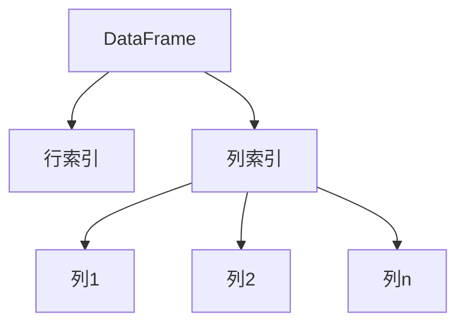

以下是关于"DataFrame原理与代码实例讲解"的技术博客文章正文部分：

# DataFrame原理与代码实例讲解

## 1. 背景介绍

### 1.1 数据分析的重要性

在当今的数据时代，数据分析已经成为各行各业的关键环节。无论是科学研究、商业智能还是政府决策,都离不开对大量数据的收集、整理和分析。有效地处理和理解数据,可以帮助我们发现隐藏的模式、预测未来趋势,并为决策提供有价值的见解。

### 1.2 Python在数据分析中的地位

Python作为一种高级编程语言,具有简洁易学的语法、丰富的库生态和跨平台的特性,使其在数据分析领域占据重要地位。尤其是配合强大的数据分析库,如NumPy、Pandas等,Python已经成为数据科学家和分析师的首选工具之一。

### 1.3 DataFrame在Pandas中的作用

Pandas是Python中最流行的数据分析库之一,它提供了两种关键的数据结构:Series和DataFrame。其中,DataFrame是一种二维的标记数据结构,可以被视为一个表格或Excel电子表格。它使用行索引和列索引来组织数据,非常适合处理结构化(表格式)数据。DataFrame在数据清洗、探索性分析、特征工程等多个环节发挥着重要作用。

## 2. 核心概念与联系

### 2.1 DataFrame的数据结构

DataFrame是一种二维的标记数据结构,可以被看作一个表格或电子表格。它由行索引(index)和列索引(columns)组成,每个列可以存储不同的数据类型(整数、浮点数、字符串等)。



### 2.2 DataFrame与NumPy数组的关系

NumPy是Python中处理数值数据的基础库,它提供了高性能的多维数组对象和相关函数。DataFrame底层依赖于NumPy数组来存储数据,但在此基础上增加了行索引和列索引,使得数据更加结构化和易于操作。

### 2.3 DataFrame与SQL表的类比

可以将DataFrame类比于关系数据库中的表格。它具有行索引(相当于主键)和列索引(相当于字段名),每列存储特定类型的数据(相当于字段值)。这种类比有助于理解DataFrame在处理结构化数据时的优势。

## 3. 核心算法原理具体操作步骤

### 3.1 创建DataFrame

有多种方式可以创建一个DataFrame对象:

1. 从Python字典创建:

```python
import pandas as pd

data = {'Name': ['Alice', 'Bob', 'Charlie'],
        'Age': [25, 30, 35],
        'City': ['New York', 'London', 'Paris']}

df = pd.DataFrame(data)
```

2. 从NumPy数组创建:

```python
import numpy as np
import pandas as pd

data = np.array([[1, 2, 3],
                 [4, 5, 6],
                 [7, 8, 9]])

df = pd.DataFrame(data, columns=['A', 'B', 'C'])
```

3. 从CSV或Excel文件导入:

```python
df = pd.read_csv('data.csv')
df = pd.read_excel('data.xlsx', sheet_name='Sheet1')
```

### 3.2 DataFrame基本操作

1. 查看前几行数据:

```python
df.head(n=5)
```

2. 查看数据类型:

```python
df.dtypes
```

3. 查看基本统计信息:

```python
df.describe()
```

4. 选择特定列:

```python
df['Name']  # 单列
df[['Name', 'Age']]  # 多列
```

5. 选择特定行:

```python
df.iloc[0]  # 第一行
df.iloc[0:3]  # 前三行
```

6. 筛选数据:

```python
df[df['Age'] > 30]
```

7. 处理缺失值:

```python
df.dropna(inplace=True)  # 删除含有缺失值的行
df.fillna(0)  # 用0填充缺失值
```

### 3.3 DataFrame数据操作

1. 添加新列:

```python
df['NewCol'] = df['A'] + df['B']
```

2. 删除列:

```python
df.drop('NewCol', axis=1, inplace=True)
```

3. 重命名列:

```python
df.rename(columns={'A': 'NewA', 'B': 'NewB'}, inplace=True)
```

4. 应用函数:

```python
df['Age'] = df['Age'].apply(lambda x: x + 1)
```

5. 排序:

```python
df.sort_values(by='Age', ascending=False, inplace=True)
```

6. 分组和聚合:

```python
grouped = df.groupby('City')
grouped.mean()
```

### 3.4 DataFrame合并和连接

1. 按行连接:

```python
new_df = pd.concat([df1, df2], ignore_index=True)
```

2. 按列连接:

```python
new_df = pd.concat([df1, df2], axis=1)
```

3. 合并(类似SQL中的JOIN操作):

```python
merged = pd.merge(df1, df2, on='key', how='inner')
```

## 4. 数学模型和公式详细讲解举例说明

在处理DataFrame时,我们经常需要对数据进行一些数学运算和统计分析。Pandas提供了许多内置函数和方法来简化这些操作。

### 4.1 描述性统计

描述性统计是对数据集的基本特征进行总结和量化的过程。DataFrame提供了一些常用的描述性统计函数,如`mean()`、`median()`、`std()`等。

例如,计算一个数值列的平均值和标准差:

```python
df['Age'].mean()  # 计算平均值
df['Age'].std()  # 计算标准差
```

### 4.2 相关性和协方差

相关性和协方差是衡量两个变量之间线性关系强度的指标。在DataFrame中,我们可以使用`corr()`方法计算列之间的相关系数矩阵,使用`cov()`方法计算协方差矩阵。

```python
corr_matrix = df.corr()
cov_matrix = df.cov()
```

### 4.3 线性回归

线性回归是一种常用的监督学习算法,用于建立自变量和因变量之间的线性关系模型。在Pandas中,我们可以使用`statsmodels`库来执行线性回归分析。

假设我们想要建立"年龄"和"收入"之间的线性回归模型,可以使用以下代码:

```python
import statsmodels.api as sm

X = df['Age']
y = df['Income']

X = sm.add_constant(X)  # 添加常数项
model = sm.OLS(y, X).fit()  # 拟合线性模型
print(model.summary())  # 输出回归结果
```

### 4.4 时间序列分析

对于包含时间戳的数据,DataFrame提供了强大的时间序列处理功能。我们可以使用`resample()`方法对时间序列数据进行重采样,并应用各种聚合函数(如`mean()`、`sum()`等)。

```python
# 将'Date'列设置为索引
df = df.set_index('Date')

# 按月重采样,计算每月平均值
monthly_mean = df['Value'].resample('M').mean()
```

## 5. 项目实践: 代码实例和详细解释说明

让我们通过一个实际项目来深入理解DataFrame的使用。我们将分析一个包含多个城市房价数据的数据集,并探索不同城市之间的房价差异。

### 5.1 导入数据

首先,我们需要导入所需的库和数据集。

```python
import pandas as pd

# 读取CSV文件
housing_data = pd.read_csv('housing_data.csv')
```

### 5.2 数据探索

让我们先来了解一下数据集的基本情况。

```python
# 查看前5行数据
print(housing_data.head())

# 获取数据类型
print(housing_data.dtypes)

# 查看基本统计信息
print(housing_data.describe())
```

### 5.3 数据清洗

在进行分析之前,我们需要对数据进行一些清洗和预处理。

```python
# 删除含有缺失值的行
housing_data.dropna(inplace=True)

# 将'Date'列转换为datetime格式
housing_data['Date'] = pd.to_datetime(housing_data['Date'])

# 将'Date'列设置为索引
housing_data = housing_data.set_index('Date')
```

### 5.4 数据分析

现在,我们可以开始对数据进行一些有趣的分析了。

1. 按城市分组,计算每个城市的平均房价:

```python
city_groups = housing_data.groupby('City')
avg_price_by_city = city_groups['Price'].mean()
print(avg_price_by_city)
```

2. 绘制每个城市的房价时间序列图:

```python
import matplotlib.pyplot as plt

city_groups.boxplot(column='Price', by='City', figsize=(10, 6))
plt.title('House Prices by City')
plt.xlabel('City')
plt.ylabel('Price')
plt.show()
```

3. 计算不同城市之间的房价相关性:

```python
corr_matrix = housing_data.groupby('City')['Price'].corr()
print(corr_matrix)
```

### 5.5 结果输出

最后,我们可以将分析结果导出为CSV文件,以供进一步处理或共享。

```python
avg_price_by_city.to_csv('avg_price_by_city.csv')
```

通过这个实例,我们学习了如何使用DataFrame进行数据导入、探索、清洗、分析和可视化。这些技能对于任何数据分析项目都是非常宝贵的。

## 6. 实际应用场景

DataFrame在各个领域的数据分析任务中都有广泛的应用,包括但不限于:

1. **金融分析**: 分析股票、债券、外汇等金融数据,进行投资组合优化、风险管理等。

2. **商业智能**: 处理销售、营销、客户等数据,进行市场分析、用户行为分析等。

3. **科学研究**: 处理实验数据、观测数据,进行统计建模、数据可视化等。

4. **社会科学**: 分析人口、经济、教育等社会数据,探索社会现象背后的规律。

5. **自然语言处理**: 处理文本数据,进行情感分析、主题建模等。

6. **推荐系统**: 分析用户行为数据,为用户推荐个性化的商品或内容。

7. **时间序列分析**: 分析股票走势、天气数据等时间序列数据,进行预测和异常检测。

总的来说,DataFrame提供了一种高效、灵活的方式来处理结构化数据,是数据科学家和分析师的利器。

## 7. 工具和资源推荐

在使用DataFrame进行数据分析时,有一些工具和资源可以为我们提供帮助和支持:

1. **Pandas官方文档**: Pandas的官方文档(https://pandas.pydata.org/docs/)是学习和参考的重要资源,包含了详细的API说明、用户指南和示例代码。

2. **Jupyter Notebook**: Jupyter Notebook是一种交互式计算环境,非常适合数据探索和可视化。它支持多种编程语言,包括Python,并且可以将代码、可视化和解释性文本集成在一个文档中。

3. **NumPy和Matplotlib**: NumPy是Python中处理数值数据的基础库,而Matplotlib则是一个强大的数据可视化库。这两个库与Pandas配合使用,可以大大提高数据分析和可视化的效率。

4. **Scikit-learn**: Scikit-learn是Python中著名的机器学习库,提供了多种监督和无监督学习算法的实现。在数据分析中,我们经常需要使用机器学习算法进行预测或建模。

5. **Stack Overflow和GitHub**: Stack Overflow是一个著名的技术问答社区,而GitHub则是一个开源代码托管平台。在使用Pandas时遇到问题或需要寻找示例代码,这两个平台都是不错的选择。

6. **在线课程和书籍**:网上有许多优质的在线课程和书籍,可以帮助你系统地学习Pandas和数据分析相关知识。例如,Coursera上的"Python for Data Science"课程和Wes McKinney的《Python for Data Analysis》一书都是不错的选择。

掌握这些工具和资源,可以帮助你更高效地使用DataFrame进行数据分析,并不断提升自己的技能。

## 8. 总结: 未来发展趋势与挑战

在总结本文时,让我们思考一下DataFrame在未来的发展趋势和可能面临的挑战。

### 8.1 大数据和分布式计算

随着数据量的不断增长,单机处理能力将面临瓶颈