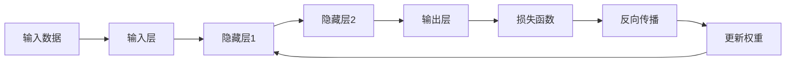
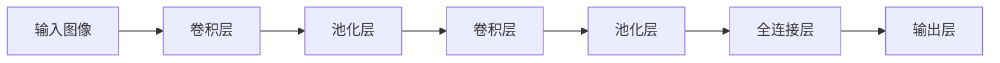
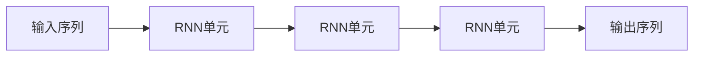
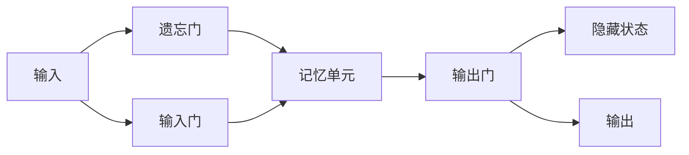
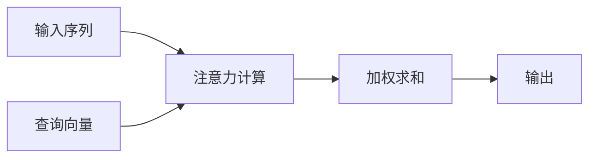
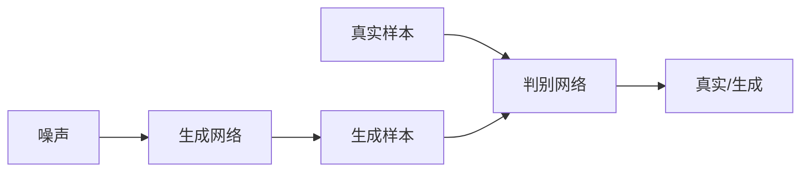

# Deep Learning (DL) 原理与代码实战案例讲解

## 1.背景介绍

深度学习(Deep Learning)是机器学习的一个新的研究热点,它是一种基于对数据进行表征学习的机器学习方法。通过对海量数据的学习,可以自动获取数据的高层次特征表示,并利用这些特征表示对复杂的模式进行预测和决策。近年来,深度学习在语音识别、图像识别、自然语言处理等领域取得了突破性的进展,极大地推动了人工智能技术的发展。

## 2.核心概念与联系

深度学习的核心思想是通过构建神经网络模型对数据进行特征学习,获取数据的高层次抽象特征表示。神经网络模型由多个层次组成,每一层对上一层的输出进行非线性变换,从而学习数据的更加抽象的特征表示。

深度学习主要包括以下几个核心概念:

1. **神经网络(Neural Network)**: 深度学习模型的基本结构,由多个层次组成,每一层对上一层的输出进行非线性变换。
2. **前馈神经网络(Feedforward Neural Network)**: 信号只从输入层向输出层单向传播的神经网络。
3. **卷积神经网络(Convolutional Neural Network, CNN)**: 适用于处理图像、视频等高维度数据的神经网络模型。
4. **循环神经网络(Recurrent Neural Network, RNN)**: 适用于处理序列数据(如文本、语音)的神经网络模型。
5. **长短期记忆网络(Long Short-Term Memory, LSTM)**: 一种特殊的RNN,能够有效解决长期依赖问题。
6. **注意力机制(Attention Mechanism)**: 一种用于加强神经网络模型对重要特征的关注的机制。
7. **生成对抗网络(Generative Adversarial Network, GAN)**: 由生成网络和判别网络组成的无监督学习框架。

这些概念相互关联,构成了深度学习的理论基础和实践方法。

## 3.核心算法原理具体操作步骤

深度学习算法的核心原理包括以下几个方面:

### 3.1 前馈神经网络

前馈神经网络是深度学习的基础模型,它由输入层、隐藏层和输出层组成。每一层由多个神经元组成,每个神经元接收上一层所有神经元的加权输入,经过激活函数后输出到下一层。前馈神经网络的训练过程包括以下步骤:

1. **前向传播**: 输入数据从输入层开始,经过每一层的加权求和和激活函数计算,得到输出层的输出。
2. **计算损失函数**: 将输出层的输出与真实标签进行比较,计算损失函数(如均方误差或交叉熵)。
3. **反向传播**: 根据链式法则,计算每一层权重对损失函数的梯度,并使用优化算法(如梯度下降)更新权重。
4. **迭代训练**: 重复上述步骤,直到模型收敛或达到预设的迭代次数。

### 3.2 卷积神经网络

卷积神经网络(CNN)是处理图像、视频等高维度数据的有效模型。它包括卷积层、池化层和全连接层。卷积层通过滤波器(权重核)对输入数据进行卷积操作,提取局部特征;池化层对卷积结果进行下采样,减少数据量;全连接层对前面层的输出进行综合,得到最终的分类或回归结果。CNN的训练过程与前馈神经网络类似,但需要注意权重共享和局部连接等特性。

### 3.3 循环神经网络

循环神经网络(RNN)适用于处理序列数据,如文本、语音等。它通过引入循环连接,使得当前时刻的输出不仅取决于当前输入,还取决于前一时刻的隐藏状态。这种结构使得RNN能够捕捉序列数据中的长期依赖关系。RNN的训练过程包括以下步骤:

1. **初始化隐藏状态**: 对于序列的第一个时刻,需要初始化隐藏状态。
2. **前向传播**: 计算当前时刻的隐藏状态和输出,并将隐藏状态传递到下一时刻。
3. **计算损失函数**: 将所有时刻的输出与真实标签进行比较,计算损失函数。
4. **反向传播通过时间(BPTT)**: 根据链式法则,计算每一时刻权重对损失函数的梯度,并使用优化算法更新权重。
5. **迭代训练**: 重复上述步骤,直到模型收敛或达到预设的迭代次数。

### 3.4 长短期记忆网络

长短期记忆网络(LSTM)是一种特殊的RNN,它通过引入门控机制和记忆单元,有效解决了RNN在处理长序列时的梯度消失和梯度爆炸问题。LSTM的核心思想是通过门控机制控制信息的流动,从而能够更好地捕捉长期依赖关系。LSTM的训练过程与RNN类似,但需要注意门控机制的计算和更新。

### 3.5 注意力机制

注意力机制是一种用于加强神经网络模型对重要特征的关注的机制。它通过计算输入数据和查询向量之间的相关性分数,对输入数据进行加权求和,从而获得更加关注重要特征的表示。注意力机制广泛应用于机器翻译、图像描述等任务中,能够有效提高模型的性能。

### 3.6 生成对抗网络

生成对抗网络(GAN)是一种无监督学习框架,它由生成网络和判别网络组成。生成网络从噪声分布中采样,生成与真实数据相似的样本;判别网络则试图区分生成的样本和真实样本。通过生成网络和判别网络的对抗训练,生成网络能够逐渐生成更加真实的样本。GAN在图像生成、语音合成等领域有广泛应用。

## 4.数学模型和公式详细讲解举例说明

深度学习中涉及到许多数学模型和公式,下面将详细讲解其中几个重要的部分。

### 4.1 前馈神经网络

前馈神经网络的核心是通过权重矩阵和激活函数对输入数据进行非线性变换。设第$l$层的输入为$\mathbf{x}^{(l)}$,权重矩阵为$\mathbf{W}^{(l)}$,偏置向量为$\mathbf{b}^{(l)}$,激活函数为$f(\cdot)$,则第$l+1$层的输出为:

$$\mathbf{x}^{(l+1)} = f(\mathbf{W}^{(l)}\mathbf{x}^{(l)} + \mathbf{b}^{(l)})$$

常用的激活函数包括sigmoid函数、tanh函数和ReLU函数等。

对于二分类问题,输出层通常使用sigmoid激活函数,将输出映射到(0,1)区间,表示预测为正例的概率。对于多分类问题,输出层通常使用softmax函数,将输出映射到(0,1)区间,表示预测为每一类的概率。

训练过程中,通过反向传播算法计算每一层权重对损失函数的梯度,并使用优化算法(如梯度下降)更新权重。

### 4.2 卷积神经网络

卷积神经网络中,卷积层是核心部分。设输入数据为$\mathbf{X}$,卷积核为$\mathbf{K}$,则卷积操作可表示为:

$$\mathbf{Y}_{i,j} = \sum_{m,n} \mathbf{X}_{i+m,j+n} \cdot \mathbf{K}_{m,n}$$

其中$\mathbf{Y}$为卷积后的特征图。卷积操作能够提取输入数据的局部特征,并通过权重共享和局部连接减少参数量。

池化层通常使用最大池化或平均池化操作,对卷积后的特征图进行下采样,减少数据量和计算量。

### 4.3 循环神经网络

循环神经网络中,隐藏状态$\mathbf{h}_t$的计算公式为:

$$\mathbf{h}_t = f(\mathbf{W}_{hh}\mathbf{h}_{t-1} + \mathbf{W}_{xh}\mathbf{x}_t + \mathbf{b}_h)$$

其中$\mathbf{W}_{hh}$为隐藏层到隐藏层的权重矩阵,$\mathbf{W}_{xh}$为输入层到隐藏层的权重矩阵,$\mathbf{b}_h$为偏置向量,$f(\cdot)$为激活函数。

输出$\mathbf{y}_t$的计算公式为:

$$\mathbf{y}_t = g(\mathbf{W}_{yh}\mathbf{h}_t + \mathbf{b}_y)$$

其中$\mathbf{W}_{yh}$为隐藏层到输出层的权重矩阵,$\mathbf{b}_y$为偏置向量,$g(\cdot)$为输出层的激活函数(如softmax)。

### 4.4 长短期记忆网络

LSTM通过引入门控机制和记忆单元,能够有效捕捉长期依赖关系。设$\mathbf{x}_t$为当前时刻的输入,$\mathbf{h}_{t-1}$为上一时刻的隐藏状态,$\mathbf{c}_{t-1}$为上一时刻的记忆单元,则LSTM的计算过程如下:

1. 遗忘门: $\mathbf{f}_t = \sigma(\mathbf{W}_f\cdot[\mathbf{h}_{t-1}, \mathbf{x}_t] + \mathbf{b}_f)$
2. 输入门: $\mathbf{i}_t = \sigma(\mathbf{W}_i\cdot[\mathbf{h}_{t-1}, \mathbf{x}_t] + \mathbf{b}_i)$
3. 记忆单元候选值: $\tilde{\mathbf{c}}_t = \tanh(\mathbf{W}_c\cdot[\mathbf{h}_{t-1}, \mathbf{x}_t] + \mathbf{b}_c)$
4. 记忆单元: $\mathbf{c}_t = \mathbf{f}_t \odot \mathbf{c}_{t-1} + \mathbf{i}_t \odot \tilde{\mathbf{c}}_t$
5. 输出门: $\mathbf{o}_t = \sigma(\mathbf{W}_o\cdot[\mathbf{h}_{t-1}, \mathbf{x}_t] + \mathbf{b}_o)$
6. 隐藏状态: $\mathbf{h}_t = \mathbf{o}_t \odot \tanh(\mathbf{c}_t)$

其中$\sigma$为sigmoid函数,$\odot$为元素wise乘积。通过门控机制,LSTM能够灵活地控制信息的流动,从而有效捕捉长期依赖关系。

### 4.5 注意力机制

注意力机制通过计算查询向量$\mathbf{q}$和键向量$\mathbf{K}$之间的相关性分数,对值向量$\mathbf{V}$进行加权求和