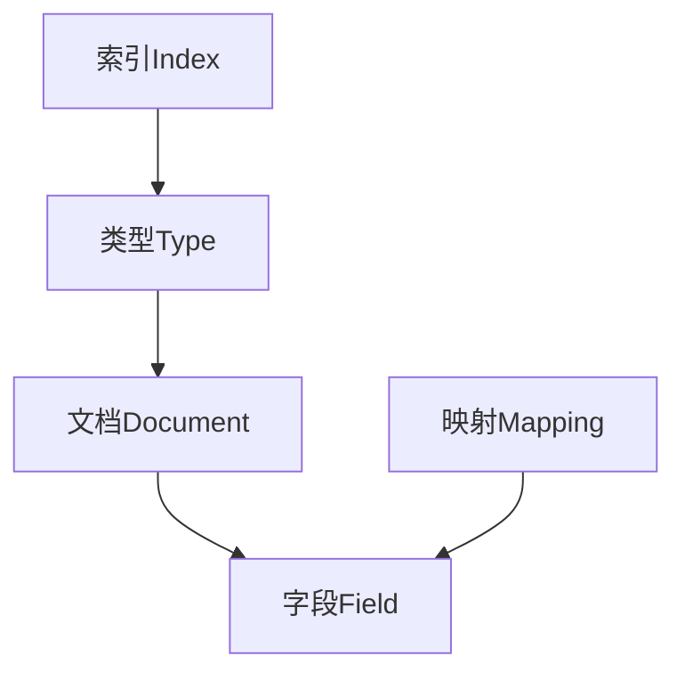

# ElasticSearch Mapping原理与代码实例讲解

## 1.背景介绍

在当今大数据时代,海量数据的存储和高效检索成为了一个巨大的挑战。Elasticsearch作为一个分布式、RESTful风格的搜索和数据分析引擎,凭借其高性能、高可用、易扩展等优势,成为了处理大规模数据的不二之选。其中,Mapping作为Elasticsearch的核心概念之一,对于数据的建模、索引和搜索起着至关重要的作用。

Elasticsearch Mapping可以被视为关系型数据库中的Schema定义,它定义了文档及其包含的字段的结构。正确地设置Mapping不仅能够提高搜索性能,还可以支持更丰富的数据操作和聚合分析。然而,由于Mapping的复杂性和灵活性,很多开发人员在实际应用中容易产生困惑和误解,导致数据建模不当,搜索效率低下等问题。

因此,深入理解Elasticsearch Mapping的原理和最佳实践就显得尤为重要。本文将全面解析Mapping的工作原理、核心概念和算法,并结合大量实例代码,为读者提供一个清晰的Mapping知识体系,帮助开发人员更好地利用Elasticsearch的强大功能,构建高效、可扩展的搜索和数据分析应用。

## 2.核心概念与联系

在深入探讨Mapping的原理之前,我们需要先了解一些核心概念及其之间的关联。

### 2.1 索引(Index)

索引是Elasticsearch中的一个逻辑数据空间,用于存储相关的文档。它类似于关系型数据库中的"数据库"概念。每个索引都有自己的Mapping定义,用于确定如何对文档中的字段进行建模和索引。

### 2.2 类型(Type)

类型是索引中的逻辑数据分区,用于对文档进行分类和组织。一个索引可以包含多个类型,每个类型都有自己的Mapping定义。需要注意的是,从Elasticsearch 6.x版本开始,每个索引只允许存在一个类型,因此在新版本中,类型的概念已被弃用。

### 2.3 文档(Document)

文档是Elasticsearch中的基本数据单元,类似于关系型数据库中的"行"概念。每个文档都属于一个索引和一个类型,并由一组键值对组成,其中键表示字段名,值表示字段值。

### 2.4 字段(Field)

字段是文档中的属性,类似于关系型数据库中的"列"概念。每个字段都有自己的数据类型和映射规则,用于确定如何对字段值进行索引和存储。

### 2.5 映射(Mapping)

映射定义了索引中文档的结构,包括文档中字段的名称、数据类型、索引方式等信息。Mapping可以在创建索引时显式定义,也可以由Elasticsearch自动推导。正确的Mapping设置对于搜索性能和数据操作至关重要。

这些核心概念之间的关系如下所示:



## 3.核心算法原理具体操作步骤

### 3.1 Mapping的生命周期

Mapping的生命周期包括以下几个阶段:

1. **创建阶段**: 在创建新索引时,可以显式定义Mapping,也可以让Elasticsearch根据第一批文档自动推导Mapping。
2. **更新阶段**: 在索引已经存在的情况下,可以通过API动态更新Mapping。但是,只能添加新的字段映射,不能修改或删除已有字段的映射。
3. **合并阶段**: 当新文档被索引时,Elasticsearch会将新文档的字段映射与现有Mapping进行合并,以确保所有字段都被正确地映射。
4. **查询阶段**: 在搜索和聚合操作中,Elasticsearch会根据Mapping来解析查询,并对字段进行相应的处理和过滤。

### 3.2 自动映射机制

如果在创建索引时没有显式定义Mapping,Elasticsearch会根据第一批索引的文档自动推导出Mapping。自动映射的过程如下:

1. Elasticsearch会检查新文档中每个字段的数据类型,并尝试将其映射为合适的核心数据类型,例如`text`、`keyword`、`date`等。
2. 如果无法确定字段的数据类型,Elasticsearch会将其映射为`object`类型。
3. 对于嵌套对象或数组,Elasticsearch会递归地处理其中的字段,并为每个字段创建相应的映射。
4. 自动映射的规则可以通过动态映射模板(Dynamic Mapping Templates)进行定制。

虽然自动映射机制提供了便利,但是手动定义Mapping通常更加可取,因为它可以确保映射的准确性和一致性,并提供更多的优化选项。

### 3.3 字段数据类型

Elasticsearch支持多种字段数据类型,每种类型都有自己的索引和搜索行为。常见的字段数据类型包括:

- **核心数据类型**:
  - `text`: 用于全文搜索的文本数据。
  - `keyword`: 用于结构化的字符串字段,不会被分词,适合用于过滤、排序和聚合。
  - `date`: 用于日期和时间数据。
  - `long`、`integer`、`short`、`byte`、`double`、`float`: 用于数值数据。
  - `boolean`: 用于布尔值。
- **复合数据类型**:
  - `object`: 用于嵌套的JSON对象。
  - `nested`: 用于嵌套的对象数组,支持对象内部进行独立的查询和评分。
- **其他数据类型**:
  - `geo_point`、`geo_shape`: 用于地理位置和形状数据。
  - `ip`: 用于IPv4和IPv6地址。
  - `completion`: 用于自动补全建议。
  - `token_count`: 用于统计字段中的词条数量。

正确选择字段数据类型对于搜索性能和数据准确性至关重要。例如,对于需要进行全文搜索的字段,应该使用`text`类型;对于需要进行排序或聚合的字段,应该使用`keyword`类型。

### 3.4 映射参数

除了字段数据类型之外,Mapping还支持许多其他参数用于定制字段的索引和搜索行为,例如:

- `index`: 控制字段是否应该被索引,可选值为`true`(索引和查询)、`false`(不索引)或`not_analyzed`(索引但不分词)。
- `analyzer`: 指定在索引和搜索时使用的分词器。
- `normalizer`: 指定在索引和搜索时使用的规范化器。
- `fields`: 为同一个字段定义多种不同的映射方式,例如一个用于全文搜索,另一个用于排序和聚合。
- `copy_to`: 将字段值复制到另一个"组合字段",以支持跨字段搜索。
- `ignore_above`: 忽略超过指定长度的字段值。
- `null_value`: 指定如何处理null值。
- `properties`: 用于定义嵌套对象或数组中字段的映射。

通过合理配置这些参数,可以根据具体的业务需求优化字段的索引和搜索行为,从而提高搜索性能和数据质量。

## 4.数学模型和公式详细讲解举例说明

在Elasticsearch中,有一些核心算法和数学模型用于评分和排名,对搜索结果的质量和相关性有着重要影响。下面我们将详细介绍其中的两个关键算法:TF-IDF和BM25。

### 4.1 TF-IDF算法

TF-IDF(Term Frequency-Inverse Document Frequency)是一种常用的信息检索算法,用于评估一个词条对于一个文档或语料库的重要程度。TF-IDF分数由两部分组成:

1. **词频(Term Frequency, TF)**: 描述词条在文档中出现的频率。常用的计算公式为:

$$
TF(t,d) = \frac{f_{t,d}}{\sqrt{\sum_{t' \in d} f_{t',d}^2}}
$$

其中,$ f_{t,d} $表示词条t在文档d中出现的次数,分母是文档d中所有词条的平方和的平方根,用于归一化。

2. **逆向文档频率(Inverse Document Frequency, IDF)**: 描述词条在整个语料库中的稀有程度。常用的计算公式为:

$$
IDF(t,D) = \log \frac{1 + N}{1 + n_t} + 1
$$

其中,N是语料库中文档的总数,$ n_t $是包含词条t的文档数量。

最终,TF-IDF分数可以通过将TF和IDF相乘得到:

$$
\text{TF-IDF}(t,d,D) = TF(t,d) \times IDF(t,D)
$$

TF-IDF算法的核心思想是,如果一个词条在文档中出现频率越高,且在语料库中出现的文档越少,那么这个词条对该文档就越重要。因此,TF-IDF可以有效地捕捉文档中重要的词条,并据此评估文档与查询之间的相关性。

### 4.2 BM25算法

BM25(Best Matching 25)是一种改进的评分算法,它基于TF-IDF,但引入了一些新的因素,旨在更好地评估文档与查询之间的相关性。BM25算法的公式如下:

$$
\text{Score}(D,Q) = \sum_{q \in Q} \text{IDF}(q) \cdot \frac{f(q,D) \cdot (k_1 + 1)}{f(q,D) + k_1 \cdot (1 - b + b \cdot \frac{|D|}{avgdl})}
$$

其中:

- $D$表示文档,Q表示查询。
- $f(q,D)$表示查询词q在文档D中出现的词频。
- $|D|$表示文档D的长度(词条数量)。
- $avgdl$表示语料库中所有文档的平均长度。
- $k_1$和$b$是可调节的参数,用于控制词频和文档长度对评分的影响。

BM25算法引入了以下改进:

1. **词频饱和**: 通过分母中的 $k_1$ 参数,可以控制词频对评分的影响,避免高词频导致的过度影响。
2. **文档长度归一化**: 通过分母中的 $b$ 参数和文档长度项,对较长文档的评分进行适当地惩罚,避免长文档过度占优。
3. **查询词权重**: 通过 $IDF(q)$ 项,对稀有查询词赋予更高的权重,提高其对评分的影响。

BM25算法综合了多个因素,能够更准确地评估文档与查询之间的相关性,因此被广泛应用于Elasticsearch和其他搜索引擎中。通过合理调节 $k_1$ 和 $b$ 参数,可以进一步优化算法的性能。

## 5.项目实践:代码实例和详细解释说明

接下来,我们将通过一个实际的项目示例,演示如何在Elasticsearch中定义和使用Mapping。我们将构建一个简单的电子商务网站,其中包括产品、订单和评论等数据。

### 5.1 创建索引和Mapping

首先,我们需要创建一个名为"products"的索引,并为其定义Mapping。以下是使用Elasticsearch Java高级REST客户端的示例代码:

```java
// 创建索引请求
CreateIndexRequest request = new CreateIndexRequest("products");

// 定义Mapping
XContentBuilder mappingBuilder = JsonXContent.contentBuilder();
mappingBuilder.startObject();
{
    mappingBuilder.startObject("properties");
    {
        mappingBuilder.startObject("name");
        {
            mappingBuilder.field("type", "text");
            mappingBuilder.field("analyzer", "english");
        }
        mappingBuilder.endObject();

        mappingBuilder.startObject("description");
        {
            mappingBuilder.field("type", "text");
            mappingBuilder.field("analyzer", "english");
        }
        mappingBuilder.endObject();

        mappingBuilder.startObject("price");
        {
            mappingBuilder.field("type", "double");
        }
        mappingBuilder.endObject();

        mappingBuilder.startObject("categories");
        {
            mappingBuilder.field("type", "keyword");
        }
        mappingBuilder.endObject();

        mappingBuilder.startObject("tags");
        {
            mappingBuilder.field("type", "keyword");
        }
        mappingBuilder.endObject();
    }
    mappingBuilder.endObject();
}
mappingBuilder.endObject();

// 设置Mapping
request.mapping(mappingBuilder);

// 创建索引
CreateIndexResponse response = client.indices().create(request, RequestOptions.DEFAULT);
```

在上面的示例中,我们定义了以下字段映射:

-