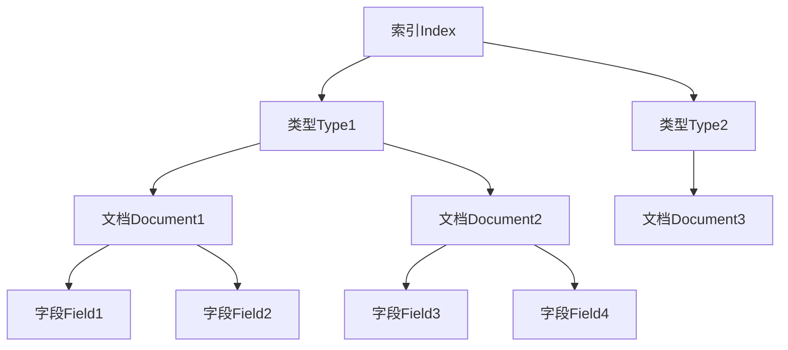
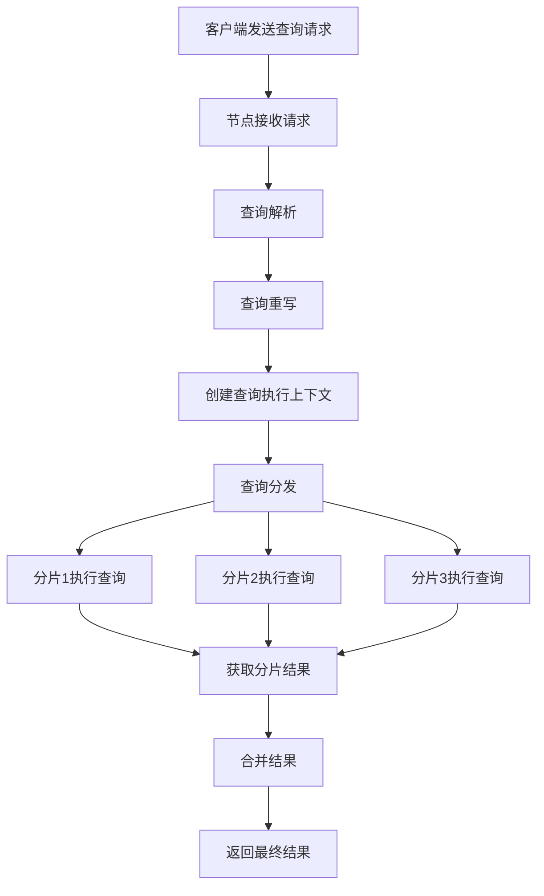

# ElasticSearch原理与代码实例讲解

## 1.背景介绍

### 1.1 什么是ElasticSearch

ElasticSearch是一个分布式、RESTful风格的搜索和数据分析引擎,它是用于实时搜索、数据分析和探索大量数据的分布式搜索引擎。它可以近乎实时地存储、搜索和分析大量数据。它被用于全文搜索、结构化搜索、分析以及将这三者混合使用。

ElasticSearch是一个建立在Apache Lucene基础之上的开源搜索引擎,由Elastic公司开发和维护。它扩展了Lucene的分布式特性,提供了分布式多用户能力,具有高可用、高可扩展、分布式、多租户等特性。

### 1.2 ElasticSearch的应用场景

ElasticSearch广泛应用于不同领域,主要包括:

- 全文搜索和站内搜索
- 日志分析和监控
- 指标分析和业务智能
- 安全分析和SIEM
- 应用程序性能监控
- 地理位置和地理空间数据分析
- 电商网站商品搜索和推荐
- 企业知识库搜索

### 1.3 ElasticSearch的优势

ElasticSearch具有以下主要优势:

- 分布式:支持分布式集群部署,可以扩展到上百台服务器,处理PB级数据
- 高性能:基于Lucene,支持近实时搜索,每秒可以处理数百万级别的搜索请求
- 高可用:支持主备模式,某个节点出现问题不会影响集群的工作
- 多租户:支持多租户模式,适合作为大数据集群来使用
- 易于集成:提供RESTful API,支持多种语言集成

## 2.核心概念与联系

### 2.1 核心概念

ElasticSearch中有一些核心概念需要理解:

- 索引(Index):相当于关系型数据库中的数据库,用于存储相关数据
- 类型(Type):索引中的逻辑数据分类,相当于关系型数据库的表
- 文档(Document):ElasticSearch存储数据的基本单元,相当于关系型数据库的一行数据
- 字段(Field):文档中的属性,相当于关系型数据库的列

### 2.2 核心概念间的关系

ElasticSearch中的关系可以用下图表示:



从上图可以看出:

- 一个索引可以包含多个类型
- 一个类型包含多个文档
- 一个文档包含多个字段

## 3.核心算法原理具体操作步骤 

### 3.1 倒排索引原理

ElasticSearch的核心是建立在Lucene的倒排索引之上的。倒排索引是文档搜索系统中常用的数据结构,用于从文档中搜索单词或词组。

倒排索引的基本思想是:

1. 将文档集合的所有单词构建一个索引,单词作为索引的关键字
2. 对于每个单词,记录下它出现的文档列表
3. 查询时,根据查询单词,获取相应的文档列表,对文档列表进行合并、排序等运算

例如,有两个文档:

```
文档1: 我是程序员
文档2: 我爱编程
```

构建倒排索引后:

```
我 -> 文档1, 文档2
是 -> 文档1 
程序员 -> 文档1
爱 -> 文档2
编程 -> 文档2
```

查询"程序员"时,直接获取"程序员"对应的文档列表即可。

### 3.2 分布式架构原理

ElasticSearch采用分布式架构,可以横向扩展,支持PB级数据。它的分布式架构主要包括:

- 集群(Cluster):一个或多个节点的集合
- 节点(Node):单个ElasticSearch实例
- 分片(Shard):索引的数据分片,支持水平扩展
- 副本(Replica):每个分片的副本,提高可用性

ElasticSearch通过分片和副本来实现数据的分布式存储和高可用,其工作原理如下:

1. 将索引数据分散到多个分片中
2. 每个分片可以有多个副本,副本分布在不同节点
3. 查询时,将请求发送给任意节点,由协调节点分发请求到相关分片
4. 合并分片结果,最终返回查询结果

这种分布式架构使ElasticSearch具有高可扩展性和高可用性。

### 3.3 查询处理流程

ElasticSearch查询处理的主要流程包括:

1. **查询解析**:接收查询请求,解析查询语句
2. **查询重写**:优化查询,如去除无用语句
3. **创建查询执行上下文**:包括创建Scorer、Filter等组件
4. **查询分发**:将查询发送到相关分片
5. **查询执行**:在每个分片上执行查询
6. **获取分片结果**:从每个分片获取查询结果
7. **合并结果**:合并所有分片结果为最终结果
8. **返回结果**:将最终结果返回给客户端

查询处理流程如下图所示:



## 4.数学模型和公式详细讲解举例说明

### 4.1 相关性评分

在ElasticSearch中,每个查询结果都会计算一个相关性评分,用于对结果进行排序。相关性评分的计算公式如下:

$$
score(q,d)  = \sum_{t \in q} \underbrace{tfidf(t,d)}_\text{Term Statistics} \cdot \underbrace{idf(t)^2}_\text{Term Importance} \cdot \underbrace{\frac{queryNorm}{queryNorm + docNorm}}_\text{Normalization Factor}
$$

其中:

- $t$ 表示查询语句中的词项(term)
- $tfidf(t,d)$ 表示词项 $t$ 在文档 $d$ 中的TF-IDF值
- $idf(t)$ 表示词项 $t$ 的逆文档频率(Inverse Document Frequency)
- $queryNorm$ 和 $docNorm$ 分别表示查询语句和文档向量的范数,用于归一化

TF-IDF的计算公式为:

$$
tfidf(t,d) = tf(t,d) \cdot idf(t)
$$

其中:

- $tf(t,d)$ 表示词项 $t$ 在文档 $d$ 中的词频(Term Frequency)
- $idf(t) = 1 + log\frac{N}{df(t)}$,表示词项 $t$ 的逆文档频率,其中 $N$ 是总文档数,$df(t)$ 是包含词项 $t$ 的文档数

通过上述公式,ElasticSearch可以计算每个文档与查询语句的相关性评分,并按评分对结果进行排序。

### 4.2 向量空间模型

ElasticSearch采用向量空间模型(Vector Space Model)来计算文档与查询的相似度。

在向量空间模型中,每个文档和查询都被表示为一个向量,其中每个维度对应一个词项,向量的值表示该词项的权重。文档向量和查询向量的夹角的余弦值就是它们的相似度。

设文档向量为 $\vec{d}=(w_1,w_2,...,w_n)$,查询向量为 $\vec{q}=(q_1,q_2,...,q_n)$,则文档与查询的相似度为:

$$
sim(\vec{d},\vec{q}) = \frac{\vec{d} \cdot \vec{q}}{|\vec{d}||\vec{q}|} = \frac{\sum_{i=1}^{n}w_iq_i}{\sqrt{\sum_{i=1}^{n}w_i^2}\sqrt{\sum_{i=1}^{n}q_i^2}}
$$

其中 $\vec{d} \cdot \vec{q}$ 表示向量点乘,$|\vec{d}|$ 和 $|\vec{q}|$ 分别表示向量的范数。

通过计算文档向量和查询向量的相似度,ElasticSearch可以找到与查询最相关的文档。

## 5.项目实践:代码实例和详细解释说明

本节将通过Java代码示例,演示如何使用ElasticSearch Java客户端进行基本的索引、搜索和聚合操作。

### 5.1 创建ElasticSearch客户端

首先,需要创建ElasticSearch的Java客户端对象:

```java
// 创建RestHighLevelClient客户端
RestHighLevelClient client = new RestHighLevelClient(
    RestClient.builder(
        new HttpHost("localhost", 9200, "http")));
```

### 5.2 创建索引

创建一个名为"books"的索引,包含"title"和"content"两个字段:

```java
// 创建索引请求
CreateIndexRequest request = new CreateIndexRequest("books");
// 配置映射
request.mapping(
    "{\n" +
    "   \"properties\": {\n" +
    "       \"title\": {\n" +
    "           \"type\": \"text\"\n" +
    "       },\n" +
    "       \"content\": {\n" +
    "           \"type\": \"text\"\n" +
    "       }\n" +
    "   }\n" +
    "}",
    XContentType.JSON);

// 发送请求创建索引
CreateIndexResponse createIndexResponse = client.indices().create(request, RequestOptions.DEFAULT);
```

### 5.3 索引文档

向"books"索引中添加一些文档:

```java
// 构建文档源
XContentBuilder source = XContentFactory.jsonBuilder()
    .startObject()
        .field("title", "ElasticSearch服务器开发")
        .field("content", "ElasticSearch是一个分布式搜索引擎...")
    .endObject();

// 创建索引请求
IndexRequest indexRequest = new IndexRequest("books")
    .source(source);

// 发送请求索引文档
IndexResponse indexResponse = client.index(indexRequest, RequestOptions.DEFAULT);
```

### 5.4 搜索文档

执行一个搜索查询,查找标题包含"ElasticSearch"的文档:

```java
// 构建搜索请求
SearchRequest searchRequest = new SearchRequest("books");
SearchSourceBuilder sourceBuilder = new SearchSourceBuilder()
    .query(QueryBuilders.matchQuery("title", "ElasticSearch"));
searchRequest.source(sourceBuilder);

// 发送搜索请求
SearchResponse searchResponse = client.search(searchRequest, RequestOptions.DEFAULT);

// 处理搜索结果
SearchHits hits = searchResponse.getHits();
for (SearchHit hit : hits) {
    String index = hit.getIndex();
    String id = hit.getId();
    Map<String, Object> sourceMap = hit.getSourceAsMap();
    System.out.println("Index: " + index + ", Id: " + id);
    System.out.println("Source: " + sourceMap);
}
```

### 5.5 聚合分析

执行一个聚合分析,统计每个标题的文档数量:

```java
// 构建聚合请求
SearchRequest searchRequest = new SearchRequest("books");
SearchSourceBuilder sourceBuilder = new SearchSourceBuilder()
    .aggregation(AggregationBuilders.terms("titles")
        .field("title")
        .size(10));
searchRequest.source(sourceBuilder);

// 发送聚合请求
SearchResponse searchResponse = client.search(searchRequest, RequestOptions.DEFAULT);

// 处理聚合结果
Terms terms = searchResponse.getAggregations().get("titles");
for (Terms.Bucket bucket : terms.getBuckets()) {
    String title = bucket.getKeyAsString();
    long count = bucket.getDocCount();
    System.out.println("Title: " + title + ", Count: " + count);
}
```

以上代码示例演示了如何使用ElasticSearch Java客户端进行基本的索引、搜索和聚合操作。在实际项目中,您可以根据需求进行扩展和定制。

## 6.实际应用场景

ElasticSearch广泛应用于各种场景,下面列举了一些常见的应用场景:

### 6.1 电商网站商品搜索

在电商网站中,ElasticSearch可以用于实现高效的商品搜索功能。用户可以根据商品名称、类别、价格等条件进行搜索,ElasticSearch会快速返回相关商品列