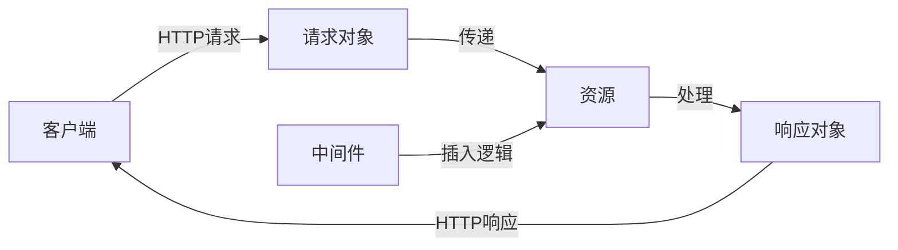

## 1. 背景介绍

在当今的软件开发领域，高性能和高并发是衡量Web服务框架的重要指标。Falcon作为一个轻量级的Web框架，它以其快速、高效的特性在Python社区中获得了广泛的关注。Falcon遵循REST架构风格，专为构建APIs而设计，它的设计哲学是尽可能少地增加CPU和内存的开销，从而提供出色的性能。

## 2. 核心概念与联系

Falcon框架的核心概念包括资源（Resource）、请求（Request）、响应（Response）和中间件（Middleware）。资源是对API提供的服务的抽象，每个资源都会对应一组HTTP方法，如GET、POST等。请求和响应对象分别封装了HTTP请求和响应的信息。中间件则提供了在请求响应周期的不同阶段插入自定义逻辑的能力。



## 3. 核心算法原理具体操作步骤

Falcon的核心算法原理是基于WSGI标准，通过一个高效的路由系统将客户端的请求分发到相应的资源上。具体操作步骤如下：

1. 客户端发起HTTP请求。
2. Falcon的WSGI服务器接收请求，创建请求对象。
3. 请求对象通过路由系统被分发到对应的资源。
4. 资源调用相应的HTTP方法处理请求，并创建响应对象。
5. 响应对象经过中间件的处理后，返回给客户端。

## 4. 数学模型和公式详细讲解举例说明

Falcon的性能优化可以用时间复杂度来分析。假设路由系统的查找效率为O(log n)，中间件处理的时间复杂度为O(m)，资源处理请求的时间复杂度为O(k)。那么，整个请求处理的时间复杂度为O(log n + m + k)。

$$ T_{总} = T_{路由} + T_{中间件} + T_{资源} $$
$$ T_{总} = O(log n) + O(m) + O(k) $$

其中，$T_{总}$ 是处理一个请求的总时间，$T_{路由}$ 是路由查找时间，$T_{中间件}$ 是中间件处理时间，$T_{资源}$ 是资源处理时间。

## 5. 项目实践：代码实例和详细解释说明

以下是一个简单的Falcon应用实例：

```python
import falcon

class HelloWorldResource:
    def on_get(self, req, resp):
        resp.media = {'message': 'Hello World!'}

app = falcon.App()
hello_world_resource = HelloWorldResource()
app.add_route('/hello', hello_world_resource)
```

在这个例子中，我们定义了一个资源`HelloWorldResource`，它有一个`on_get`方法来处理GET请求。我们创建了一个Falcon应用实例，并将`/hello`路径与`HelloWorldResource`关联起来。

## 6. 实际应用场景

Falcon适用于需要高性能和高并发处理的Web API项目。例如，在云计算服务、大数据分析、物联网（IoT）和移动后端服务中，Falcon都能提供快速响应和高效的服务。

## 7. 工具和资源推荐

- WSGI服务器：Gunicorn、uWSGI
- 数据库：SQLAlchemy、MongoEngine
- 测试工具：pytest、tox
- 性能分析：cProfile、line_profiler

## 8. 总结：未来发展趋势与挑战

随着Web服务的不断演进，Falcon也在不断地更新和改进。未来的发展趋势可能包括对异步编程的支持、更丰富的中间件生态系统以及更好的集成工具。同时，随着Web安全和隐私保护的重视，Falcon也面临着如何在保持性能的同时，加强安全性的挑战。

## 9. 附录：常见问题与解答

Q1: Falcon与Flask、Django等框架有何不同？
A1: Falcon专注于API的构建，性能更优，但不提供像Flask、Django那样的全栈功能。

Q2: Falcon是否支持异步编程？
A2: Falcon目前主要支持同步编程模式，但可以通过与异步服务器如ASGI结合使用来支持异步编程。

Q3: 如何在Falcon中处理大型文件上传？
A3: Falcon提供了流式请求处理功能，可以有效地处理大型文件上传，避免内存溢出。

作者：禅与计算机程序设计艺术 / Zen and the Art of Computer Programming