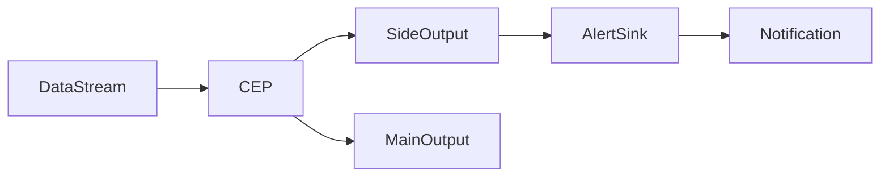

# FlinkCEP监控与告警：实时掌握应用状态

## 1. 背景介绍
### 1.1 实时计算的重要性
在当今大数据时代,企业需要实时处理海量数据,快速洞察业务趋势,及时响应市场变化。实时计算已成为企业数字化转型的关键技术之一。Flink作为新一代大数据实时计算引擎,凭借其低延迟、高吞吐、exactly-once语义保证等优势,在实时计算领域备受青睐。
### 1.2 Flink CEP简介
Flink CEP (Complex Event Processing)是Flink提供的复杂事件处理库,它允许在无界的事件流中检测事件模式,实现复杂事件处理。CEP可以帮助我们从大量的实时数据中发现有价值的信息,用于异常检测、业务监控等场景。
### 1.3 监控告警的必要性
对于实时计算应用而言,及时发现异常,快速定位和解决问题至关重要。没有完善的监控告警机制,一旦出现数据积压、延迟飙升等异常情况,就会影响到下游的业务。因此,构建一套完善的Flink CEP监控告警系统势在必行。

## 2. 核心概念与联系
### 2.1 Flink CEP 核心概念
- Event: 事件,即输入的数据
- Pattern: 模式,由一个或多个事件组成,用于定义要检测的复杂事件
- Pattern Sequence: 模式序列,定义事件之间的时序关系
- Pattern Operator: 模式操作符,如 followedBy, where, within 等,用于组合事件形成复杂模式
### 2.2 监控告警相关概念 
- Metric: 度量指标,如延迟、吞吐量、资源利用率等
- Threshold: 阈值,定义了触发告警的边界条件
- Alert: 告警,当监控指标超过阈值时产生
- Notification: 通知,将告警信息发送给相关人员,如邮件、短信、电话等
### 2.3 概念之间的联系
通过定义合适的Pattern,我们可以在Flink CEP应用中实时检测异常事件。同时收集Flink的各项Metric指标,设定Threshold阈值,一旦发现问题,就触发Alert告警,并通过Notification通知相关人员进行处理。

## 3. 核心算法原理与操作步骤
### 3.1 Flink CEP 模式匹配算法
Flink CEP采用非确定性有限自动机(NFA)算法进行事件模式匹配。
1. 将Pattern转换为NFA的状态和转移边
2. 输入的事件依次驱动NFA状态转移
3. 到达接受状态时输出匹配到的事件序列
4. 超时或不满足的事件序列被丢弃
### 3.2 使用 Flink CEP API 进行模式定义
1. 定义输入事件的POJO类
2. 创建CEP Pattern,使用 Pattern API定义匹配模式
3. 将输入的DataStream与定义好的Pattern进行匹配
4. 调用select或flatSelect方法,提取匹配到的事件
### 3.3 将 CEP 与监控告警联系起来
1. 定义表示异常的Pattern
2. 在CEP的select或flatSelect方法中,将匹配到的异常事件发送到监控告警系统
3. 监控告警系统判断是否达到阈值,触发相应的通知动作

## 4. 数学模型与公式详解
### 4.1 延迟计算公式
$$ Latency = T_{process} - T_{generate} $$
其中,$T_{process}$表示事件被处理的时间戳,$T_{generate}$表示事件产生的时间戳,两者相减即可得到事件的处理延迟。
### 4.2 吞吐量计算公式
$$ Throughput = \frac{N_{events}}{T_{total}} $$
其中,$N_{events}$表示处理的事件总数,$T_{total}$表示总的处理时间,吞吐量等于单位时间内处理的事件数。
### 4.3 资源利用率计算
$$ Utilization = \frac{Used}{Total} \times 100\% $$
对于CPU、内存、网络等资源,利用率等于已使用的资源量除以总的可用资源量。

## 5. 代码实例详解
下面通过一个简单的例子,演示如何使用Flink CEP进行事件模式匹配,并集成到监控告警系统中。
### 5.1 定义事件POJO类
```java
public class OrderEvent {
    private String userId;
    private String orderId;
    private int amount;
    private long timestamp;
    // 构造函数、getter和setter方法
}
```
### 5.2 定义CEP Pattern
```java
Pattern<OrderEvent, ?> pattern = Pattern.<OrderEvent>begin("first")
    .where(new SimpleCondition<OrderEvent>() {
        @Override
        public boolean filter(OrderEvent event) {
            return event.getAmount() > 1000;
        }
    })
    .next("second")
    .where(new SimpleCondition<OrderEvent>() {
        @Override
        public boolean filter(OrderEvent event) {
            return event.getAmount() > 500;
        }
    })
    .within(Time.seconds(10));
```
以上代码定义了一个Pattern,用于检测10秒内出现的两次金额大于1000和500的订单事件。
### 5.3 将Pattern应用到DataStream上
```java
DataStream<OrderEvent> orders = ...
PatternStream<OrderEvent> patternStream = CEP.pattern(orders, pattern);

OutputTag<String> outputTag = new OutputTag<String>("side-output"){};

SingleOutputStreamOperator<String> result = patternStream.flatSelect(
    outputTag,
    (pattern, collector) -> collector.collect("Suspicious Order Pattern: " + pattern),
    Collector::collect
);

result.getSideOutput(outputTag).addSink(new AlertSink());
```
首先使用CEP.pattern将定义好的Pattern应用到输入的DataStream上,得到PatternStream。然后调用flatSelect方法,将匹配到的suspicious pattern输出到side output。最后将side output连接到自定义的AlertSink,将告警信息发送到监控系统。
### 5.4 自定义告警Sink
```java
public class AlertSink implements SinkFunction<String> {
    @Override
    public void invoke(String value, Context context) {
        // 判断是否达到阈值
        if (...) {
            // 发送告警通知,如邮件、短信
            sendAlertNotification(value);
        }
    }
}
```
自定义的AlertSink中,判断告警是否达到设定的阈值,如果达到就发送告警通知。

## 6. 实际应用场景
Flink CEP 监控告警可以应用于多个实际场景,例如:
### 6.1 电商实时风控
通过 CEP 识别短时间内异常的下单行为,实时预警,防止薅羊毛、刷单等欺诈行为。
### 6.2 物联网设备监控
通过 CEP 分析物联网设备上报的数据,发现异常的数据模式,实时告警,方便运维人员及时处理。
### 6.3 实时大屏监控
在数据大屏中实时显示Flink作业的key metrics,当出现异常时以醒目的方式提示,并通知相关负责人。

## 7. 工具和资源推荐
### 7.1 Flink CEP 官方文档
Flink 官网提供了详尽的 CEP 开发文档,包括基本概念、API用法、配置参数等。
https://ci.apache.org/projects/flink/flink-docs-release-1.12/zh/dev/libs/cep.html
### 7.2 Prometheus + Grafana 
Prometheus 是主流的监控数据采集和存储方案,Grafana 负责监控数据可视化。
https://prometheus.io/  
https://grafana.com/
### 7.3 Flink CEP Monitoring Demo
Ververica 公司开源的一个 CEP 监控告警的 Demo 项目,包含了 Metrics 埋点、Prometheus 集成、Grafana Dashboard 等完整的最佳实践。
https://github.com/ververica/flink-cep-monitoring-demo

## 8. 总结与展望
### 8.1 Flink CEP 的优势
Flink CEP 使得在流式数据中进行复杂事件处理变得简单高效,能够大幅提升异常检测和实时监控的效率。同时 Flink 丰富的 Metric 指标,为构建完善的监控告警系统提供了基础。
### 8.2 当前的局限性
目前 Flink CEP 还不支持模式的热更新,每次调整 Pattern 都需要重启作业。同时 CEP 引擎内部的状态管理也有待进一步优化,以应对海量事件的处理。
### 8.3 未来的发展方向
- 支持动态调整 Pattern,无需重启作业
- 改进 CEP 状态管理,进一步提升事件处理性能
- 集成机器学习算法,实现更加智能的异常检测
- 提供开箱即用的监控告警组件,降低使用门槛

Flink CEP 监控告警是实时掌握应用状态的利器,建议企业在生产环境中予以实践。未来 Flink CEP 必将在易用性、性能等方面不断优化,为实时计算应用保驾护航。让我们拭目以待!

## 9. 附录:常见问题
### Q: Flink CEP 支持哪些模式操作符?
A: Flink CEP 支持以下模式操作符:
- where: 为模式指定一个条件
- or: 组合两个模式为一个,匹配其中一个即可
- until: 组合两个模式,第一个模式在第二个出现前可以重复多次 
- times/oneOrMore/timesOrMore: 指定模式出现的次数
- optional: 标记模式为可选的
- greedy: 在有多个可选模式时,尽可能多地匹配事件
### Q: 如何定义自己的 CEP Metric?
A: 可以使用 Flink 提供的 Metric API,在 CEP flatSelect 等方法中调用 getRuntimeContext().getMetricGroup() 获取对应的 metric group,然后调用 counter()/gauge()/meter() 等方法注册自定义的 metric。
### Q: 如何在 Grafana 中配置 Flink CEP 监控大屏?
A: 1. 在 Prometheus 中配置 Flink Job 的 metrics endpoint
   2. 在 Grafana 中添加 Prometheus 数据源
   3. 新建 Dashboard,添加 Graph、Stat 等面板
   4. 配置面板使用的 Metric,设置大屏布局
   5. 调整阈值,配置告警通知



作者：禅与计算机程序设计艺术 / Zen and the Art of Computer Programming