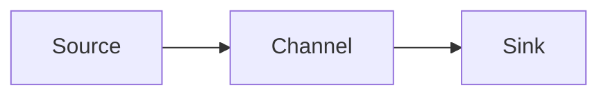

# Flume未来发展趋势：展望数据收集未来

## 1. 背景介绍
在大数据时代，数据收集成为了数据分析和数据驱动决策的基础。Apache Flume作为一个高效的、分布式的、可靠的、和可扩展的日志聚合系统，它能够高效地收集、聚合和移动大量的日志数据。随着云计算、物联网(IoT)和实时分析技术的发展，Flume的应用场景和技术挑战也在不断演变。

## 2. 核心概念与联系
Flume的核心概念包括Source、Channel和Sink。Source负责数据的收集，Channel作为缓冲区保证数据的可靠传输，Sink则负责将数据输出到目标存储系统。这三者共同构成了Flume的数据流动架构。



## 3. 核心算法原理具体操作步骤
Flume采用了事件驱动模型，通过定义不同的Source和Sink来适应不同的数据源和目标系统。在数据传输过程中，Flume提供了事务支持，确保数据的一致性和可靠性。操作步骤通常包括配置Source、Channel和Sink，启动Agent，以及监控和调优。

## 4. 数学模型和公式详细讲解举例说明
Flume的数据流可以用概率模型来描述，例如使用泊松分布来模拟数据事件的到达过程，或者使用队列理论中的Markov链模型来分析Channel的性能。

$$ P(X=k) = \frac{\lambda^k e^{-\lambda}}{k!} $$

其中，$ \lambda $ 表示单位时间内平均到达的事件数，$ k $ 表示某个时间段内到达的事件数。

## 5. 项目实践：代码实例和详细解释说明
以一个简单的Flume配置为例，展示如何收集系统日志并将其输出到HDFS。

```properties
# Define a memory channel
agent.channels.memChannel.type = memory

# Define a source to collect system logs
agent.sources.syslog.type = exec
agent.sources.syslog.command = tail -F /var/log/syslog
agent.sources.syslog.channels = memChannel

# Define a sink to write to HDFS
agent.sinks.hdfsSink.type = hdfs
agent.sinks.hdfsSink.hdfs.path = hdfs://namenode/flume/logs/
agent.sinks.hdfsSink.channel = memChannel
```

## 6. 实际应用场景
Flume广泛应用于日志数据收集、用户行为追踪、流量监控等场景。在IoT领域，Flume可以用于收集传感器数据，在金融领域，Flume用于交易数据的实时分析。

## 7. 工具和资源推荐
除了Flume，还有如Kafka、Logstash等其他数据收集工具。对于Flume的学习，推荐官方文档、GitHub上的开源项目以及相关技术社区。

## 8. 总结：未来发展趋势与挑战
Flume未来的发展趋势将更加注重于云原生支持、实时处理能力和更强的可扩展性。挑战包括处理更大规模的数据、保证数据的安全性以及简化配置和管理。

## 9. 附录：常见问题与解答
- Q: Flume如何保证数据不丢失？
- A: Flume通过Channel的事务机制和Sink的可靠性机制来保证数据不丢失。

- Q: Flume和Kafka有什么区别？
- A: Flume专注于数据收集，而Kafka是一个分布式消息系统，更强调数据的传输和缓存。

作者：禅与计算机程序设计艺术 / Zen and the Art of Computer Programming