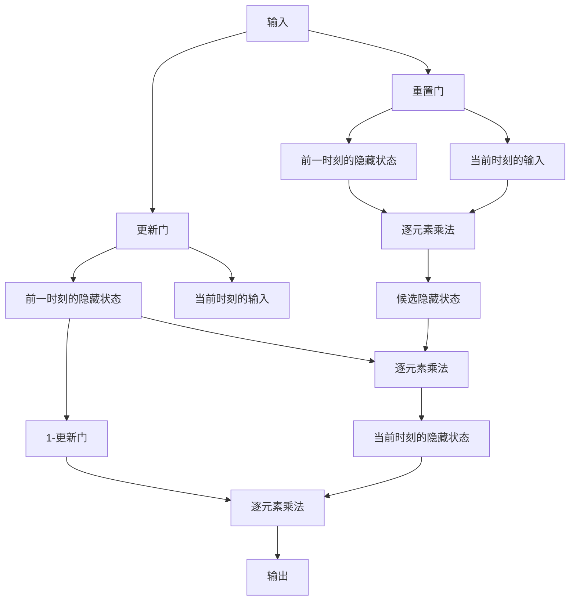

## 1.背景介绍

在自然语言处理领域，长短时记忆网络（LSTM）是一种非常流行的神经网络结构，它可以有效地处理序列数据，如文本、语音等。然而，LSTM的结构比较复杂，包含多个门控单元，导致训练和推理的时间和空间复杂度较高。为了简化LSTM的结构，研究人员提出了门控循环单元（GRU）。

GRU是一种类似于LSTM的循环神经网络结构，它只包含两个门控单元，可以在保持较高性能的同时，减少模型的复杂度。本文将介绍GRU的核心概念、算法原理、数学模型和公式、项目实践、实际应用场景、工具和资源推荐、未来发展趋势和挑战以及常见问题与解答。

## 2.核心概念与联系

GRU是一种循环神经网络结构，它的核心概念是门控单元。门控单元是一种可以控制信息流动的机制，它可以决定哪些信息需要被保留，哪些信息需要被遗忘。GRU只包含两个门控单元：重置门和更新门。

重置门可以控制前一时刻的隐藏状态对当前时刻的输入进行多大程度的重置。更新门可以控制前一时刻的隐藏状态对当前时刻的输入进行多大程度的更新。通过这两个门控单元，GRU可以有效地处理序列数据，如文本、语音等。

## 3.核心算法原理具体操作步骤

GRU的算法原理可以分为以下几个步骤：

1. 初始化权重和偏置：GRU的权重和偏置需要进行初始化，可以使用随机数进行初始化。

2. 计算重置门：根据当前时刻的输入和前一时刻的隐藏状态，计算重置门的值。重置门的计算公式如下：

   $r_t = \sigma(W_r \cdot [h_{t-1}, x_t] + b_r)$

   其中，$W_r$是重置门的权重矩阵，$b_r$是重置门的偏置向量，$\sigma$是sigmoid函数，$h_{t-1}$是前一时刻的隐藏状态，$x_t$是当前时刻的输入。

3. 计算更新门：根据当前时刻的输入和前一时刻的隐藏状态，计算更新门的值。更新门的计算公式如下：

   $z_t = \sigma(W_z \cdot [h_{t-1}, x_t] + b_z)$

   其中，$W_z$是更新门的权重矩阵，$b_z$是更新门的偏置向量，$\sigma$是sigmoid函数，$h_{t-1}$是前一时刻的隐藏状态，$x_t$是当前时刻的输入。

4. 计算候选隐藏状态：根据当前时刻的输入和前一时刻的隐藏状态，计算候选隐藏状态。候选隐藏状态的计算公式如下：

   $\tilde{h}_t = \tanh(W \cdot [r_t \odot h_{t-1}, x_t] + b)$

   其中，$W$是隐藏状态的权重矩阵，$b$是隐藏状态的偏置向量，$\odot$是逐元素乘法运算符，$r_t$是重置门的值，$h_{t-1}$是前一时刻的隐藏状态，$x_t$是当前时刻的输入。

5. 计算当前时刻的隐藏状态：根据更新门和候选隐藏状态，计算当前时刻的隐藏状态。当前时刻的隐藏状态的计算公式如下：

   $h_t = (1 - z_t) \odot h_{t-1} + z_t \odot \tilde{h}_t$

   其中，$h_t$是当前时刻的隐藏状态，$z_t$是更新门的值，$\tilde{h}_t$是候选隐藏状态。

6. 输出当前时刻的隐藏状态：将当前时刻的隐藏状态作为输出。

## 4.数学模型和公式详细讲解举例说明

GRU的数学模型和公式可以用以下Mermaid流程图表示：



其中，输入包括当前时刻的输入和前一时刻的隐藏状态。重置门和更新门分别控制前一时刻的隐藏状态对当前时刻的输入进行重置和更新。候选隐藏状态是根据当前时刻的输入和前一时刻的隐藏状态计算得到的。当前时刻的隐藏状态是根据更新门和候选隐藏状态计算得到的。最终的输出是当前时刻的隐藏状态。

## 5.项目实践：代码实例和详细解释说明

以下是使用Python实现GRU的代码示例：

```python
import torch
import torch.nn as nn

class GRU(nn.Module):
    def __init__(self, input_size, hidden_size):
        super(GRU, self).__init__()
        self.input_size = input_size
        self.hidden_size = hidden_size
        self.reset_gate = nn.Linear(input_size + hidden_size, hidden_size)
        self.update_gate = nn.Linear(input_size + hidden_size, hidden_size)
        self.candidate_state = nn.Linear(input_size + hidden_size, hidden_size)

    def forward(self, input, hidden):
        combined = torch.cat((input, hidden), 1)
        reset = torch.sigmoid(self.reset_gate(combined))
        update = torch.sigmoid(self.update_gate(combined))
        candidate = torch.tanh(self.candidate_state(torch.cat((input, reset * hidden), 1)))
        output = (1 - update) * hidden + update * candidate
        return output
```

在上述代码中，我们定义了一个GRU类，它继承自nn.Module类。GRU类包含三个线性层：重置门、更新门和候选隐藏状态。在forward方法中，我们首先将当前时刻的输入和前一时刻的隐藏状态拼接在一起，然后分别计算重置门、更新门和候选隐藏状态。最后，根据更新门和候选隐藏状态计算当前时刻的隐藏状态，并将其作为输出返回。

## 6.实际应用场景

GRU可以应用于自然语言处理领域的各种任务，如语言建模、机器翻译、情感分析等。此外，GRU还可以应用于时间序列预测、音频识别等领域。

## 7.工具和资源推荐

以下是一些学习GRU的工具和资源：

- PyTorch：一个流行的深度学习框架，支持GRU的实现。
- TensorFlow：另一个流行的深度学习框架，支持GRU的实现。
- GRU tutorial：一个详细的GRU教程，包含理论和实践部分。

## 8.总结：未来发展趋势与挑战

GRU是一种简化LSTM结构的循环神经网络结构，它可以有效地处理序列数据，如文本、语音等。随着深度学习技术的不断发展，GRU在自然语言处理领域的应用前景非常广阔。然而，GRU仍然存在一些挑战，如训练和推理的时间和空间复杂度较高等问题。未来，我们需要进一步研究和优化GRU的结构和算法，以提高其性能和效率。

## 9.附录：常见问题与解答

Q: GRU和LSTM有什么区别？

A: GRU和LSTM都是循环神经网络结构，但是GRU只包含两个门控单元，而LSTM包含三个门控单元。因此，GRU的结构比LSTM更简单，但是LSTM的性能可能更好。

Q: GRU适用于哪些任务？

A: GRU适用于自然语言处理领域的各种任务，如语言建模、机器翻译、情感分析等。此外，GRU还可以应用于时间序列预测、音频识别等领域。

Q: 如何实现GRU？

A: 可以使用深度学习框架，如PyTorch、TensorFlow等，来实现GRU。在实现过程中，需要定义GRU的结构和算法，并进行训练和推理。

作者：禅与计算机程序设计艺术 / Zen and the Art of Computer Programming