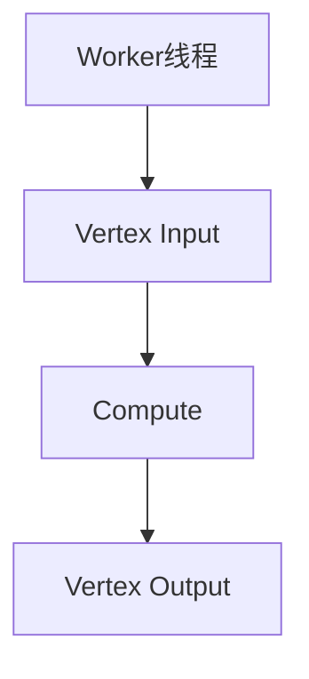

## 1. 背景介绍

Giraph是一个基于Hadoop的分布式图计算框架，它可以处理大规模的图数据，例如社交网络、路网、生物网络等。Giraph的设计目标是提供一个高效、可扩展、易于使用的图计算框架，使得用户可以方便地进行图计算任务的开发和部署。

Giraph最初由Yahoo!开发，后来成为Apache基金会的一个开源项目。目前，Giraph已经成为了大规模图计算领域的一个重要工具，被广泛应用于社交网络分析、推荐系统、网络安全等领域。

## 2. 核心概念与联系

### 2.1 图模型

在Giraph中，图被表示为一个由节点和边组成的数据结构。每个节点都有一个唯一的标识符和一些属性，每条边都连接两个节点，并且可以带有一些权重。图可以被看作是一个由节点和边组成的网络，其中节点表示实体，边表示实体之间的关系。

### 2.2 分布式计算

Giraph是一个分布式计算框架，它可以在多台计算机上同时运行。在Giraph中，图被分割成多个子图，每个子图被分配到不同的计算节点上进行计算。每个计算节点只处理自己负责的子图，然后将计算结果发送给其他节点，最终得到整个图的计算结果。

### 2.3 Pregel模型

Giraph的计算模型基于Google的Pregel模型，Pregel模型是一种基于消息传递的分布式计算模型。在Pregel模型中，计算过程被抽象为一系列迭代，每个迭代被称为一个超步（superstep）。在每个超步中，每个节点都可以向其它节点发送消息，并根据接收到的消息更新自己的状态。当所有节点都完成当前超步的计算后，进入下一个超步，直到达到收敛条件为止。

## 3. 核心算法原理具体操作步骤

### 3.1 Giraph计算模型

Giraph的计算模型基于Pregel模型，每个计算节点都有一个Worker线程，负责处理自己负责的子图。在每个超步中，Worker线程会按照一定的顺序依次执行以下三个步骤：

1. Vertex Input：读取当前超步需要处理的节点的信息，包括节点的标识符、属性和邻居节点等信息。

2. Compute：对当前超步需要处理的节点进行计算，根据节点的属性和邻居节点的信息更新节点的状态，并向其它节点发送消息。

3. Vertex Output：将当前超步需要输出的节点信息写入到输出文件中，以便下一个超步读取。

### 3.2 Giraph计算模型示意图



## 4. 数学模型和公式详细讲解举例说明

Giraph的计算模型基于Pregel模型，其中涉及到一些数学模型和公式，例如PageRank算法、最短路径算法等。这些算法的具体数学模型和公式可以参考相关文献和资料。

## 5. 项目实践：代码实例和详细解释说明

### 5.1 Giraph代码示例

以下是一个简单的Giraph代码示例，实现了PageRank算法：

```java
public class PageRankComputation extends BasicComputation<LongWritable, DoubleWritable, FloatWritable, DoubleWritable> {

    private static final double DAMPING_FACTOR = 0.85;

    @Override
    public void compute(Vertex<LongWritable, DoubleWritable, FloatWritable> vertex, Iterable<DoubleWritable> messages) throws IOException {
        if (getSuperstep() == 0) {
            vertex.setValue(new DoubleWritable(1.0 / getTotalNumVertices()));
        } else {
            double sum = 0.0;
            for (DoubleWritable message : messages) {
                sum += message.get();
            }
            double newValue = (1 - DAMPING_FACTOR) / getTotalNumVertices() + DAMPING_FACTOR * sum;
            vertex.setValue(new DoubleWritable(newValue));
            sendMessageToAllEdges(vertex, new DoubleWritable(newValue / vertex.getNumEdges()));
        }
        vertex.voteToHalt();
    }
}
```

### 5.2 Giraph代码解释说明

上述代码实现了PageRank算法，其中compute方法是Giraph计算模型中的核心计算逻辑。在第0个超步中，每个节点的PageRank值被初始化为1.0/总节点数。在后续的超步中，每个节点会接收到其它节点发送的消息，根据消息更新自己的PageRank值，并向其它节点发送消息。最终，当所有节点的PageRank值收敛时，计算结束。

## 6. 实际应用场景

Giraph可以应用于各种大规模图计算场景，例如社交网络分析、推荐系统、网络安全等。以下是一些实际应用场景的举例：

### 6.1 社交网络分析

Giraph可以用于社交网络分析，例如计算社交网络中的节点中心性、社区发现等问题。通过Giraph，可以方便地处理大规模的社交网络数据，并得到有用的分析结果。

### 6.2 推荐系统

Giraph可以用于推荐系统，例如计算用户之间的相似度、推荐物品等问题。通过Giraph，可以方便地处理大规模的用户和物品数据，并得到有用的推荐结果。

### 6.3 网络安全

Giraph可以用于网络安全领域，例如检测网络攻击、分析网络流量等问题。通过Giraph，可以方便地处理大规模的网络数据，并得到有用的安全分析结果。

## 7. 工具和资源推荐

以下是一些Giraph相关的工具和资源推荐：

### 7.1 Giraph官方网站

Giraph官方网站提供了Giraph的最新版本下载、文档、示例代码等资源，可以方便地了解和使用Giraph。

### 7.2 Giraph源代码

Giraph源代码托管在Apache基金会的Git仓库中，可以方便地查看和下载Giraph的源代码。

### 7.3 Giraph论文

Giraph的设计和实现细节可以参考相关的论文，例如《Pregel: A System for Large-Scale Graph Processing》等。

## 8. 总结：未来发展趋势与挑战

Giraph作为一个分布式图计算框架，具有高效、可扩展、易于使用等优点，被广泛应用于各种大规模图计算场景。未来，随着大数据和人工智能技术的不断发展，Giraph将面临更多的挑战和机遇。例如，如何进一步提高Giraph的计算效率、如何支持更多的图计算算法等问题，都是Giraph未来需要解决的难题。

## 9. 附录：常见问题与解答

以下是一些常见问题和解答：

### 9.1 Giraph是否支持分布式图计算？

是的，Giraph是一个分布式图计算框架，可以在多台计算机上同时运行。

### 9.2 Giraph是否支持Pregel模型？

是的，Giraph的计算模型基于Pregel模型，可以方便地进行基于消息传递的分布式图计算。

### 9.3 Giraph是否支持PageRank算法？

是的，Giraph可以方便地实现PageRank算法，可以参考相关的示例代码和文档。

### 9.4 Giraph是否支持社交网络分析？

是的，Giraph可以用于社交网络分析，例如计算节点中心性、社区发现等问题。

### 9.5 Giraph是否支持推荐系统？

是的，Giraph可以用于推荐系统，例如计算用户之间的相似度、推荐物品等问题。