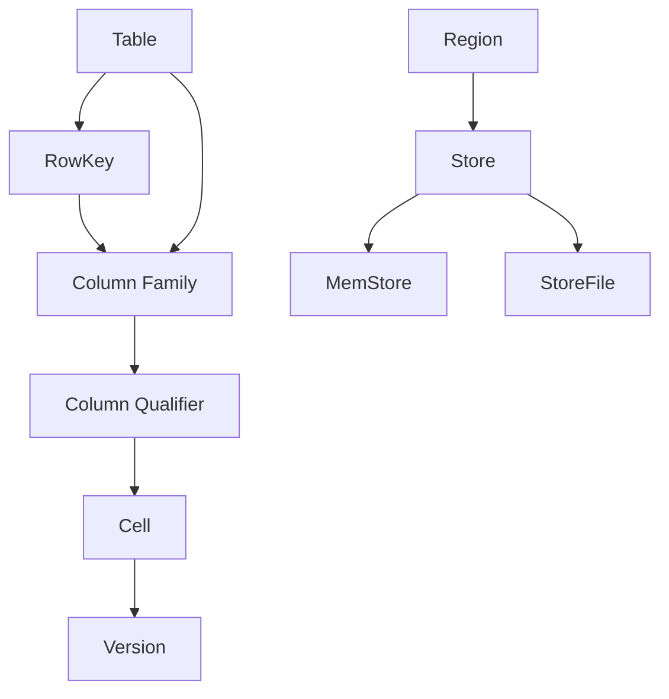
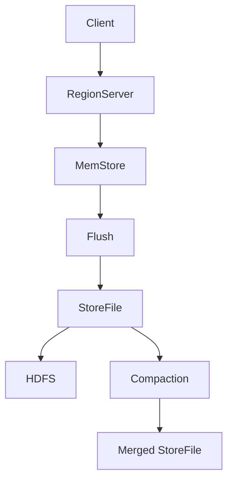
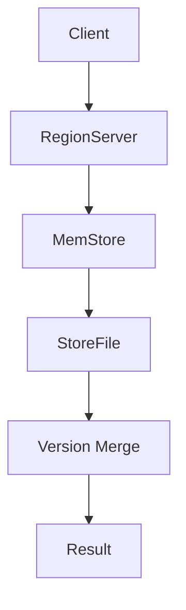

# HBase原理与代码实例讲解

## 1. 背景介绍

在当今大数据时代，数据量呈现出爆炸式增长趋势。传统的关系型数据库在处理海量数据时面临着可扩展性和性能瓶颈的挑战。为了解决这一问题,Google于2006年提出了BigTable的概念,这是一种分布式、可扩展的NoSQL数据库。HBase正是基于Google的BigTable论文设计和实现的开源分布式列式数据库。

HBase具有高可靠性、高性能、可伸缩、分布式等优点,非常适合于存储和处理海量的结构化数据和半结构化数据。它已被广泛应用于Facebook、Twitter、Yahoo等知名公司,以及许多大数据处理场景。

### 1.1 HBase简介

HBase是一个分布式的、面向列的开源数据库,它是建立在HDFS(Hadoop分布式文件系统)之上的。HBase通过将数据划分为多个Region,并将这些Region分布在不同的RegionServer上,从而实现了数据的自动分区和负载均衡。

HBase的数据模型与传统的关系型数据库不同,它采用了类似Google BigTable的数据模型,将数据存储在由行键(Row Key)、列族(Column Family)和列限定符(Column Qualifier)确定的单元格(Cell)中。这种数据模型非常适合于存储半结构化或非结构化的数据。

### 1.2 HBase架构

HBase的架构主要包括以下几个核心组件:

- **HMaster**: HBase集群的主控组件,负责监控集群状态和协调RegionServer的工作。
- **RegionServer**: 负责存储和管理HBase中的数据,每个RegionServer管理着一个或多个Region。
- **Zookeeper**: 用于维护HBase集群的状态和元数据信息,确保集群的高可用性。
- **HDFS**: HBase的底层存储系统,用于存储实际的数据文件。

## 2. 核心概念与联系

为了更好地理解HBase的原理,我们需要先了解一些核心概念及其之间的关系。



- **Table**: HBase中的表相当于关系型数据库中的表。每个表都由多个行组成,并被水平划分为多个Region。
- **RowKey**: 表示表中每一行的唯一标识符,用于快速查找特定行。RowKey是按字典序排序的。
- **Column Family**: 列族是列的逻辑分组,所有属于同一列族的列都存储在同一个文件中。列族在创建表时就需要定义好,之后不能修改。
- **Column Qualifier**: 列限定符是列的具体标识符,它与列族共同确定了一个列。
- **Cell**: 由RowKey、Column Family、Column Qualifier和版本号(Timestamp)唯一确定的单元,存储着实际的数据值。
- **Region**: 表被划分为多个水平区域,每个Region由一个或多个Store组成,并由一个RegionServer负责管理。
- **Store**: 每个列族在每个Region中对应一个Store,Store中包含了该列族的所有数据。
- **MemStore**: 写入数据首先会进入内存中的MemStore,当MemStore达到一定阈值时,就会被刷写到StoreFile中。
- **StoreFile**: 存储在HDFS上的数据文件,由MemStore刷写而来。StoreFile是只读的,当有新数据写入时,会形成新的StoreFile。

## 3. 核心算法原理具体操作步骤

### 3.1 数据写入流程

HBase的数据写入流程如下:

1. 客户端向RegionServer发送写入请求。
2. RegionServer根据RowKey找到对应的Region,并将数据写入该Region的MemStore。
3. 当MemStore达到一定阈值时,就会启动刷写流程,将MemStore中的数据刷写到StoreFile中。
4. 新的StoreFile会被持久化到HDFS上,并在内存中保留一份索引。
5. 当一个Region中的StoreFile数量达到一定阈值时,就会触发合并操作,将多个StoreFile合并成一个更大的StoreFile。



### 3.2 数据读取流程

HBase的数据读取流程如下:

1. 客户端向RegionServer发送读取请求。
2. RegionServer根据RowKey找到对应的Region。
3. RegionServer先在MemStore中查找数据,如果没有找到,则在StoreFile中查找。
4. 如果在多个StoreFile中都找到了数据,则需要进行版本合并,取最新版本的数据。
5. 将查找到的数据返回给客户端。



### 3.3 Region分割与合并

随着数据量的增长,单个Region可能会变得过大,导致RegionServer的负载过高。为了保持集群的平衡,HBase会自动对过大的Region进行分割。分割过程如下:

1. HMaster选择一个过大的Region进行分割。
2. HMaster在RegionServer上临时启动一个分割器进程。
3. 分割器将Region分割为两个子Region,并将数据重新分配到这两个子Region中。
4. 原Region被卸载,两个新的子Region被加载到相应的RegionServer上。

相反,如果某个Region变得过小,HBase也会自动对其进行合并操作,以提高存储效率。合并过程与分割过程类似,只是将两个小的Region合并为一个更大的Region。

## 4. 数学模型和公式详细讲解举例说明

在HBase中,有一些数学模型和公式用于优化性能和资源利用率。

### 4.1 局部性原理

HBase的设计遵循了数据局部性原理,即将相关的数据存储在物理上靠近的位置,以减少数据访问的开销。这一原理可以用以下公式表示:

$$
T_{access} = T_{seek} + T_{transfer}
$$

其中,`$T_{access}$`表示数据访问的总时间,`$T_{seek}$`表示磁盘寻道时间,`$T_{transfer}$`表示数据传输时间。由于磁盘寻道时间远大于数据传输时间,因此将相关数据存储在物理上靠近的位置可以大大减小`$T_{seek}$`,从而优化数据访问性能。

### 4.2 Bloom Filter

HBase中使用了Bloom Filter来加速数据查询。Bloom Filter是一种空间高效的概率数据结构,用于快速判断一个元素是否存在于集合中。它的原理是使用多个哈希函数对元素进行哈希,并将哈希值对应的位置在位向量中设置为1。

查询时,如果元素的所有哈希值对应的位置在位向量中都为1,则有很大概率该元素存在于集合中;如果任何一个位置为0,则可以确定该元素一定不存在。

Bloom Filter的误判率可以用以下公式表示:

$$
P = (1 - e^{-kn/m})^k
$$

其中,`$k$`表示哈希函数的个数,`$n$`表示集合中元素的个数,`$m$`表示位向量的长度。通过调整`$k$`和`$m$`的值,可以控制Bloom Filter的误判率和空间开销。

### 4.3 LSM Tree

HBase的存储引擎采用了LSM(Log-Structured Merge-Tree)树的数据结构,它将数据分为不可修改的有序文件(StoreFile)和内存中的可修改组件(MemStore)。

LSM树的写入过程如下:

1. 新数据首先写入MemStore。
2. 当MemStore达到一定大小时,将其刷写到一个新的不可修改的StoreFile中。
3. 定期将多个StoreFile合并为一个更大的StoreFile。

读取过程如下:

1. 首先查询MemStore,如果没有找到,则查询StoreFile。
2. 由于StoreFile是有序的,可以使用二分查找快速定位数据。

LSM树的写入性能非常高,因为只需要将数据追加到MemStore即可。但是读取性能则取决于StoreFile的数量和大小,因为需要在多个StoreFile中查找数据。

## 5. 项目实践:代码实例和详细解释说明

接下来,我们将通过一个简单的Java示例来演示如何使用HBase客户端进行数据的增删改查操作。

### 5.1 环境准备

首先,我们需要准备HBase的运行环境。可以在本地使用HBase的伪分布式模式,也可以在集群环境中部署HBase。此外,还需要安装HBase的Java客户端库,以便在Java代码中访问HBase。

### 5.2 创建表

```java
import org.apache.hadoop.conf.Configuration;
import org.apache.hadoop.hbase.HBaseConfiguration;
import org.apache.hadoop.hbase.HColumnDescriptor;
import org.apache.hadoop.hbase.HTableDescriptor;
import org.apache.hadoop.hbase.TableName;
import org.apache.hadoop.hbase.client.Admin;
import org.apache.hadoop.hbase.client.Connection;
import org.apache.hadoop.hbase.client.ConnectionFactory;

public class CreateTable {
    public static void main(String[] args) throws Exception {
        Configuration conf = HBaseConfiguration.create();
        Connection connection = ConnectionFactory.createConnection(conf);
        Admin admin = connection.getAdmin();

        HTableDescriptor tableDesc = new HTableDescriptor(TableName.valueOf("my_table"));
        tableDesc.addFamily(new HColumnDescriptor("cf1"));
        tableDesc.addFamily(new HColumnDescriptor("cf2"));

        admin.createTable(tableDesc);
        admin.close();
        connection.close();
    }
}
```

在上面的示例中,我们创建了一个名为`my_table`的表,包含两个列族`cf1`和`cf2`。

### 5.3 插入数据

```java
import org.apache.hadoop.conf.Configuration;
import org.apache.hadoop.hbase.HBaseConfiguration;
import org.apache.hadoop.hbase.TableName;
import org.apache.hadoop.hbase.client.Connection;
import org.apache.hadoop.hbase.client.ConnectionFactory;
import org.apache.hadoop.hbase.client.Put;
import org.apache.hadoop.hbase.client.Table;
import org.apache.hadoop.hbase.util.Bytes;

public class InsertData {
    public static void main(String[] args) throws Exception {
        Configuration conf = HBaseConfiguration.create();
        Connection connection = ConnectionFactory.createConnection(conf);
        Table table = connection.getTable(TableName.valueOf("my_table"));

        Put put = new Put(Bytes.toBytes("row1"));
        put.addColumn(Bytes.toBytes("cf1"), Bytes.toBytes("name"), Bytes.toBytes("John"));
        put.addColumn(Bytes.toBytes("cf1"), Bytes.toBytes("age"), Bytes.toBytes("30"));
        put.addColumn(Bytes.toBytes("cf2"), Bytes.toBytes("email"), Bytes.toBytes("john@example.com"));

        table.put(put);
        table.close();
        connection.close();
    }
}
```

在上面的示例中,我们向表`my_table`中插入了一行数据。每个单元格由列族、列限定符和值组成。

### 5.4 查询数据

```java
import org.apache.hadoop.conf.Configuration;
import org.apache.hadoop.hbase.HBaseConfiguration;
import org.apache.hadoop.hbase.TableName;
import org.apache.hadoop.hbase.client.Connection;
import org.apache.hadoop.hbase.client.ConnectionFactory;
import org.apache.hadoop.hbase.client.Get;
import org.apache.hadoop.hbase.client.Result;
import org.apache.hadoop.hbase.client.Table;
import org.apache.hadoop.hbase.util.Bytes;

public class QueryData {
    public static void main(String[] args) throws Exception {
        Configuration conf = HBaseConfiguration.create();
        Connection connection = ConnectionFactory.createConnection(conf);
        Table table = connection.getTable(TableName.valueOf("my_table"));

        Get get = new Get(Bytes.toBytes("row1"));
        Result result = table.get(get);

        byte[] nameValue = result.getValue(Bytes.toBytes("cf1"), Bytes.toBytes("name"));
        byte[] ageValue = result.getValue(Bytes.toBytes("cf1"), Bytes.toBytes("age"));
        byte[] emailValue = result.getValue(Bytes.toBytes("cf2"), Bytes.toBytes("email"));

        System.out.println("Name: " + Bytes.toString(nameValue));
        System.out.println("Age: " + Bytes.toString(ageValue));
        System.out.println("Email: " + Bytes.toString(emailValue));

        table.close();
        connection.close();
    }
}
```

在上面的示例中,我们使用`Get`操作从表`my_table`中