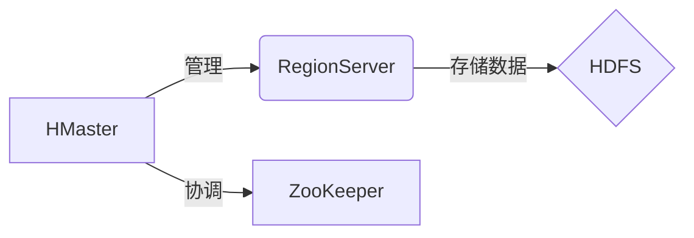

# HBase新特性解读,带你领略HBase的未来

## 1. 背景介绍
Apache HBase是一个开源的非关系型分布式数据库（NoSQL），它建立在Hadoop和HDFS之上，提供了类似于Google Bigtable的能力，以便于处理大量的结构化和非结构化数据。随着大数据技术的不断发展，HBase也在不断地进化和改进，以满足日益增长的性能和功能需求。

## 2. 核心概念与联系
HBase的核心概念包括表（Table）、行（Row）、列族（Column Family）和时间戳（Timestamp）。它通过行键（Row Key）的字典顺序存储数据，支持随机实时读写访问。HBase的架构主要由三个部分组成：HMaster服务器、RegionServer和ZooKeeper。



## 3. 核心算法原理具体操作步骤
HBase的核心算法包括数据存储、分布式协调和负载均衡。数据存储依赖于HDFS，利用其高可靠性和高吞吐量的特点。分布式协调通过ZooKeeper实现，保证集群中各个组件的状态同步。负载均衡由HMaster负责，通过Region的分裂和合并来实现。

## 4. 数学模型和公式详细讲解举例说明
HBase的性能可以用数学模型来描述，例如，读写延迟可以表示为：

$$ L = \frac{1}{2} \cdot (N_{reads} \cdot T_{read} + N_{writes} \cdot T_{write}) $$

其中，$L$ 是平均延迟，$N_{reads}$ 和 $N_{writes}$ 分别是读和写的操作数，$T_{read}$ 和 $T_{write}$ 是单次读和写操作的平均时间。

## 5. 项目实践：代码实例和详细解释说明
在项目实践中，我们可以通过HBase的Java API来实现数据的增删改查操作。以下是一个简单的代码示例，展示了如何在HBase中创建表：

```java
Configuration config = HBaseConfiguration.create();
try (Connection connection = ConnectionFactory.createConnection(config);
     Admin admin = connection.getAdmin()) {
    TableName tableName = TableName.valueOf("myTable");
    TableDescriptor tableDescriptor = TableDescriptorBuilder.newBuilder(tableName)
        .setColumnFamily(ColumnFamilyDescriptorBuilder.of("myColumnFamily"))
        .build();
    admin.createTable(tableDescriptor);
}
```

## 6. 实际应用场景
HBase广泛应用于社交网络、搜索引擎、日志分析、实时数据分析等场景。它能够处理大量的数据，并提供快速的查询性能，特别适合于对数据模型进行频繁更改的应用。

## 7. 工具和资源推荐
为了更好地使用HBase，推荐以下工具和资源：
- HBase官方文档：提供全面的指南和参考。
- HBase Shell：用于交互式操作HBase。
- Phoenix：提供SQL皮肤，使得操作HBase更加便捷。
- HBase客户端库：如Java、Python等语言的客户端库。

## 8. 总结：未来发展趋势与挑战
HBase的未来发展趋势将更加注重性能优化、易用性提升和生态系统的完善。同时，随着数据量的增长，数据的安全性和隐私保护也将成为挑战。

## 9. 附录：常见问题与解答
Q1: HBase如何保证数据的一致性？
A1: HBase通过使用ZooKeeper来协调服务器之间的状态，确保数据的一致性。

Q2: HBase的读写性能如何？
A2: HBase的读写性能取决于多种因素，包括集群的配置、数据模型设计等。通过优化这些因素，可以提升性能。

作者：禅与计算机程序设计艺术 / Zen and the Art of Computer Programming