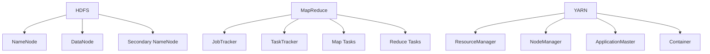

# Hadoop原理与代码实例讲解

## 1. 背景介绍
### 1.1 大数据处理的挑战
### 1.2 Hadoop的诞生
### 1.3 Hadoop生态系统概览

## 2. 核心概念与联系  
### 2.1 HDFS分布式文件系统
#### 2.1.1 HDFS架构
#### 2.1.2 数据块与副本
#### 2.1.3 NameNode与DataNode
### 2.2 MapReduce分布式计算框架 
#### 2.2.1 MapReduce编程模型
#### 2.2.2 Map与Reduce阶段
#### 2.2.3 任务调度与容错
### 2.3 YARN资源管理器
#### 2.3.1 YARN架构
#### 2.3.2 ResourceManager与NodeManager
#### 2.3.3 应用程序生命周期管理

## 3. 核心算法原理具体操作步骤
### 3.1 MapReduce词频统计
#### 3.1.1 数据输入与分片
#### 3.1.2 Map阶段词频统计
#### 3.1.3 Shuffle阶段数据交换
#### 3.1.4 Reduce阶段结果合并
### 3.2 HDFS文件读写
#### 3.2.1 文件上传与分块
#### 3.2.2 数据块复制与分布
#### 3.2.3 文件读取与合并

## 4. 数学模型和公式详细讲解举例说明
### 4.1 数据局部性原理
#### 4.1.1 时间局部性
#### 4.1.2 空间局部性
#### 4.1.3 Hadoop中的应用
### 4.2 数据分块与副本放置策略
#### 4.2.1 分块大小的选择
#### 4.2.2 副本放置算法
#### 4.2.3 机架感知与容错

## 5. 项目实践：代码实例和详细解释说明
### 5.1 Hadoop集群搭建
#### 5.1.1 单节点伪分布式模式
#### 5.1.2 多节点完全分布式模式
#### 5.1.3 配置文件说明
### 5.2 HDFS Shell操作实例
#### 5.2.1 文件上传与下载
#### 5.2.2 目录创建与删除
#### 5.2.3 文件权限管理
### 5.3 MapReduce编程实例
#### 5.3.1 WordCount词频统计
#### 5.3.2 分布式排序
#### 5.3.3 二次排序

## 6. 实际应用场景
### 6.1 日志数据分析
#### 6.1.1 Web访问日志处理
#### 6.1.2 用户行为分析
### 6.2 推荐系统
#### 6.2.1 用户画像构建
#### 6.2.2 基于物品的协同过滤
### 6.3 机器学习
#### 6.3.1 分布式决策树
#### 6.3.2 并行SVM算法

## 7. 工具和资源推荐
### 7.1 Hadoop发行版
#### 7.1.1 Apache Hadoop
#### 7.1.2 Cloudera CDH
#### 7.1.3 Hortonworks HDP
### 7.2 开发工具
#### 7.2.1 Eclipse插件
#### 7.2.2 IntelliJ IDEA插件
### 7.3 学习资源
#### 7.3.1 官方文档
#### 7.3.2 在线教程
#### 7.3.3 经典书籍

## 8. 总结：未来发展趋势与挑战
### 8.1 Hadoop 3.x新特性 
#### 8.1.1 纠删码
#### 8.1.2 异构存储
#### 8.1.3 时间线服务
### 8.2 云计算与Hadoop
#### 8.2.1 云上部署Hadoop
#### 8.2.2 Hadoop即服务(HaaS)
### 8.3 实时大数据处理
#### 8.3.1 Spark与Flink
#### 8.3.2 流批一体化架构

## 9. 附录：常见问题与解答
### 9.1 Hadoop安装部署问题
### 9.2 HDFS使用常见问题
### 9.3 MapReduce编程注意事项



Hadoop作为大数据处理的事实标准，其分布式存储和计算的核心思想源自Google的GFS和MapReduce论文。HDFS提供了高吞吐量的数据访问，能够处理PB级别的海量数据；MapReduce则将复杂的分布式计算抽象为Map和Reduce两个基本操作，极大地简化了分布式程序的编写。

HDFS采用主从架构，由一个NameNode和多个DataNode组成。NameNode负责管理文件系统的命名空间和数据块的映射信息，而DataNode则负责存储实际的数据块。数据以固定大小的块为单位进行存储，每个块默认会有3个副本，分布在不同的节点上，以提供数据可靠性和容错能力。

MapReduce同样采用主从架构，由一个JobTracker和多个TaskTracker组成。用户提交的作业被划分为若干个Map任务和Reduce任务，由JobTracker负责调度到不同的TaskTracker上执行。Map任务对输入的数据进行并行处理，生成中间结果；Reduce任务则对Map的输出结果进行归约，得到最终结果。整个过程自动处理了任务的调度、数据的分发和容错等问题，使得用户可以专注于编写业务逻辑。

下面以经典的WordCount为例，介绍MapReduce编程模型的基本步骤。WordCount的目标是统计文本文件中每个单词出现的次数。Map函数接收一行文本作为输入，将其切分为单词，并输出<word, 1>形式的键值对。Reduce函数则接收单词作为键，对应的值为一组计数，将它们累加得到该单词的总次数。

```java
public class WordCount {
    public static class TokenizerMapper extends Mapper<Object, Text, Text, IntWritable> {
        private final static IntWritable one = new IntWritable(1);
        private Text word = new Text();
        
        public void map(Object key, Text value, Context context) throws IOException, InterruptedException {
            StringTokenizer itr = new StringTokenizer(value.toString());
            while (itr.hasMoreTokens()) {
                word.set(itr.nextToken());
                context.write(word, one);
            }
        }
    }
    
    public static class IntSumReducer extends Reducer<Text,IntWritable,Text,IntWritable> {
        private IntWritable result = new IntWritable();
        
        public void reduce(Text key, Iterable<IntWritable> values, Context context) throws IOException, InterruptedException {
            int sum = 0;
            for (IntWritable val : values) {
                sum += val.get();
            }
            result.set(sum);
            context.write(key, result);
        }
    }
    
    public static void main(String[] args) throws Exception {
        Configuration conf = new Configuration();
        Job job = Job.getInstance(conf, "word count");
        job.setJarByClass(WordCount.class);
        job.setMapperClass(TokenizerMapper.class);
        job.setCombinerClass(IntSumReducer.class);
        job.setReducerClass(IntSumReducer.class);
        job.setOutputKeyClass(Text.class);
        job.setOutputValueClass(IntWritable.class);
        FileInputFormat.addInputPath(job, new Path(args[0]));
        FileOutputFormat.setOutputPath(job, new Path(args[1]));
        System.exit(job.waitForCompletion(true) ? 0 : 1);
    }
}
```

以上就是一个完整的MapReduce程序，对文本数据进行词频统计。可以看到，开发人员只需要实现Map和Reduce两个函数接口，定义输入输出数据的格式，而无需关心具体的任务调度、容错等底层细节。这种简单而强大的编程模型极大地提高了开发效率。

随着Hadoop生态的不断发展，一些列优秀的工具和框架如雨后春笋般涌现，进一步丰富和完善了Hadoop技术栈。其中，Hive提供了类SQL的数据仓库工具，Pig提供了数据流语言Pig Latin，HBase提供了面向列的NoSQL数据库，Mahout提供了可扩展的机器学习库，Zookeeper提供了分布式协调服务。这些围绕Hadoop的项目极大地扩展了Hadoop的应用范围，使其在搜索、推荐、广告等众多领域大放异彩。

展望未来，Hadoop在大数据时代仍将扮演重要角色。Hadoop 3.x引入了纠删码、异构存储、时间线服务等新特性，进一步提升了性能和灵活性。同时，Spark、Flink等实时计算框架与Hadoop良好集成，共同构建了流批一体的大数据处理平台。Hadoop与云计算的结合，也使得用户能够以更低的成本、更高的效率处理海量数据。这些都预示着Hadoop将在可预见的未来，继续在大数据领域占据核心地位。

作者：禅与计算机程序设计艺术 / Zen and the Art of Computer Programming