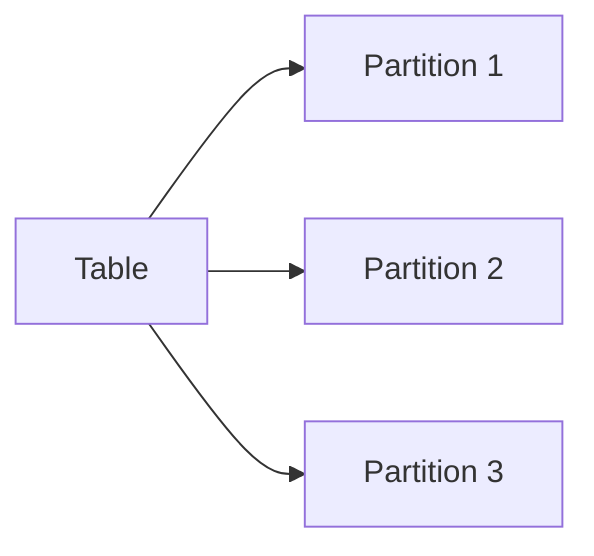

# HiveQL表操作详解：创建、查询和修改

## 1. 背景介绍

### 1.1 Hive简介

Apache Hive是一个建立在Hadoop之上的数据仓库基础构架，它提供了一种机制将结构化的数据文件映射为一张数据库表，并提供简单的SQL查询功能，可以将SQL语句转换为MapReduce任务进行运行。Hive定义了简单的类SQL查询语言，称为HiveQL，它允许熟悉SQL的用户查询数据。同时，这个语言也允许熟悉MapReduce开发者的开发自定义的mapper和reducer来处理内建的mapper和reducer无法完成的复杂的分析工作。

### 1.2 为什么要学习HiveQL表操作

HiveQL是Hive的查询语言，用来操作Hive中的数据。通过学习HiveQL表操作，我们可以：

1. 方便地在Hive中创建和管理表结构
2. 高效地查询和分析海量数据
3. 实现复杂的数据处理和转换逻辑
4. 与其他大数据工具如Spark、Presto等集成，增强数据处理能力

因此，掌握HiveQL表操作对于从事大数据开发和分析的工程师来说是必备技能。

## 2. 核心概念与关联

要理解HiveQL表操作，需要先了解几个核心概念：

### 2.1 表(Table)

Hive的表对应HDFS上的指定目录，表中的数据被映射为目录下的文件。Hive中每个表都有对应的元数据，用于描述表的结构、数据所在目录等信息。

### 2.2 分区(Partition)

Hive的表可以根据某个或某些字段进行分区。分区可以让Hive在查询时只扫描表的一部分数据，从而提高查询速度。表和分区的关系如下图所示：



### 2.3 数据类型

Hive支持多种数据类型，包括基本数据类型(int,float,double,string等)和复杂数据类型(array,map,struct)。合理使用数据类型可以提高存储和计算效率。

### 2.4 HiveQL

HiveQL是操作Hive中数据的语言，语法与SQL类似。通过HiveQL可以实现表的创建、删除、查询、插入等操作。

## 3. 核心操作步骤

下面介绍HiveQL表操作的核心步骤，包括表的创建、查询和修改。

### 3.1 创建表

#### 3.1.1 建表语法

Hive建表的基本语法如下：

```sql
CREATE [EXTERNAL] TABLE [IF NOT EXISTS] table_name 
[(col_name data_type [COMMENT col_comment], ...)]
[COMMENT table_comment]
[PARTITIONED BY (col_name data_type [COMMENT col_comment], ...)]
[CLUSTERED BY (col_name, col_name, ...) 
[SORTED BY (col_name [ASC|DESC], ...)] INTO num_buckets BUCKETS]
[ROW FORMAT row_format] 
[STORED AS file_format]
[LOCATION hdfs_path]
```

其中：
- EXTERNAL关键字可以让Hive创建一个外部表，不会将数据移动到数据仓库目录中，只是在元数据中存储了数据的位置。
- PARTITIONED BY指定分区字段
- CLUSTERED BY指定分桶字段
- ROW FORMAT 指定行格式，如DELIMITED FIELDS TERMINATED BY ','
- STORED AS指定存储格式，常用的有TEXTFILE、SEQUENCEFILE、ORC、PARQUET等

#### 3.1.2 内部表与外部表

可以用EXTERNAL关键字创建外部表。内部表与外部表的主要区别为：

- 内部表数据由Hive自身管理，外部表数据由HDFS管理；
- 内部表删除时会删除元数据和数据，外部表只删除元数据，HDFS上的文件并不会被删除。

因此，如果数据被多个工具共享，或者需要在Hive外部修改数据，那么就要创建外部表。

#### 3.1.3 分区表

如果表的某些字段有较好的区分度，且经常作为过滤条件，就适合作为分区字段。分区字段不是表中的列，但会在HDFS上表现为文件夹。

创建分区表的示例：

```sql
CREATE TABLE user_partition(
  userid INT,
  age INT,
  gender STRING,
  occupation STRING,
  zipcode STRING
)
PARTITIONED BY (dt STRING)
ROW FORMAT DELIMITED FIELDS TERMINATED BY ','
STORED AS TEXTFILE;
```

表user_partition按dt字段分区，在HDFS上对应的目录为：

```
/user/hive/warehouse/user_partition/dt=2020-01-01/
/user/hive/warehouse/user_partition/dt=2020-01-02/
/user/hive/warehouse/user_partition/dt=2020-01-03/
...
```

向分区表插入数据时，需要指定分区：

```sql
INSERT INTO user_partition PARTITION (dt='2020-01-01')
SELECT userid, age, gender, occupation, zipcode FROM another_table;
```

### 3.2 查询表

#### 3.2.1 SELECT查询

Hive支持标准的SELECT语句进行数据查询，基本语法为：

```sql
SELECT [ALL | DISTINCT] select_expr, select_expr, ...
FROM table_reference
[WHERE where_condition] 
[GROUP BY col_list]
[HAVING having_condition] 
[ORDER BY col_list]
[CLUSTER BY col_list
  | [DISTRIBUTE BY col_list] [SORT BY col_list]
]
[LIMIT number]
```

与标准SQL类似，HiveQL SELECT语句支持WHERE过滤、GROUP BY分组、JOIN连接、ORDER BY排序、HAVING筛选、LIMIT限制等子句。

#### 3.2.2 分区查询

对于分区表，查询时加上分区过滤条件可以避免全表扫描，从而显著提升查询速度。

```sql
SELECT * FROM user_partition 
WHERE dt='2020-01-01'
AND age > 20;
```

上面的查询只会扫描dt='2020-01-01'分区下的数据。

#### 3.2.3 JOIN查询

Hive支持多表JOIN，语法与标准SQL类似。但是JOIN会启动MapReduce作业，因此要尽量避免JOIN大表。

```sql
SELECT u.userid, u.age, o.amount 
FROM user u
JOIN orders o ON u.userid = o.userid
WHERE u.age > 20;
```

### 3.3 修改表

#### 3.3.1 新增列

使用ALTER TABLE语句可以为表新增列：

```sql
ALTER TABLE user ADD COLUMNS (
  email STRING COMMENT 'email address', 
  phone STRING COMMENT 'phone number'
);
```

#### 3.3.2 修改列

修改列的名称、类型、注释：

```sql
ALTER TABLE user CHANGE COLUMN age user_age INT
COMMENT 'user age';
```

#### 3.3.3 删除列

```sql
ALTER TABLE user DROP COLUMN occupation;
```

需要注意的是，Hive不支持修改列的操作，如果要修改已有列，只能先删除再新增。而且由于表的数据可能很大，新增和删除列的操作代价较高，应谨慎使用。

#### 3.3.4 重命名表

```sql
ALTER TABLE user RENAME TO user_profile;
```

## 4. 数学模型和公式详解

Hive底层执行引擎基于MapReduce，因此Hive的数学模型可以用MapReduce的数学模型来描述。这里以WordCount为例，MapReduce的数学模型如下：

输入：大规模文本数据，可以表示为集合$D={d_1,d_2,...,d_n}$，其中$d_i$为第$i$个文档。

Map阶段：遍历集合$D$中每个文档$d_i$，将其转化为$<word, 1>$的键值对，即
$$map(d_i) \to {<w_{i1},1>,<w_{i2},1>,...,<w_{ik},1>}$$

其中$w_{ij}$为文档$d_i$的第$j$个单词。

Reduce阶段：将Map阶段产生的键值对按照单词聚合，对每个单词$w_j$，将其出现次数累加，即：
$$reduce(<w_j, (c_1,c_2,...,c_m)>) \to <w_j, \sum_{k=1}^m c_k>$$

其中$c_k$为单词$w_j$第$k$次出现时的计数值，初始为1。Reduce的结果就是每个单词的出现总次数。

Hive将SQL转换为MapReduce任务，本质上与WordCount类似，只是Map和Reduce的逻辑根据SQL语句的不同而有所差异。但整体的数学模型是一致的，即将输入数据集合$D$映射为中间的键值对，再对中间结果按照key聚合，最后输出聚合结果。

## 5. 代码实例详解

下面通过一个具体的例子，演示如何使用HiveQL进行表的创建、查询和修改。

### 5.1 数据准备

在HDFS的/data目录下准备测试数据文件user.txt：

```
1,张三,25,male,13800001234,doctor
2,李四,30,male,13700002345,teacher
3,王五,35,female,13600003456,engineer
```

### 5.2 创建表

创建user表，指定列名和数据类型：

```sql
CREATE TABLE user(
  userid INT,
  name STRING,
  age INT,
  gender STRING, 
  phone STRING,
  occupation STRING
)
ROW FORMAT DELIMITED FIELDS TERMINATED BY ','
STORED AS TEXTFILE;
```

### 5.3 导入数据

从HDFS导入数据到user表：

```sql
LOAD DATA INPATH '/data/user.txt' INTO TABLE user;
```

### 5.4 查询数据

查询年龄大于30岁的用户：

```sql
SELECT * FROM user WHERE age > 30;
```

查询结果为：
```
3    王五    35    female    13600003456    engineer    
```

### 5.5 修改表结构

为user表新增email列：

```sql
ALTER TABLE user ADD COLUMNS (email STRING);
```

更新后，可以查询email列：

```sql
SELECT name, email FROM user;
```

结果为：

```
张三    NULL
李四    NULL
王五    NULL  
```

新增的列，在已有数据中显示为NULL。

## 6. 应用场景

Hive适合用在数据量很大、更新频率很低的场景，比如：

- 日志分析。收集应用程序、Web服务器的日志，定期导入Hive中进行分析。
- 用户行为分析。收集用户的搜索、点击、购买等行为数据，分析用户的喜好和购买意向。
- 海量数据ETL。Hive可以作为一个ETL工具，将数据从不同的数据源抽取到HDFS，进行转换和清洗，最后加载到目标数据库或数据仓库。

## 7. 工具和资源推荐

### 7.1 HUE 

Hive User Experience (HUE)是一个基于Web的图形化Hive客户端，可以在浏览器中编写和执行HiveQL语句，查看表结构和数据，十分便捷。

### 7.2 Zeppelin

Apache Zeppelin是一个基于Web的交互式数据分析工具，支持以Notebook的方式编写和运行HiveQL语句，并能够生成可视化报表。适合在数据分析和探索阶段使用。

### 7.3 官方文档

要全面深入学习HiveQL，建议多查阅Hive官方文档，网址为：

https://cwiki.apache.org/confluence/display/Hive/LanguageManual

其中的LanguageManual详细介绍了HiveQL的语法和特性。

## 8. 总结与展望

本文全面介绍了HiveQL表操作的相关知识，包括表的创建、查询、修改等，并通过原理讲解和代码实例加深了理解。Hive是大数据时代重要的数据仓库工具，HiveQL作为其查询语言，有着广泛的应用场景。

未来，Hive将与Spark、Presto等新兴的大数据处理引擎进一步融合，通过优化查询引擎、执行引擎，为用户提供更快速、更智能的海量数据分析体验。同时，Hive也将集成更多的SQL特性，进一步提升与传统数据库的兼容性。作为大数据工程师，持续学习Hive的新特性和应用实践，对于提升数据处理和分析能力大有裨益。

## 9. 附录：常见问题解答

### 9.1 Hive与关系型数据库的区别？

Hive是基于Hadoop的数据仓库工具，适合海量数据的批处理分析场景，而关系型数据库适合实时的事务处理场景。Hive不支持行级别的增删改操作，也不支持完整的SQL语法和索引，但其通过MapReduce进行并行计算，能够处理PB级别的海量数据。

### 9.2 Hive的数据存储在哪里？

Hive的元数据(表、列的定义)存储在关系型数据库如MySQL、Derby中，表的数