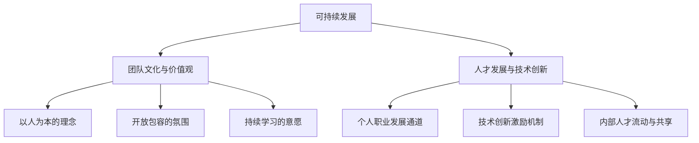

# IT团队的可持续发展

## 1.背景介绍

### 1.1 IT行业的快速发展与挑战
#### 1.1.1 技术革新与迭代加速
#### 1.1.2 市场竞争日益激烈  
#### 1.1.3 人才需求与短缺并存

### 1.2 IT团队面临的困境
#### 1.2.1 人员流失与招聘难题
#### 1.2.2 技术债务累积
#### 1.2.3 团队协作效率低下

### 1.3 可持续发展的重要性
#### 1.3.1 保障业务连续性
#### 1.3.2 提升团队竞争力
#### 1.3.3 实现长期价值创造

## 2.核心概念与联系

### 2.1 可持续发展的内涵
#### 2.1.1 平衡当前与长远利益
#### 2.1.2 兼顾个人与团队成长
#### 2.1.3 追求经济、社会与环境效益

### 2.2 团队文化与价值观
#### 2.2.1 以人为本的理念
#### 2.2.2 开放包容的氛围
#### 2.2.3 持续学习的意愿  

### 2.3 人才发展与技术创新
#### 2.3.1 个人职业发展通道
#### 2.3.2 技术创新激励机制
#### 2.3.3 内部人才流动与共享



## 3.核心原理与具体操作步骤

### 3.1 构建学习型组织
#### 3.1.1 营造持续学习的环境
#### 3.1.2 鼓励知识分享与传承
#### 3.1.3 提供多元化学习资源

### 3.2 优化人才发展体系
#### 3.2.1 建立职业发展双通道
#### 3.2.2 完善绩效考核与反馈
#### 3.2.3 加强导师辅导与教练

### 3.3 推动技术创新落地
#### 3.3.1 设立创新孵化器
#### 3.3.2 开展黑客松等创新活动
#### 3.3.3 引入创新项目评估机制

## 4.数学模型与公式讲解

### 4.1 人员流失预测模型
假设离职人数服从泊松分布，用 $P(X=k)=\frac{\lambda^k e^{-\lambda}}{k!}$ 计算k名员工离职的概率，其中$\lambda$为单位时间内平均离职人数。

### 4.2 团队绩效评估模型
引入平衡计分卡(BSC)，从财务、客户、内部流程、学习与成长四个维度综合评估团队绩效。
$$Score=\sum_{i=1}^n w_i \cdot s_i, \sum_{i=1}^n w_i=1$$
其中$w_i$为各维度权重，$s_i$为各维度得分，$i=1,2,3,4$分别代表四个维度。

### 4.3 创新项目价值评估模型
采用净现值(NPV)法评估创新项目的经济价值，用 $NPV=\sum_{t=0}^n \frac{NCF_t}{(1+r)^t}-I$ 计算创新项目的净现值，其中$NCF_t$为第t年的净现金流量，r为折现率，I为初始投资，n为项目寿命。

## 5.项目实践：代码实例与详解

### 5.1 员工画像系统
利用机器学习算法，根据员工的行为数据、绩效表现等构建员工画像，实现人才的精准管理与个性化发展。

```python
from sklearn.cluster import KMeans

# 员工特征数据
X = [[0.5, 0.6], [0.8, 0.3], [0.1, 0.4], [0.6, 0.8]]  

# 聚类分析
kmeans = KMeans(n_clusters=2).fit(X)

# 输出聚类结果
print(kmeans.labels_)  
print(kmeans.cluster_centers_)
```

### 5.2 技术债务管理平台
开发技术债务管理平台，对系统中的技术债进行识别、度量、跟踪和治理，提高代码质量和系统可维护性。

```java
public class TechnicalDebt {
    private String id;
    private String description;
    private int severity;
    private double principal;
    private double interest;
    
    // 构造函数、getter和setter方法
    
    public void calculateInterest() {
        // 计算技术债的利息
        interest = 0.05 * principal;
    }
}
```

### 5.3 创新项目管理工具
研发创新项目管理工具，支持创意收集、项目立项、任务分解、进度跟踪等功能，促进创新项目的高效实施。

```javascript
// 创新项目类
class InnovationProject {
    constructor(name, description, startDate, endDate) {
        this.name = name;
        this.description = description;
        this.startDate = startDate;
        this.endDate = endDate;
        this.tasks = [];
    }
    
    addTask(task) {
        this.tasks.push(task);
    }
    
    getTotalDuration() {
        // 计算项目总时长
        const timeDiff = this.endDate.getTime() - this.startDate.getTime();
        return Math.ceil(timeDiff / (1000 * 3600 * 24)); 
    }
}
```

## 6.实际应用场景

### 6.1 互联网企业的人才发展
阿里巴巴、腾讯等互联网巨头高度重视人才发展，建立了完善的职业发展通道和培养体系，注重员工的能力提升与个人成长。

### 6.2 制造业企业的技术创新
海尔、格力等制造业龙头企业坚持自主创新，鼓励员工参与技术攻关和产品研发，形成了持续不断的创新机制和能力。

### 6.3 金融机构的敏捷转型
工商银行、平安集团等金融机构积极推进敏捷转型，通过敏捷研发模式和DevOps实践，提升IT交付效率和质量，更好地支持业务创新。

## 7.工具和资源推荐

### 7.1 在线学习平台
- Coursera：提供来自世界顶尖大学和企业的在线课程。
- edX：由哈佛大学和麻省理工学院创办的大规模开放在线课程平台。

### 7.2 技术社区与博客
- GitHub：全球最大的开源社区，汇聚了海量的优秀开源项目。
- InfoQ：提供软件开发领域的新闻、文章、演讲视频等高质量内容。

### 7.3 敏捷项目管理工具
- JIRA：功能强大的项目与事务跟踪工具，广泛用于敏捷开发。
- Trello：简单易用的项目协作工具，以看板的方式直观呈现任务。

## 8.总结：未来发展趋势与挑战

### 8.1 数字化转型加速
数字化浪潮席卷各行各业，IT团队需要加快数字化转型步伐，利用云计算、大数据、人工智能等新技术重塑业务模式和流程。

### 8.2 人才竞争日益激烈
IT人才市场竞争日益激烈，团队需要制定更有吸引力的人才发展策略，营造良好的技术氛围和成长环境，吸引并留住优秀人才。

### 8.3 创新驱动发展
技术创新是IT企业的核心竞争力，团队需要持续加大研发投入，鼓励自主创新，加速新技术的应用和产业化，抢占市场先机。

## 9.附录：常见问题与解答

### 9.1 如何平衡短期业绩和长期发展？
要树立长期主义思维，在追求短期业绩的同时，也要关注人才培养、技术积累等长期发展要素，平衡当前收益和未来增长。

### 9.2 如何提升团队的创新能力？
营造鼓励创新的文化氛围，完善创新激励机制，搭建创新孵化平台，同时引入外部创新资源，多措并举提升自主创新能力。

### 9.3 如何应对人员流失风险？
建立人才梯队，完善职业发展通道，加强人文关怀，创造开放多元的工作环境，提高员工的获得感和归属感，减少人员流失。

作者：禅与计算机程序设计艺术 / Zen and the Art of Computer Programming