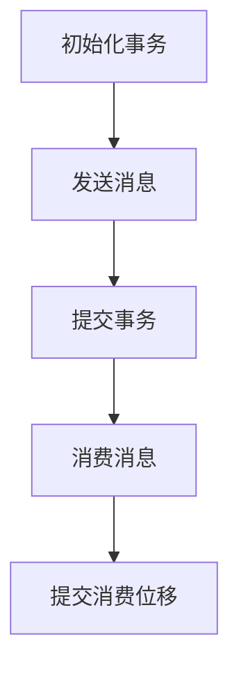

# KafkaGroup：理解Kafka的事务性与一致性

## 1.背景介绍

Apache Kafka 是一个分布式流处理平台，广泛应用于实时数据流处理、日志聚合、事件源系统等场景。Kafka 的高吞吐量、低延迟和高可用性使其成为现代数据架构的核心组件。然而，随着应用场景的复杂化，事务性和一致性问题变得越来越重要。本文将深入探讨 Kafka 的事务性与一致性，帮助读者更好地理解和应用这些概念。

## 2.核心概念与联系

### 2.1 事务性

事务性是指一组操作要么全部成功，要么全部失败的特性。Kafka 在 0.11.0.0 版本引入了事务性，以确保消息的原子性和一致性。事务性操作包括生产者的消息发送和消费者的消息消费。

### 2.2 一致性

一致性是指系统在任何时刻都能保证数据的正确性和完整性。Kafka 的一致性体现在消息的顺序性和持久性上。Kafka 通过分区和副本机制来保证数据的一致性。

### 2.3 事务性与一致性的联系

事务性和一致性是相辅相成的。事务性操作确保了数据的一致性，而一致性机制则为事务性操作提供了基础保障。Kafka 通过事务性机制和一致性协议，确保了数据在分布式环境中的可靠性和正确性。

## 3.核心算法原理具体操作步骤

### 3.1 事务性操作步骤

1. **初始化事务**：生产者初始化一个事务。
2. **发送消息**：生产者在事务中发送消息。
3. **提交事务**：生产者提交事务，确保消息被原子性地写入 Kafka。
4. **消费消息**：消费者读取消息，并在事务中处理。
5. **提交消费位移**：消费者提交消费位移，确保消息处理的一致性。

### 3.2 一致性操作步骤

1. **消息写入**：生产者将消息写入分区的主副本。
2. **副本同步**：主副本将消息同步到所有副本。
3. **消息确认**：所有副本确认消息写入成功。
4. **消息读取**：消费者从分区读取消息，确保消息的顺序性和一致性。

以下是 Kafka 事务性操作的 Mermaid 流程图：



## 4.数学模型和公式详细讲解举例说明

### 4.1 事务性数学模型

Kafka 的事务性可以用 ACID（原子性、一致性、隔离性、持久性）模型来描述：

- **原子性**：事务中的所有操作要么全部成功，要么全部失败。
- **一致性**：事务执行前后，系统状态保持一致。
- **隔离性**：事务之间相互独立，不受其他事务影响。
- **持久性**：事务一旦提交，结果永久保存。

### 4.2 一致性数学模型

Kafka 的一致性可以用 CAP（一致性、可用性、分区容忍性）理论来描述：

- **一致性**：所有节点在同一时间看到相同的数据。
- **可用性**：每个请求都能收到响应，无论成功或失败。
- **分区容忍性**：系统能在网络分区的情况下继续运行。

### 4.3 举例说明

假设有一个生产者 P 和两个消费者 C1 和 C2，P 发送消息 M1 和 M2，C1 和 C2 分别消费这些消息。通过事务性和一致性机制，确保以下条件：

1. P 发送 M1 和 M2 要么全部成功，要么全部失败。
2. C1 和 C2 读取到的消息顺序一致。
3. C1 和 C2 处理消息后，提交的消费位移一致。

## 5.项目实践：代码实例和详细解释说明

### 5.1 生产者事务性代码示例

```java
Properties props = new Properties();
props.put("bootstrap.servers", "localhost:9092");
props.put("key.serializer", "org.apache.kafka.common.serialization.StringSerializer");
props.put("value.serializer", "org.apache.kafka.common.serialization.StringSerializer");
props.put("transactional.id", "my-transactional-id");

KafkaProducer<String, String> producer = new KafkaProducer<>(props);
producer.initTransactions();

try {
    producer.beginTransaction();
    producer.send(new ProducerRecord<>("my-topic", "key1", "value1"));
    producer.send(new ProducerRecord<>("my-topic", "key2", "value2"));
    producer.commitTransaction();
} catch (ProducerFencedException | OutOfOrderSequenceException | AuthorizationException e) {
    producer.close();
} catch (KafkaException e) {
    producer.abortTransaction();
}
```

### 5.2 消费者事务性代码示例

```java
Properties props = new Properties();
props.put("bootstrap.servers", "localhost:9092");
props.put("group.id", "my-group");
props.put("enable.auto.commit", "false");
props.put("isolation.level", "read_committed");
props.put("key.deserializer", "org.apache.kafka.common.serialization.StringDeserializer");
props.put("value.deserializer", "org.apache.kafka.common.serialization.StringDeserializer");

KafkaConsumer<String, String> consumer = new KafkaConsumer<>(props);
consumer.subscribe(Arrays.asList("my-topic"));

while (true) {
    ConsumerRecords<String, String> records = consumer.poll(Duration.ofMillis(100));
    for (ConsumerRecord<String, String> record : records) {
        // 处理消息
    }
    consumer.commitSync();
}
```

### 5.3 代码解释

- **生产者事务性代码**：初始化事务，开始事务，发送消息，提交事务。如果发生异常，回滚事务。
- **消费者事务性代码**：设置隔离级别为 `read_committed`，确保只读取已提交的消息，处理消息后提交消费位移。

## 6.实际应用场景

### 6.1 金融交易系统

在金融交易系统中，事务性和一致性至关重要。Kafka 可以确保交易数据的原子性和一致性，防止数据丢失和重复处理。

### 6.2 实时数据分析

在实时数据分析场景中，Kafka 的事务性和一致性机制可以确保数据流的准确性和完整性，避免数据处理中的错误和不一致。

### 6.3 日志聚合

在日志聚合场景中，Kafka 可以确保日志数据的顺序性和一致性，方便后续的日志分析和处理。

## 7.工具和资源推荐

### 7.1 Kafka 官方文档

Kafka 官方文档提供了详细的 API 说明和使用指南，是学习 Kafka 的重要资源。

### 7.2 Kafka 社区

Kafka 社区是一个活跃的技术交流平台，包含了大量的技术讨论和问题解答。

### 7.3 开源项目

GitHub 上有许多开源的 Kafka 项目，可以参考这些项目的代码和实现，学习 Kafka 的最佳实践。

## 8.总结：未来发展趋势与挑战

### 8.1 未来发展趋势

随着数据量的不断增长和应用场景的复杂化，Kafka 的事务性和一致性机制将会进一步完善和优化。未来，Kafka 可能会引入更多的高级特性，如多数据中心支持、更加灵活的事务管理等。

### 8.2 挑战

尽管 Kafka 在事务性和一致性方面已经取得了很大的进展，但在高并发和大规模分布式环境下，仍然面临一些挑战。例如，如何在保证高性能的同时，进一步提高数据的一致性和可靠性，是一个需要持续研究和解决的问题。

## 9.附录：常见问题与解答

### 9.1 Kafka 的事务性如何保证消息的原子性？

Kafka 通过事务性 API 和内部的事务日志，确保消息的原子性。生产者在事务中发送的所有消息，要么全部成功，要么全部失败。

### 9.2 Kafka 的一致性如何保证消息的顺序性？

Kafka 通过分区和副本机制，确保消息的顺序性。每个分区内的消息按照写入顺序存储，消费者按照顺序读取消息。

### 9.3 如何处理 Kafka 中的事务冲突？

Kafka 通过事务 ID 和事务日志，检测和处理事务冲突。如果检测到事务冲突，Kafka 会回滚事务，确保数据的一致性。

### 9.4 Kafka 的事务性和一致性对性能有何影响？

事务性和一致性机制会增加一定的性能开销，但通过合理的配置和优化，可以将性能影响降到最低。例如，使用批量发送和异步提交，可以提高系统的吞吐量和响应速度。

### 9.5 如何监控和调试 Kafka 的事务性和一致性问题？

可以使用 Kafka 提供的监控工具和日志，监控和调试事务性和一致性问题。例如，使用 Kafka 的 JMX 指标，可以监控事务的提交和回滚情况，及时发现和解决问题。

---

作者：禅与计算机程序设计艺术 / Zen and the Art of Computer Programming