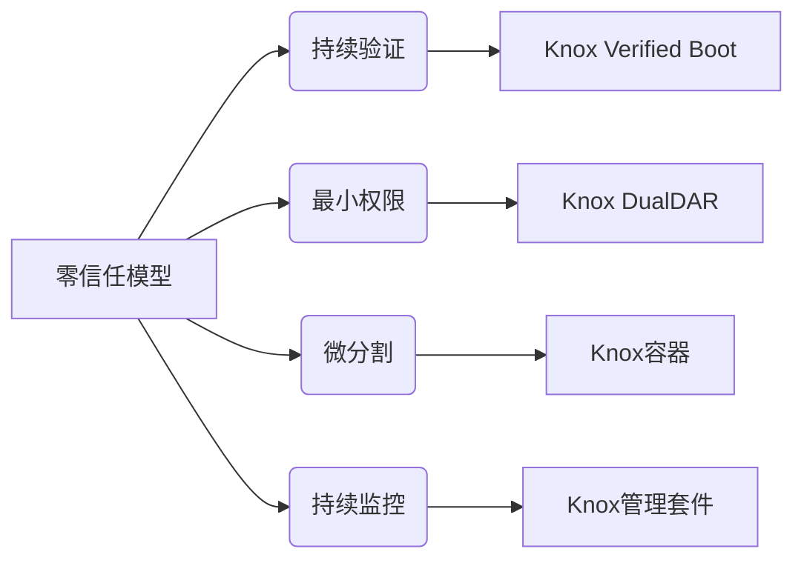
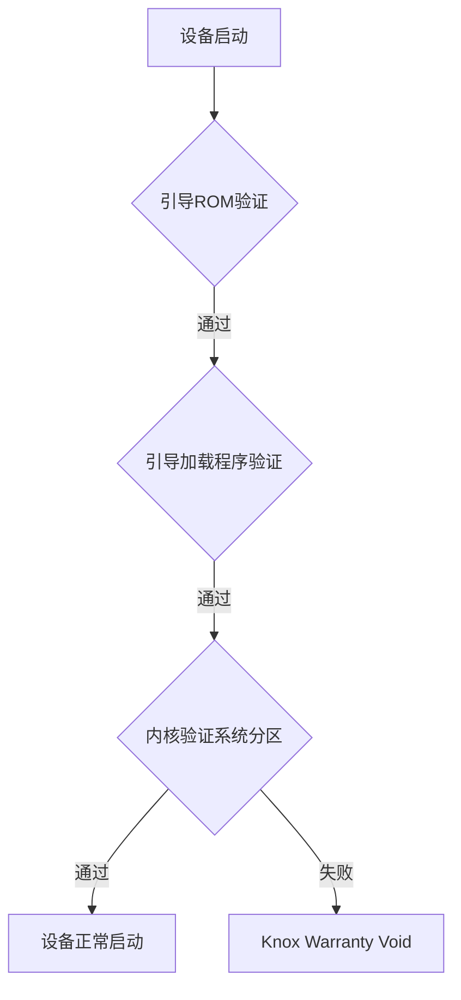

# Knox和零信任安全模型：构建无边界安全网络

## 1. 背景介绍
### 1.1 网络安全面临的挑战
随着企业数字化转型的加速,传统的网络边界正在消失。移动办公、云计算、物联网等新技术和应用场景的兴起,使得企业网络边界变得模糊,网络攻击面不断扩大。传统的基于边界防护的安全模型已经难以应对日益复杂的网络安全威胁。

### 1.2 零信任安全模型的提出
在此背景下,谷歌、Forrester等企业和研究机构先后提出了零信任(Zero Trust)安全模型。零信任安全模型的核心理念是:不再默认信任任何设备、用户和网络,在授予访问权限前都需要对其身份进行严格的认证和鉴权。

### 1.3 Knox在零信任安全中的作用
三星Knox作为业界领先的移动安全平台,为企业构建零信任安全架构提供了完整的解决方案。Knox通过设备完整性验证、数据加密、安全容器等关键技术,实现了从硬件到操作系统、从应用到数据的全方位防护,为企业打造无边界的安全网络奠定了基础。

## 2. 核心概念与联系
### 2.1 零信任安全模型
零信任安全模型包含以下几个核心原则:

1. 持续验证一切 - 包括用户、设备和应用
2. 最小权限访问 - 只授予完成任务所需的最小权限
3. 微分割网络 - 将网络划分为更小的安全区域
4. 持续监控和响应 - 实时检测异常行为并快速响应

### 2.2 Knox平台
Knox平台提供了一系列安全功能和管理工具,主要包括:

1. Knox Verified Boot - 验证设备完整性,防止系统被篡改
2. Knox DualDAR架构 - 将工作和个人数据存储在独立的加密分区
3. Knox容器 - 为企业应用和数据提供独立的安全运行环境 
4. Knox管理套件 - 包括EMM、E-FOTA等统一的设备管理工具

### 2.3 零信任与Knox的关系
Knox平台为实现零信任安全模型提供了关键支撑。通过Knox,企业可以:

1. 确保只有可信的设备和用户才能接入网络
2. 基于用户身份和设备状态动态调整访问权限
3. 利用Knox容器实现应用和数据的隔离与保护
4. 通过统一的管理平台实现对设备和威胁的可视化与控制



## 3. 核心算法原理与操作步骤
### 3.1 设备完整性验证
Knox Verified Boot基于可信引导(Trusted Boot)技术,在设备启动时对引导过程进行完整性验证,确保系统未被恶意篡改。其主要步骤包括:

1. 引导ROM验证引导加载程序的数字签名
2. 引导加载程序验证内核的数字签名
3. 内核启动后,验证系统分区的哈希值
4. 如果任一步骤验证失败,设备将进入Knox Warranty Void状态

### 3.2 数据加密与隔离
Knox DualDAR(Dual Data-At-Rest)架构通过将工作和个人数据存储在独立的加密分区,实现数据的隔离与保护。其核心原理是:

1. 将设备存储分为工作分区和个人分区
2. 分别对两个分区进行独立的全盘加密
3. 不同分区使用不同的加密密钥,相互隔离
4. 企业可以远程擦除工作分区,而不影响个人数据

### 3.3 安全容器
Knox容器利用基于ARM TrustZone技术的安全世界(Secure World),为企业应用和数据提供独立的运行环境。其工作原理是:

1. 普通应用运行在普通世界(Normal World)
2. 企业应用运行在安全世界,与普通应用隔离
3. 安全世界有独立的内存和存储空间,受TrustZone保护
4. 安全世界与普通世界的切换通过安全监视器(Secure Monitor)实现



## 4. 数学模型与公式
### 4.1 密码学基础
Knox平台广泛应用了现代密码学算法,为数据的机密性、完整性和不可抵赖性提供保障。其中涉及的主要数学模型包括:

1. 对称加密:如AES、TDES等,用于数据存储加密
   
   $C = E_k(M)$

   其中,$M$为明文数据,$k$为对称密钥,$E$为加密算法,$C$为密文

2. 非对称加密:如RSA、ECC等,用于密钥交换和数字签名
   
   $C = E_{pk}(M)$, $M = D_{sk}(C)$
   
   其中,$pk$为公钥,$sk$为私钥,$E$为加密算法,$D$为解密算法

3. 密码学哈希:如SHA-256等,用于完整性验证
   
   $H = Hash(M)$

   其中,$M$为输入消息,$Hash$为哈希函数,$H$为哈希值

### 4.2 设备完整性验证模型
Knox Verified Boot可以用以下数学模型来描述:

设$B_i$为第$i$个引导阶段,$S_i$为$B_i$的数字签名,则验证过程为:

$$
Verify(B_i, S_i, PK_i) = 
\begin{cases}
   \text{true},  & \text{if } S_i = Sign_{SK_i}(H(B_i)) \\
   \text{false}, & \text{otherwise}
\end{cases}
$$

其中,$PK_i$和$SK_i$分别为第$i$个阶段的公私钥对,$H$为哈希函数,$Sign$为签名算法。只有当每个阶段的验证都通过时,设备才能正常启动。

## 5. 项目实践
### 5.1 集成Knox SDK
为了在应用中集成Knox安全功能,开发者需要:

1. 在项目中引入Knox SDK
   
```java
dependencies {
   implementation 'com.samsung.android.knox:knox-sdk:2.0.0'
}
```

2. 在应用清单中声明所需权限

```xml
<uses-permission android:name="com.samsung.android.knox.permission.KNOX_CONTAINER"/>
```

3. 使用Knox SDK API调用相关功能,如创建Knox容器

```java
String id = "MyContainer";
KnoxContainerManager km = KnoxContainerManager.getInstance();
km.createContainer(id, "default", "MyContainer", true);
```

### 5.2 Knox容器管理
通过Knox SDK,开发者可以方便地管理Knox容器的生命周期:

1. 创建容器
   
```java
String id = "MyContainer";
KnoxContainerManager km = KnoxContainerManager.getInstance();
int flags = KnoxContainerManager.FLAG_CONTAINER_CREATE_CUSTOM;
km.createContainer(id, "default", "MyContainer", flags);
```

2. 启动/停止容器

```java
String id = "MyContainer";
KnoxContainerManager km = KnoxContainerManager.getInstance();
km.startContainer(id);
km.stopContainer(id);
```

3. 删除容器

```java
String id = "MyContainer";
KnoxContainerManager km = KnoxContainerManager.getInstance();
km.removeContainer(id);
```

### 5.3 Knox DualDAR加密
利用Knox DualDAR,可以对设备存储进行分区加密:

1. 创建加密分区
   
```java
sdpManager = SdpManager.getInstance();
int storageType = SdpManager.SDP_STORAGE_TYPE_INTERNAL;
sdpManager.createPartition("MyPartition", storageType, "password");
```

2. 挂载/卸载分区

```java
String partitionId = "MyPartition";
sdpManager.mountPartition(partitionId, "password");
sdpManager.unmountPartition(partitionId, true);
```

3. 删除分区

```java
String partitionId = "MyPartition";
sdpManager.removePartition(partitionId);
```

## 6. 实际应用场景
### 6.1 移动办公安全
在BYOD(Bring Your Own Device)和移动办公的趋势下,如何保护企业数据和应用成为了关键问题。Knox平台提供了完整的移动办公安全解决方案:

1. 通过Knox容器,将企业应用和数据与个人空间隔离
2. 利用DualDAR对企业数据进行加密保护
3. 通过EMM(企业移动管理)平台实现对设备的统一管理与控制

### 6.2 移动支付安全
移动支付是移动设备的重要应用场景之一。Knox平台为移动支付提供了坚实的安全保障:

1. 基于ARM TrustZone实现安全支付应用的隔离执行
2. 利用可信执行环境(TEE)保护敏感数据如PIN码、指纹等
3. 通过可信用户界面(Trusted UI)防止钓鱼攻击和屏幕劫持

### 6.3 物联网设备安全  
在物联网场景下,设备安全成为了新的挑战。Knox平台可以为物联网设备提供端到端的安全防护:

1. 通过安全引导确保设备系统完整性
2. 利用TrustZone实现关键功能的安全隔离
3. 提供安全的固件升级(E-FOTA)功能,防止固件被篡改

## 7. 工具和资源推荐
### 7.1 官方文档
三星官网提供了详尽的Knox平台文档,包括:

- Knox SDK API参考: https://docs.samsungknox.com/dev/knox-sdk/index.htm
- Knox白皮书: https://docs.samsungknox.com/admin/whitepaper/kpe/index.htm
- 最佳实践指南: https://docs.samsungknox.com/admin/best-practices/index.htm

### 7.2 开发者社区
三星开发者社区是与其他开发者交流Knox开发经验的好去处:

- Stack Overflow Knox标签: https://stackoverflow.com/questions/tagged/samsung-knox
- 三星开发者论坛: https://developer.samsung.com/forum/

### 7.3 第三方资源
除了官方资源,网上还有很多有价值的第三方Knox学习资料,例如:

- 书籍:《Android Security Internals》,《Mobile Security and Privacy》等
- 在线课程:Pluralsight,Coursera,Udemy等平台上都有相关课程
- 博客文章:XDA Developers,Android Central等

## 8. 未来发展与挑战
### 8.1 5G时代的安全
5G网络以其高速率、低延时、大连接的特点,将极大地促进移动互联网的发展。但同时,5G也带来了新的安全挑战,如:

- 更大的攻击面:5G将连接海量的设备,攻击面急剧扩大
- 更高的安全要求:5G将支撑关键基础设施,需要更高等级的安全
- 更复杂的安全生态:5G涉及到运营商、设备商、服务提供商等多方

Knox平台需要与5G安全标准紧密结合,在身份认证、访问控制、数据保护等方面提供更强的安全能力,成为5G时代的关键安全支撑。

### 8.2 AI安全
人工智能在带来便利的同时,也带来了新的安全隐患,例如:

- AI模型窃取和滥用
- 对抗样本攻击
- 数据和隐私泄露

未来Knox平台应借助AI技术提升自身安全能力,如利用机器学习实现智能威胁检测和响应。同时,Knox也应为AI应用提供必要的安全保障,如保护敏感的训练数据。

### 8.3 后量子密码学
量子计算机的出现对现有的密码学体系构成了严重的挑战。很多经典密码算法(如RSA)在量子计算机面前将不再安全。因此,迫切需要研究和采用后量子密码学算法。

未来Knox平台需要及时跟进后量子密码学的最新进展,适时引入如格基密码、哈希签名等抗量子算法,确保平台的长期安全。同时,还需要考虑后量子算法的性能和易用性,避免影响用户体验。

## 9. 常见问题与解答
### 9.1 Knox