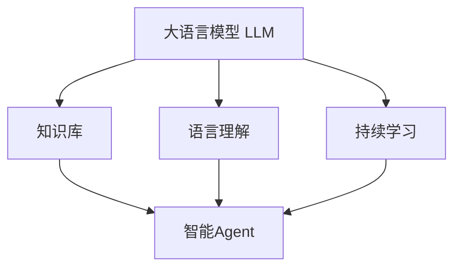

# LLM-based Agent的持续学习与进化

## 1. 背景介绍
### 1.1 人工智能的发展历程
#### 1.1.1 早期的人工智能
#### 1.1.2 机器学习的崛起
#### 1.1.3 深度学习的突破
### 1.2 大语言模型(LLM)的出现
#### 1.2.1 Transformer架构的提出
#### 1.2.2 GPT系列模型的发展
#### 1.2.3 LLM在各领域的应用
### 1.3 智能Agent的概念与发展
#### 1.3.1 Agent的定义与特点  
#### 1.3.2 传统的Agent设计方法
#### 1.3.3 基于LLM的Agent的优势

## 2. 核心概念与联系
### 2.1 大语言模型(LLM)
#### 2.1.1 LLM的定义与原理
#### 2.1.2 LLM的训练方法
#### 2.1.3 LLM的评估指标
### 2.2 智能Agent
#### 2.2.1 Agent的组成要素
#### 2.2.2 Agent的决策机制
#### 2.2.3 Agent的学习能力
### 2.3 LLM与Agent的结合
#### 2.3.1 LLM作为Agent的知识库
#### 2.3.2 LLM增强Agent的语言理解能力
#### 2.3.3 LLM赋予Agent持续学习的潜力



## 3. 核心算法原理与操作步骤
### 3.1 基于LLM的知识蒸馏
#### 3.1.1 知识蒸馏的概念
#### 3.1.2 将LLM的知识转移到Agent
#### 3.1.3 蒸馏过程中的损失函数设计
### 3.2 基于强化学习的Agent优化
#### 3.2.1 强化学习的基本原理
#### 3.2.2 将Agent的决策过程建模为马尔可夫决策过程
#### 3.2.3 使用策略梯度方法优化Agent的策略
### 3.3 持续学习的实现机制
#### 3.3.1 元学习的概念与方法
#### 3.3.2 将元学习应用于Agent的持续学习
#### 3.3.3 设计适应性强的学习算法

## 4. 数学模型与公式详解
### 4.1 Transformer模型的数学描述
#### 4.1.1 自注意力机制的计算过程
$$Attention(Q,K,V) = softmax(\frac{QK^T}{\sqrt{d_k}})V$$
#### 4.1.2 多头注意力的并行计算
$$MultiHead(Q,K,V) = Concat(head_1, ..., head_h)W^O$$
#### 4.1.3 前馈神经网络的计算
$$FFN(x) = max(0, xW_1 + b_1)W_2 + b_2$$
### 4.2 强化学习的数学建模
#### 4.2.1 马尔可夫决策过程的定义
$$M = (S,A,P,R,\gamma)$$
#### 4.2.2 策略梯度定理的推导
$$\nabla_\theta J(\theta) = \mathbb{E}_{\tau \sim p_\theta(\tau)}[\sum_{t=0}^T \nabla_\theta log \pi_\theta(a_t|s_t)Q^{\pi_\theta}(s_t,a_t)]$$
#### 4.2.3 价值函数的近似
$$V^{\pi}(s) \approx \hat{V}(s,w) = \phi(s)^T w$$
### 4.3 元学习的数学描述
#### 4.3.1 元学习的优化目标
$$\theta^* = \arg\min_\theta \mathbb{E}_{T_i \sim p(T)} [L_{T_i}(f_\theta)]$$
#### 4.3.2 MAML算法的更新过程
$$\theta_{i}' = \theta - \alpha \nabla_\theta L_{T_i}(f_\theta)$$
$$\theta \leftarrow \theta - \beta \nabla_\theta \sum_{T_i \sim p(T)} L_{T_i}(f_{\theta_i'})$$

## 5. 项目实践：代码实例与详解
### 5.1 使用PyTorch实现Transformer模型
```python
import torch
import torch.nn as nn

class SelfAttention(nn.Module):
    def __init__(self, embed_size, heads):
        super(SelfAttention, self).__init__()
        self.embed_size = embed_size
        self.heads = heads
        self.head_dim = embed_size // heads
        
        assert (self.head_dim * heads == embed_size), "Embed size needs to be divisible by heads"
        
        self.values = nn.Linear(self.head_dim, self.head_dim, bias=False)
        self.keys = nn.Linear(self.head_dim, self.head_dim, bias=False)
        self.queries = nn.Linear(self.head_dim, self.head_dim, bias=False)
        self.fc_out = nn.Linear(heads * self.head_dim, embed_size)
    
    def forward(self, values, keys, query, mask):
        N = query.shape[0]
        value_len, key_len, query_len = values.shape[1], keys.shape[1], query.shape[1]
        
        # Split the embedding into self.heads different pieces
        values = values.reshape(N, value_len, self.heads, self.head_dim)
        keys = keys.reshape(N, key_len, self.heads, self.head_dim)
        query = query.reshape(N, query_len, self.heads, self.head_dim)
        
        values = self.values(values)  # (N, value_len, heads, head_dim)
        keys = self.keys(keys)  # (N, key_len, heads, head_dim)
        queries = self.queries(query)  # (N, query_len, heads, heads_dim)
        
        energy = torch.einsum("nqhd,nkhd->nhqk", [queries, keys])  # (N, heads, query_len, key_len)
        
        if mask is not None:
            energy = energy.masked_fill(mask == 0, float("-1e20"))
        
        attention = torch.softmax(energy / (self.embed_size ** (1/2)), dim=3)
        
        out = torch.einsum("nhql,nlhd->nqhd", [attention, values]).reshape(
            N, query_len, self.heads * self.head_dim
        )
        # (N, query_len, heads, head_dim) then flatten last two dimensions
        
        out = self.fc_out(out)
        return out

class TransformerBlock(nn.Module):
    def __init__(self, embed_size, heads, dropout, forward_expansion):
        super(TransformerBlock, self).__init__()
        self.attention = SelfAttention(embed_size, heads)
        self.norm1 = nn.LayerNorm(embed_size)
        self.norm2 = nn.LayerNorm(embed_size)
        
        self.feed_forward = nn.Sequential(
            nn.Linear(embed_size, forward_expansion * embed_size),
            nn.ReLU(),
            nn.Linear(forward_expansion * embed_size, embed_size),
        )
        
        self.dropout = nn.Dropout(dropout)
        
    def forward(self, value, key, query, mask):
        attention = self.attention(value, key, query, mask)
        
        x = self.dropout(self.norm1(attention + query))
        forward = self.feed_forward(x)
        out = self.dropout(self.norm2(forward + x))
        return out
```

### 5.2 使用TensorFlow实现强化学习算法
```python
import tensorflow as tf
import numpy as np

class PolicyGradient:
    def __init__(self, n_actions, n_features, learning_rate=0.01, reward_decay=0.95):
        self.n_actions = n_actions
        self.n_features = n_features
        self.lr = learning_rate
        self.gamma = reward_decay
        
        self.ep_obs, self.ep_as, self.ep_rs = [], [], []
        
        self._build_net()
        
    def _build_net(self):
        with tf.name_scope('inputs'):
            self.tf_obs = tf.placeholder(tf.float32, [None, self.n_features], name="observations")
            self.tf_acts = tf.placeholder(tf.int32, [None, ], name="actions_num")
            self.tf_vt = tf.placeholder(tf.float32, [None, ], name="actions_value")
        
        layer = tf.layers.dense(
            inputs=self.tf_obs,
            units=10,
            activation=tf.nn.tanh,
            kernel_initializer=tf.random_normal_initializer(mean=0, stddev=0.3),
            bias_initializer=tf.constant_initializer(0.1),
            name='fc1'
        )
        
        all_act = tf.layers.dense(
            inputs=layer,
            units=self.n_actions,
            activation=None,
            kernel_initializer=tf.random_normal_initializer(mean=0, stddev=0.3),
            bias_initializer=tf.constant_initializer(0.1),
            name='fc2'
        )
        
        self.all_act_prob = tf.nn.softmax(all_act, name='act_prob')
        
        with tf.name_scope('loss'):
            neg_log_prob = tf.nn.sparse_softmax_cross_entropy_with_logits(logits=all_act, labels=self.tf_acts)
            loss = tf.reduce_mean(neg_log_prob * self.tf_vt)
        
        with tf.name_scope('train'):
            self.train_op = tf.train.AdamOptimizer(self.lr).minimize(loss)
            
    def choose_action(self, observation):
        prob_weights = self.sess.run(self.all_act_prob, feed_dict={self.tf_obs: observation[np.newaxis, :]})
        action = np.random.choice(range(prob_weights.shape[1]), p=prob_weights.ravel())
        return action
    
    def store_transition(self, s, a, r):
        self.ep_obs.append(s)
        self.ep_as.append(a)
        self.ep_rs.append(r)
        
    def learn(self):
        discounted_ep_rs_norm = self._discount_and_norm_rewards()
        
        self.sess.run(self.train_op, feed_dict={
             self.tf_obs: np.vstack(self.ep_obs),
             self.tf_acts: np.array(self.ep_as),
             self.tf_vt: discounted_ep_rs_norm,
        })
        
        self.ep_obs, self.ep_as, self.ep_rs = [], [], []
        return discounted_ep_rs_norm
    
    def _discount_and_norm_rewards(self):
        discounted_ep_rs = np.zeros_like(self.ep_rs)
        running_add = 0
        for t in reversed(range(0, len(self.ep_rs))):
            running_add = running_add * self.gamma + self.ep_rs[t]
            discounted_ep_rs[t] = running_add
        
        discounted_ep_rs -= np.mean(discounted_ep_rs)
        discounted_ep_rs /= np.std(discounted_ep_rs)
        return discounted_ep_rs
```

### 5.3 使用PyTorch实现MAML元学习算法
```python
import torch
import torch.nn as nn
import torch.nn.functional as F
import higher

class Net(nn.Module):
    def __init__(self, n_way, k_shot):
        super(Net, self).__init__()
        self.n_way = n_way
        self.k_shot = k_shot
        
        self.encoder = nn.Sequential(
            nn.Conv2d(3, 64, kernel_size=3, padding=1),
            nn.BatchNorm2d(64),
            nn.ReLU(inplace=True),
            nn.MaxPool2d(2),
            nn.Conv2d(64, 64, kernel_size=3, padding=1),
            nn.BatchNorm2d(64),
            nn.ReLU(inplace=True),
            nn.MaxPool2d(2),
            nn.Conv2d(64, 64, kernel_size=3, padding=1),
            nn.BatchNorm2d(64),
            nn.ReLU(inplace=True),
            nn.MaxPool2d(2)
        )
        
        self.classifier = nn.Linear(64, n_way)
        
    def forward(self, x):
        x = self.encoder(x)
        x = x.view(x.size(0), -1)
        x = self.classifier(x)
        return x

class MAML:
    def __init__(self, model, inner_lr, outer_lr, n_way, k_shot):
        self.model = model
        self.inner_lr = inner_lr
        self.outer_lr = outer_lr
        self.n_way = n_way
        self.k_shot = k_shot
        
        self.outer_opt = torch.optim.Adam(self.model.parameters(), lr=outer_lr)
        
    def train(self, support_x, support_y, query_x, query_y):
        self.model.train()
        
        task_num, _, _, _ = support_x.size()
        querysz = query_x.size(1)
        
        losses_q = []
        corrects = []
        
        for i in range(task_num):
            # Inner loop optimization
            with higher.innerloop_ctx(self.model, self.inner_opt, copy_initial_weights=False) as (fnet, diffopt):
                for _ in range(self.inner_steps):
                    support_logits = fnet(support_x[i])
                    support_loss = F.cross_entropy(support_logits, support_y[i])
                    diffopt.step(support_loss)
                
                # Outer loop optimization
                query_logits = fnet(query_x[i])
                query_loss = F.cross_entropy(query_logits, query_y[i])
                losses_q.append(query_loss)
                
                pred_q = F.softmax(query_logits, dim=1).argmax(dim=1)
                correct = torch.eq(pred_q, query_y[i]).sum().item()
                corr