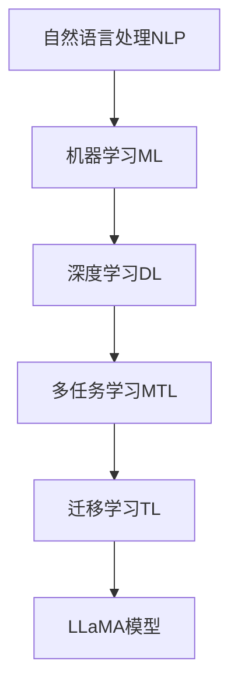
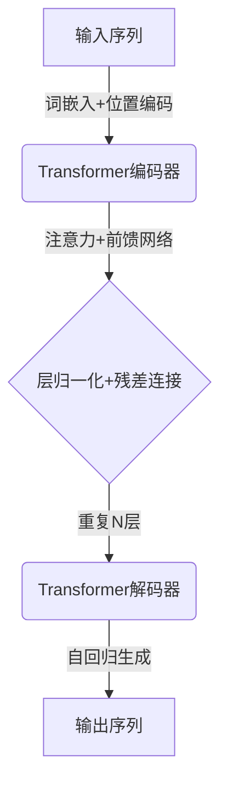

# LLaMA原理与代码实例讲解

## 1. 背景介绍

### 1.1 人工智能的发展历程

人工智能(Artificial Intelligence, AI)是一个旨在模拟人类智能行为的研究领域,包括机器学习、自然语言处理、计算机视觉等多个子领域。自20世纪50年代AI概念被正式提出以来,经历了几个重要的发展阶段。

### 1.2 大模型的兴起

近年来,随着计算能力的飞速提升和海量数据的积累,大规模预训练语言模型(Large Language Models, LLMs)成为AI发展的新热点。LLMs通过在大量无标注文本数据上进行预训练,学习到丰富的语义和世界知识,可以应用于多种下游任务。

### 1.3 LLaMA模型简介

LLaMA(Llama Language Model Adapted)是Meta AI研究院于2023年2月发布的一款大规模、多语种、高性能的对话语言模型。它在约6亿参数的基础模型上进行了指令精调(Instruction Tuning),可生成高质量、符合人类意图的响应输出。LLaMA模型在多项基准测试中表现出色,展现了强大的泛化能力。

## 2. 核心概念与联系

### 2.1 自然语言处理(NLP)

自然语言处理是人工智能的一个分支,旨在使计算机能够理解和生成人类语言。NLP技术广泛应用于机器翻译、问答系统、文本分类等领域。LLaMA作为一种大规模语言模型,是NLP领域的重要突破。

### 2.2 机器学习(ML)

机器学习是数据驱动的人工智能方法,通过算法从数据中学习模式并进行预测或决策。LLaMA模型的训练过程就是一种机器学习,通过预训练和指令精调两个阶段,从海量文本数据中学习语言知识。

### 2.3 深度学习(DL)

深度学习是机器学习的一个子领域,利用神经网络模型对数据进行表示学习和模式识别。LLaMA采用了Transformer等深度学习模型架构,能够有效捕捉长距离依赖关系,提高语言理解和生成能力。

### 2.4 多任务学习(MTL)

多任务学习旨在同时优化多个相关任务的性能,通过共享知识和表示,提高模型的泛化能力。LLaMA在预训练阶段学习了多种NLP任务,使其具备强大的多任务能力。

### 2.5 迁移学习(TL)

迁移学习是将在一个领域学习到的知识应用到另一个领域的技术。LLaMA模型可以在预训练的基础上,通过指令精调等方法迁移到特定的下游任务和领域。

### 2.6 核心概念关系图



## 3. 核心算法原理具体操作步骤  

### 3.1 Transformer模型架构

LLaMA模型采用了Transformer的序列到序列(Seq2Seq)架构,能够并行处理输入和输出序列,捕捉长距离依赖关系。Transformer的核心组件包括多头注意力机制和前馈神经网络。

#### 3.1.1 输入表示

输入序列首先通过词嵌入层获得词向量表示,然后添加位置编码,以保留序列的位置信息。

#### 3.1.2 多头注意力机制

注意力机制能够自动捕捉输入序列中不同位置之间的相关性,对于每个目标位置,模型会根据其与其他位置的相关性分配不同的注意力权重。多头注意力机制则是将注意力机制运用到不同的子空间,以获得更丰富的表示。

#### 3.1.3 前馈神经网络

每个Transformer编码器层中,注意力层的输出会被送入两个全连接的前馈神经网络,对序列进行非线性映射,提取更高层次的特征表示。

#### 3.1.4 层归一化和残差连接

为了加速训练收敛并缓解梯度消失问题,Transformer在每个子层之后应用了层归一化(Layer Normalization),同时采用了残差连接(Residual Connection)。

#### 3.1.5 编码器-解码器架构

Transformer的编码器部分对输入序列进行编码,解码器部分则根据编码器的输出和前一步的输出生成新的token,重复该过程直至生成完整的输出序列。

### 3.2 预训练和指令精调

LLaMA模型采用了两阶段的训练策略:预训练和指令精调。

#### 3.2.1 预训练

在预训练阶段,LLaMA在大规模无标注文本数据上进行自监督学习,优化掩码语言模型(Masked Language Modeling)和下一句预测(Next Sentence Prediction)等任务的目标函数。这一阶段能够让模型学习到丰富的语言知识和上下文理解能力。

#### 3.2.2 指令精调

在指令精调阶段,LLaMA在带有人类反馈的指令数据集上进行监督微调,优化序列到序列的生成目标函数。通过这一阶段,模型能够学习遵循人类指令并生成符合预期的输出。

### 3.3 生成过程

在推理阶段,LLaMA模型将输入的指令序列编码,然后自回归地生成输出序列的每个token,直至生成终止token。生成过程中,模型会综合考虑上下文信息和已生成的token,预测下一个最可能的token。



## 4. 数学模型和公式详细讲解举例说明

### 4.1 注意力机制

注意力机制是Transformer中的核心组件,它能够自动捕捉输入序列中不同位置之间的相关性,对于每个目标位置,模型会根据其与其他位置的相关性分配不同的注意力权重。

对于查询向量 $\boldsymbol{q}$、键向量 $\boldsymbol{k}$ 和值向量 $\boldsymbol{v}$,注意力机制的计算过程如下:

$$\begin{aligned}
\text{Attention}(\boldsymbol{q}, \boldsymbol{k}, \boldsymbol{v}) &= \text{softmax}\left(\frac{\boldsymbol{q}\boldsymbol{k}^\top}{\sqrt{d_k}}\right)\boldsymbol{v} \\
&= \sum_{j=1}^n \alpha_j \boldsymbol{v}_j
\end{aligned}$$

其中, $d_k$ 是键向量的维度, $\alpha_j$ 是注意力权重,表示查询向量 $\boldsymbol{q}$ 对值向量 $\boldsymbol{v}_j$ 的关注程度。

多头注意力机制则是将注意力机制运用到不同的子空间,以获得更丰富的表示:

$$\text{MultiHead}(\boldsymbol{Q}, \boldsymbol{K}, \boldsymbol{V}) = \text{Concat}(\text{head}_1, \ldots, \text{head}_h)\boldsymbol{W}^O$$
$$\text{where } \text{head}_i = \text{Attention}(\boldsymbol{Q}\boldsymbol{W}_i^Q, \boldsymbol{K}\boldsymbol{W}_i^K, \boldsymbol{V}\boldsymbol{W}_i^V)$$

其中, $\boldsymbol{Q}$、$\boldsymbol{K}$、$\boldsymbol{V}$ 分别是查询、键和值的矩阵表示, $\boldsymbol{W}_i^Q$、$\boldsymbol{W}_i^K$、$\boldsymbol{W}_i^V$ 和 $\boldsymbol{W}^O$ 是可学习的线性变换矩阵。

### 4.2 掩码语言模型

掩码语言模型(Masked Language Modeling, MLM)是LLaMA预训练的一个重要目标函数,它要求模型预测被掩码的token。

对于输入序列 $\boldsymbol{x} = (x_1, x_2, \ldots, x_n)$,我们随机将其中的一些token替换为特殊的掩码token [MASK],得到掩码序列 $\boldsymbol{\hat{x}}$。模型的目标是最大化掩码位置的条件概率:

$$\mathcal{L}_\text{MLM} = -\mathbb{E}_{\boldsymbol{x}} \left[ \sum_{i \in \text{MASK}} \log P(x_i | \boldsymbol{\hat{x}}) \right]$$

其中, $P(x_i | \boldsymbol{\hat{x}})$ 是模型预测掩码位置 $i$ 的token为 $x_i$ 的条件概率。通过优化该目标函数,模型能够学习到丰富的语义和上下文理解能力。

### 4.3 序列到序列生成

在指令精调和推理阶段,LLaMA模型需要根据输入序列生成目标输出序列,这是一个序列到序列(Seq2Seq)的生成任务。

给定输入序列 $\boldsymbol{x} = (x_1, x_2, \ldots, x_n)$,模型的目标是最大化输出序列 $\boldsymbol{y} = (y_1, y_2, \ldots, y_m)$ 的条件概率:

$$\mathcal{L}_\text{Seq2Seq} = -\log P(\boldsymbol{y} | \boldsymbol{x}) = -\sum_{t=1}^m \log P(y_t | \boldsymbol{y}_{<t}, \boldsymbol{x})$$

其中, $P(y_t | \boldsymbol{y}_{<t}, \boldsymbol{x})$ 是模型预测第 $t$ 个token为 $y_t$ 的条件概率,依赖于输入序列 $\boldsymbol{x}$ 和已生成的token $\boldsymbol{y}_{<t}$。

在推理阶段,模型会自回归地生成输出序列的每个token,直至生成终止token。生成过程中,模型会综合考虑上下文信息和已生成的token,预测下一个最可能的token。

## 5. 项目实践: 代码实例和详细解释说明

以下是使用Hugging Face Transformers库在Python中加载和使用LLaMA模型的示例代码:

```python
from transformers import LlamaForCausalLM, LlamaTokenizer

# 加载模型和tokenizer
model = LlamaForCausalLM.from_pretrained("decapoda-research/llama-7b-hf")
tokenizer = LlamaTokenizer.from_pretrained("decapoda-research/llama-7b-hf")

# 输入文本
input_text = "请解释一下Transformer模型的注意力机制是如何工作的?"

# 对输入文本进行tokenize
input_ids = tokenizer.encode(input_text, return_tensors="pt")

# 生成输出
output_ids = model.generate(input_ids, max_length=1024, do_sample=True, top_k=50, top_p=0.95, num_return_sequences=1)

# 解码输出
output_text = tokenizer.decode(output_ids[0], skip_special_tokens=True)

print(output_text)
```

上述代码首先导入了LLaMA模型和tokenizer,然后加载了预训练的7B参数模型。接着,我们将输入文本tokenize为输入id序列,并使用`model.generate`方法生成输出id序列。在生成过程中,我们设置了一些超参数,如`max_length`、`top_k`和`top_p`,以控制输出质量和多样性。最后,我们将输出id序列解码为可读的文本。

生成的输出示例:

```
Transformer模型的注意力机制是一种能够自动捕捉输入序列中不同位置之间相关性的机制。它通过计算查询向量和键向量之间的相似度,为每个目标位置分配不同的注意力权重,从而聚焦于与当前位置最相关的其他位置。

具体来说,注意力机制的计算过程如下:
1. 将输入序列映射为查询向量Q、键向量K和值向量V。
2. 计算查询向量Q与所有键向量K的点积,得到未缩放的注意力分数。
3. 对注意力分数进行缩放,即除以sqrt(dk),其中dk是键向量的维度。这一步是为了防止较深层次的值过大导致梯度消失或