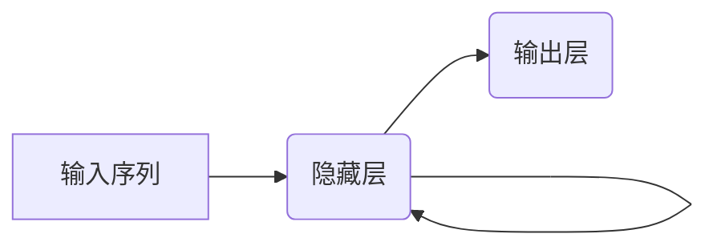
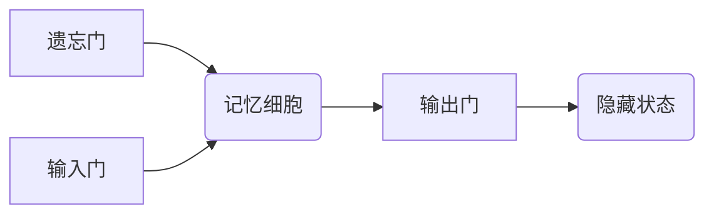

# LSTM的未来之路：人工智能的无限可能

## 1.背景介绍

### 1.1 人工智能的崛起

人工智能(Artificial Intelligence, AI)作为一门前沿交叉学科,已经渗透到我们生活的方方面面。从语音助手到无人驾驶,从医疗诊断到金融投资,人工智能正在彻底改变着我们的生活方式。在这场由数据和算法驱动的科技革命中,长短期记忆网络(Long Short-Term Memory, LSTM)无疑扮演着关键角色。

### 1.2 LSTM的重要性

LSTM是一种特殊的递归神经网络,擅长处理序列数据,如文本、语音和时间序列等。它的核心优势在于能够有效地解决长期依赖问题,捕捉数据中的长期模式和依赖关系。凭借这一独特能力,LSTM已广泛应用于自然语言处理、语音识别、机器翻译、时间序列预测等领域,为人工智能的发展做出了卓越贡献。

## 2.核心概念与联系 

### 2.1 递归神经网络

LSTM属于递归神经网络(Recurrent Neural Network, RNN)的一种,RNN是一类专门设计用于处理序列数据的神经网络。与传统的前馈神经网络不同,RNN在隐藏层之间建立了循环连接,使得网络能够对序列数据进行动态建模,捕捉数据中的时间或空间依赖关系。



然而,标准的RNN在处理长序列时容易出现梯度消失或爆炸问题,导致无法有效捕获长期依赖关系。为了解决这一问题,LSTM被提出并广为使用。

### 2.2 LSTM的核心结构

LSTM网络的核心是一个记忆细胞(Memory Cell),它被设计为能够有选择性地记住或遗忘信息。每个记忆细胞都包含一个状态向量,用于存储历史信息。在每个时间步,记忆细胞会根据当前输入和前一时间步的状态,决定保留、更新或遗忘哪些信息。

这种选择性记忆的能力赋予了LSTM捕捉长期依赖关系的能力,使其在处理长序列数据时表现出色。LSTM的核心结构包括遗忘门(Forget Gate)、输入门(Input Gate)和输出门(Output Gate),它们共同控制着信息的流动。



### 2.3 LSTM与其他神经网络的关系

LSTM是RNN家族中的一员,但也与其他神经网络模型存在密切联系。例如,卷积神经网络(Convolutional Neural Network, CNN)常与LSTM结合使用,用于处理图像序列或视频数据。此外,LSTM也被广泛应用于生成式对抗网络(Generative Adversarial Network, GAN)和变分自编码器(Variational Autoencoder, VAE)等生成模型中,用于生成序列数据。

## 3.核心算法原理具体操作步骤

LSTM的核心算法原理可以分为以下几个步骤:

### 3.1 遗忘门

遗忘门决定了从前一时间步传递过来的细胞状态中,哪些信息需要被遗忘或保留。它通过一个sigmoid函数计算出一个介于0和1之间的权重向量,将其与前一时间步的细胞状态相乘,从而实现对信息的选择性遗忘。

$$
f_t = \sigma(W_f \cdot [h_{t-1}, x_t] + b_f)
$$

其中,$f_t$表示遗忘门的激活值向量,$W_f$和$b_f$分别是遗忘门的权重矩阵和偏置向量,$h_{t-1}$是前一时间步的隐藏状态向量,$x_t$是当前时间步的输入向量。

### 3.2 输入门

输入门决定了当前时间步的输入信息中,哪些需要被更新到细胞状态中。它包括两个部分:一个sigmoid函数决定更新的程度,另一个tanh函数创建一个新的候选细胞状态向量。

$$
i_t = \sigma(W_i \cdot [h_{t-1}, x_t] + b_i)
$$
$$
\tilde{C}_t = \tanh(W_C \cdot [h_{t-1}, x_t] + b_C)
$$

其中,$i_t$表示输入门的激活值向量,$W_i$和$b_i$分别是输入门的权重矩阵和偏置向量,$\tilde{C}_t$是新的候选细胞状态向量,$W_C$和$b_C$分别是候选细胞状态的权重矩阵和偏置向量。

### 3.3 细胞状态更新

将遗忘门和输入门的结果综合起来,根据如下公式更新细胞状态:

$$
C_t = f_t \odot C_{t-1} + i_t \odot \tilde{C}_t
$$

其中,$C_t$是当前时间步的细胞状态向量,$\odot$表示元素wise乘积运算。新的细胞状态是前一时间步的细胞状态经过遗忘门过滤后,与当前输入门控制的新信息相加的结果。

### 3.4 输出门

输出门决定了细胞状态中的哪些信息需要被输出到最终的隐藏状态中,供下一时间步或最终输出使用。它同样包括一个sigmoid函数和一个tanh函数。

$$
o_t = \sigma(W_o \cdot [h_{t-1}, x_t] + b_o)
$$
$$
h_t = o_t \odot \tanh(C_t)
$$

其中,$o_t$表示输出门的激活值向量,$W_o$和$b_o$分别是输出门的权重矩阵和偏置向量,$h_t$是当前时间步的隐藏状态向量。

通过上述四个步骤,LSTM能够选择性地保留、更新和输出信息,从而有效捕捉长期依赖关系。这种独特的设计使得LSTM在处理长序列数据时表现出色,成为序列建模的主流方法之一。

## 4.数学模型和公式详细讲解举例说明

为了更好地理解LSTM的数学原理,我们将通过一个具体的例子来详细说明LSTM在处理序列数据时的运作过程。

假设我们有一个包含5个时间步的序列数据$X = [x_1, x_2, x_3, x_4, x_5]$,其中每个$x_t$是一个向量,表示当前时间步的输入。我们的目标是基于这个序列预测一个输出$y$。

在LSTM中,每个时间步都会更新一次隐藏状态$h_t$和细胞状态$C_t$。初始时,我们将$h_0$和$C_0$设置为全0向量。

### 4.1 时间步1

在第一个时间步,LSTM将根据输入$x_1$计算出遗忘门$f_1$、输入门$i_1$、输出门$o_1$以及候选细胞状态$\tilde{C}_1$:

$$
f_1 = \sigma(W_f \cdot [h_0, x_1] + b_f)
$$
$$
i_1 = \sigma(W_i \cdot [h_0, x_1] + b_i)
$$
$$
\tilde{C}_1 = \tanh(W_C \cdot [h_0, x_1] + b_C)
$$
$$
o_1 = \sigma(W_o \cdot [h_0, x_1] + b_o)
$$

由于$h_0$和$C_0$都是全0向量,所以$f_1$实际上决定了是否保留初始的全0细胞状态。然后,LSTM将根据上述门控值和候选细胞状态,更新细胞状态$C_1$和隐藏状态$h_1$:

$$
C_1 = f_1 \odot C_0 + i_1 \odot \tilde{C}_1 = i_1 \odot \tilde{C}_1
$$
$$
h_1 = o_1 \odot \tanh(C_1)
$$

### 4.2 时间步2

在第二个时间步,LSTM将根据输入$x_2$和前一时间步的隐藏状态$h_1$计算出新的门控值和候选细胞状态:

$$
f_2 = \sigma(W_f \cdot [h_1, x_2] + b_f)
$$
$$
i_2 = \sigma(W_i \cdot [h_1, x_2] + b_i)
$$
$$
\tilde{C}_2 = \tanh(W_C \cdot [h_1, x_2] + b_C)
$$
$$
o_2 = \sigma(W_o \cdot [h_1, x_2] + b_o)
$$

然后,LSTM将根据这些值和前一时间步的细胞状态$C_1$,更新新的细胞状态$C_2$和隐藏状态$h_2$:

$$
C_2 = f_2 \odot C_1 + i_2 \odot \tilde{C}_2
$$
$$
h_2 = o_2 \odot \tanh(C_2)
$$

可以看出,在第二个时间步,LSTM不仅考虑了当前输入$x_2$,还融合了前一时间步的隐藏状态$h_1$和细胞状态$C_1$,从而能够捕捉到序列数据中的长期依赖关系。

### 4.3 后续时间步

对于后续的时间步3、4和5,LSTM将以类似的方式进行计算,每次都会根据当前输入$x_t$、前一时间步的隐藏状态$h_{t-1}$和细胞状态$C_{t-1}$,计算出新的门控值、候选细胞状态,并更新新的细胞状态$C_t$和隐藏状态$h_t$。

通过这种递归的方式,LSTM能够在整个序列上传递信息,并根据门控机制选择性地保留、更新和输出相关信息。最终,我们可以基于最后一个时间步的隐藏状态$h_5$,通过一个额外的输出层计算出预测值$y$。

该例子清楚地说明了LSTM在处理序列数据时的工作原理。通过门控机制和细胞状态的设计,LSTM能够有效地捕捉长期依赖关系,从而在诸多序列建模任务中取得了卓越的表现。

## 5.项目实践:代码实例和详细解释说明

为了更好地理解LSTM的实现细节,我们将使用Python中的深度学习框架PyTorch来构建一个基于LSTM的序列建模项目。在这个项目中,我们将使用一个简单的数据集,并训练一个LSTM模型来预测序列的下一个元素。

### 5.1 准备数据集

我们将使用一个人工构造的数据集,它包含一系列长度为5的序列,每个序列由0到9之间的随机整数组成。我们的目标是根据前4个数字预测第5个数字。

```python
import torch
from torch.utils.data import Dataset

class SequenceDataset(Dataset):
    def __init__(self, num_sequences=1000):
        self.data = torch.randint(0, 10, (num_sequences, 5))

    def __len__(self):
        return len(self.data)

    def __getitem__(self, idx):
        sequence = self.data[idx]
        X = sequence[:-1]
        y = sequence[-1]
        return X, y
```

在上面的代码中,我们定义了一个`SequenceDataset`类,它继承自PyTorch的`Dataset`类。在初始化时,我们生成了1000个长度为5的随机整数序列。`__getitem__`方法用于获取单个样本,它将序列分为输入`X`(前4个数字)和目标`y`(第5个数字)。

### 5.2 构建LSTM模型

接下来,我们将定义一个LSTM模型,它将输入序列作为输入,并预测下一个元素。

```python
import torch.nn as nn

class LSTMModel(nn.Module):
    def __init__(self, input_size, hidden_size, output_size):
        super(LSTMModel, self).__init__()
        self.hidden_size = hidden_size
        self.lstm = nn.LSTM(input_size, hidden_size, batch_first=True)
        self.fc = nn.Linear(hidden_size, output_size)

    def forward(self, x):
        batch_size = x.size(0)
        h0 = torch.zeros(1, batch_size, self.hidden_size)
        c0 = torch.zeros(1, batch_size, self.hidden_size)
        _, (hn, cn) = self.lstm(x, (h0, c0))
        out = self.fc(