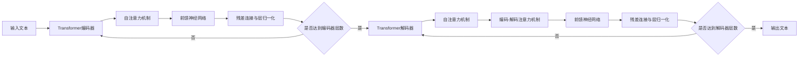

# Megatron-Turing NLG原理与代码实例讲解

## 1. 背景介绍
### 1.1 大语言模型的发展历程
#### 1.1.1 Transformer的提出
#### 1.1.2 GPT系列模型的演进
#### 1.1.3 Megatron-LM的提出

### 1.2 Megatron-Turing NLG的诞生
#### 1.2.1 NVIDIA与微软的合作
#### 1.2.2 Megatron-Turing NLG的特点
#### 1.2.3 Megatron-Turing NLG的应用前景

## 2. 核心概念与联系
### 2.1 Transformer架构
#### 2.1.1 自注意力机制
#### 2.1.2 前馈神经网络
#### 2.1.3 残差连接与层归一化

### 2.2 自回归语言模型
#### 2.2.1 语言模型的概念
#### 2.2.2 自回归的原理
#### 2.2.3 自回归语言模型的优势

### 2.3 模型并行与数据并行
#### 2.3.1 模型并行的概念
#### 2.3.2 数据并行的概念
#### 2.3.3 模型并行与数据并行的结合

### 2.4 混合精度训练
#### 2.4.1 混合精度的概念
#### 2.4.2 混合精度训练的优势
#### 2.4.3 混合精度训练的实现

## 3. 核心算法原理与具体操作步骤
### 3.1 Megatron-Turing NLG的整体架构
#### 3.1.1 编码器-解码器结构
#### 3.1.2 多头注意力机制
#### 3.1.3 前馈神经网络与残差连接

### 3.2 模型并行的实现
#### 3.2.1 张量切片
#### 3.2.2 流水线并行
#### 3.2.3 数据并行与ZeRO优化器

### 3.3 混合精度训练的实现
#### 3.3.1 自动混合精度
#### 3.3.2 损失缩放
#### 3.3.3 动态损失缩放

### 3.4 训练过程与优化策略
#### 3.4.1 学习率调度
#### 3.4.2 权重衰减
#### 3.4.3 梯度裁剪

## 4. 数学模型和公式详细讲解举例说明
### 4.1 自注意力机制的数学表示
#### 4.1.1 查询、键、值的计算
#### 4.1.2 注意力权重的计算
#### 4.1.3 注意力输出的计算

### 4.2 前馈神经网络的数学表示
#### 4.2.1 线性变换
#### 4.2.2 激活函数
#### 4.2.3 残差连接与层归一化

### 4.3 自回归语言模型的数学表示
#### 4.3.1 条件概率的计算
#### 4.3.2 交叉熵损失函数
#### 4.3.3 困惑度的计算

### 4.4 混合精度训练的数学表示
#### 4.4.1 量化与反量化
#### 4.4.2 损失缩放的计算
#### 4.4.3 梯度裁剪的数学表示

## 5. 项目实践：代码实例和详细解释说明
### 5.1 Megatron-Turing NLG的代码结构
#### 5.1.1 模型定义
#### 5.1.2 数据处理
#### 5.1.3 训练与评估

### 5.2 模型并行的代码实现
#### 5.2.1 张量切片的代码实现
#### 5.2.2 流水线并行的代码实现
#### 5.2.3 ZeRO优化器的代码实现

### 5.3 混合精度训练的代码实现
#### 5.3.1 自动混合精度的代码实现
#### 5.3.2 损失缩放的代码实现
#### 5.3.3 动态损失缩放的代码实现

### 5.4 训练与评估的代码实现
#### 5.4.1 数据加载与预处理
#### 5.4.2 模型训练的代码实现
#### 5.4.3 模型评估的代码实现

## 6. 实际应用场景
### 6.1 文本生成
#### 6.1.1 开放域对话生成
#### 6.1.2 故事生成
#### 6.1.3 诗歌生成

### 6.2 文本摘要
#### 6.2.1 单文档摘要
#### 6.2.2 多文档摘要
#### 6.2.3 抽取式摘要与生成式摘要

### 6.3 机器翻译
#### 6.3.1 单语言对翻译
#### 6.3.2 多语言翻译
#### 6.3.3 无监督机器翻译

### 6.4 问答系统
#### 6.4.1 阅读理解式问答
#### 6.4.2 知识库问答
#### 6.4.3 常识问答

## 7. 工具和资源推荐
### 7.1 开源实现
#### 7.1.1 NVIDIA Megatron-LM
#### 7.1.2 Microsoft DeepSpeed
#### 7.1.3 Hugging Face Transformers

### 7.2 预训练模型
#### 7.2.1 Megatron-Turing NLG 345M
#### 7.2.2 Megatron-Turing NLG 530B
#### 7.2.3 GPT-3

### 7.3 数据集
#### 7.3.1 WikiText
#### 7.3.2 OpenWebText
#### 7.3.3 Common Crawl

### 7.4 训练资源
#### 7.4.1 NVIDIA GPU集群
#### 7.4.2 微软Azure云平台
#### 7.4.3 Google Cloud TPU

## 8. 总结：未来发展趋势与挑战
### 8.1 模型规模的扩大
#### 8.1.1 参数量的增加
#### 8.1.2 计算资源的需求
#### 8.1.3 训练效率的提升

### 8.2 预训练范式的发展
#### 8.2.1 无监督预训练
#### 8.2.2 自监督预训练
#### 8.2.3 多任务预训练

### 8.3 模型的可解释性与可控性
#### 8.3.1 注意力可视化
#### 8.3.2 模型蒸馏与压缩
#### 8.3.3 可控文本生成

### 8.4 多模态语言模型
#### 8.4.1 文本-图像预训练模型
#### 8.4.2 文本-语音预训练模型
#### 8.4.3 多模态融合与对齐

## 9. 附录：常见问题与解答
### 9.1 Megatron-Turing NLG与GPT-3的区别
### 9.2 如何高效地微调Megatron-Turing NLG
### 9.3 Megatron-Turing NLG在推理阶段的加速方法
### 9.4 Megatron-Turing NLG生成文本的多样性问题
### 9.5 Megatron-Turing NLG在实际应用中的局限性

Megatron-Turing NLG是由NVIDIA与微软合作推出的大规模语言模型。它基于Transformer架构，采用了自回归的训练范式，通过海量文本数据的预训练，可以生成高质量的自然语言文本。

Megatron-Turing NLG的核心在于其强大的并行化能力。通过模型并行和数据并行的结合，Megatron-Turing NLG可以在多个GPU上高效地训练超大规模的语言模型。模型并行将模型的不同部分分配到不同的GPU上，而数据并行则在多个GPU上复制模型，并行处理不同的数据子集。此外，Megatron-Turing NLG还采用了混合精度训练，通过在不同的计算阶段使用不同的数值精度，在保证模型性能的同时显著降低了训练时间和内存消耗。

在模型架构方面，Megatron-Turing NLG采用了Transformer的编码器-解码器结构。编码器通过自注意力机制对输入文本进行编码，捕捉文本中的长距离依赖关系。解码器同样使用自注意力机制，并引入了编码-解码注意力机制，根据编码器的输出生成目标文本。前馈神经网络和残差连接则用于增强模型的表达能力和训练稳定性。

Megatron-Turing NLG在训练过程中使用了多种优化策略，如学习率调度、权重衰减和梯度裁剪等，以确保模型的收敛和泛化性能。同时，Megatron-Turing NLG还引入了一些新的技术，如ZeRO优化器，进一步提升了模型的训练效率。

在实际应用中，Megatron-Turing NLG展现出了强大的自然语言生成能力。它可以应用于开放域对话、故事生成、文本摘要、机器翻译等多个任务，生成流畅、连贯且富有创意的文本。此外，Megatron-Turing NLG还可以用于构建问答系统，回答用户的各种问题。

为了方便研究人员和开发者使用Megatron-Turing NLG，NVIDIA和微软分别开源了Megatron-LM和DeepSpeed等实现。同时，他们还提供了多个预训练的Megatron-Turing NLG模型，以及相关的数据集和训练资源，降低了模型应用的门槛。

展望未来，大规模语言模型的发展趋势主要体现在以下几个方面：模型规模的进一步扩大、预训练范式的不断发展、模型可解释性与可控性的提升，以及多模态语言模型的兴起。然而，这些发展也伴随着计算资源需求的增加、训练效率的挑战、生成文本多样性的问题等困难。

总之，Megatron-Turing NLG代表了大规模语言模型的重要里程碑。它不仅展示了海量数据预训练和大规模并行化的威力，也为自然语言处理领域的发展开辟了新的道路。相信通过学术界和工业界的共同努力，大规模语言模型必将在更广泛的应用场景中发挥重要作用，推动人工智能技术的进一步发展。

作者：禅与计算机程序设计艺术 / Zen and the Art of Computer Programming