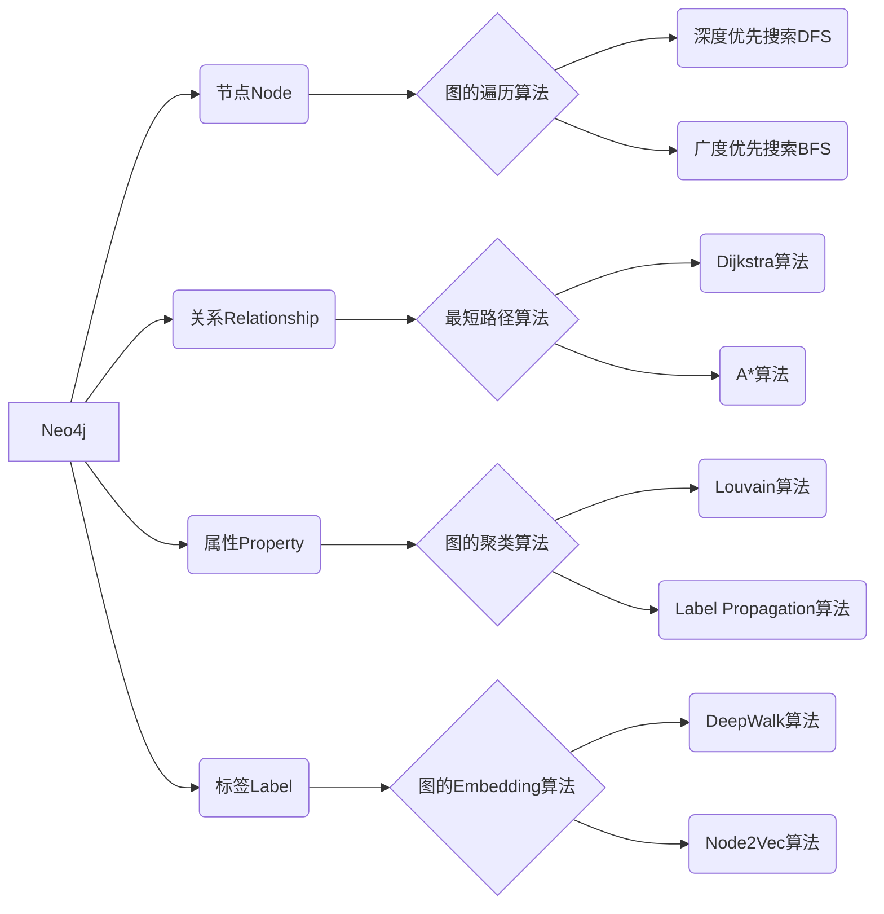
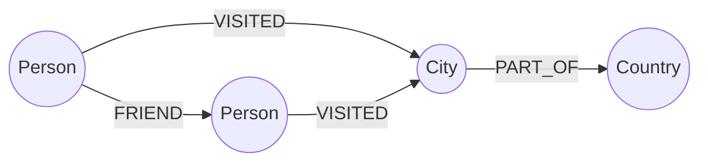

# Neo4j原理与代码实例讲解

## 1. 背景介绍
### 1.1 图数据库的兴起
### 1.2 Neo4j的诞生与发展
### 1.3 Neo4j在行业中的应用现状

## 2. 核心概念与联系
### 2.1 图的基本概念
#### 2.1.1 节点(Node)
#### 2.1.2 关系(Relationship) 
#### 2.1.3 属性(Property)
#### 2.1.4 标签(Label)
### 2.2 Neo4j的数据模型
#### 2.2.1 节点与关系的表示
#### 2.2.2 属性的存储方式
#### 2.2.3 Schema-free的特点
### 2.3 图数据库与关系型数据库的区别
#### 2.3.1 数据模型差异
#### 2.3.2 查询方式差异
#### 2.3.3 适用场景差异

## 3. 核心算法原理具体操作步骤
### 3.1 图的遍历算法
#### 3.1.1 深度优先搜索(DFS)
#### 3.1.2 广度优先搜索(BFS)
### 3.2 最短路径算法
#### 3.2.1 Dijkstra算法
#### 3.2.2 A*算法
### 3.3 图的聚类算法
#### 3.3.1 Louvain算法
#### 3.3.2 Label Propagation算法
### 3.4 图的Embedding算法
#### 3.4.1 DeepWalk算法
#### 3.4.2 Node2Vec算法

## 4. 数学模型和公式详细讲解举例说明
### 4.1 图的数学表示
#### 4.1.1 邻接矩阵
#### 4.1.2 邻接表
### 4.2 图的度量指标
#### 4.2.1 点的度
#### 4.2.2 图的密度
#### 4.2.3 聚类系数
### 4.3 随机游走的数学模型
#### 4.3.1 转移概率矩阵
#### 4.3.2 平稳分布

## 5. 项目实践：代码实例和详细解释说明 
### 5.1 使用Neo4j构建电影图谱
#### 5.1.1 数据准备与导入
#### 5.1.2 Cypher查询语句
#### 5.1.3 可视化展示
### 5.2 基于Neo4j的社交网络分析
#### 5.2.1 数据建模
#### 5.2.2 关键用户挖掘
#### 5.2.3 社区发现
### 5.3 使用Neo4j进行知识图谱构建
#### 5.3.1 本体构建
#### 5.3.2 实体抽取与链接
#### 5.3.3 知识推理

## 6. 实际应用场景
### 6.1 金融风控领域
### 6.2 社交网络分析
### 6.3 推荐系统
### 6.4 知识图谱

## 7. 工具和资源推荐
### 7.1 Neo4j官方文档
### 7.2 Neo4j Desktop
### 7.3 Neo4j Bloom
### 7.4 APOC工具库
### 7.5 图可视化工具

## 8. 总结：未来发展趋势与挑战
### 8.1 图数据库的发展趋势
### 8.2 Neo4j面临的机遇与挑战
### 8.3 图数据库在人工智能领域的应用前景

## 9. 附录：常见问题与解答
### 9.1 如何选择合适的图数据库？
### 9.2 Neo4j的性能如何优化？
### 9.3 如何进行Neo4j集群部署？



Neo4j是一个高性能的NoSQL图形数据库，它将结构化数据存储在网络上而不是表中。它是一个嵌入式、基于磁盘的、具备完全的事务特性的Java持久化引擎，但是它将结构化数据存储在网络(从数学角度叫做图)上而不是表中。

Neo4j的数据模型由以下几个核心概念组成：

1. 节点(Node):图中的对象,可以带有属性(Property)
2. 关系(Relationship):连接节点,并且关系也可以带有属性
3. 属性(Property):键值对,存储在节点或关系上
4. 标签(Label):为节点分组,一个节点可以有多个标签

下图展示了一个简单的Neo4j数据模型示例:



与传统的关系型数据库相比,Neo4j的数据模型更加灵活,非常适合处理高度关联的数据。关系型数据库为了处理关联数据,通常需要复杂的多表JOIN操作,而Neo4j可以直接遍历图中的关系,无需JOIN,因此查询性能更高。

Neo4j使用Cypher作为查询语言,Cypher是一种声明式的图查询语言,语法简洁易学。下面是一个使用Cypher查询的例子,查找某个人的朋友去过的城市:

```cypher
MATCH (p:Person)-[:FRIEND]-(friend)-[:VISITED]->(city)
WHERE p.name = 'John'
RETURN friend.name, city.name
```

除了基本的图遍历操作,Neo4j还内置了一些经典的图算法,包括:

1. 图的遍历算法:深度优先搜索(DFS)、广度优先搜索(BFS)
2. 最短路径算法:Dijkstra算法、A*算法
3. 图的聚类算法:Louvain算法、Label Propagation算法
4. 图的Embedding算法:DeepWalk算法、Node2Vec算法

这些算法可以直接应用在Neo4j图数据上,非常方便地解决诸如最短路径查找、社区发现等问题。

下面我们通过一个具体的项目实践来讲解Neo4j的使用。我们将使用Neo4j构建一个电影图谱,图中包含演员、导演、电影等实体,以及它们之间的关系。

首先我们需要准备数据并导入到Neo4j中。可以使用Neo4j提供的`LOAD CSV`命令从CSV文件中批量导入数据。例如导入演员数据:

```cypher
LOAD CSV WITH HEADERS FROM 'file:///actors.csv' AS row
MERGE (:Actor {name: row.name, born: toInteger(row.born)})
```

导入电影和演员之间的关系数据:

```cypher
LOAD CSV WITH HEADERS FROM 'file:///roles.csv' AS row
MATCH (m:Movie {title: row.movie})
MATCH (p:Actor {name: row.actor}) 
MERGE (p)-[:ACTED_IN]->(m)
```

数据导入完成后,我们就可以使用Cypher语句进行各种查询和分析了。例如根据演员名称查找他参演的所有电影:

```cypher
MATCH (a:Actor)-[:ACTED_IN]->(m:Movie)
WHERE a.name = 'Tom Hanks'
RETURN m.title
```

或者查找某部电影的所有演员:

```cypher
MATCH (a:Actor)-[:ACTED_IN]->(m:Movie)
WHERE m.title = 'Forrest Gump'  
RETURN a.name
```

除了查询,我们还可以使用Neo4j的图算法进行更深入的分析。例如使用Louvain算法进行社区发现,找出演员之间的合作关系:

```cypher
CALL algo.louvain.stream('Actor', 'ACTED_IN', {})
YIELD nodeId, community
MATCH (a:Actor) WHERE id(a) = nodeId
RETURN a.name AS name, community
```

最后,我们可以使用Neo4j Bloom等可视化工具将分析结果直观地展示出来。

除了电影图谱,Neo4j还可以应用于很多其他领域,例如:

1. 金融风控:通过分析资金流向、关联交易检测欺诈行为
2. 社交网络分析:挖掘用户社区、影响力分析等
3. 推荐系统:基于用户行为、兴趣挖掘相似用户和物品
4. 知识图谱:知识表示、存储、推理和问答

总的来说,Neo4j凭借其灵活的图数据模型、强大的查询和分析能力,在处理高度关联数据方面具有独特的优势。随着图数据库的不断发展,Neo4j也在积极拥抱云原生、图神经网络等前沿技术,为更多行业提供高效、智能的数据分析解决方案。

当然,Neo4j在某些方面也存在局限,例如对超大规模图的扩展性、对分析结果的解释性等。未来如何进一步优化性能、提升易用性,同时发挥图特有的智能分析能力,将是Neo4j持续演进的方向。

作者：禅与计算机程序设计艺术 / Zen and the Art of Computer Programming