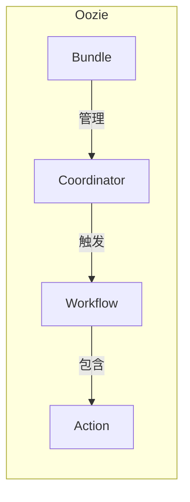
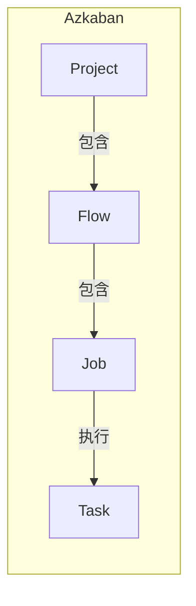

# OozieBundle与Azkaban：工作流编排工具的比较

## 1.背景介绍

在大数据处理领域,工作流编排工具扮演着至关重要的角色。随着数据量的不断增长和分析需求的日益复杂,有效管理和协调各种任务的执行顺序和依赖关系变得愈发重要。Apache OozieBundle和Azkaban作为两种流行的工作流编排工具,为企业提供了强大的任务调度和监控能力,帮助简化大数据处理流程。

### 1.1 什么是工作流编排工具?

工作流编排工具是一种软件系统,旨在设计、定义、执行和监控由多个任务组成的复杂流程。它们通常用于自动化和协调分布式环境中的各种任务,如数据提取、转换、加载(ETL)、机器学习模型训练等。工作流编排工具确保任务按照正确的顺序执行,并根据依赖关系和条件来控制流程的进度。

### 1.2 工作流编排工具的作用

工作流编排工具在大数据处理中发挥着关键作用,主要包括以下几个方面:

1. **自动化和协调复杂流程**: 通过将复杂的数据处理流程分解为多个任务,并定义它们之间的依赖关系和执行顺序,工作流编排工具可以自动化和协调整个流程的执行。

2. **提高效率和可靠性**: 工作流编排工具可以有效地管理和监控任务的执行状态,自动重试失败的任务,并提供故障恢复机制,从而提高整个流程的效率和可靠性。

3. **资源利用优化**: 通过合理分配和调度资源,工作流编排工具可以优化资源利用,避免资源浪费,提高整体系统的吞吐量。

4. **可维护性和可扩展性**: 工作流编排工具通常提供图形化界面和声明式配置,使得定义和修改工作流变得更加简单,提高了系统的可维护性和可扩展性。

5. **监控和报告**: 工作流编排工具通常内置了监控和报告功能,允许用户实时跟踪任务的执行状态,并生成详细的日志和报告,方便故障排查和性能优化。

## 2.核心概念与联系

在比较OozieBundle和Azkaban之前,让我们先了解一些核心概念和它们之间的联系。

### 2.1 Oozie

Apache Oozie是一个用于管理Apache Hadoop作业(如MapReduce、Pig、Hive等)的工作流调度系统。它集成了多种作业调度器,提供了一种规范化的方式来定义和执行复杂的数据处理流程。

Oozie中的核心概念包括:

- **Workflow**: 一组按特定顺序执行的动作(如MapReduce作业、Pig作业等)。
- **Coordinator**: 基于时间(频率)和数据可用性触发Workflow的执行。
- **Bundle**: 用于批处理多个相关的Coordinator应用程序。

### 2.2 Azkaban

Azkaban是一个批处理工作流作业调度器,由Linkedin开发和开源。它旨在解决执行有依赖关系的作业的问题,并提供了一个易于使用的Web用户界面来维护和跟踪工作流。

Azkaban中的核心概念包括:

- **Project**: 一组相关的工作流,通常对应于一个特定的业务领域或数据管道。
- **Flow**: 一个有向无环图,表示一系列有依赖关系的作业。
- **Job**: 工作流中的基本执行单元,可以是脚本、命令或其他可执行程序。

### 2.3 OozieBundle与Azkaban的关系

OozieBundle和Azkaban都是用于管理和协调复杂数据处理流程的工具,但它们在设计理念和实现方式上存在一些差异。

OozieBundle主要面向Apache Hadoop生态系统,旨在管理和协调Hadoop相关作业(如MapReduce、Pig、Hive等)的执行。它提供了一种声明式的方式来定义工作流,并支持基于时间和数据可用性触发执行。

另一方面,Azkaban则更加通用,可以用于管理和协调各种类型的作业,不仅限于Hadoop生态系统。它提供了一个直观的Web用户界面,方便用户维护和监控工作流的执行。

尽管两者在细节上有所不同,但它们都旨在解决相同的问题:自动化和协调复杂的数据处理流程,提高效率和可靠性。在选择使用哪种工具时,需要根据具体的需求和环境进行权衡。

## 3.核心算法原理具体操作步骤

### 3.1 OozieBundle

OozieBundle的核心算法原理主要包括以下几个方面:

1. **工作流定义**: OozieBundle使用XML文件来定义工作流,描述各个任务之间的依赖关系和执行顺序。这种声明式的方式使得工作流定义更加清晰和可维护。

2. **协调器触发**: OozieBundle中的协调器(Coordinator)负责根据时间和数据可用性触发工作流的执行。协调器定义了工作流的执行频率和条件,并将满足条件的工作流实例提交给Oozie调度器执行。

3. **任务调度和监控**: Oozie调度器负责管理和监控工作流的执行。它将工作流分解为多个任务,并根据依赖关系和资源可用性调度任务的执行。Oozie还提供了故障恢复机制,可以自动重试失败的任务。

4. **Bundle管理**: OozieBundle允许用户将多个相关的协调器应用程序组合在一起,形成一个Bundle。Bundle提供了一种更高层次的管理方式,方便用户协调和监控多个相关的数据处理流程。

OozieBundle的具体操作步骤如下:

1. 定义工作流(Workflow)XML文件,描述任务及其依赖关系。
2. 定义协调器(Coordinator)XML文件,指定工作流的执行频率和条件。
3. 定义Bundle XML文件(可选),将多个协调器应用程序组合在一起。
4. 将XML文件部署到Oozie服务器。
5. Oozie协调器根据定义的条件触发工作流实例的执行。
6. Oozie调度器管理和监控工作流实例的执行,包括任务调度、故障恢复等。
7. 用户可以通过Oozie Web UI或命令行工具查看工作流的执行状态和日志。

### 3.2 Azkaban

Azkaban的核心算法原理主要包括以下几个方面:

1. **工作流定义**: Azkaban使用一种基于文件的方式来定义工作流,每个工作流对应一个项目目录。工作流由一个或多个作业(Job)组成,作业之间的依赖关系通过有向无环图(DAG)来描述。

2. **作业执行**: Azkaban使用了一种称为"流水线执行模型"的方式来执行作业。每个作业都由一个或多个命令组成,这些命令按顺序执行。作业的输出会被缓存,以供下游作业使用。

3. **故障处理和重试**: Azkaban提供了多种故障处理机制,包括自动重试失败的作业、手动重试、失败后终止等。用户可以根据需求配置不同的策略。

4. **资源管理**: Azkaban支持对执行器(Executor)进行分区,每个分区可以配置不同的资源限制(如内存、CPU等),从而实现资源隔离和优化利用。

5. **监控和报告**: Azkaban提供了Web UI和REST API,用户可以通过这些接口查看工作流的执行状态、日志和报告。它还支持与外部监控系统(如Graphite、Ganglia等)集成。

Azkaban的具体操作步骤如下:

1. 定义项目目录,包括工作流定义文件和相关脚本或命令。
2. 使用Azkaban提供的工具或Web UI上传项目目录到Azkaban服务器。
3. 在Azkaban Web UI或通过API触发工作流的执行。
4. Azkaban调度器根据工作流定义分配执行器资源,并按照依赖关系执行各个作业。
5. 作业执行过程中,Azkaban会缓存中间结果,并在发生故障时根据配置的策略进行重试或终止。
6. 用户可以通过Azkaban Web UI或API查看工作流的执行状态、日志和报告。

## 4.数学模型和公式详细讲解举例说明

在工作流编排领域,数学模型和公式主要用于优化任务调度和资源分配。下面我们将介绍一些常见的数学模型和公式,并给出具体的例子说明。

### 4.1 任务调度优化

任务调度是工作流编排系统的核心功能之一。合理的任务调度策略可以提高系统的吞吐量和资源利用率。常见的任务调度优化模型包括:

1. **最小完成时间模型**:

   目标是找到一种任务调度方式,使得所有任务的完成时间之和最小。可以使用线性规划或动态规划等方法求解。

   假设有n个任务$T_1, T_2, \dots, T_n$,每个任务在不同资源上的执行时间分别为$t_{ij}$,其中i表示任务编号,j表示资源编号。我们需要找到一种任务分配方式,使得所有任务的完成时间之和最小:

   $$\min \sum_{i=1}^n C_i$$

   其中$C_i$表示任务$T_i$的完成时间。

2. **最小延迟时间模型**:

   目标是找到一种任务调度方式,使得所有任务的平均延迟时间最小。延迟时间是指任务实际完成时间与理想完成时间之差。

   假设每个任务$T_i$有一个期望完成时间$d_i$,实际完成时间为$C_i$,则任务$T_i$的延迟时间为$L_i = C_i - d_i$。我们需要找到一种任务分配方式,使得所有任务的平均延迟时间最小:

   $$\min \frac{1}{n} \sum_{i=1}^n L_i$$

3. **最大吞吐量模型**:

   目标是找到一种任务调度方式,使得单位时间内完成的任务数量最大。这在需要处理大量短任务的场景中非常有用。

   假设有m个资源,每个资源的处理速率为$r_j$,任务$T_i$在资源j上的执行时间为$t_{ij}$。我们需要找到一种任务分配方式,使得单位时间内完成的任务数量最大:

   $$\max \sum_{i=1}^n \frac{1}{t_{ij}}$$

   其中$t_{ij}$表示将任务$T_i$分配给资源j时的执行时间。

这些模型可以根据具体场景进行调整和扩展,以满足不同的优化目标和约束条件。

### 4.2 资源分配优化

合理的资源分配策略可以提高工作流编排系统的效率和可扩展性。常见的资源分配优化模型包括:

1. **bin packing问题**:

   目标是将n个任务分配到m个资源上,使得使用的资源数量最少。这可以看作是一个经典的bin packing问题。

   假设每个资源的容量为C,任务$T_i$的资源需求为$s_i$,我们需要找到一种分配方式,使得使用的资源数量最少:

   $$\min m$$

   $$\text{s.t.} \sum_{i \in B_j} s_i \leq C, \quad j=1,2,\dots,m$$

   其中$B_j$表示分配给第j个资源的任务集合。

2. **多维bin packing问题**:

   在实际场景中,资源通常有多个维度,如CPU、内存、磁盘等。这时可以将问题建模为多维bin packing问题。

   假设每个资源有d个维度,第j个资源的容量为$(C_{j1}, C_{j2}, \dots, C_{jd})$,任务$T_i$的资源需求为$(s_{i1}, s_{i2}, \dots, s_{id})$,我们需要找到一种分配方式,使得使用