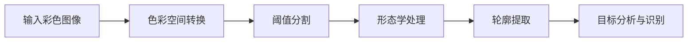

# OpenCV基于颜色的目标识别

## 1. 背景介绍

在计算机视觉领域中,目标识别是一个非常重要且具有挑战性的课题。其中,基于颜色的目标识别技术因其简单、直观、易于实现等特点,在实际应用中得到了广泛的应用。OpenCV作为一个开源的计算机视觉库,提供了丰富的图像处理和分析算法,为实现基于颜色的目标识别提供了强大的工具支持。

本文将深入探讨OpenCV中基于颜色的目标识别技术,从背景知识、核心概念、算法原理、数学模型、代码实践等多个角度进行全面解析,帮助读者系统地掌握这一技术,并能够将其应用到实际项目中去。

### 1.1 计算机视觉与目标识别概述
#### 1.1.1 计算机视觉的定义和发展历程
#### 1.1.2 目标识别的概念和应用场景
#### 1.1.3 目标识别的主要技术路线

### 1.2 OpenCV简介
#### 1.2.1 OpenCV的发展历史
#### 1.2.2 OpenCV的主要模块和功能
#### 1.2.3 OpenCV在目标识别中的优势

## 2. 核心概念与联系

要实现基于颜色的目标识别,需要理解一些核心概念,并明确它们之间的联系。

### 2.1 色彩空间
#### 2.1.1 RGB色彩空间
RGB是最常见的一种色彩空间,它将颜色表示为红(R)、绿(G)、蓝(B)三个分量的组合。OpenCV中图像默认采用BGR格式存储。

#### 2.1.2 HSV色彩空间
HSV色彩空间更符合人眼对颜色的感知,它用色调(H)、饱和度(S)、明度(V)来描述颜色。OpenCV提供了RGB到HSV的转换函数。

#### 2.1.3 其他常见色彩空间
如YUV、LAB等。根据识别对象的特点选择合适的色彩空间很关键。

### 2.2 阈值分割
阈值分割是基于颜色识别的重要步骤,它将图像划分为感兴趣区域(ROI)和背景。常见的阈值分割方法有:

#### 2.2.1 全局阈值分割
对整个图像使用同一个阈值进行二值化。

#### 2.2.2 自适应阈值分割 
根据图像不同区域的特点,自动确定局部阈值。

#### 2.2.3 Otsu阈值分割
通过最大类间方差自动确定全局阈值,对光照不均的图像效果较好。

### 2.3 形态学操作
形态学操作通过对二值图像进行一系列的腐蚀、膨胀、开闭运算等,可以滤除噪声、连通目标区域、提取目标轮廓等。常见的形态学操作有:

#### 2.3.1 腐蚀与膨胀
分别用于消除目标边缘的噪点和填充目标内部的孔洞。

#### 2.3.2 开运算与闭运算
开运算先腐蚀后膨胀,用于去除目标外部的噪声;闭运算先膨胀后腐蚀,用于填充目标内部的空洞。

#### 2.3.3 其他形态学操作
如顶帽、黑帽、击中击不中变换等。

### 2.4 轮廓提取
轮廓提取是在二值图像中提取目标的外边界,常用算法有:

#### 2.4.1 Canny边缘检测
先用Canny算子检测出图像的边缘,再对边缘进行连通分析得到轮廓。

#### 2.4.2 查找轮廓算法
使用OpenCV的findContours函数,可直接从二值图像中提取出轮廓。

### 2.5 颜色识别流程
基于颜色的目标识别一般分为以下几个步骤:



## 3. 核心算法原理与具体操作步骤

### 3.1 色彩空间转换
OpenCV中使用cvtColor函数进行色彩空间转换,其原型为:
```cpp
void cvtColor(InputArray src, OutputArray dst, int code, int dstCn=0)
```
常用的转换代码有:
- COLOR_BGR2GRAY: BGR转灰度图
- COLOR_BGR2HSV: BGR转HSV
- COLOR_HSV2BGR: HSV转BGR

具体操作步骤如下:
```python
# 读取BGR图像
bgr_img = cv2.imread("image.jpg")
# BGR转HSV
hsv_img = cv2.cvtColor(bgr_img, cv2.COLOR_BGR2HSV)
```

### 3.2 阈值分割
OpenCV中使用inRange函数进行颜色阈值分割,其原型为:
```cpp
void inRange(InputArray src, InputArray lowerb, InputArray upperb, OutputArray dst)
```
其中,lowerb和upperb分别表示颜色范围的下界和上界。

具体操作步骤如下:
```python
# 设置蓝色的阈值范围
lower_blue = np.array([100, 50, 50]) 
upper_blue = np.array([130, 255, 255])
# 对HSV图像进行阈值分割
mask = cv2.inRange(hsv_img, lower_blue, upper_blue)
```

### 3.3 形态学操作
OpenCV中常用的形态学操作函数有:
- erode: 腐蚀
- dilate: 膨胀
- morphologyEx: 形态学变换,可实现开闭运算

具体操作步骤如下:
```python
# 定义结构元
kernel = cv2.getStructuringElement(cv2.MORPH_RECT, (3,3))
# 开运算,去除外部噪点
opening = cv2.morphologyEx(mask, cv2.MORPH_OPEN, kernel)  
# 闭运算,填充内部孔洞
closing = cv2.morphologyEx(opening, cv2.MORPH_CLOSE, kernel)
```

### 3.4 轮廓提取
使用OpenCV的findContours函数提取二值图像的轮廓,其原型为:
```cpp
void findContours(InputArray image, OutputArrayOfArrays contours,
                  OutputArray hierarchy, int mode, int method, Point offset=Point())
```
常用的轮廓近似方法有:
- CHAIN_APPROX_NONE: 保存所有轮廓点
- CHAIN_APPROX_SIMPLE: 只保存轮廓拐点

具体操作步骤如下:  
```python
# 提取轮廓
contours, hierarchy = cv2.findContours(closing, cv2.RETR_EXTERNAL, cv2.CHAIN_APPROX_SIMPLE)
```

### 3.5 目标分析与识别
对提取出的轮廓进行分析,常用的有:
- contourArea: 计算轮廓面积
- boundingRect: 计算轮廓的外接矩形
- minEnclosingCircle: 计算轮廓的最小外接圆

根据这些几何特征,结合先验知识,即可识别出感兴趣的目标。

```python
# 分析轮廓
for contour in contours:
    # 计算轮廓面积
    area = cv2.contourArea(contour)
    # 面积太小的忽略
    if area < 1000:
        continue
    # 计算外接矩形
    x, y, w, h = cv2.boundingRect(contour)
    # 根据外接矩形的宽高比判断是否为目标
    if 0.8 < w/h < 1.2:
        # 在原图上画出目标
        cv2.rectangle(bgr_img, (x,y), (x+w,y+h), (0,255,0), 2)
```

## 4. 数学模型和公式详解

### 4.1 HSV颜色模型
HSV颜色模型用色调(H)、饱和度(S)、明度(V)三个分量表示颜色,其中:
- 色调(H): 描述颜色的基本属性,如红、绿、蓝等,取值范围为0°~360°。
- 饱和度(S): 描述颜色的纯度,越高色彩越纯,取值范围为0~1。
- 明度(V): 描述颜色的明亮程度,越高越亮,取值范围为0~1。

RGB颜色转换到HSV颜色的公式为:

$$
\begin{aligned}
V & = \max(R,G,B) \\
S & = \begin{cases}
0, & \text{if } V=0 \\
\frac{V-\min(R,G,B)}{V}, & \text{otherwise}
\end{cases} \\
H & = \begin{cases}
0^{\circ}, & \text{if } S=0 \\
60^{\circ} \times \frac{G-B}{V-\min(R,G,B)}, & \text{if } V=R \\
60^{\circ} \times \left(\frac{B-R}{V-\min(R,G,B)}+2\right), & \text{if } V=G \\
60^{\circ} \times \left(\frac{R-G}{V-\min(R,G,B)}+4\right), & \text{if } V=B
\end{cases}
\end{aligned}
$$

其中 $R,G,B \in [0,1]$ 分别表示红、绿、蓝三个分量。

### 4.2 形态学操作
设二值图像为 $A$,结构元为 $B$,形态学操作可表示为:
- 腐蚀: $A \ominus B = \{z \mid B_z \subseteq A \}$
- 膨胀: $A \oplus B = \{z \mid (\hat{B})_z \cap A \neq \varnothing \}$
- 开运算: $A \circ B = (A \ominus B) \oplus B$  
- 闭运算: $A \bullet B = (A \oplus B) \ominus B$

其中 $\hat{B}$ 表示 $B$ 的反射, $B_z$ 表示 $B$ 平移 $z$。

### 4.3 轮廓特征
设轮廓为 $C=\{(x_i,y_i)\}$,则:
- 轮廓面积: $S=\frac{1}{2}\left|\sum_{i=0}^{n-1}(x_i y_{i+1} - x_{i+1} y_i)\right|$
- 外接矩形: $R=\{(x_{min},y_{min}),(x_{max},y_{max})\}$
- 最小外接圆: $O=(x_c,y_c),r=\max\limits_i \sqrt{(x_i-x_c)^2+(y_i-y_c)^2}$

## 5. 项目实践:代码实例与详解

下面给出一个使用OpenCV实现蓝色目标识别的完整Python代码示例:

```python
import cv2
import numpy as np

# 读取图像
img = cv2.imread('image.jpg')

# BGR转HSV
hsv = cv2.cvtColor(img, cv2.COLOR_BGR2HSV)

# 蓝色范围
lower_blue = np.array([100,50,50])
upper_blue = np.array([130,255,255])

# 阈值分割
mask = cv2.inRange(hsv, lower_blue, upper_blue)

# 形态学操作
kernel = cv2.getStructuringElement(cv2.MORPH_RECT, (3,3))
opening = cv2.morphologyEx(mask, cv2.MORPH_OPEN, kernel)
closing = cv2.morphologyEx(opening, cv2.MORPH_CLOSE, kernel)

# 轮廓提取
contours, hierarchy = cv2.findContours(closing, cv2.RETR_EXTERNAL, cv2.CHAIN_APPROX_SIMPLE)

# 分析轮廓
for contour in contours:
    # 计算面积
    area = cv2.contourArea(contour)
    if area < 1000:
        continue
    
    # 外接矩形
    rect = cv2.boundingRect(contour)
    x, y, w, h = rect
    cv2.rectangle(img, (x,y), (x+w,y+h), (0,255,0), 2)
    
    # 最小外接圆
    (x,y),radius = cv2.minEnclosingCircle(contour)
    center = (int(x),int(y))
    radius = int(radius)
    cv2.circle(img, center, radius, (255,0,0), 2)

# 显示结果    
cv2.imshow('Result', img)
cv2.waitKey(0)
cv2.destroyAllWindows()
```

代码解析:
1. 读取输入图像,并将其从BGR色彩空间转换到HSV色彩空间。
2. 设置蓝色的阈值范围,对HSV图像进行阈值分割,得到蓝色区域的二值图像。
3. 对二值图像进行开运算和闭运算,去除噪声和填充孔洞。
4. 使用findContours函数提取轮廓。
5. 遍历每个轮廓,计算其面积,